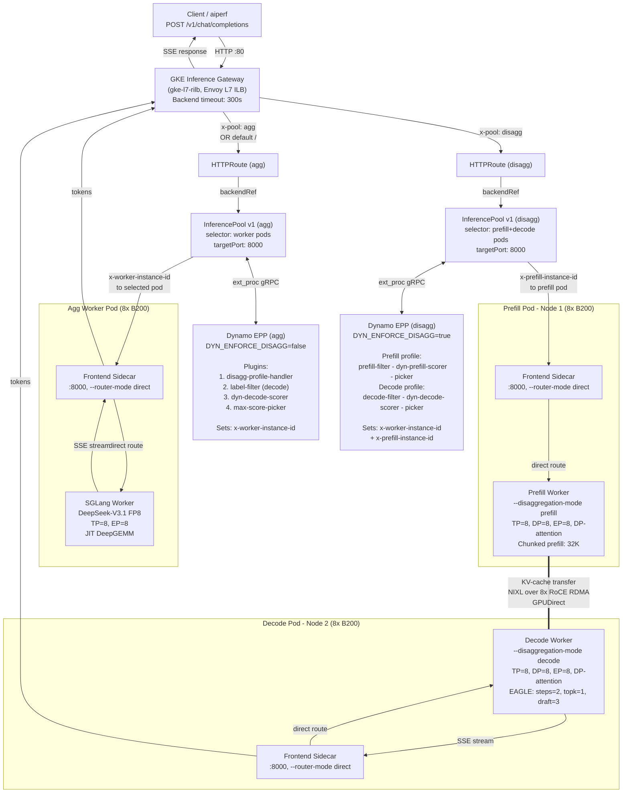

# GKE Inference Gateway + Dynamo EPP (Token-Aware KV Routing)

Aggregated and disaggregated DeepSeek-V3.1 (FP8) on B200 GPUs, fronted by the **GKE Inference Gateway** with the **NVIDIA Dynamo Endpoint Picker Plugin (EPP)** for token-aware KV-cache routing.

**Stack**: Dynamo Operator 1.0.0 · SGLang Runtime 1.0.0 · GKE Gateway API (`gke-l7-rilb`) · GAIE InferencePool v1 · Custom EPP from `ai-dynamo/dynamo` main branch

---

## Architecture

The GKE Inference Gateway replaces direct Frontend access with an L7 load balancer + EPP pipeline. The EPP scores backend endpoints using KV-cache awareness and sets routing headers that the frontend sidecar reads to direct requests to specific workers.



---

## Files

| File | Resource | Purpose |
|---|---|---|
| `dgd.yaml` | DynamoGraphDeployment | **Aggregated**: SGLang worker (TP=8, EP=8), frontend sidecar (`--router-mode direct`), EPP with `dyn-decode-scorer` |
| `dgd-disagg.yaml` | DynamoGraphDeployment | **Disaggregated (1P1D)**: Prefill + Decode workers, frontend sidecars on both, EPP with `dyn-prefill-scorer` + `dyn-decode-scorer`, NIXL/RoCE |
| `gateway.yaml` | Gateway | GKE internal L7 load balancer, HTTP on port 80 |
| `http-route.yaml` | HTTPRoute | Two routes: `x-pool: agg` to aggregated pool, `x-pool: disagg` to disagg pool, default `/` to aggregated |
| `health-check-policy.yaml` | HealthCheckPolicy | L7 LB health checks for both pools -- `GET /health` on port 8000 (frontend sidecar) |
| `backend-policy.yaml` | GCPBackendPolicy | Backend timeout 300s for both pools (default 30s is too short for inference) |
| `epp-configmap-patch.yaml` | ConfigMap | EPP plugin config with `dyn-decode-scorer`, `label-filter`, `max-score-picker`, and scheduling profiles |
| `perf-pod.yaml` | Pod | Standalone pod for running `aiperf` benchmarks |
| `cloudbuild.yaml` | Cloud Build config | Builds the custom EPP image via GCP Cloud Build |
| `Dockerfile.epp-cloudbuild` | Dockerfile | 3-stage build: Rust FFI lib, Go EPP binary, minimal runtime |

---

## Prerequisites

### 1. GKE Cluster + Dynamo Platform

Same as the [Dynamo-native setup](../dynamo/README.md#prerequisites):

- GKE cluster with **B200** GPU nodes + **RDMA** multi-networking
- Dynamo Operator 1.0.0 via Helm
- Namespace `dynamo-system`, PVC `deepseek-v31-model-rwx`, Secret `hf-token-secret`

### 2. GKE Gateway Controller

The `gke-l7-rilb` GatewayClass must be available:

```bash
kubectl get gatewayclass gke-l7-rilb
```

This is enabled by default on GKE clusters with the Gateway API controller.

### 3. Gateway API Inference Extension CRDs (GAIE)

Install the InferencePool / InferenceModel CRDs:

```bash
kubectl apply -f https://github.com/kubernetes-sigs/gateway-api-inference-extension/releases/download/v1.2.1/manifests.yaml
```

Verify:

```bash
kubectl get crd inferencepools.inference.networking.k8s.io
```

### 4. Custom EPP Image

The `dynamo-frontend:1.0.0` EPP image does not include a recent fix for the `dyn-decode-scorer` Rust FFI with Kubernetes-based service discovery. A newer image with the fix is in the release pipeline, but until it ships you need to build a custom image from the `main` branch following the steps below.

---

## Building the Custom EPP Image

This folder includes `cloudbuild.yaml` and `Dockerfile.epp-cloudbuild` for building the EPP image with GCP Cloud Build. The Dockerfile is a 3-stage build: Rust FFI library, Go EPP binary, and a minimal runtime image.

```bash
git clone --depth 1 https://github.com/ai-dynamo/dynamo.git
cd dynamo

# Copy the Cloud Build files into the repo root
cp /path/to/gaie/cloudbuild.yaml .
cp /path/to/gaie/Dockerfile.epp-cloudbuild .

gcloud builds submit \
  --config=cloudbuild.yaml \
  --substitutions=_EPP_IMAGE=REGION-docker.pkg.dev/PROJECT_ID/REPO_NAME/dynamo-epp:latest \
  --region=REGION
```

Set `REGION` to your Artifact Registry location and Cloud Build region (for example `asia-southeast1` or `us-central1`). The hostname prefix must match: `REGION-docker.pkg.dev/...`.

After the build completes, update the EPP image in `dgd.yaml` and `dgd-disagg.yaml` under `services.Epp.extraPodSpec.mainContainer.image`.

---

## Aggregated GAIE Deployment

### 1. Deploy the GKE Inference Gateway

```bash
kubectl apply -f gateway.yaml
```

### 2. Deploy the Aggregated DGD

```bash
kubectl apply -f dgd.yaml
```

This creates: 1 EPP pod + 1 worker pod (with frontend sidecar, 2 containers) + operator-managed Services + InferencePool.

### 3. Wait for Worker Ready

DeepGEMM JIT compilation + model loading takes ~10 min.

```bash
kubectl get pods -n dynamo-system -w | grep aggregated-gaie
```

### 4. Patch EPP ConfigMap (if needed)

The Dynamo operator may not reconcile `eppConfig` changes. If the EPP doesn't have the right plugins:

```bash
kubectl apply -f epp-configmap-patch.yaml
kubectl rollout restart deployment -n dynamo-system -l nvidia.com/dynamo-component=Epp
```

### 5. Find the Pool Service and Apply Policies

```bash
# Find the auto-created InferencePool backing Service
kubectl get svc -n dynamo-system | grep pool-ips

# Apply health check and backend timeout policies
kubectl apply -f health-check-policy.yaml
kubectl apply -f backend-policy.yaml
```

### 6. Create HTTPRoute

```bash
kubectl apply -f http-route.yaml
```

### 7. Test

```bash
GATEWAY_IP=$(kubectl get gateway inference-gateway -n dynamo-system -o jsonpath='{.status.addresses[0].value}')

# From inside the cluster (gke-l7-rilb is internal)
kubectl exec perf-gaie-fp8 -n dynamo-system -- \
  curl -s http://${GATEWAY_IP}:80/v1/chat/completions \
  -H "Content-Type: application/json" \
  -H "x-pool: agg" \
  -d '{"model":"deepseek-ai/DeepSeek-V3.1","messages":[{"role":"user","content":"Hello"}],"max_tokens":50}'
```

---

## Disaggregated 1P1D GAIE Deployment

### 1. Deploy the Disagg DGD

```bash
kubectl apply -f dgd-disagg.yaml
```

This creates: 1 EPP pod + 1 prefill pod (with frontend sidecar) + 1 decode pod (with frontend sidecar).

### 2. Wait for All Pods

Model loading takes ~10 min per worker.

```bash
kubectl get pods -n dynamo-system -w | grep disagg-gaie
```

### 3. Apply Policies

The `health-check-policy.yaml` and `backend-policy.yaml` already include both agg and disagg pool targets.

```bash
kubectl apply -f health-check-policy.yaml
kubectl apply -f backend-policy.yaml
```

### 4. Test

```bash
kubectl exec perf-gaie-fp8 -n dynamo-system -- \
  curl -s http://${GATEWAY_IP}:80/v1/chat/completions \
  -H "Content-Type: application/json" \
  -H "x-pool: disagg" \
  -d '{"model":"deepseek-ai/DeepSeek-V3.1","messages":[{"role":"user","content":"Hello"}],"max_tokens":50}'
```

---

## Benchmarking with aiperf

### Deploy the Perf Pod

```bash
kubectl apply -f perf-pod.yaml -n dynamo-system
kubectl wait --for=condition=Ready pod/perf-gaie-fp8 -n dynamo-system --timeout=300s
kubectl exec -it perf-gaie-fp8 -n dynamo-system -- bash
```

### Run aiperf at C=10 (via Gateway)

The Gateway endpoint is `http://<GATEWAY_IP>:80` (not the direct frontend :8000).

```bash
GATEWAY_IP=$(kubectl get gateway inference-gateway -n dynamo-system -o jsonpath='{.status.addresses[0].value}')

# Aggregated
aiperf profile \
  --url "http://${GATEWAY_IP}:80" \
  --artifact-dir /workspace/results/gaie-agg/concurrency_10 \
  --model "deepseek-ai/DeepSeek-V3.1" \
  --tokenizer /opt/model-cache/hub/models--deepseek-ai--DeepSeek-V3.1/snapshots/c0781d039fb7a1ba2abc4add0bdc293e92d2b8db \
  --endpoint-type chat \
  --endpoint /v1/chat/completions \
  --streaming \
  --synthetic-input-tokens-mean 1000 --synthetic-input-tokens-stddev 0 \
  --output-tokens-mean 250 --output-tokens-stddev 0 \
  --extra-inputs "max_tokens:250" \
  --extra-inputs "min_tokens:250" \
  --extra-inputs "ignore_eos:true" \
  --extra-inputs "repetition_penalty:1.0" \
  --extra-inputs "temperature:0.0" \
  --concurrency 10 \
  --request-count 100 \
  --warmup-request-count 10 \
  --num-dataset-entries 12800 \
  --random-seed 100 \
  --workers-max 10 \
  --record-processors 32 \
  --request-timeout-seconds 21600 \
  --no-server-metrics \
  --ui simple
```

For disagg, add `--extra-inputs "x-pool:disagg"` or pass the header via `--header "x-pool: disagg"` (depending on aiperf version).

### Changing Concurrency

| Concurrency | `--concurrency` | `--request-count` | `--warmup-request-count` | `--workers-max` |
|---|---|---|---|---|
| C=10 | 10 | 100 | 10 | 10 |
| C=50 | 50 | 500 | 50 | 50 |
| C=100 | 100 | 1000 | 100 | 100 |

Update `--artifact-dir` to reflect the concurrency level (e.g., `concurrency_50`).

---

## Key Design Decisions

### InferencePool v1 Bridge

The Dynamo operator creates an **alpha** InferencePool (`inference.networking.x-k8s.io`). GKE Gateway watches **v1** InferencePool (`inference.networking.k8s.io`). The operator auto-creates a v1 InferencePool with `extensionRef` pointing to the EPP Service. Both API groups coexist.

### Double Tokenization Overhead

The EPP tokenizes the prompt to compute KV-cache routing scores, then the frontend sidecar re-tokenizes the same prompt for inference. This adds to TTFT at low concurrency (amortized at higher concurrency).

**Future fix**: GAIE v1.5 introduces a Pluggable Parser Framework ([PR #2359](https://github.com/kubernetes-sigs/gateway-api-inference-extension/pull/2359)) that allows the EPP to directly mutate the request body, injecting `nvext.token_data` to skip re-tokenization.

---

## Images

Replace `REGION`, `PROJECT_ID`, and `REPO_NAME` in the EPP image with your GCP Artifact Registry hostname and repository path (see **Building the Custom EPP Image** above).

| Component | Image |
|---|---|
| Worker + Frontend Sidecar | `nvcr.io/nvidia/ai-dynamo/sglang-runtime:1.0.0` |
| EPP | `REGION-docker.pkg.dev/PROJECT_ID/REPO_NAME/dynamo-epp:latest` |
| Model | `deepseek-ai/DeepSeek-V3.1` (FP8, from HuggingFace) |

---

## References

- [Dynamo-native variant (no Gateway)](../dynamo/README.md)
- [Dynamo](https://github.com/ai-dynamo/dynamo)
- [Gateway API Inference Extension](https://github.com/kubernetes-sigs/gateway-api-inference-extension)
- [Dynamo EPP GAIE Integration](https://github.com/ai-dynamo/dynamo/tree/main/deploy/inference-gateway)
