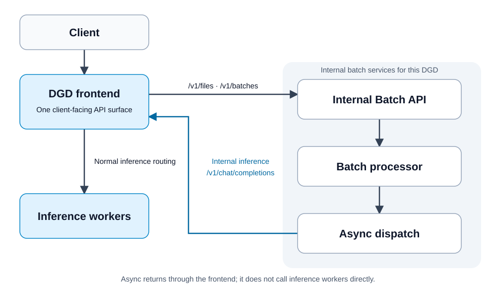

<!--
SPDX-FileCopyrightText: Copyright (c) 2025-2026 NVIDIA CORPORATION & AFFILIATES. All rights reserved.
SPDX-License-Identifier: Apache-2.0
-->

# Offline Batch Inference with Dynamo

Submit files and batch jobs to the same Dynamo frontend used for inference. One `dynamo-batch` Helm release deploys the batch services for your DGD, using pinned Batch Gateway and Async components internally. Provision metadata, queue, and object storage separately; this chart only connects to them.



## Set Up

You need the Dynamo Kubernetes operator, one GPU for the sample model, Helm, `kubectl`, Python with PyYAML, and existing PostgreSQL, Redis/Valkey, and S3-compatible storage reachable from the batch pods. Create the object bucket before installing. Use a Dynamo runtime image built from this checkout; set both image fields in `dynamo.yaml` to that image, following the [container build guide](../../../container/README.md). The example serves `Qwen/Qwen3-0.6B`.

From the repository root:

```bash
cd examples/deployments/batch-gateway
kubectl create namespace dynamo-batch-example
kubectl apply -n dynamo-batch-example -f dynamo.yaml
```

Create a Secret named `dynamo-batch-storage` in `dynamo-batch-example` through your secret manager or Kubernetes tooling. Include the following keys, and keep credentials out of the checked-in profile and generated values:

- `postgresql-url`: PostgreSQL connection URL for batch metadata.
- `redis-url`: Redis/Valkey connection URL for queues and request/result exchange.
- `s3-secret-access-key`: secret access key for the object bucket.

In `profile-external-storage.yaml`, set the bucket, region, access key ID, and optional S3 endpoint/path-style settings. Set `storage.secretName` if your Secret has a different name. The sample DGD and profile already have matching model, namespace, and service names. Install the batch integration:

```bash
helm dependency build chart
python3 render_values.py profile-external-storage.yaml --output-dir /tmp/dynamo-batch-values
helm upgrade --install qwen-batch ./chart \
  --namespace dynamo-batch-example \
  --values /tmp/dynamo-batch-values/dynamo-batch-values.yaml --wait --timeout 5m
```

The chart does not create databases, queue storage, object buckets, storage credentials, or persistent volumes. Manage storage availability, backups, and access policies separately.

Use separate metadata databases and object prefixes for independently managed DGDs. Queue names and default object prefixes include the DGD namespace and name. Uninstalling the batch release does not delete externally managed storage or its credentials.

In another terminal, expose **only the Dynamo frontend** and leave the port-forward running:

```bash
kubectl port-forward -n dynamo-batch-example \
  service/qwen3-0-6b-batch-frontend 8000:8000
```

Verify the model is available before submitting a batch:

```bash
curl --fail http://localhost:8000/v1/models
curl --fail http://localhost:8000/v1/chat/completions \
  -H 'Content-Type: application/json' \
  -d '{"model":"Qwen/Qwen3-0.6B","messages":[{"role":"user","content":"Say hello"}],"max_tokens":16}'
```

## Submit a Batch

```bash
python3 run_example.py --base-url http://localhost:8000 --success-only
```

This uploads `batch-input.jsonl`, creates a job, polls it, downloads its output, and verifies that both request IDs have successful results. Each JSONL line contains a unique `custom_id`, `method`, `url`, and request `body`. For example:

```json
{"custom_id":"question-1","method":"POST","url":"/v1/chat/completions","body":{"model":"Qwen/Qwen3-0.6B","messages":[{"role":"user","content":"What is Dynamo?"}],"max_tokens":64}}
```

Your own client uses the same frontend base URL:

1. `POST /v1/files` with multipart fields `purpose=batch` and `file=<your JSONL file>`; save its `id`.
2. `POST /v1/batches` with `{"input_file_id":"<file id>","endpoint":"/v1/chat/completions","completion_window":"24h"}`; save the batch `id`.
3. `GET /v1/batches/<batch id>` until the job reaches a terminal state.
4. Download `GET /v1/files/<output_file_id>/content`, and the error file if `error_file_id` is present.

Use a consistent `X-MaaS-Username` tenant header for all calls. Pass your deployment's authorization credentials when required. The example client uses a development tenant and placeholder bearer token. Input files are limited to 200 MiB in this profile; for larger workloads, split the JSONL into multiple input files and submit a job for each. Increasing the limit also requires sizing the frontend request-body limit, Processor work directory, and storage capacity.

## Use an Existing DGD

Set `targetDGD.name`, `targetDGD.namespace`, and `model` in the profile to match your deployment. Add `--batch-gateway-url http://<dgd>-batch-api.<namespace>.svc:8000` to every frontend replica, using a runtime image containing the proxy. The integration calls the standard `<dgd>-frontend` Service on port 8000. Regenerate the values into a new output directory, then install the chart in that namespace.

For error and cancellation examples, run `run_example.py` without `--success-only`. Cancelling a job does not interrupt inference requests already accepted by Dynamo.

Keep inference workers ready for this example. Async checks model readiness before dispatching requests, but this chart does not add backlog-driven Planner scaling or scale-from-zero.
