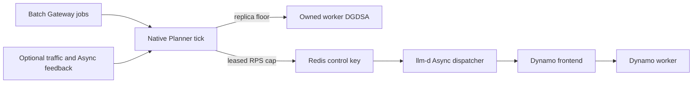

# Planner as a Batch Scheduler

## Planner Batch Scheduling POC

Batch Gateway remains the durable owner of jobs and results, llm-d Async remains
the request dispatcher, and Planner does not dispatch individual requests. Every
due native Planner tick observes durable job state plus optional
serving/dispatcher feedback and controls two generic outputs:

- a batch replica floor merged into Planner's normal final scaling decision;
- a renewable maximum batch-admission lease enforced by llm-d Async.



## Validation Evidence

Canonical run `20260828T213549Z-planner-native-1e3ff8` began with the
worker DGDSA at zero and the existing frontend pod held SchedulingGated by
Grove/KAI. A new Gateway job caused Planner to keep admission at zero, scale
only the owned worker DGDSA `0 -> 1`, wait for readiness, open a 5-RPS cap,
drain 100/100 requests with zero failures, and return the batch floor and cap to
zero. The worker remained at one because the floor is a lower bound rather than
a scale-down instruction. See the
[native E2E report](experiment/reports/20260828-native-planner-e2e.md) and the
[experiment index](experiment/index.md) for the full evidence corpus.

The POC focuses on plumbing, fail-closed control, autonomous worker recovery,
and batch-only execution. Due-date optimization, concurrent online SLA
protection, fairness among jobs/tenants, and post-batch scale-down remain future
policy work.

## Deploy the Planner POC

First deploy the stock Batch Gateway example through the Async dispatch step in
the [parent README](../README.md). The stock `dynamo.yaml` remains independently
deployable and does not create a Planner pod.

The stock Async deployment uses a constant-open queue gate. Before starting
Planner, replace it with an Async image containing the companion LLM-180 Redis
leased-rate gate and apply the Planner worker-pool overlay. The v0.9.0 chart
accepts image repository and tag separately, so `ASYNC_IMAGE` must be a complete
tagged image reference (digests and untagged references are rejected here).

From `examples/deployments/llm-d-batch-gateway`, set the namespace and image,
split the image according to the chart schema, and render the exact Helm inputs:

```bash
export NAMESPACE=your-namespace
export ASYNC_IMAGE=your-registry.example/llm-d-async:llm-180

: "${NAMESPACE:?set NAMESPACE to the deployed example namespace}"
: "${ASYNC_IMAGE:?set ASYNC_IMAGE to the companion LLM-180 image}"

case "${ASYNC_IMAGE}" in
  *@*)
    echo "ASYNC_IMAGE must use a tag; the chart renders repository:tag" >&2
    exit 1
    ;;
esac
ASYNC_IMAGE_REPOSITORY="${ASYNC_IMAGE%:*}"
ASYNC_IMAGE_TAG="${ASYNC_IMAGE##*:}"
if [[ "${ASYNC_IMAGE_REPOSITORY}" == "${ASYNC_IMAGE}" ||
      -z "${ASYNC_IMAGE_REPOSITORY}" ||
      -z "${ASYNC_IMAGE_TAG}" ||
      "${ASYNC_IMAGE_TAG}" == */* ]]; then
  echo "ASYNC_IMAGE must be a complete repository:tag reference" >&2
  exit 1
fi

ASYNC_HELM_ARGS=(
  --version v0.9.0
  --namespace "${NAMESPACE}"
  --values llm-d-async-values.yaml
  --values llm-d-async-planner-values.yaml
  --set-string "ap.image.repository=${ASYNC_IMAGE_REPOSITORY}"
  --set-string "ap.image.tag=${ASYNC_IMAGE_TAG}"
)

if ! ASYNC_RENDERED="$(helm template async-dispatch \
  oci://ghcr.io/llm-d/charts/llm-d-async \
  "${ASYNC_HELM_ARGS[@]}")"; then
  echo "failed to render the llm-d Async Planner deployment" >&2
  exit 1
fi

if ! grep -Fq -- \
  '--pool-config-file=/etc/llm-d-async/config/worker-pools.json' \
  <<<"${ASYNC_RENDERED}"; then
  echo "rendered Async deployment does not consume worker-pools.json" >&2
  exit 1
fi
if ! grep -Fq -- 'worker_pool_id\":\"dynamo-batch' \
  <<<"${ASYNC_RENDERED}"; then
  echo "rendered Async queue does not route to dynamo-batch" >&2
  exit 1
fi
if ! grep -Fq -- 'redis-leased-rate' <<<"${ASYNC_RENDERED}"; then
  echo "rendered Async worker pool does not use redis-leased-rate" >&2
  exit 1
fi
if ! grep -Fq -- "image: \"${ASYNC_IMAGE}\"" <<<"${ASYNC_RENDERED}"; then
  echo "rendered Async deployment does not use ASYNC_IMAGE" >&2
  exit 1
fi
```

Only after all three render checks pass, upgrade the existing Async release and
verify the live image, pool-config argument, and mounted gate configuration:

```bash
if ! helm upgrade --install async-dispatch \
  oci://ghcr.io/llm-d/charts/llm-d-async \
  "${ASYNC_HELM_ARGS[@]}"; then
  echo "failed to deploy the llm-d Async Planner overlay" >&2
  exit 1
fi

if ! kubectl rollout status --namespace "${NAMESPACE}" \
  deployment/async-dispatch-llm-d-async \
  --timeout=180s; then
  echo "llm-d Async Planner rollout did not become ready" >&2
  exit 1
fi

DEPLOYED_ASYNC_IMAGE="$(kubectl get deployment \
  --namespace "${NAMESPACE}" \
  async-dispatch-llm-d-async \
  -o jsonpath='{.spec.template.spec.containers[0].image}')"
if [[ "${DEPLOYED_ASYNC_IMAGE}" != "${ASYNC_IMAGE}" ]]; then
  echo "live llm-d Async image does not match ASYNC_IMAGE" >&2
  exit 1
fi

if ! kubectl get deployment \
  --namespace "${NAMESPACE}" \
  async-dispatch-llm-d-async \
  -o jsonpath='{.spec.template.spec.containers[0].args}' \
  | grep -Fq -- \
    '--pool-config-file=/etc/llm-d-async/config/worker-pools.json'; then
  echo "live llm-d Async deployment does not consume worker-pools.json" >&2
  exit 1
fi
if ! kubectl get deployment \
  --namespace "${NAMESPACE}" \
  async-dispatch-llm-d-async \
  -o jsonpath='{.spec.template.spec.containers[0].args}' \
  | grep -Fq -- 'worker_pool_id":"dynamo-batch'; then
  echo "live llm-d Async queue does not route to dynamo-batch" >&2
  exit 1
fi

if ! kubectl get configmap \
  --namespace "${NAMESPACE}" \
  async-dispatch-llm-d-async-config \
  -o jsonpath='{.data.worker-pools\.json}' \
  | grep -Fq -- 'redis-leased-rate'; then
  echo "live llm-d Async worker pool does not use redis-leased-rate" >&2
  exit 1
fi
```

The POC overlay is an `envsubst` template because the Planner's service-account
subject, runtime namespace, and parent-DGD namespace must match the caller's
Kubernetes namespace. It also requires a Planner image built from this branch;
the template deliberately has no fallback image.

Set the remaining required image and render the template into `kubectl`:

```bash
export PLANNER_IMAGE=your-registry.example/dynamo:planner-batch-poc

: "${PLANNER_IMAGE:?set PLANNER_IMAGE to an image built from this branch}"

if ! envsubst '${NAMESPACE} ${PLANNER_IMAGE}' \
  < planner-scheduling/planner-poc.yaml \
  | kubectl apply --namespace "${NAMESPACE}" -f -; then
  echo "failed to apply the Planner POC resources" >&2
  exit 1
fi
```

The overlay uses same-namespace service names for Batch Gateway, the Dynamo
frontend, llm-d Async metrics, and Valkey. The stock backend and POC overlay
both expect the documented `model-cache` PVC and `hf-token-secret` in
`NAMESPACE`.

Wait for the Planner and confirm that the rendered image and namespaces are the
ones you intended:

```bash
if ! kubectl wait --namespace "${NAMESPACE}" \
  --for=condition=Ready \
  dynamographdeployment/qwen3-0-6b-batch-planner \
  --timeout=300s; then
  echo "Planner POC deployment did not become ready" >&2
  exit 1
fi

DEPLOYED_PLANNER_IMAGE="$(kubectl get dynamographdeployment \
  --namespace "${NAMESPACE}" \
  qwen3-0-6b-batch-planner \
  -o jsonpath='{.spec.components[0].podTemplate.spec.containers[0].image}')"
if [[ "${DEPLOYED_PLANNER_IMAGE}" != "${PLANNER_IMAGE}" ]]; then
  echo "live Planner image does not match PLANNER_IMAGE" >&2
  exit 1
fi

DEPLOYED_ROLE_NAMESPACE="$(kubectl get rolebinding \
  --namespace "${NAMESPACE}" \
  qwen3-0-6b-batch-planner-scaling-adapter \
  -o jsonpath='{.subjects[0].namespace}')"
if [[ "${DEPLOYED_ROLE_NAMESPACE}" != "${NAMESPACE}" ]]; then
  echo "Planner RoleBinding subject is in the wrong namespace" >&2
  exit 1
fi

if ! kubectl get configmap \
  --namespace "${NAMESPACE}" \
  qwen3-0-6b-batch-planner-config \
  -o jsonpath='{.data.planner\.yaml}' \
  | grep -Fq -- "namespace: ${NAMESPACE}-qwen3-0-6b-batch"; then
  echo "live Planner config targets the wrong runtime namespace" >&2
  exit 1
fi
```

## Optional POC Cleanup

Remove the Planner-only resources, then restore the stock Async image and
constant gate without changing the rest of the Batch Gateway example:

```bash
envsubst '${NAMESPACE} ${PLANNER_IMAGE}' \
  < planner-scheduling/planner-poc.yaml \
  | kubectl delete --ignore-not-found -f -

helm upgrade --install async-dispatch \
  oci://ghcr.io/llm-d/charts/llm-d-async \
  --version v0.9.0 \
  --namespace "${NAMESPACE}" \
  --reset-values \
  --values llm-d-async-values.yaml
```

## Original design sketch

We will use Planner as a Batch Scheduler.

It will observe state like it does today, but may decide to dispatch a batch job instead of
make a scaling decision.

I.e. Planner can make predictions as to when is a good time to schedule a batch job vs autoscale.
For example, we may not have to autoscale if we are below our utilization (meeting SLA) but have enough batch work queued that we can
get done so that we do not have to pay the coldstart cost.

steady state -> some percentage below max utilization if know we have enough long term batch work.  steadily work through batch jobs. chunk up large batch jobs so that they are evenly distributed.
    short term traffic spike -> take a break from scheduling more batch work.
    short term traffic dip -> dispatch more batch work.
    long term traffic dip -> scale down
    long term traffic spike -> scale up
    giant batch job addition -> scale up
    small batch job addition -> scale down.

the calculus will look something like this.
Client schedules batch job with 20,000 requests and a DUE date of 1 hour from now.
Currently we are using 90% of capacity of the pool since the full pool can process 100 rps.
Meaning we can fit an actual 10 rps without violating SLAs.
So we start with a steady schedule of throwing 10rps.
Then we get to the point where we have a traffic spike, we need to stop the batch jobs.
The spike hit was 10% so we were able to survive it without autoscaling, but maybe lasted 50 mins.
So now we still have 10,0000 requests left but only 10 mins left.  so we need to scale up so we can handle 20rps extra.
And so we do that.  And everything meets SLA.  batch jobs and live traffic.

Obviously we can flesh out how that works but this is the basic idea.
Some big questions:

Should Planner basically just use the state of the batch jobs to determine whether it makes scaling decisions or not
and let router just handle scheduling of the batch job based on its SLA?

Planner knows what its planning for the size of the pool.
Case for Planner owning dispatching?
     it knows how much batch work a router should be taking and prioritizing.
     if router always prioritized by due date, then even when under utilized new requests will always cut in front of batch jobs.
Case for no?
    Router can just handle above as its own cost function.
    Planner just observes the actual batch job drain rate and scales based on that?
Case for a mix:
    1) to not overwhelm router anyway Planner will chunk.
    2) Planner will tune Router with an expected batch drain rate.
    3) Planner will change that drain rate as necessary
    4) Based on Routing decisions there may be a different effective batch drain rate.

Can we implement this with a customer Router policy class for batch tho?

POC Work:
1) Enable batch policy class / queue
2) If deficit round robin balancing exists today, we can use that?
3) For POC it might be easiest to just have Planner dispatch batch requests at a steady state: i.e. rate limited 10 RPS.
4) On LLM-D Gateway we would need to assess work - how to do partial batch job selection?
5) We will need plumbing of batch state to Planner
6) we will need to work on adding this to the Planner pipeline / brain.
7) We will need to add a testing setup and see how this works.
