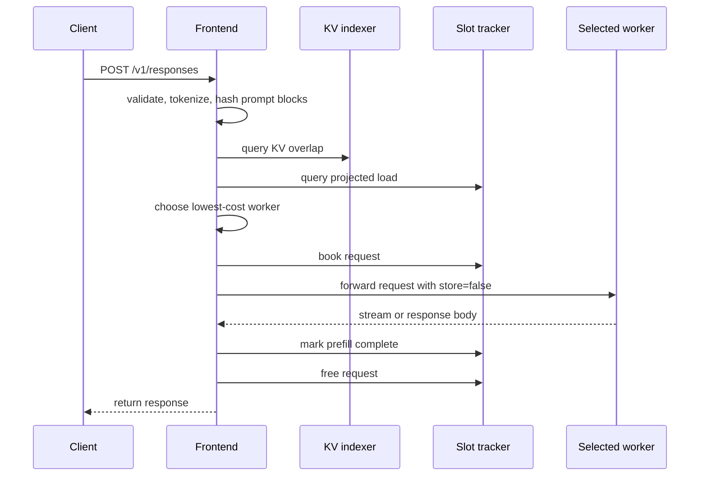

<!--
SPDX-FileCopyrightText: Copyright (c) 2025-2026 NVIDIA CORPORATION & AFFILIATES. All rights reserved.
SPDX-License-Identifier: Apache-2.0
-->

# Raw Engines Routing Frontend

This example implements a small FastAPI gateway around two bare `vllm serve`
workers. It uses the standalone [KV indexer](/docs/components/router/standalone-indexer.md)
for device-cache overlap and the standalone
[slot tracker](/docs/components/router/standalone-slot-tracker.md) for active-request
accounting.

The gateway does not use the Dynamo runtime, etcd, NATS, replica peers, or persistent
state. It is an educational example of the HTTP interfaces needed by an external
router, not a production-complete OpenAI gateway.

## Supported API

The gateway exposes:

```text
GET  /health
POST /v1/responses
```

`POST /v1/responses` supports stateless text generation with:

- `input` as a string or text-only message list
- optional string `instructions`
- streaming and non-streaming responses
- ordinary generation parameters forwarded to vLLM

It deliberately rejects stateful Responses features, tools, background requests,
multimodal content, partial assistant continuations, and rendering-altering
extensions. The gateway forces `store: false` before forwarding requests because a
later stateful follow-up could otherwise route to a different raw worker.

The primary walkthrough requires two GPUs so that routing decisions are observable.
For a wiring-only smoke check, launch and register one worker and pass one `--worker`
argument to the frontend.

## Prerequisites

Use the project root `.venv`. Build the Python bindings with both standalone services,
then install the Dynamo package with the `vllm` extra:

```bash
uv pip install --python .venv/bin/python maturin

cd lib/bindings/python
VIRTUAL_ENV=../../../.venv ../../../.venv/bin/maturin develop \
  --uv \
  --features kv-indexer,slot-tracker
cd ../../..

uv pip install --python .venv/bin/python -e '.[vllm]'
```

The commands below assume you start in the repository root.

## Start The Services

Start the standalone indexer:

```bash
DYN_LOG=debug .venv/bin/python -m dynamo.indexer --port 8090
```

Start the standalone slot tracker in another terminal:

```bash
DYN_LOG=debug .venv/bin/python -m dynamo.slot_tracker --port 8091
```

Both services start with empty registries. Workers are registered explicitly below.

## Start Raw vLLM Workers

Launch worker `1` on GPU `0`:

```bash
CUDA_VISIBLE_DEVICES=0 \
VLLM_LOGGING_LEVEL=DEBUG \
VLLM_USE_DEEP_GEMM=0 \
.venv/bin/vllm serve Qwen/Qwen3-0.6B \
  --port 8100 \
  --block-size 64 \
  --enable-prefix-caching \
  --enforce-eager \
  --kv-events-config '{"publisher":"zmq","topic":"kv-events","endpoint":"tcp://*:20080","replay_endpoint":"tcp://*:20180","enable_kv_cache_events":true}'
```

Launch worker `2` on GPU `1`:

```bash
CUDA_VISIBLE_DEVICES=1 \
VLLM_LOGGING_LEVEL=DEBUG \
VLLM_USE_DEEP_GEMM=0 \
.venv/bin/vllm serve Qwen/Qwen3-0.6B \
  --port 8101 \
  --block-size 64 \
  --enable-prefix-caching \
  --enforce-eager \
  --kv-events-config '{"publisher":"zmq","topic":"kv-events","endpoint":"tcp://*:20081","replay_endpoint":"tcp://*:20181","enable_kv_cache_events":true}'
```

Each `endpoint` is a ZMQ PUB socket for KV-cache events. Each `replay_endpoint` is a
ZMQ ROUTER socket that lets the standalone indexer recover missing event batches after
it detects a PUB/SUB sequence gap. This example does not configure indexer peers or
slot-tracker replica synchronization.

## Register Workers

Register both ZMQ event streams with the indexer:

```bash
curl -sS -X POST http://127.0.0.1:8090/register \
  -H 'Content-Type: application/json' \
  -d '{
    "instance_id": 1,
    "endpoint": "tcp://127.0.0.1:20080",
    "replay_endpoint": "tcp://127.0.0.1:20180",
    "model_name": "Qwen/Qwen3-0.6B",
    "block_size": 64,
    "dp_rank": 0
  }'

curl -sS -X POST http://127.0.0.1:8090/register \
  -H 'Content-Type: application/json' \
  -d '{
    "instance_id": 2,
    "endpoint": "tcp://127.0.0.1:20081",
    "replay_endpoint": "tcp://127.0.0.1:20181",
    "model_name": "Qwen/Qwen3-0.6B",
    "block_size": 64,
    "dp_rank": 0
  }'
```

Register the same workers independently with the slot tracker:

```bash
curl -sS -X POST http://127.0.0.1:8091/register \
  -H 'Content-Type: application/json' \
  -d '{
    "worker_id": 1,
    "model_name": "Qwen/Qwen3-0.6B",
    "block_size": 64,
    "dp_start": 0,
    "dp_size": 1
  }'

curl -sS -X POST http://127.0.0.1:8091/register \
  -H 'Content-Type: application/json' \
  -d '{
    "worker_id": 2,
    "model_name": "Qwen/Qwen3-0.6B",
    "block_size": 64,
    "dp_start": 0,
    "dp_size": 1
  }'
```

Inspect the registered topology:

```bash
curl -sS http://127.0.0.1:8090/workers
curl -sS http://127.0.0.1:8091/workers
```

## Start The Frontend

Launch the FastAPI frontend:

```bash
.venv/bin/python examples/raw_engines_routing/frontend.py \
  --worker 1:0=http://127.0.0.1:8100 \
  --worker 2:0=http://127.0.0.1:8101 \
  --log-level DEBUG
```

The gateway tokenizes each accepted request, queries both standalone services, and
selects the lowest-cost worker:

```text
device_overlap_blocks = matched_gpu_tokens / block_size
projected_prefill_blocks = potential_prefill_tokens / block_size
adjusted_prefill_blocks = max(projected_prefill_blocks - device_overlap_blocks, 0)
cost = prefill_load_scale * adjusted_prefill_blocks + potential_decode_blocks
```

An `asyncio.Lock` serializes the slot-tracker `/potential_loads`, selection, and `/add`
admission section. This prevents a thundering herd where concurrent requests all select
against the same pre-booking load snapshot; the next request should observe the load
booked by the previous one. The lock is a gateway policy choice, not a fundamental
requirement of splitting the frontend from the slot tracker. Tokenization, indexer
overlap queries, and generation remain concurrent.

Slot-tracker hashes are local opaque accounting identities. The frontend computes one
ordered chained BLAKE2b hash for each complete prompt block. They intentionally do not
need to match the engine-compatible block hashes maintained by the indexer.

## Request Flow



Logical flow for one request:

```text
messages = normalize(request)
token_ids = tokenize(messages)
sequence_hashes = slot_hashes(token_ids)
overlap_scores = indexer.query(token_ids)

with admission_lock:
    potential_loads = slot_tracker.potential_loads(sequence_hashes, len(token_ids))
    selected = lowest_cost_worker(overlap_scores, potential_loads)
    slot_tracker.add(selected, request_id, sequence_hashes)

try:
    upstream = selected.worker.responses({**request, "store": false})
    if request.stream:
        for frame in upstream:
            if first_generated_delta(frame):
                slot_tracker.prefill_complete(request_id)
            yield frame
    else:
        body = upstream.read()
        slot_tracker.prefill_complete(request_id)
        return body
finally:
    slot_tracker.free(request_id)
```

The simplified gateway also omits the production router's host-cache, disk-cache,
shared-cache, overload, cache-extension, randomized-routing, and output-block policies.

## Send Requests

Use the OpenAI SDK for a non-streaming request:

```python
from openai import OpenAI

client = OpenAI(base_url="http://127.0.0.1:8000/v1", api_key="unused")
response = client.responses.create(
    model="Qwen/Qwen3-0.6B",
    input="Explain prefix caching in one paragraph.",
)
print(response.output_text)
```

Stream a response:

```python
from openai import OpenAI

client = OpenAI(base_url="http://127.0.0.1:8000/v1", api_key="unused")
stream = client.responses.create(
    model="Qwen/Qwen3-0.6B",
    input="Count to five slowly.",
    stream=True,
)
for event in stream:
    print(event)
```

Inspect active slot load while a stream is running:

```bash
curl -sS http://127.0.0.1:8091/loads
```

The frontend calls `/prefill_complete` on the first non-empty streamed delta and calls
`/free` when generation completes, the upstream request fails, or the downstream stream
is dropped. Non-streaming requests complete prefill accounting when the full upstream
body arrives.

## Inspect Routing Behavior

Send repeated prompts and prompts that share a multi-block prefix. The frontend's
`DEBUG` logs show token counts, slot-hash counts, overlap scores, projected loads,
candidate costs, and lifecycle writes without logging prompt text or full token arrays.

To observe topology changes, remove worker `1` from the slot tracker:

```bash
curl -sS -X POST http://127.0.0.1:8091/unregister \
  -H 'Content-Type: application/json' \
  -d '{"worker_id":1,"model_name":"Qwen/Qwen3-0.6B"}'
```

New requests route to worker `2`. Re-register worker `1` with the earlier slot-tracker
`/register` command to make it eligible again.

`/potential_loads` is advisory rather than a reservation. If a selected worker
disappears before `/add`, the gateway recomputes once. It does not retry an ambiguous
`/add` timeout because duplicate admission is intentionally consumer-owned.
