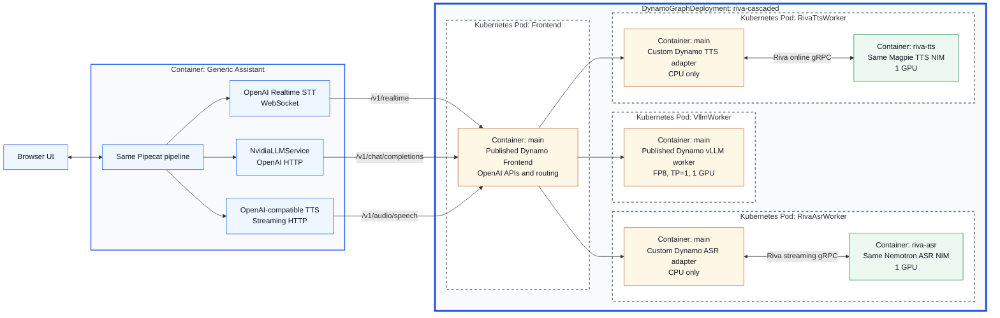

<!--
SPDX-FileCopyrightText: Copyright (c) 2025-2026 NVIDIA CORPORATION & AFFILIATES. All rights reserved.
SPDX-License-Identifier: Apache-2.0

Licensed under the Apache License, Version 2.0 (the "License");
you may not use this file except in compliance with the License.
You may obtain a copy of the License at

http://www.apache.org/licenses/LICENSE-2.0

Unless required by applicable law or agreed to in writing, software
distributed under the License is distributed on an "AS IS" BASIS,
WITHOUT WARRANTIES OR CONDITIONS OF ANY KIND, either express or implied.
See the License for the specific language governing permissions and
limitations under the License.
-->

# Riva speech adapters for a cascaded voice agent

This example exposes Riva-compatible speech NIMs through Dynamo's standard
OpenAI-compatible APIs. A voice application such as Pipecat remains responsible
for the ASR -> LLM -> TTS cascade, conversation state, turn taking, tools, and
barge-in.



The thick blue border is the DGD, dashed borders are Kubernetes pods, and each
labeled inner box is a container. The Generic Assistant container runs outside
the DGD.

The deployment matches the Generic Assistant recipe in the Nemotron Voice
Agent Blueprint so the same UI and workload can compare direct NIM access with
Dynamo routing:

| Stage | Model |
| --- | --- |
| ASR | Nemotron ASR Streaming 1.2.0, English streaming profile |
| LLM | NVIDIA Nemotron 3 Nano 30B A3B FP8 |
| TTS | Magpie TTS Multilingual 1.8.0 |

## Deploy on Kubernetes

The manifest creates a Dynamo frontend, a vLLM worker, and separate ASR and TTS
worker pods. Each speech worker runs its Riva NIM as a sidecar. The deployment
uses three GPUs in total, one for each model.

### Prerequisites

- A Kubernetes cluster with at least three NVIDIA GPUs and the
  [Dynamo Kubernetes Platform](../../docs/fern/kubernetes/quickstart.mdx)
  installed.
- Docker and `envsubst`, plus access to a registry that the cluster can pull
  from.
- An NGC API key with access to the ASR and TTS NIM images.
- A Hugging Face token with access to the Nemotron LLM.
- A ReadWriteMany storage class for the shared model cache.

Run all commands from the Dynamo repository root. Set the deployment values
once:

```bash
export NAMESPACE=voice-agent
export DYNAMO_RUNTIME_VERSION=<compatible-published-version>
export DYNAMO_FRONTEND_IMAGE="nvcr.io/nvidia/ai-dynamo/dynamo-frontend:${DYNAMO_RUNTIME_VERSION}"
export DYNAMO_VLLM_IMAGE="nvcr.io/nvidia/ai-dynamo/vllm-runtime:${DYNAMO_RUNTIME_VERSION}"
export CUSTOM_RIVA_ADAPTER_IMAGE="<registry-host>/<project>/dynamo-riva-adapter:${DYNAMO_RUNTIME_VERSION}"
export DYNAMO_REGISTRY=<registry-host>
export DYNAMO_REGISTRY_USER=<username>
export DYNAMO_REGISTRY_PASSWORD=<password>
export NGC_API_KEY=<ngc-api-key>
export HF_TOKEN=<hugging-face-token>
export RWX_STORAGE_CLASS=<rwx-storage-class>
```

Use the same Dynamo runtime version for the two published images and the custom
adapter image. Its semantic tag lets the Dynamo operator derive compatibility
directly from each component's main image.

### 1. Build and push the adapter image

The speech worker's main container is a small CPU-only adapter. It derives from
the published Dynamo frontend image, which provides the Dynamo runtime without
vLLM, and adds the Riva client and this example's adapter code:

```bash
./examples/riva_cascaded_pipeline/container/build.sh
docker push "${CUSTOM_RIVA_ADAPTER_IMAGE}"
```

The selected published version must contain the Dynamo realtime and streaming
speech support required by this example. Use branch-built images only when
validating changes that have not reached a published release.

### 2. Create the namespace and credentials

```bash
kubectl create namespace "${NAMESPACE}" --dry-run=client -o yaml \
  | kubectl apply -f -

kubectl create secret docker-registry dynamo-image-pull-secret \
  --namespace "${NAMESPACE}" \
  --docker-server "${DYNAMO_REGISTRY}" \
  --docker-username "${DYNAMO_REGISTRY_USER}" \
  --docker-password "${DYNAMO_REGISTRY_PASSWORD}" \
  --dry-run=client -o yaml | kubectl apply -f -

kubectl create secret docker-registry ngc-secret \
  --namespace "${NAMESPACE}" \
  --docker-server nvcr.io \
  --docker-username '$oauthtoken' \
  --docker-password "${NGC_API_KEY}" \
  --dry-run=client -o yaml | kubectl apply -f -

kubectl create secret generic ngc-api \
  --namespace "${NAMESPACE}" \
  --from-literal=NGC_API_KEY="${NGC_API_KEY}" \
  --dry-run=client -o yaml | kubectl apply -f -

kubectl create secret generic hf-token-secret \
  --namespace "${NAMESPACE}" \
  --from-literal=HF_TOKEN="${HF_TOKEN}" \
  --dry-run=client -o yaml | kubectl apply -f -
```

### 3. Create the shared model cache

The three model pods may run on different nodes, so the cache must support
`ReadWriteMany`:

```bash
kubectl apply --namespace "${NAMESPACE}" -f - <<EOF
apiVersion: v1
kind: PersistentVolumeClaim
metadata:
  name: model-cache
spec:
  accessModes:
    - ReadWriteMany
  storageClassName: ${RWX_STORAGE_CLASS}
  resources:
    requests:
      storage: 200Gi
EOF
```

### 4. Deploy the graph

Render the image environment variables while applying the tracked manifest:

```bash
envsubst '${DYNAMO_FRONTEND_IMAGE} ${DYNAMO_VLLM_IMAGE} ${CUSTOM_RIVA_ADAPTER_IMAGE}' \
  < examples/riva_cascaded_pipeline/deploy/agg.yaml \
  | kubectl apply --namespace "${NAMESPACE}" -f -
```

Watch the model pods start. Initial NIM and LLM downloads can take several
minutes:

```bash
kubectl get dgd riva-cascaded --namespace "${NAMESPACE}"
kubectl get pods --namespace "${NAMESPACE}" \
  --selector nvidia.com/dynamo-graph-deployment-name=riva-cascaded --watch
```

After the pods appear, wait for every container to become ready:

```bash
kubectl wait --namespace "${NAMESPACE}" --for=condition=Ready pod \
  --selector nvidia.com/dynamo-graph-deployment-name=riva-cascaded \
  --timeout=45m
```

If a pod does not become ready, inspect its events and container logs:

```bash
kubectl describe pod --namespace "${NAMESPACE}" \
  --selector nvidia.com/dynamo-graph-deployment-name=riva-cascaded
kubectl logs --namespace "${NAMESPACE}" \
  --selector nvidia.com/dynamo-component=RivaAsrWorker \
  --container riva-asr --tail=100
```

### 5. Connect and validate

Forward the generated frontend service:

```bash
kubectl port-forward --namespace "${NAMESPACE}" \
  service/riva-cascaded-frontend 8000:8000
```

The deployment exposes:

- `ws://localhost:8000/v1/realtime`, transcription using 24 kHz PCM
- `http://localhost:8000/v1/chat/completions`
- `http://localhost:8000/v1/audio/speech`, streaming 24 kHz PCM

In another terminal, install the small client dependency and exercise TTS and
ASR together:

```bash
python3 -m pip install aiohttp
python3 examples/riva_cascaded_pipeline/smoke_speech_loop.py
```

The check reports TTS TTFB, ASR first-transcript latency, PCM RMS, and the final
transcript. It fails on an API error, silent audio, or an empty transcript.

The TTS adapter requires a Dynamo runtime with streaming
`/v1/audio/speech` support. The realtime ASR adapter disables server VAD
because Pipecat's local VAD and Smart Turn processors commit the input audio.

## Use the Blueprint UI

Run the Nemotron Voice Agent Generic Assistant with its Dynamo service profile:

This command requires the companion Dynamo profile in the Blueprint repository.

```bash
docker compose --profile generic-assistant/dynamo up -d
```

Open `http://localhost:7860`. This is the same application, browser UI,
Pipecat pipeline, prompt, VAD, and turn processor used by the direct NIM
profile; only the service endpoints differ.

## Tests

The unit tests mock Riva while exercising the public Dynamo event and audio
contracts:

```bash
python3 -m pip install -r examples/riva_cascaded_pipeline/requirements.txt \
  pytest pytest-asyncio
PYTHONPATH=components/src:lib/bindings/python/src \
  python3 -m pytest -xvv examples/riva_cascaded_pipeline/tests
bash -n examples/riva_cascaded_pipeline/{launch_workers.sh,container/build.sh}
pre-commit run check-yaml --files examples/riva_cascaded_pipeline/deploy/agg.yaml
```

For functional validation, run `smoke_speech_loop.py` and confirm that the
transcript matches the synthesized sentence closely enough to recognize the
intended text.
