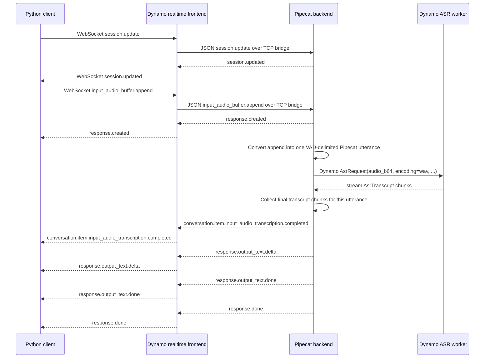
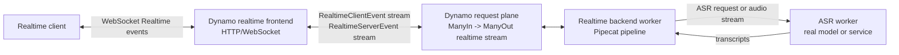

# Voice Agent Architecture

This example is a proof of concept for putting a Pipecat voice pipeline behind
Dynamo's OpenAI-style realtime endpoint.

The important split is:

- The public client-facing API is Dynamo's realtime WebSocket endpoint.
- The realtime backend is currently a standalone Python Pipecat process.
- ASR is called through the normal Dynamo request plane, using a mock worker for
  now.
- The frontend-to-Pipecat hop is a temporary JSON-over-TCP bridge, not the final
  Dynamo bidirectional request-plane contract.

## Current Components

```mermaid
flowchart LR
    client["Python client<br/>client/client.py"]
    ws["Dynamo realtime frontend<br/>frontend/src/bin/frontend.rs<br/>HTTP + WebSocket"]
    bridge["Temporary backend bridge<br/>newline-delimited JSON over TCP"]
    pipecat["Python Pipecat backend<br/>backend/pipecat_backend.py"]
    asr_client["DynamoASRService<br/>Pipecat STT adapter"]
    runtime["Dynamo request plane<br/>DistributedRuntime client"]
    worker["Mock ASR Dynamo worker<br/>backend/mock_asr_worker.py<br/>voice_agent.asr.transcribe"]

    client <--> |"OpenAI Realtime events<br/>WebSocket"| ws
    ws <--> |"temporary JSON bridge<br/>one event in, streamed events out"| bridge
    bridge <--> pipecat
    pipecat --> asr_client
    asr_client --> |"AsrRequest JSON<br/>single request"| runtime
    runtime --> worker
    worker --> |"stream of AsrTranscript"| runtime
    runtime --> asr_client
```

## Request Path

## Streaming Boundaries

| Boundary | Current transport | Current streaming shape | Bidirectional? | Notes |
| --- | --- | --- | --- | --- |
| Client to realtime frontend | WebSocket | Client and server both send Realtime events on one connection | Yes | This is the public OpenAI-style realtime surface. The client can send more events while the server streams events back. |
| Realtime frontend engine interface | `ManyIn<RealtimeClientEvent>` to `ManyOut<Annotated<RealtimeServerEvent>>` | Dynamo-facing Rust type is bidirectional-stream-shaped | Yes, at the trait boundary | The frontend registers a `RealtimeBidirectionalEngine`. This is the shape we want remote backends to use later. |
| Realtime frontend to Pipecat backend | Newline-delimited JSON over a raw TCP connection | Frontend writes one client event, then reads server events until `session.updated`, `response.done`, or `error` | Not fully | This is the temporary non-Dynamo bridge. It is full-duplex TCP at the socket level, but the code uses a turn-scoped request/streamed-response pattern rather than concurrent bidirectional streaming. |
| Pipecat backend internal pipeline | Pipecat frames in process | `InputAudioRawFrame` plus synthetic VAD frames flow through a segmented STT pipeline | Partially | Pipecat itself is frame-oriented, but this PoC wraps one `input_audio_buffer.append` as one complete utterance and waits for transcript output. |
| Pipecat backend to ASR worker | Dynamo request plane via `DistributedRuntime` | One `AsrRequest` in, stream of `AsrTranscript` out | No | This is real Dynamo request-plane communication, but it is `SingleIn -> ManyOut`, not realtime bidirectional streaming. The whole utterance audio is sent as base64 JSON. |
| ASR worker implementation | Python `@dynamo_worker` endpoint | Mock stream of transcript chunks | No | The worker is a real Dynamo worker, but the ASR model is stubbed. |

## Temporary Non-Dynamo Pieces

The pieces below are intentionally temporary scaffolding:

- `frontend` to `backend/pipecat_backend.py` uses newline-delimited JSON over
  TCP. It is not service discovery, routing, load balancing, or remote
  dispatch through Dynamo.
- `backend/pipecat_backend.py` is a standalone process that connects to the
  frontend bridge. It is not registered as the realtime Dynamo backend.
- Realtime events are JSON dictionaries in the Python backend, not Python
  bindings for the Rust `RealtimeClientEvent` and `RealtimeServerEvent` types.
- One `input_audio_buffer.append` is treated as a complete utterance. There is
  no server-side multi-append audio buffer, real VAD, microphone capture, or
  playback yet.
- The ASR worker returns deterministic mock transcripts. Only the
  Pipecat-to-Dynamo request-plane shape is real.

The real Dynamo piece today is the Pipecat backend's call to
`voice_agent.asr.transcribe`: the custom `DynamoASRService` creates a
`DistributedRuntime` client, sends an `AsrRequest`, and consumes the worker's
streaming `AsrTranscript` output.

## Target Shape

The expected next architecture is to replace the custom frontend/backend bridge
with a Dynamo remote bidirectional stream:

In that version:

- The realtime backend should be a Dynamo worker endpoint with the same logical
  contract as `ManyIn<RealtimeClientEvent> -> ManyOut<Annotated<RealtimeServerEvent>>`.
- The frontend should not know whether the backend is local or remote; it should
  dispatch through Dynamo rather than a hand-rolled TCP bridge.
- Python can own the Pipecat backend once the runtime can expose the needed
  bidirectional stream bindings to Python.
- The ASR side can remain `SingleIn -> ManyOut` for utterance-level ASR, or move
  to a bidirectional audio/transcript stream if we want low-latency partial ASR
  over audio chunks.
