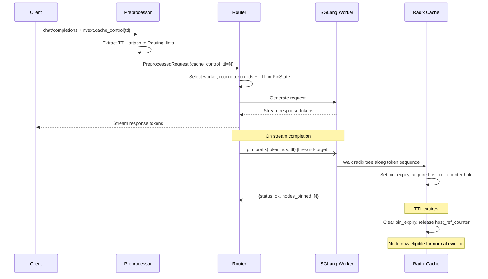

# SGLang for Agentic Workloads

This guide covers SGLang-specific configuration for agentic serving with Dynamo. It explains which SGLang engine flags to enable, how Dynamo's [agent hints](../../components/router/agent-hints.md) map to SGLang behavior, and how to use experimental cache pinning to protect KV cache for high-value conversations.

## Overview

Agentic workloads (tool-calling loops, multi-turn reasoning, code generation pipelines) have different performance characteristics than batch inference:

- **Prefix-heavy**: Successive turns share a growing conversation prefix. KV cache reuse is critical for low TTFT.
- **Priority-sensitive**: Some requests (user-facing agent turns) matter more than background tasks.
- **Long-lived**: Conversations span minutes to hours. Cache eviction under memory pressure can destroy accumulated KV state.

Dynamo's agent hints give the router per-request metadata. SGLang's engine flags control how that metadata affects scheduling and eviction on the worker.

## SGLang Engine Flags

### Priority Scheduling

Enable priority-based scheduling so the engine respects the `priority` value from `nvext.agent_hints.priority`:

```bash
python -m dynamo.sglang \
  --model-path <model> \
  --enable-priority-scheduling \
  --schedule-low-priority-values-first \
  ...
```

| Flag | Description |
|------|-------------|
| `--enable-priority-scheduling` | Enables priority-based request scheduling instead of FCFS. |
| `--schedule-low-priority-values-first` | Inverts priority ordering so lower values are scheduled first (matches vLLM convention). Without this flag, higher values = higher priority. |

When priority scheduling is enabled, the engine uses the `priority` field from `nvext.agent_hints` to order requests in its internal queue. Requests with higher effective priority are scheduled before lower-priority ones. Ties are broken by arrival time.

### Priority-Based KV Cache Eviction

By default, SGLang evicts radix tree nodes using LRU. You can switch to priority-based eviction so that low-priority cache entries are evicted before high-priority ones:

```bash
python -m dynamo.sglang \
  --model-path <model> \
  --radix-eviction-policy priority \
  ...
```

| Flag | Values | Default | Description |
|------|--------|---------|-------------|
| `--radix-eviction-policy` | `lru`, `priority` | `lru` | Eviction strategy for the GPU radix cache. `priority` uses a heap ordered by the request's priority value. |

This does **not** require HiCache. It controls GPU-only radix tree eviction. When the GPU KV cache is full:

- **`lru`**: Evicts the least recently used leaf nodes first.
- **`priority`**: Evicts lowest-priority leaf nodes first. Nodes with equal priority fall back to LRU ordering.

#### Interaction with HiCache

When both `--radix-eviction-policy priority` and `--enable-hierarchical-cache` are enabled, priority affects eviction at both tiers:

| Event | Behavior |
|-------|----------|
| **GPU full** | Low-priority nodes are evicted (demoted to host) first. With `write_through`, all nodes survive on host -- priority only affects demotion order. |
| **Host full** | Low-priority nodes are deleted from host first. High-priority nodes survive longer. Pinned nodes are skipped entirely. |

The practical impact depends on your write policy. With `write_through`, GPU eviction is just a demotion -- the real deletion happens at host eviction, which is where priority ordering matters most.

## How Agent Hints Map to SGLang

Dynamo's `nvext.agent_hints` fields are consumed by the router and forwarded to SGLang workers. Here is how each hint interacts with the SGLang engine:

| Agent Hint | Router Behavior | SGLang Engine Behavior |
|------------|----------------|----------------------|
| `priority` | No routing effect (forwarded to engine) | Queue ordering when `--enable-priority-scheduling` is set. Also affects radix cache eviction order when `--radix-eviction-policy priority` is set. |
| `latency_sensitivity` | Shifts request earlier in router queue (requires `--router-queue-threshold`) | No direct engine effect. |
| `osl` | Output block tracking for routing decisions (requires `--router-track-output-blocks`) | No direct engine effect. |
| `speculative_prefill` | After response completes, sends a `max_tokens=1` prefill to warm the KV cache for the predicted next turn. | SGLang processes the prefill request normally, populating the radix cache. |

### Example: Agentic Request with Hints

```python
from openai import OpenAI

client = OpenAI(base_url="http://localhost:8000/v1", api_key="dummy")

response = client.chat.completions.create(
    model="Qwen/Qwen3-14B-FP8",
    messages=[
        {"role": "system", "content": "You are a coding assistant."},
        {"role": "user", "content": "Write a Python function to parse CSV files."},
    ],
    stream=True,
    extra_body={
        "nvext": {
            "agent_hints": {
                "priority": 10,
                "latency_sensitivity": 2.0,
                "speculative_prefill": True,
                "osl": 512
            }
        }
    }
)

for chunk in response:
    if chunk.choices[0].delta.content:
        print(chunk.choices[0].delta.content, end="")
```

## Cache Pinning (Experimental)

<Warning>Cache pinning is experimental and available on development branches only. The API may change.</Warning>

**Required PRs:**
- SGLang: [feat: TTL-based prefix pinning with refresh-on-hit for HiRadixCache](https://github.com/sgl-project/sglang/pull/18941)
- Dynamo: [feat: wire nvext.cache_control TTL-based pinning through Dynamo router](https://github.com/ai-dynamo/dynamo/pull/6213)

Cache pinning lets you explicitly protect KV cache for high-value conversation prefixes. When a request includes `nvext.cache_control`, the router fires a `pin_prefix` call to the SGLang worker after generation completes. Pinned nodes resist eviction for the specified TTL -- even under memory pressure, they are retained (demoted to host memory with HiCache rather than deleted).

### How It Works



1. The client includes `nvext.cache_control` with a TTL in the request.
2. The Dynamo preprocessor extracts the TTL and attaches it to routing hints.
3. The router routes the request normally and records the token IDs in a `PinState`.
4. After the response stream completes, the router spawns a fire-and-forget `pin_prefix` RPC to the worker that served the request.
5. The worker walks the radix tree along the token sequence and pins each node, setting `pin_expiry` and acquiring a `host_ref_counter` hold that prevents eviction.
6. When TTL expires, the pin is cleared and the node becomes eligible for normal eviction.

### Enabling Cache Pinning

**Frontend flag:**

```bash
python -m dynamo.frontend \
  --router-mode kv \
  --enable-cache-control \
  ...
```

| Flag | Description |
|------|-------------|
| `--enable-cache-control` | Enables cache control (PIN with TTL). Creates a `cache_control` service mesh client and fires `pin_prefix` after generation for requests with `nvext.cache_control`. Requires `--router-mode=kv`. |

**SGLang worker:** The worker receives PIN requests via its `cache_control` service mesh endpoint. You **must** set the `SGLANG_HICACHE_MAX_PINNED_RATIO` environment variable to a non-zero value -- pinning is disabled by default.

| Environment Variable | Type | Default | Description |
|---------------------|------|---------|-------------|
| `SGLANG_HICACHE_MAX_PINNED_RATIO` | `float` | `0.0` | Max fraction of cache tokens that can be pinned. Must be in `[0, 1)`. `0` disables pinning entirely. |

HiCache is required (`--enable-hierarchical-cache`). Without it, the scheduler rejects PIN requests. For best results, use `write_through` so that pinned nodes demote to host memory instead of being deleted when GPU memory fills:

```bash
SGLANG_HICACHE_MAX_PINNED_RATIO=0.1 python -m dynamo.sglang \
  --model-path Qwen/Qwen3-14B-FP8 \
  --enable-hierarchical-cache \
  --hicache-ratio 2.0 \
  --hicache-write-policy write_through \
  ...
```

### Request Format

Include `cache_control` as a top-level field in `nvext`:

```json
{
    "model": "Qwen/Qwen3-14B-FP8",
    "messages": [
        {"role": "system", "content": "You are a helpful assistant."},
        {"role": "user", "content": "Explain quantum computing."}
    ],
    "nvext": {
        "cache_control": {
            "type": "ephemeral",
            "ttl": "1h"
        }
    }
}
```

| Field | Type | Description |
|-------|------|-------------|
| `cache_control.type` | `string` | Currently only `"ephemeral"` is supported. |
| `cache_control.ttl` | `string` | TTL as integer seconds (`"600"`) or shorthand (`"5m"`, `"1h"`). Clamped to [300, 3600] seconds. Unrecognized strings default to 300s. |

### Python Example

```python
from openai import OpenAI

client = OpenAI(base_url="http://localhost:8000/v1", api_key="dummy")

# First turn -- pin the conversation prefix for 1 hour
response = client.chat.completions.create(
    model="Qwen/Qwen3-14B-FP8",
    messages=[
        {"role": "system", "content": system_prompt},
        {"role": "user", "content": "Analyze this codebase and suggest improvements."},
    ],
    stream=True,
    extra_body={
        "nvext": {
            "cache_control": {
                "type": "ephemeral",
                "ttl": "1h"
            }
        }
    }
)

# Collect the assistant reply
assistant_response = ""
for chunk in response:
    if chunk.choices[0].delta.content:
        assistant_response += chunk.choices[0].delta.content

# Later turns reuse the pinned prefix -- even after heavy load from
# other requests, the KV cache for this conversation is preserved.
response = client.chat.completions.create(
    model="Qwen/Qwen3-14B-FP8",
    messages=[
        {"role": "system", "content": system_prompt},
        {"role": "user", "content": "Analyze this codebase and suggest improvements."},
        {"role": "assistant", "content": assistant_response},
        {"role": "user", "content": "Now focus on the database layer."},
    ],
    stream=True,
    extra_body={
        "nvext": {
            "cache_control": {
                "type": "ephemeral",
                "ttl": "1h"
            }
        }
    }
)
```

### Verifying Cache Hits

The response includes `prompt_tokens_details.cached_tokens` in the `usage` object when `--enable-cache-report` is set on the SGLang worker:

```json
{
    "usage": {
        "prompt_tokens": 2048,
        "completion_tokens": 150,
        "prompt_tokens_details": {
            "cached_tokens": 1920
        }
    }
}
```

A high `cached_tokens / prompt_tokens` ratio on subsequent turns confirms that the pinned prefix was preserved.

### Limitations

- **Pinning disabled by default**: `SGLANG_HICACHE_MAX_PINNED_RATIO` defaults to `0.0`. You must set it to a non-zero value (e.g., `0.1`) or all PIN requests will be rejected.
- **HiCache required**: The scheduler rejects PIN requests unless `--enable-hierarchical-cache` is set.
- **TTL clamping**: Values are clamped to [300, 3600] seconds. You cannot pin for less than 5 minutes or more than 1 hour.
- **Pin budget**: Pinned tokens consume a budget controlled by `SGLANG_HICACHE_MAX_PINNED_RATIO` (fraction of host pool capacity). Requests exceeding this budget are rejected.
- **No priority on pinned nodes**: `pin_prefix` does not set a priority on the radix tree nodes. All pinned nodes have equal eviction priority and fall back to LRU ordering among themselves when host memory fills.
- **Requires stack restart for A/B testing**: Pins persist in cache across benchmark runs. When comparing pinned vs. unpinned performance, restart the full stack between phases to avoid false cache hits.

## See Also

- **[Agent Hints](../../components/router/agent-hints.md)**: Per-request hint reference
- **[NVIDIA Request Extensions (nvext)](../../components/frontend/nvext.md)**: Full `nvext` field reference
- **[Router Guide](../../components/router/router-guide.md)**: Router configuration and CLI arguments
- **[SGLang HiCache](../../integrations/sglang-hicache.md)**: Enabling hierarchical KV cache
