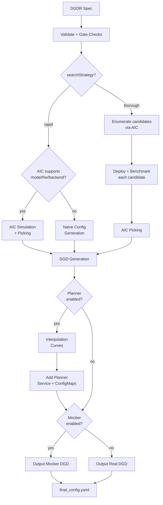

## Overview

The Dynamo Profiler analyzes model inference performance and generates optimized deployment configurations (DynamoGraphDeployments). Given a model, hardware, and SLA targets, it determines the best parallelization strategy, selects optimal prefill and decode engine configurations, and produces a ready-to-deploy DGD YAML.

The profiler accepts a `DynamoGraphDeploymentRequestSpec` (DGDR) as input and uses [AI Configurator (AIC)](https://github.com/ai-dynamo/aiconfigurator) for performance simulation, candidate enumeration, and configuration picking. When the planner is enabled, the profiler additionally generates engine interpolation curves used for runtime autoscaling.

## Workflow

- **What** model you want to deploy (`model`)
- **How** it should perform (SLA targets: `sla.ttft`, `sla.itl`)
- **Where** it should run (optional GPU preferences via `hardware`)
- **Which** backend to use (`backend`: auto, vllm, sglang, or trtllm)
- **Which** image to use (`image`)

The profiler follows this pipeline:



### Stage-by-stage walkthrough

1. **Validation**: The DGDR spec is validated — required fields checked (`image`, `hardware.gpuSku`, `hardware.numGpusPerNode`), SLA targets verified, and gate checks applied (see [Gate Checks](#gate-checks-and-constraints)).

2. **Search Strategy**: The profiler branches based on `searchStrategy`:
   - **Rapid**: Uses AIC simulation to estimate performance across parallelization configs. No GPUs needed, completes in ~30 seconds.
   - **Thorough**: Enumerates candidate parallelization configs via AIC, deploys each on real GPUs, benchmarks with AIPerf, then picks the best. Takes 2-4 hours, disagg mode only.

3. **Picking**: The profiler selects the best configuration using one of three modes, determined automatically from the DGDR spec (see [Picking Modes](#picking-modes)).

4. **DGD Generation**: The picked configuration is rendered into a complete DGD YAML via AIC's generator pipeline, including correct parallelization, replica counts, container image, and PVC mounts.

5. **Interpolation** (planner only): When the planner is enabled, the profiler generates detailed performance interpolation curves — TTFT vs ISL for prefill, ITL vs KV-cache utilization for decode. These are saved into ConfigMaps for the planner to use at runtime.

6. **Final Assembly**: The planner service is added to the DGD if enabled. If mocker is enabled, the mocker DGD is used instead of real workers. The result is written to `final_config.yaml`.

## Search Strategies

### Rapid

Uses AIC's performance simulation to estimate optimal configurations without deploying real engines. Completes in ~30 seconds.

```yaml
searchStrategy: rapid
```

- Supports all backends: vLLM, SGLang, TensorRT-LLM
- If the model/hardware/backend combination is not supported by AIC, falls back to a naive config (memory-fit TP calculation)
- No GPU resources consumed during profiling

### Thorough

Enumerates candidate parallelization configs, deploys each as a real K8s workload, and benchmarks with AIPerf.

```yaml
searchStrategy: thorough
```

- Only disaggregated mode is supported
- Does not support `auto` backend — specify `vllm`, `sglang`, or `trtllm`
- Takes 2-4 hours depending on the number of candidates
- Provides highest accuracy since measurements come from real hardware

## Picking Modes

The profiler automatically selects a picking mode based on the DGDR spec:

### Autoscale

Triggered when the **planner is enabled** (scaling enabled in `features.planner`). Picks prefill and decode engines independently, each with 1 replica. The planner handles scaling at runtime.

### Load Match

Triggered when a **target load** is specified (`workload.requestRate` or `workload.concurrency`). Finds the configuration that serves the target load with the minimum number of GPUs under SLA.

```yaml
workload:
  requestRate: 5.0   # target 5 req/s
```

### Default

Triggered when there is **no planner and no target load**. Maximizes throughput for the available GPU budget under SLA.

## Planner Integration

When the planner is enabled, the profiler generates engine interpolation data needed for throughput-based autoscaling. The `pre_deployment_sweeping_mode` field controls how this data is produced:

```yaml
features:
  planner:
    pre_deployment_sweeping_mode: rapid   # rapid | thorough | none
    enable_throughput_scaling: true
```

- **rapid**: Uses AIC simulation to generate interpolation curves (~30s, no GPUs)
- **thorough**: Deploys the selected engine config on real GPUs and sweeps across ISL/concurrency ranges (2-4h)
- **none**: Skips interpolation. Only valid when using load-based scaling without throughput-based scaling.

The profiler saves two ConfigMaps into the generated DGD:
- **planner-config-XXXX**: Serialized `PlannerConfig` JSON (with `profile_results_dir` pointing to the profiling data mount)
- **planner-profile-data-XXXX**: Prefill and decode interpolation data (JSON)

See the [Planner Guide](../planner/planner-guide.md) for the full `PlannerConfig` reference.

## Mocker

When `features.mocker.enabled: true`, the profiler outputs a mocker DGD that simulates engine behavior without real GPUs. This is useful for testing planner behavior and validating configurations at scale.

Mocker requires pre-deployment sweeping to generate simulated performance profiles — `pre_deployment_sweeping_mode` cannot be `none` when mocker is enabled.

## Gate Checks and Constraints

The profiler enforces these rules at startup:

| Condition | Behavior |
|-----------|----------|
| `searchStrategy: thorough` + `backend: auto` | Rejected. Specify a concrete backend. |
| AIC unsupported + `enable_throughput_scaling: true` | Rejected. Throughput planner requires AIC support. |
| AIC unsupported + `pre_deployment_sweeping_mode: rapid` | Falls back to `none` with a warning. |
| `e2eLatency` provided without `ttft: null, itl: null` | Rejected by SLA validator. When using `e2eLatency`, explicitly null out `ttft` and `itl`. |
| SLA unachievable | Warning logged, SLA updated to best achievable value. |
| Load-match needs more GPUs than available | Warning logged. |

## Support Matrix

| Backend | Dense Models | MoE Models |
|---------|-------------|------------|
| vLLM | ✅ | 🚧 |
| SGLang | ✅ | ✅ |
| TensorRT-LLM | ✅ | 🚧 |

The profiler sweeps over the following parallelization mappings for prefill and decode:

| Model Architecture | Prefill Parallelization Mapping | Decode Parallelization Mapping |
|---------|-------------|------------|
| MLA+MoE (DeepseekV3ForCausalLM, DeepseekV32ForCausalLM) | TEP, DEP | TEP, DEP |
| GQA+MoE (Qwen3MoeForCausalLM) | TP, TEP, DEP | TP, TEP, DEP |
| Other Models | TP | TP |

<Note>
Exact model x parallelization mapping support is dependent on the backend. The profiler does not guarantee that the recommended P/D engine configuration is supported and bug-free by the backend.
</Note>

## Deployment

### Kubernetes Deployment (DGDR)

The recommended deployment method is through DGDRs. Sample configurations are provided in `components/src/dynamo/profiler/deploy/`:

| Sample | Description |
|--------|-------------|
| `profile_sla_dgdr.yaml` | Standard online profiling with AIPerf |
| `profile_sla_aic_dgdr.yaml` | Fast offline profiling with AI Configurator |
| `profile_sla_moe_dgdr.yaml` | MoE model profiling (SGLang) |

#### Container Images

Each DGDR requires a container image for profiling and deployment:

- **`image`** (Optional): Container image for the profiling job. Must contain the profiler code and dependencies.

```yaml
spec:
  image: "nvcr.io/nvidia/ai-dynamo/vllm-runtime:0.9.0"
```

#### Quick Start: Deploy with DGDR

**Step 1: Create Your DGDR**

Use a sample configuration or create your own:

```yaml
apiVersion: nvidia.com/v1beta1
kind: DynamoGraphDeploymentRequest
metadata:
  name: my-model-profiling
spec:
  model: "Qwen/Qwen3-0.6B"
  backend: vllm
  image: "nvcr.io/nvidia/ai-dynamo/dynamo-frontend:1.0.0"
```

**Step 2: Apply the DGDR**

```bash
export NAMESPACE=your-namespace
kubectl apply -f my-profiling-dgdr.yaml -n $NAMESPACE
```

**Step 3: Monitor Progress**

```bash
# View status
kubectl get dgdr -n $NAMESPACE

# Detailed status
kubectl describe dgdr my-model-profiling -n $NAMESPACE

# Watch profiling job logs
kubectl logs -f job/profile-my-model-profiling -n $NAMESPACE
```

**DGDR Status Phases:**
- `Pending`: Initial state, preparing to profile
- `Profiling`: Running profiling job (20-30 seconds for AIC, 2-4 hours for online)
- `Ready`: Profiling complete, generated DGD spec available in status
- `Deploying`: Generating and applying DGD configuration
- `Deployed`: DGD successfully deployed and running
- `Failed`: Error occurred (check events for details)

**Step 4: Access Your Deployment**

```bash
# Find the frontend service
kubectl get svc -n $NAMESPACE | grep frontend

# Port-forward to access locally
kubectl port-forward svc/<deployment>-frontend 8000:8000 -n $NAMESPACE

# Test the endpoint
curl http://localhost:8000/v1/models
```

<Note>
DGDRs are **immutable**. To update SLAs or configuration, delete the existing DGDR and create a new one.
</Note>

## Profiling Method

The profiler follows a 5-step process:

1. **Hardware Setup**: Uses defaults or user-specified hardware configuration. Optionally, cluster-scoped operators can enable automatic GPU discovery to detect specifications from cluster nodes.
2. **Identify Sweep Ranges**: Automatically determine minimum and maximum number of GPUs per engine. Minimum is determined by the model size and GPU VRAM. Maximum is set to one node for dense models and 4 nodes for MoE models.
3. **Parallelization Mapping Sweep**: Test performance of engines with different parallelization mappings using the input ISL and OSL.
   - For dense models, test different TP sizes for both prefill and decode.
   - For MoE models (SGLang), evaluate both TEP and DEP as candidates for prefill and decode.
   - **Prefill**:
     - TP/TEP: Measure TTFT with batch size = 1 (assuming ISL is long enough to saturate compute) without KV reuse.
     - DEP: Attention uses data parallelism. Send a single burst with total concurrency `attention_dp_size × attn_dp_num_req_ratio` (defaults to 4) and compute the reported TTFT as `time_to_first_token.max / attn_dp_num_req_ratio` from the AIPerf summary of that burst.
   
   - **Decode**: Measure the ITL under different numbers of in-flight requests, from 1 to the maximum the KV cache can hold. To measure ITL without being affected by piggy-backed prefill requests, the script enables KV-reuse and warms up the engine by issuing the same prompts before measuring.
   
4. **Recommendation**: Select optimal parallelization mapping for prefill and decode that achieves the highest per-GPU throughput while adhering to the SLA on TTFT and ITL.
5. **In-Depth Profiling on the Recommended P/D Engine**: Interpolate TTFT with ISL and ITL with active KV cache and decode context length for more accurate performance estimation.

   - **Prefill**: Measures TTFT and throughput per GPU across different input lengths with batch size=1.
   - **Decode**: Measures ITL and throughput per GPU under various KV cache loads and decode context lengths.

### AIPerf on Real Engines

Profiles your model by creating real test deployments in Kubernetes and measuring their performance.

- **Duration**: 2-4 hours
- **Accuracy**: Highest (real measurements)
- **GPU Requirements**: Full access to test different parallelization mappings
- **Backends**: vLLM, SGLang, TensorRT-LLM

AIPerf-based profiling is the default behavior. Use `searchStrategy: thorough` for comprehensive real-engine profiling:

```yaml
spec:
  searchStrategy: thorough  # Deep exploration with real engine profiling
```

### AI Configurator Simulation

Uses performance simulation to rapidly estimate optimal configurations without running real deployments.

- **Duration**: 20-30 seconds
- **Accuracy**: Estimated (may have errors for unusual configurations)
- **GPU Requirements**: None
- **Backends**: TensorRT-LLM only (vLLM/SGLang coming soon)

AI Configurator is used by default with `searchStrategy: rapid`:

```yaml
spec:
  searchStrategy: rapid  # Fast profiling with AI Configurator simulation (default)
```

<Note>
`aicBackendVersion` specifies the TensorRT-LLM version that AI Configurator simulates. See the [AI Configurator supported features](https://github.com/ai-dynamo/aiconfigurator#supported-features) for available versions.
</Note>

**Currently supports:**
- **Backends**: TensorRT-LLM (versions 0.20.0, 1.0.0rc3, 1.0.0rc6)
- **Systems**: H100 SXM, H200 SXM, B200 SXM, GB200 SXM, A100 SXM
- **Models**: Wide range including GPT, Llama, Mixtral, DeepSeek, Qwen, and more

See [AI Configurator documentation](https://github.com/ai-dynamo/aiconfigurator#supported-features) for the full list.

### Automatic GPU Discovery

The operator automatically discovers GPU resources from cluster nodes, providing hardware info (GPU model, VRAM, GPUs per node) and automatic profiling search space calculation.

**Requirements:**
- **Cluster-scoped operators**: Have node read permissions by default
- **Namespace-scoped operators**: GPU discovery is enabled by default when installing via Helm — the chart provisions the required ClusterRole/ClusterRoleBinding automatically

**For namespace-scoped operators**, GPU discovery is controlled by a Helm value:

```bash
# GPU discovery enabled (default) — Helm provisions read-only node access automatically
helm install dynamo-platform ... --set dynamo-operator.gpuDiscovery.enabled=true

# GPU discovery disabled — you must provide hardware config manually in each DGDR
helm install dynamo-platform ... --set dynamo-operator.gpuDiscovery.enabled=false
```

If GPU discovery is disabled, provide hardware config manually in the DGDR:

```yaml
spec:
  hardware:
    numGpusPerNode: 8
    gpuSku: "H100-SXM5-80GB"
    vramMb: 81920
```

If GPU discovery is disabled and no manual hardware config is provided, the DGDR will be rejected at admission time.

## Configuration

### DGDR Configuration Structure

All profiler configuration is provided through the v1beta1 DGDR spec fields:

```yaml
apiVersion: nvidia.com/v1beta1
kind: DynamoGraphDeploymentRequest
metadata:
  name: my-deployment
spec:
  model: "Qwen/Qwen3-0.6B"
  backend: vllm
  image: "nvcr.io/nvidia/ai-dynamo/vllm-runtime:0.9.0"

  searchStrategy: rapid  # or thorough
  autoApply: true

  workload: { ... }
  sla: { ... }
  hardware: { ... }
  features: { ... }
  overrides: { ... }
```

### SLA Configuration (Optional)

```yaml
workload:
  isl: 3000      # Average input sequence length (tokens)
  osl: 150       # Average output sequence length (tokens)

sla:
  ttft: 200.0    # Target Time To First Token (milliseconds)
  itl: 20.0      # Target Inter-Token Latency (milliseconds)
```

- **ISL/OSL**: Based on your expected traffic patterns
- **TTFT**: First token latency target (lower = more GPUs needed, affects prefill engine)
- **ITL**: Token generation latency target (lower = more GPUs needed, affects decode engine)
- **Trade-offs**: Tighter SLAs require more GPU resources

### Hardware Configuration (Optional)

```yaml
hardware:
  gpuSku: h200_sxm            # GPU SKU identifier (auto-detected)
  vramMb: 81920               # VRAM per GPU in MiB
  totalGpus: 16               # Total GPUs available in the cluster
  numGpusPerNode: 8           # GPUs per node (for multi-node MoE)
```

- **numGpusPerNode**: Determine the upper bound of GPUs per node for dense models and configure Grove for multi-node MoE engines
- **gpuSku**: GPU SKU identifier, auto-detected by the controller

<Tip>
If you don't specify hardware constraints, the controller auto-detects based on your model size and available cluster resources.
</Tip>

### Search Strategy (Optional)

Controls the profiling search depth:

```yaml
spec:
  searchStrategy: rapid   # "rapid" (default) for fast sweep; "thorough" for deeper exploration
```

- **rapid**: Performs a fast sweep over parallelization mappings (default)
- **thorough**: Explores more configurations for potentially better results

### Planner Configuration (Optional)

Pass arguments to the SLA planner via the features section:

```yaml
features:
  planner:
    planner_min_endpoint: 2                    # Minimum endpoints to maintain
    planner_adjustment_interval: 60            # Adjustment interval (seconds)
    planner_load_predictor: linear             # Load prediction method
```

<Note>
Planner arguments use `planner_` prefix. See [SLA Planner documentation](../planner/planner-guide.md) for full list.
</Note>

### Model Cache PVC (Advanced)

For large models, use a pre-populated PVC containing model weights instead of downloading from HuggingFace:

```yaml
modelCache:
  pvcName: "model-cache"
  pvcModelPath: "hub/models--deepseek-ai--DeepSeek-R1"
  pvcMountPath: "/opt/model-cache"
```

Requirements:
- The PVC must exist in the same namespace as the DGDR
- The model weights must be accessible at `{mountPath}/{pvcPath}`

### Engine Configuration (Auto-configured)

The controller automatically handles model and backend configuration from high-level fields:

```yaml
# You specify:
spec:
  model: "Qwen/Qwen3-0.6B"
  backend: vllm

# Controller auto-injects into the profiling job
```

You should **not** manually set model or backend in profiling config overrides.

### Using Existing DGD Configs

Provide a base DGD config via the overrides section:

```yaml
overrides:
  dgd:
    apiVersion: nvidia.com/v1alpha1
    kind: DynamoGraphDeployment
    metadata:
      name: my-dgd
    spec:
      # ... your base DGD spec
```

The profiler uses the DGD config as a **base template**, then optimizes it based on your SLA targets.

## Integration

### With SLA Planner

The Profiler generates interpolation data that the SLA Planner uses for autoscaling decisions.

**Prefill Interpolation** (`selected_prefill_interpolation/raw_data.npz`):
- `prefill_isl`: 1D array of input sequence lengths tested
- `prefill_ttft`: 1D array of TTFTs (ms) at each ISL
- `prefill_thpt_per_gpu`: 1D array of throughput (tokens/s/GPU) at each ISL

**Decode Interpolation** (`selected_decode_interpolation/raw_data.npz`):
- `max_kv_tokens`: Total KV tokens capacity in decode engine
- `x_kv_usage`: 1D array of active KV usage percentages [0, 1]
- `y_context_length`: 1D array of average context lengths tested
- `z_itl`: 1D array of ITLs (ms) at each (KV usage, context length) point
- `z_thpt_per_gpu`: 1D array of throughput (tokens/s/GPU) at each point

### With Dynamo Operator

When using DGDR, the Dynamo Operator:

1. Creates profiling jobs automatically
2. Stores profiling data in ConfigMaps (`planner-profile-data`)
3. Generates optimized DGD configurations
4. Deploys the DGD with SLA Planner integration

The generated DGD is tracked via labels:
```yaml
metadata:
  labels:
    dgdr.nvidia.com/name: my-deployment
    dgdr.nvidia.com/namespace: your-namespace
```

### With Observability

Monitor profiling jobs:

```bash
kubectl logs -f job/profile-<dgdr-name> -n $NAMESPACE
kubectl describe dgdr <name> -n $NAMESPACE
```

## Advanced Topics

### Manual Deployment Control

Disable auto-deployment to review the generated DGD before applying:

```yaml
spec:
  autoApply: false
```

Then manually extract and apply:

```bash
# Extract generated DGD from DGDR status
kubectl get dgdr my-deployment -n $NAMESPACE -o jsonpath='{.status.profilingResults.selectedConfig}' | kubectl apply -f -

# Or save to file for review
kubectl get dgdr my-deployment -n $NAMESPACE -o jsonpath='{.status.profilingResults.selectedConfig}' > my-dgd.yaml
```

### Mocker Deployment

Deploy a mocker deployment that simulates engines without GPUs:

```yaml
spec:
  model: <model-name>
  backend: trtllm
  features:
    mocker:
      enabled: true    # Deploy mocker instead of real backend
  autoApply: true
```

Profiling still runs against the real backend to collect performance data. The mocker uses this data to simulate realistic timing behavior. Useful for large-scale experiments, testing Planner behavior, and validating configurations.

### Accessing Profiling Artifacts

By default, profiling data is stored in ConfigMaps. For detailed artifacts (plots, logs, raw data), attach a PVC via overrides:

```yaml
overrides:
  profilingJob:
    template:
      spec:
        volumes:
        - name: profiling-output
          persistentVolumeClaim:
            claimName: "dynamo-pvc"
```

**ConfigMaps (always created):**
- `dgdr-output-<name>`: Generated DGD configuration
- `planner-profile-data`: Profiling data for Planner (JSON)

**PVC artifacts (optional):**
- Performance plots (PNGs)
- DGD configurations for each profiled deployment
- AIPerf profiling artifacts
- Raw profiling data (`.npz` files)
- Profiler logs

Access PVC results:
```bash
kubectl apply -f deploy/utils/manifests/pvc-access-pod.yaml -n $NAMESPACE
kubectl wait --for=condition=Ready pod/pvc-access-pod -n $NAMESPACE --timeout=60s
kubectl cp $NAMESPACE/pvc-access-pod:/data ./profiling-results
kubectl delete pod pvc-access-pod -n $NAMESPACE
```

### Output Performance Plots

The profiler generates plots to visualize performance data:

**Parallelization Mapping Sweep Plots:**
- `prefill_performance.png`: TTFT vs Parallelization Mapping size
- `decode_performance.png`: ITL vs Parallelization Mapping size and in-flight requests

**In-Depth Profiling Plots:**
- `selected_prefill_interpolation/prefill_ttft_interpolation.png`: TTFT vs ISL
- `selected_prefill_interpolation/prefill_throughput_interpolation.png`: Throughput vs ISL
- `selected_decode_interpolation/decode_itl_interplation.png`: ITL vs KV usage and context length
- `selected_decode_interpolation/decode_throughput_interpolation.png`: Throughput vs KV usage and context length

## Runtime Profiling (SGLang)

SGLang workers expose profiling endpoints for runtime performance analysis:

```bash
# Start profiling
curl -X POST http://localhost:9090/engine/start_profile \
  -H "Content-Type: application/json" \
  -d '{"output_dir": "/tmp/profiler_output"}'

# Run inference requests...

# Stop profiling
curl -X POST http://localhost:9090/engine/stop_profile
```

View traces using Chrome's `chrome://tracing`, [Perfetto UI](https://ui.perfetto.dev/), or TensorBoard.

## Troubleshooting

### SLA Cannot Be Met

The profiler logs a warning and updates the SLA to the best achievable value. To improve results:
- Relax SLA targets (increase TTFT/ITL)
- Add more GPU resources
- Try a different backend
- Use a smaller or quantized model

### Profiling Takes Too Long

- Use `searchStrategy: rapid` for ~30s profiling
- Reduce interpolation granularity
- Reduce the GPU search space via hardware constraints

### Out of Memory During Profiling

- Reduce `max_batch_size` in engine config
- Skip larger TP configurations by constraining hardware
- Use a quantized model variant

### Image Pull Errors

Ensure image pull secrets are configured in your namespace for the container registry.

## See Also

- [Profiler README](README.md) — Quick overview and feature matrix
- [Profiler Examples](profiler-examples.md) — Complete DGDR YAML examples
- [Planner Guide](../planner/planner-guide.md) — PlannerConfig reference and scaling modes
- [DGDR API Reference](../../kubernetes/api-reference.md) — Full DGDR specification
