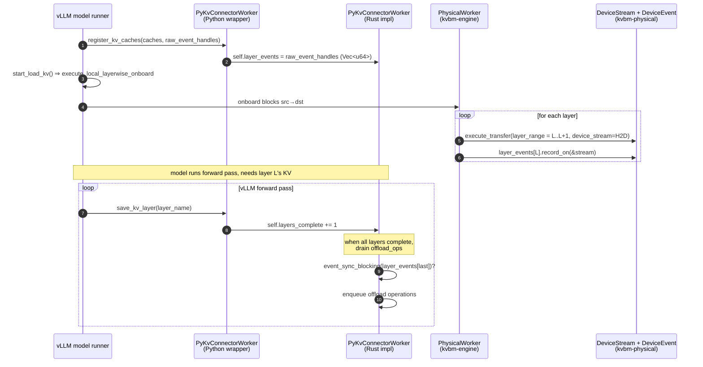

# `event_sync_blocking` and layer-wise onboarding

How the Python/FFI boundary in `kvbm-py3` synchronizes on device events
coming from CUDA or SYCL, and how that pairs with
`PhysicalWorker::execute_local_layerwise_onboard` on the Rust side.

For architecture context — how this binding fits into KVBM v2 and why
SYCL was added alongside CUDA — see
[`kvbm_v2_xpu_sycl_enablement.md`](../../../kvbm-physical/docs/kvbm_v2_xpu_sycl_enablement.md).

## What it is

`event_sync_blocking(event_handle: u64) -> anyhow::Result<()>` is a
single function with three cfg-gated bodies. It blocks the calling
thread until the device event identified by `event_handle` fires.

```rust
// lib/bindings/kvbm/src/block_manager/vllm/connector/worker.rs

#[cfg(feature = "cuda")]
pub fn event_sync_blocking(event_handle: u64) -> anyhow::Result<()> {
    unsafe {
        let ev = event_handle as CUevent;
        let r  = cuEventSynchronize(ev);
        if r != CUresult::CUDA_SUCCESS {
            return Err(anyhow::anyhow!("cuEventSynchronize failed: {:?}", r));
        }
    }
    Ok(())
}

#[cfg(feature = "xpu-sycl")]
pub fn event_sync_blocking(event_handle: u64) -> anyhow::Result<()> {
    unsafe {
        let ev = event_handle as *const oneapi_rs::sys::sycl_rs_event_t;
        oneapi_rs::sys::sycl_rs_event_wait(ev)
            .result()
            .map_err(|e| anyhow::anyhow!("sycl_rs_event_wait failed: {:?}", e))?;
    }
    Ok(())
}

#[cfg(not(any(feature = "cuda", feature = "xpu-sycl")))]
pub fn event_sync_blocking(_event_handle: u64) -> anyhow::Result<()> {
    anyhow::bail!("event_sync_blocking: no backend enabled")
}
```

The `u64` handle is the numeric value of the underlying driver handle
(`CUevent` or `sycl_rs_event_t*`) re-interpreted as an integer. vLLM
passes handles across the Python/Rust boundary as opaque `u64`
integers because it already owns the lifetime on the Python side.

## The event pipeline

A vLLM worker step with KVBM offload looks like this:



The important bit: `event_sync_blocking` is called on the **last
layer's event**, not on every layer. The whole point of recording per-layer
events in `execute_local_layerwise_onboard` is that vLLM's attention can
stream-wait on each event independently; KVBM only synchronizes the
host-visible "all layers done" fence when it's about to enqueue G2→G3
offload work that the GPU writes cannot racing against.

## Error handling — why `?` matters

The previous implementation used `assert_eq!(status, CUDA_SUCCESS)` and
returned `()`. After the XPU enablement the signature changed to
`Result<()>`, and the call site in `save_kv_layer` uses `?`:

```rust
event_sync_blocking(self.layer_events[self.layers_complete - 1])?;
```

A hook that drops the result would silently swallow failures — a
driver-level event-wait error (bad handle, GPU hang, signal interrupt)
would be lost. `?` ensures the error surfaces as an `anyhow::Error`
up through the connector into vLLM, which logs it and fails the step
rather than proceeding with stale KV.

## How the event handle reaches Rust

vLLM owns the events. On the Python side (in the vLLM connector) it
creates one `torch.cuda.Event` (or `torch.xpu.Event`) per layer and
passes the integer handle via the `bind_connector_metadata` pathway.
Rust stores these in `self.layer_events: Vec<u64>` as raw integers —
it never tries to reconstitute the Python object; it only ever calls
`event_sync_blocking(handle)`.

This keeps the boundary zero-copy and zero-ownership: KVBM does not
own the events, does not destroy them, and can hand the same handles
back to vLLM without reference counting on the Rust side.

## Pairing with `DeviceEvent::record_on`

On the Rust side, `PhysicalWorker::execute_local_layerwise_onboard`
accepts `layer_events: &[Arc<DeviceEvent>]` — one `DeviceEvent` per
layer, pre-allocated and re-recorded per iteration. The per-layer
flow is:

```rust
for layer in 0..num_layers {
    let options = TransferOptions::builder()
        .layer_range(layer..layer + 1)
        .device_stream(stream.clone())
        .build()?;
    self.manager.execute_transfer(g2, src, g1, dst, options)?;
    layer_events[layer].record_on(&stream)?;
}
```

`DeviceEvent::record_on` is the trait method that was added
specifically to make this loop backend-agnostic — it re-records a
pre-allocated event on the current position of a stream, matching
CUDA's `cuEventRecord(event, stream)` semantics. The events vLLM hands
in via `raw_event_handles` correspond 1:1 with these `DeviceEvent`s;
both point at the same underlying CUDA / SYCL event object, because
that's how Python and Rust share the handle.

## Feature mutual exclusivity

```toml
# lib/bindings/kvbm/Cargo.toml
cuda     = ["dep:cudarc"]
xpu-sycl = ["dep:oneapi-rs"]
nccl     = ["cuda", "block-manager", ...]
oneccl   = ["xpu-sycl", "block-manager"]
```

`cuda` and `xpu-sycl` are **not** marked mutually exclusive in
`Cargo.toml`, but the source has three `pub fn event_sync_blocking`
definitions gated on `cuda`, `xpu-sycl`, and `not(any(...))`. Enabling
both at once produces a duplicate-definition error at build time.

Recommended guard (not yet in the source):

```rust
#[cfg(all(feature = "cuda", feature = "xpu-sycl"))]
compile_error!("kvbm-py3: `cuda` and `xpu-sycl` are mutually exclusive");
```

Today a `cargo build` with no device feature is possible — it picks
the "no backend enabled" stub that returns `bail!(...)`. The call site
in `save_kv_layer` will fail at the first layer onboard, which is
loud but not the friendliest developer experience. Building `kvbm-py3`
without `cuda` or `xpu-sycl` is never useful in production.

## Two-liner runbook

- **vLLM on NVIDIA**: build `kvbm-py3` with `--features
  block-manager,cuda,nccl`. `event_sync_blocking` binds to
  `cuEventSynchronize`; MLA broadcasts go through
  `NcclCollectives`.
- **vLLM on Intel XPU**: export `KVBM_ENABLE_XPU_KERNELS=1` first (the
  SYCL feature links against `libkvbm_kernels_xpu.so`, which is only
  produced when that env var is set during the `kvbm-kernels` build —
  see [`sycl_kernels.md`](../../../kvbm-kernels/docs/sycl_kernels.md)),
  then build `kvbm-py3` with `--features
  block-manager,xpu-sycl,oneccl`. `event_sync_blocking` binds to
  `sycl_rs_event_wait`; MLA broadcasts go through `OneCclCollectives`.

## Related docs

- [`device_executor_flow.md`](../../../kvbm-physical/docs/device_executor_flow.md) — how `DeviceEvent` is produced and recorded inside the executor.
- [`collectives.md`](../../../kvbm-engine/docs/collectives.md) — how NCCL / oneCCL broadcasts interact with the same event machinery in the MLA worker.
- [`sycl_pool_and_numa.md`](../../../memory/docs/sycl_pool_and_numa.md) — why the pinned host memory that backs `raw_event_handles`-associated buffers is allocated through a NUMA-pinned worker.
