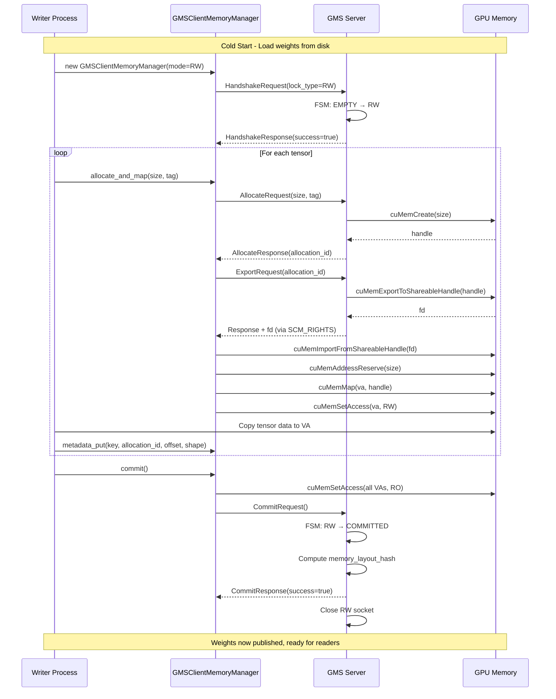
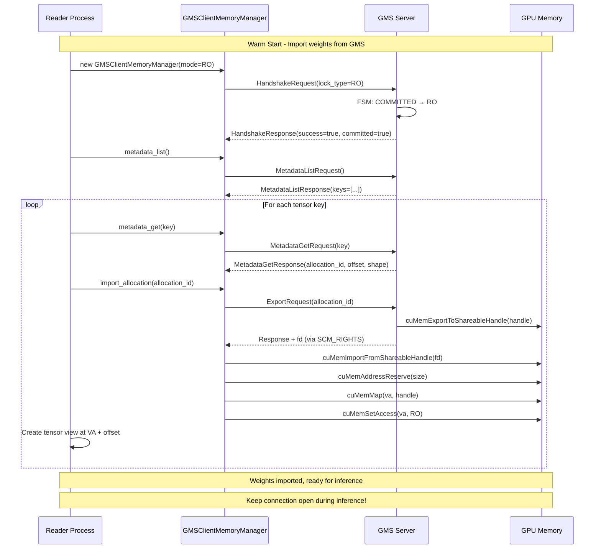
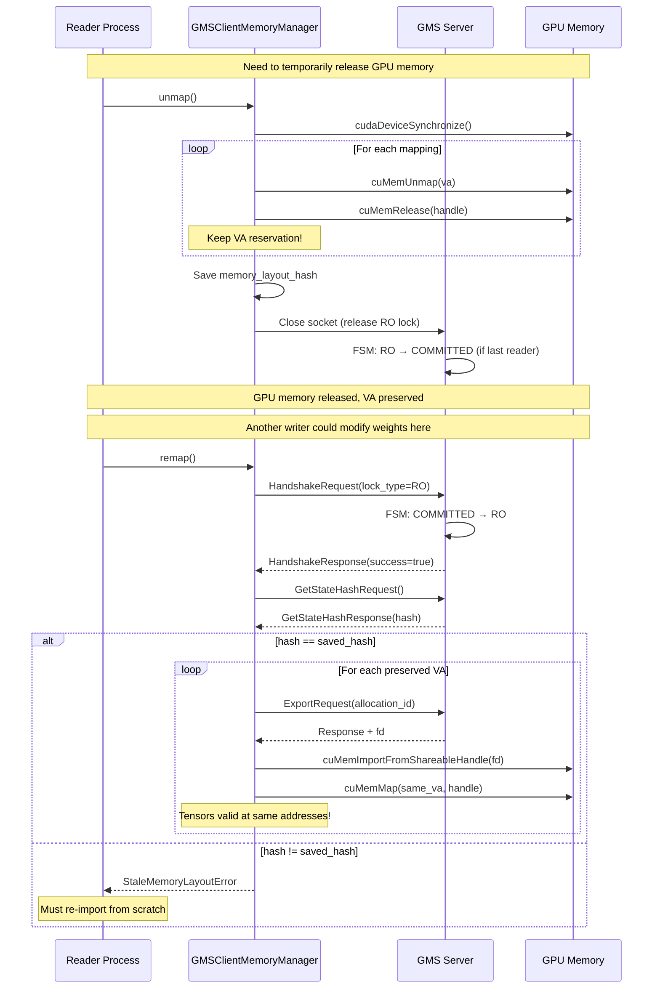
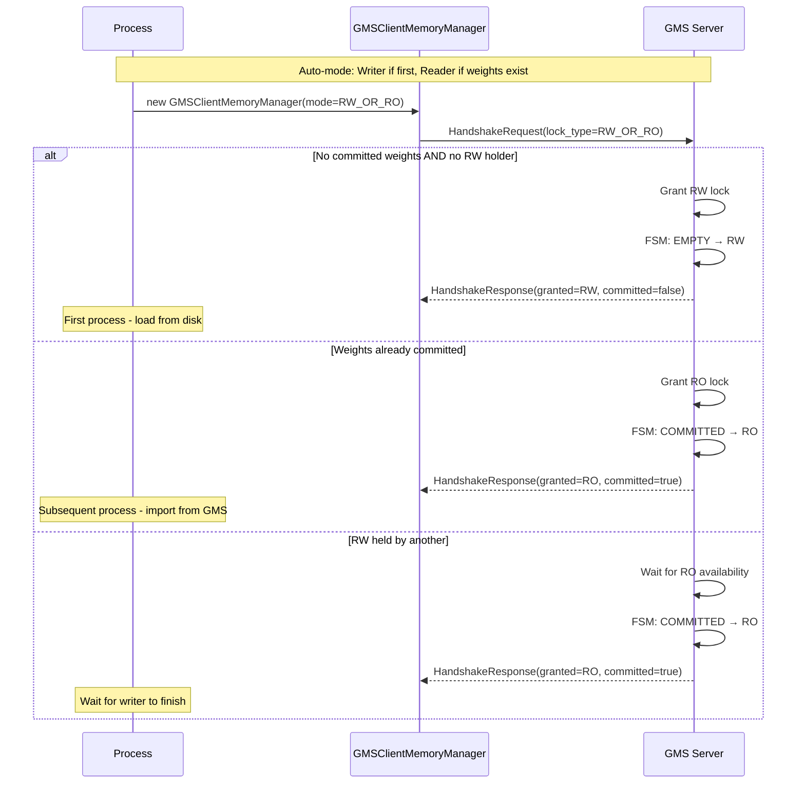

# GPU Memory Service (GMS)

## Overview

The **GPU Memory Service (GMS)** is an out-of-process GPU memory manager that decouples ownership of GPU memory from the processes that use it. This enables:

- **Zero-copy sharing** of GPU memory across multiple processes
- **Data survival** across process crashes
- **Fast model loading** via memory import instead of disk I/O for subsequent workers

## Problem Statement

In traditional LLM inference deployments, each worker process:
1. Loads model weights from disk/network into GPU memory
2. Owns that GPU memory for the lifetime of the process
3. Cannot share weights with other workers on the same GPU

This leads to:
- **Slow worker startup** (weight loading is I/O bound)
- **Memory waste** (duplicate weights when running multiple workers)
- **No crash resilience** (GPU memory lost when process dies)

## Solution Architecture

```
┌─────────────────────────────────────────────────────────────────────────────┐
│                           GPU Memory Service                                │
├─────────────────────────────────────────────────────────────────────────────┤
│                                                                             │
│   ┌─────────────────┐                         ┌─────────────────────────┐  │
│   │   GMS Server    │◄──── Unix Socket ──────►│   GMS Client (Writer)   │  │
│   │                 │         RPC             │                         │  │
│   │  ┌───────────┐  │                         │  ┌───────────────────┐  │  │
│   │  │ Memory    │  │                         │  │ GMSClientMemory   │  │  │
│   │  │ Manager   │  │                         │  │ Manager           │  │  │
│   │  │           │  │                         │  │                   │  │  │
│   │  │ • cuMemCreate    ──── FD Export ──────►│  │ • cuMemImport     │  │  │
│   │  │ • cuMemExport│  │  (SCM_RIGHTS)        │  │ • cuMemMap        │  │  │
│   │  │ • cuMemRelease   │                     │  │ • cuMemSetAccess  │  │  │
│   │  └───────────┘  │                         │  └───────────────────┘  │  │
│   │                 │                         │                         │  │
│   │  ┌───────────┐  │                         │  ┌───────────────────┐  │  │
│   │  │ State     │  │                         │  │ PyTorch MemPool   │  │  │
│   │  │ Machine   │  │                         │  │ Integration       │  │  │
│   │  │ (FSM)     │  │                         │  └───────────────────┘  │  │
│   │  └───────────┘  │                         └─────────────────────────┘  │
│   │                 │                                                       │
│   │  ┌───────────┐  │                         ┌─────────────────────────┐  │
│   │  │ Metadata  │  │◄──── Unix Socket ──────►│   GMS Client (Reader)   │  │
│   │  │ Store     │  │         RPC             │                         │  │
│   │  └───────────┘  │                         │  • Import allocations   │  │
│   └─────────────────┘                         │  • Map to local VA      │  │
│                                               │  • Unmap/Remap support  │  │
│                                               └─────────────────────────┘  │
│                                                                             │
└─────────────────────────────────────────────────────────────────────────────┘
```

## Core Components

### 1. Server (`server/`)

#### `GMSRPCServer` (`rpc.py`)
The main async RPC server that:
- Listens on a Unix domain socket
- Handles client connections with RW/RO lock semantics
- Dispatches requests to the handler
- Manages the state machine transitions

#### `GMSServerMemoryManager` (`memory_manager.py`)
Manages physical GPU memory allocations using **CUDA VMM (Virtual Memory Management)** API:

- **No VA mapping**: The server allocates physical memory without mapping it to virtual addresses
- **No CUDA context**: This allows the server to survive GPU driver failures
- **FD export**: Allocations are exported as POSIX file descriptors for cross-process sharing

Key operations:
- `allocate(size, tag)` → Creates physical allocation via `cuMemCreate`
- `export_fd(allocation_id)` → Exports handle as FD via `cuMemExportToShareableHandle`
- `free(allocation_id)` → Releases physical memory via `cuMemRelease`

#### `GlobalLockFSM` (`locking.py`)
Explicit state machine managing read/write locks:

```
State Diagram:

    EMPTY ──RW_CONNECT──► RW ──RW_COMMIT──► COMMITTED
      ▲                    │                   │
      │                    │                   │
      └───RW_ABORT─────────┘                   │
                                               ▼
    COMMITTED ◄──RO_DISCONNECT (last)── RO ◄──RO_CONNECT
                      │                  ▲
                      │                  │
                      └──RO_CONNECT──────┘
                      └──RO_DISCONNECT───┘ (not last)
```

| State | Description |
|-------|-------------|
| `EMPTY` | No connections, no committed weights |
| `RW` | Writer connected (exclusive access) |
| `COMMITTED` | Weights valid, no connections |
| `RO` | Reader(s) connected (shared access) |

### 2. Client (`client/`)

#### `GMSRPCClient` (`rpc.py`)
Low-level RPC client that:
- Connects to server via Unix socket
- **Socket connection IS the lock** - connection lifetime = lock lifetime
- Sends/receives messages using msgpack serialization
- Receives file descriptors via `SCM_RIGHTS`

#### `GMSClientMemoryManager` (`memory_manager.py`)
High-level client memory manager that:
- Wraps `GMSRPCClient` for business logic
- Handles local VA (Virtual Address) reservation and mapping
- Supports **unmap/remap** for VA-stable memory release

Key operations:
- `allocate_and_map(size, tag)` → Allocates on server + maps locally
- `import_allocation(allocation_id)` → Imports existing allocation from server
- `commit()` → Publishes weights and releases RW lock
- `unmap()` / `remap()` → Release/reacquire RO lock while preserving VA

### 3. Common (`common/`)

#### Protocol Messages (`protocol/messages.py`)
Typed message structures using `msgspec`:
- `HandshakeRequest/Response` - Lock acquisition
- `AllocateRequest/Response` - Memory allocation
- `ExportRequest` - FD export (response includes FD via SCM_RIGHTS)
- `CommitRequest/Response` - Weight publishing
- `MetadataPut/Get/Delete/List` - Tensor metadata storage

#### Wire Protocol (`protocol/wire.py`)
Length-prefixed message framing with optional FD passing:
- 4-byte big-endian length prefix
- msgpack-encoded payload
- FD passing via Unix socket `SCM_RIGHTS`

### 4. PyTorch Integration (`client/torch/`)

#### `allocator.py`
Singleton management for GMS + PyTorch `MemPool` integration:
- `get_or_create_gms_client_memory_manager()` → Returns manager + optional MemPool
- In RW mode: creates `CUDAPluggableAllocator` that routes allocations through GMS

### 5. Framework Integrations (`integrations/`)

Pre-built integrations for:
- **vLLM**: Model loader that uses RW_OR_RO mode for automatic cold/warm start
- **SGLang**: Similar integration for SGLang inference engine

---

## Sequence Diagrams

### Writer Flow (Cold Start - First Worker)



### Reader Flow (Warm Start - Subsequent Workers)



### Unmap/Remap Flow (Memory Pressure Handling)



### RW_OR_RO Auto-Mode Flow



---

## Key Design Decisions

### 1. No VA Mapping on Server

The server never maps memory to virtual addresses (`cuMemMap`). This means:
- **No CUDA context** required on the server
- Server can survive GPU driver resets
- Memory management is fully delegated to clients

### 2. Socket-as-Lock

The socket connection **is** the lock:
- RW lock: Exclusive connection (only one RW at a time)
- RO lock: Shared connection (multiple RO allowed)
- Lock release = socket close (automatic on crash)

Benefits:
- **Crash resilience**: If a reader crashes, its lock is automatically released
- **No explicit unlock**: No forgotten locks or deadlocks

### 3. VA-Stable Unmap/Remap

During `unmap()`:
- Physical memory is released (`cuMemUnmap` + `cuMemRelease`)
- VA reservations are **kept** (`cuMemAddressReserve` still valid)

During `remap()`:
- Same VAs are reused for mapping
- **Tensor pointers remain valid** (no need to update PyTorch tensors)

### 4. Memory Layout Hash

On commit, the server computes a hash of:
- All allocation IDs, sizes, and tags
- All metadata entries

On `remap()`, this hash is checked:
- If match: Safe to remap (layout unchanged)
- If mismatch: Raise `StaleMemoryLayoutError` (must re-import)

**Important**: This detects **structural** changes, not **content** changes.
Weight values can be modified in-place (e.g., RL training updates) as long as the structure is preserved.

---

## Wire Protocol

### Message Format

```
┌──────────────┬────────────────────────────────────────┐
│ Length (4B)  │  msgpack-encoded Message               │
│ big-endian   │                                        │
└──────────────┴────────────────────────────────────────┘
```

### FD Passing

File descriptors are passed out-of-band using Unix socket `SCM_RIGHTS`:

```python
# Server side (send FD)
socket.send_fds(sock, [message_bytes], [fd])

# Client side (receive FD)
data, fds, _, _ = socket.recv_fds(sock, bufsize, maxfds=1)
fd = fds[0] if fds else -1
```

---

## API Reference

### GMSClientMemoryManager

```python
class GMSClientMemoryManager:
    def __init__(
        socket_path: str,
        mode: RequestedLockType,  # RW, RO, or RW_OR_RO
        device: int = 0,
        timeout_ms: Optional[int] = None,
    ): ...

    # Properties
    @property mode: GrantedLockType  # Actual granted mode
    @property is_connected: bool
    @property is_unmapped: bool
    @property total_bytes: int

    # Allocation (RW only)
    def allocate_and_map(size: int, tag: str = "default") -> int  # Returns VA
    def free_mapping(va: int) -> None
    def clear_all() -> int  # Returns count cleared

    # Import (RO or RW)
    def import_allocation(allocation_id: str) -> int  # Returns VA

    # Metadata (RW: put/delete, RO: get/list)
    def metadata_put(key: str, allocation_id: str, offset: int, value: bytes) -> bool
    def metadata_get(key: str) -> Optional[Tuple[str, int, bytes]]
    def metadata_list(prefix: str = "") -> List[str]
    def metadata_delete(key: str) -> bool

    # Lifecycle
    def commit() -> bool  # Publish weights, release RW lock
    def switch_to_read(timeout_ms: Optional[int] = None) -> None
    def unmap() -> None   # Release RO lock, preserve VAs
    def remap(timeout_ms: Optional[int] = None) -> bool
    def close() -> None
```

### Server States

| State | Can Connect RW | Can Connect RO | Description |
|-------|----------------|----------------|-------------|
| `EMPTY` | ✓ | ✗ | No weights, no connections |
| `RW` | ✗ | ✗ | Writer active (exclusive) |
| `COMMITTED` | ✓ | ✓ | Weights valid, no connections |
| `RO` | ✗ | ✓ | Reader(s) active |

---

## Framework Integration Example (vLLM)

```python
from gpu_memory_service import get_or_create_gms_client_memory_manager
from gpu_memory_service.common.types import GrantedLockType, RequestedLockType

# Auto-mode: first worker gets RW, subsequent get RO
gms_client, pool = get_or_create_gms_client_memory_manager(
    socket_path="/tmp/gms.sock",
    device=0,
    mode=RequestedLockType.RW_OR_RO,
    tag="weights",
)

if gms_client.mode == GrantedLockType.RW:
    # Cold start: allocate using MemPool, load from disk
    with torch.cuda.memory.use_mem_pool(pool):
        model = load_model_from_disk()

    # Register tensors with GMS metadata
    for name, param in model.named_parameters():
        gms_client.metadata_put(name, ...)

    gms_client.commit()  # Publish for others
    gms_client.switch_to_read()  # Become reader for inference

else:
    # Warm start: import weights from GMS
    model = create_model_on_meta_device()
    materialize_tensors_from_gms(gms_client, model)
    # Weights instantly available!
```

---

## Performance Characteristics

| Operation | Time Complexity | Notes |
|-----------|-----------------|-------|
| RW Connect | O(1) | Immediate if no holder |
| RO Connect | O(1) | Immediate if committed |
| Allocate | O(1) | `cuMemCreate` |
| Export | O(1) | `cuMemExportToShareableHandle` |
| Import | O(1) | `cuMemImportFromShareableHandle` |
| Map | O(1) | `cuMemMap` |
| Unmap | O(n) | n = number of mappings |
| Remap | O(n) | n = number of mappings |
| Commit | O(n) | Hash computation over all allocations |

**Memory Overhead**: ~100 bytes per allocation (metadata tracking)

---

## Limitations

1. **Single-GPU per server**: Each GMS server manages one GPU device
2. **Same-machine only**: Unix sockets don't work across machines
3. **CUDA VMM required**: Requires CUDA driver with VMM support (compute capability 7.0+)
4. **No content validation**: Remap doesn't detect in-place weight modifications
