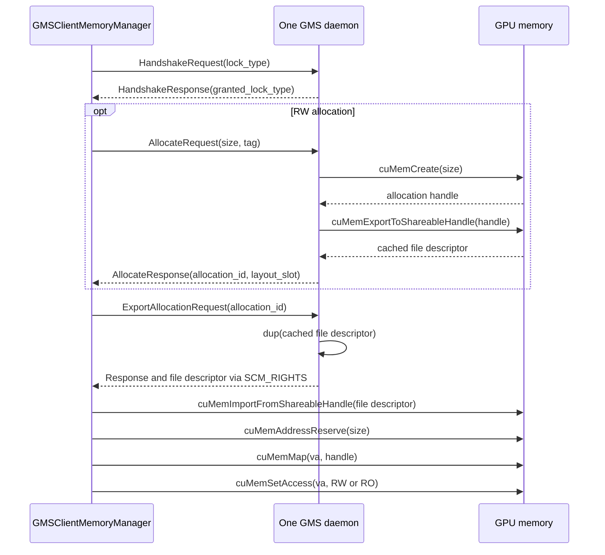
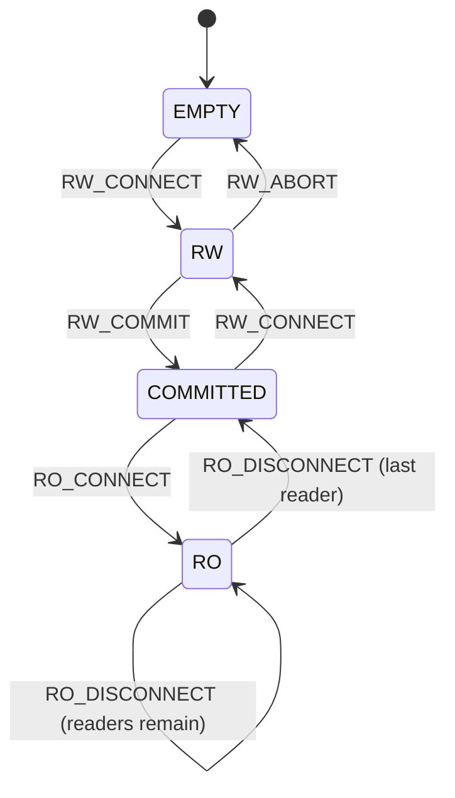

<!--
SPDX-FileCopyrightText: Copyright (c) 2025-2026 NVIDIA CORPORATION & AFFILIATES. All rights reserved.
SPDX-License-Identifier: Apache-2.0
-->

# GPU Memory Service (GMS)

GPU Memory Service (GMS) owns CUDA Virtual Memory Management (VMM) allocation handles outside
inference-engine processes. Clients import those handles, map them into their own virtual address
spaces, and access them under read-write (RW) or read-only (RO) sessions.

GMS supports:

- Publishing a model-weight layout once and importing it in later workers without another disk load
- Keeping committed model weights resident across reader-process replacement
- Preserving client virtual addresses while mappings are temporarily removed
- Managing mutable KV cache allocation lifecycles for vLLM and SGLang
- Loading GMS-managed weights in vLLM, SGLang, and TensorRT-LLM

Committed layouts survive reader disconnects while the GMS process, GPU, and driver remain healthy.
Uncommitted RW layouts do not survive writer disconnects. In particular, the current vLLM and
SGLang integrations discard KV cache backing on pause and allocate fresh backing on resume.

## Process Topology

The standard launcher starts two independent GMS daemons for every visible GPU:

```text
GPU 0
|
+-- weights daemon  <->  gms_GPU-UUID_weights.sock
|   +-- allocation manager
|   +-- session manager and FSM
|   +-- metadata and committed-layout hash
|
+-- kv_cache daemon <->  gms_GPU-UUID_kv_cache.sock
    +-- allocation manager
    +-- session manager and FSM
    +-- metadata and committed-layout hash
```

Each daemon owns one memory domain for one GPU. The daemons do not share allocations, metadata, lock
state, or committed state. A reference to "the server state" in this document means the state of one
daemon and socket. The standard launcher supervises its children as one failure domain: if any child
exits, it terminates every GMS daemon that it started.

Run the standard launcher with:

```bash
python -m gpu_memory_service.cli.server
```

The launcher discovers visible GPUs and starts both daemons for each one. To run one daemon directly,
specify its device and domain:

```bash
python -m gpu_memory_service --device 0 --tag weights
```

## Ownership and Mapping

The server calls `cuMemCreate` and caches one shareable file descriptor exported with
`cuMemExportToShareableHandle` for each allocation. Export RPCs duplicate the cached descriptor.
The server does not call `cuMemMap` for application allocations.

Clients use `GMSClientMemoryManager` to:

- Import allocation file descriptors as CUDA handles
- Reserve virtual address (VA) ranges
- Map allocations and set RW or RO access
- Record allocation metadata needed to reconstruct tensors
- Unmap allocations while retaining VA reservations

> [!NOTE]
> Use `GMSClientMemoryManager` instead of the low-level RPC client. The RPC client is an
> implementation detail.

An allocation remains physically resident while a server or client CUDA handle, or a duplicated
shareable file descriptor, references it. Calling `unmap_all_vas()` releases the client's mapping
and imported handle, but does not necessarily release the underlying GPU allocation. A committed
weight allocation remains owned by the weights daemon. For KV cache, the normal pause path unmaps
the client handles and then aborts the RW session, which releases the KV daemon's handles. External
handles or exported descriptors can delay final reclamation.

### Allocation and Import Flow


```mermaid
sequenceDiagram
    participant C as GMSClientMemoryManager
    participant S as One GMS daemon
    participant GPU as GPU memory

    C->>S: HandshakeRequest(lock_type)
    S-->>C: HandshakeResponse(granted_lock_type)

    opt RW allocation
        C->>S: AllocateRequest(size, tag)
        S->>GPU: cuMemCreate(size)
        GPU-->>S: allocation handle
        S->>GPU: cuMemExportToShareableHandle(handle)
        GPU-->>S: cached file descriptor
        S-->>C: AllocateResponse(allocation_id, layout_slot)
    end

    C->>S: ExportAllocationRequest(allocation_id)
    S->>S: dup(cached file descriptor)
    S-->>C: Response and file descriptor via SCM_RIGHTS
    C->>GPU: cuMemImportFromShareableHandle(file descriptor)
    C->>GPU: cuMemAddressReserve(size)
    C->>GPU: cuMemMap(va, handle)
    C->>GPU: cuMemSetAccess(va, RW or RO)
```

## Observable Server State

The four-state FSM describes granted sessions for one daemon. It is not the complete lock-admission
model. The observable state is derived from the active RW session, active RO sessions, and the
stored committed-layout flag:

| State | Active Sessions | Committed Layout |
|---|---|---|
| `EMPTY` | None | No |
| `RW` | One writer | No |
| `COMMITTED` | None | Yes |
| `RO` | One or more readers | Yes |

The committed flag remains set while the observable state is `RO`. Queued writers and a writer
reservation used during the handshake are additional coordination state that does not appear as a
fifth `ServerState` value.

### Granted-Session Transitions


```mermaid
stateDiagram-v2
    [*] --> EMPTY

    EMPTY --> RW : RW_CONNECT
    RW --> COMMITTED : RW_COMMIT
    RW --> EMPTY : RW_ABORT

    COMMITTED --> RW : RW_CONNECT
    COMMITTED --> RO : RO_CONNECT

    RO --> RO : RO_CONNECT
    RO --> RO : RO_DISCONNECT (readers remain)
    RO --> COMMITTED : RO_DISCONNECT (last reader)
```

The transition diagram begins after admission grants a session. It therefore does not show a request
waiting behind another session or a transient writer reservation.

### Admission Policy

| Requested Mode | Grant Policy |
|---|---|
| `RW` | Grant when no session or writer reservation is active. While waiting, block new reader grants. |
| `RO` | Grant for a committed layout when no RW session, queued writer, or reserved writer exists. |
| `RW_OR_RO` | Grant RW when uncommitted and free; grant RO when committed and reader admission is open; otherwise wait. |

Only an explicit `RW` request enters the waiting-writer count and receives writer preference;
`RW_OR_RO` does not. The policy is not strict FIFO ordering among writers. It prevents a stream of
new readers from indefinitely delaying an explicit RW request. A waiting writer behind active
readers can be granted RW only after the last reader disconnects.

### Events

| Event | Effect |
|---|---|
| `RW_CONNECT` | Grant exclusive access, clear any previous committed layout, and start a fresh active layout. |
| `RW_COMMIT` | Publish the active layout, remove RW ownership, and enter `COMMITTED`. |
| `RW_ABORT` | Clear the active allocations, metadata, and hash, then enter `EMPTY`. |
| `RO_CONNECT` | Add a reader for the committed layout. |
| `RO_DISCONNECT` | Remove a reader; the last reader returns the observable state to `COMMITTED`. |

### Session Lifetime

A successfully handshaken socket represents an active server session. Closing an uncommitted RW
session triggers `RW_ABORT`; closing an RO session removes that reader. `commit()` releases RW
ownership as part of the commit operation rather than waiting for a later explicit unlock.

The session controls access to server RPCs. It does not invalidate CUDA handles already imported by
other processes. Runtime inspection probes (`GetRuntimeState` and `GetEventHistory`) connect, fetch
diagnostics, and close without entering the granted-session FSM.

## Memory-Domain Lifecycles

### Weights

The first weight loader normally uses `RW_OR_RO`:

```text
EMPTY -> RW -> COMMITTED -> RO
```

An RW loader allocates and populates weights, calls `commit()`, reconnects RO, and remaps the
committed allocations at its preserved VAs. Later loaders receive RO and import the same committed
layout. Reader disconnects do not clear it. A later explicit RW grant clears the old committed layout
before building a replacement.

### KV Cache

The vLLM and SGLang integrations keep GMS-managed KV cache in an uncommitted RW layout while an
engine is active:

```text
active:  EMPTY -> RW
pause:   RW -> EMPTY
resume:  EMPTY -> RW
```

Pause performs:

1. `unmap_all_vas()` to release the engine's mappings and imported handles while retaining VAs.
2. `abort()` to close the RW session and clear the KV daemon's allocation handles.

Resume performs:

1. `connect(RW)` to start a fresh KV layout.
2. `reallocate_all_handles("kv_cache")` to allocate new physical backing for the preserved mappings.
3. `remap_all_vas()` to map that backing at the original VAs.

Tensor addresses remain stable, but KV cache bytes do not survive. TensorRT-LLM does not use GMS for
KV cache; it uses TensorRT-LLM's native collective sleep and wake operations when that interface is
available.

## Layout Publication and Compatibility

`commit()` is a publication barrier. The client synchronizes CUDA work, unmaps its local RW mappings
while retaining VAs, sends the commit request, and releases the RW session. The server validates
metadata and publishes the layout hash before readers can import it.

On commit, the server sorts allocations by `layout_slot` and hashes:

- Canonical allocation rank, requested size, aligned size, and tag
- Metadata key, owning allocation rank, byte offset, and value

The hash deliberately excludes allocation IDs, raw `layout_slot` values, CUDA handles, and allocation
contents. Matching hashes mean that two layouts are structurally compatible, not that they are the
same allocation generation or contain the same bytes. `remap_all_vas()` matches allocations by
canonical rank and updates local allocation IDs when it remaps a compatible replacement layout.

If the hash changes, `remap_all_vas()` raises `StaleMemoryLayoutError`. It does not rebuild tensors
automatically. Current framework integrations do not recover automatically: vLLM exits the worker,
while SGLang and TensorRT-LLM propagate a resume failure.

The hash is cleared when RW admission replaces a committed layout.

## Allocation Backpressure

GMS treats `cuMemCreate` out-of-memory responses as transient:

- `--alloc-retry-interval` controls the delay between attempts and defaults to `0.5` seconds.
- `--alloc-retry-timeout` limits total retry time and defaults to `60.0` seconds in the server CLI.
- Lower-level server constructors accept `None` for an unbounded retry timeout.

Non-OOM CUDA VMM failures are fatal. Allocation retry also stops if the requesting client
disconnects.

## Failure Boundaries

GMS provides process-level lifetime separation, not GPU or node fault tolerance:

- A committed weight layout can survive a reader or engine-process crash.
- An uncommitted RW layout is cleared when its writer disconnects or crashes.
- A GMS process failure loses that daemon's server-owned handles and state.
- Under the standard launcher, one child failure causes the supervisor to stop its sibling daemons.
- A GPU reset, driver failure, or node failure is outside the persistence guarantee.
- The server initializes CUDA and owns CUDA driver resources even though it does not map application
  allocations with `cuMemMap`.
- GMS does not prove that a disconnected writer has no in-flight GPU work. New RW layouts use fresh
  allocations and can wait for old handle references to be reclaimed.

Runtime `allocation_count` and `allocations_cleared` values count server-owned allocation handles.
Imported handles in other processes can keep memory resident after the server clears its own layout.

## Client API

Construct the high-level client with:

```python
GMSClientMemoryManager(
    socket_path,
    *,
    device=0,
    tag=None,
    scratch_size=512 * 1024 * 1024,
)
```

The public lifecycle operations are:

| Category | Operations |
|---|---|
| Session | `connect(lock_type, timeout_ms=None)`, `abort()`, `close(*, best_effort=False)` |
| Server handles | `allocate_handle()`, `export_handle()`, `get_handle_info()`, `free_handle()`, `list_handles()` |
| Publication | `commit()`, `get_memory_layout_hash()` |
| Metadata | `metadata_put()`, `metadata_get()`, `metadata_list()`, `metadata_delete()` |
| Local VA | `reserve_va()`, `map_va()`, `unmap_va()`, `free_va()` |
| Mappings | `create_mapping()`, `destroy_mapping()`, `unmap_all_vas()`, `remap_all_vas()` |
| Fresh backing | `reallocate_all_handles()` |

The vLLM shadow integration also uses `create_scratch_mapping()`,
`prepare_scratch_for_reallocation()`, and `destroy_scratch_mapping()`. These operations replace
client-local scratch backing with fresh server backing while preserving VAs.

`connect(..., timeout_ms=None)` uses separate timeouts for socket availability and session
admission. With `None`, the client waits up to 30 seconds for the Unix socket and indefinitely for
the requested lock. A positive `timeout_ms` value applies independently to both waits.

## Wire Protocol

Messages use a four-byte big-endian length followed by a msgpack payload:

```text
+-------------+------------------------------------------+
| Length (4B) | msgpack-encoded message                  |
| big-endian  |                                          |
+-------------+------------------------------------------+
```

Allocation file descriptors are passed out of band with Unix socket `SCM_RIGHTS`.

## Framework Integrations

Start GMS before launching an engine with `--load-format gms`. Dynamo configures the backend-specific
integration from that load format.

| Backend | GMS-Managed Weights | GMS-Managed KV Cache | Pause and Resume |
|---|---|---|---|
| vLLM | Yes | With sleep mode; shadow mode begins with client-local scratch backing | GMS for weights and KV |
| SGLang | Yes | Yes | GMS for weights and KV |
| TensorRT-LLM | Yes | No | GMS for weights; native TensorRT-LLM operations for KV when available |

### vLLM

```bash
python -m dynamo.vllm \
  --model Qwen/Qwen3-0.6B \
  --load-format gms \
  --enable-sleep-mode \
  --gpu-memory-utilization 0.9
```

Dynamo selects `GMSWorker` automatically for `--load-format gms`. Do not pass `--worker-cls`.
Weights use the `weights` daemon. With `--enable-sleep-mode`, mutable KV allocations use the
`kv_cache` daemon.

`--gms-shadow-mode` requires `--load-format gms`. It derives weight writer or reader mode from
`ENGINE_ID` and uses client-local aliased scratch backing for initial KV cache setup. After
initialization, the worker automatically pauses, removes the scratch backing, and waits for the
failover lock. On the first wake, it converts the preserved scratch bookkeeping, allocates fresh
server backing, and remaps it at the captured VAs. See
[Shadow Engine Failover](https://github.com/ai-dynamo/dynamo/blob/main/docs/kubernetes/shadow-engine-failover.md)
for the complete operator workflow.

### SGLang

```bash
python -m dynamo.sglang \
  --model-path Qwen/Qwen3-0.6B \
  --load-format gms \
  --disable-cuda-graph \
  --disable-piecewise-cuda-graph \
  --mem-fraction-static 0.9
```

GMS setup enables SGLang's memory-saver path automatically. Do not add
`--enable-memory-saver` solely for GMS. The integration supports the `weights` and `kv_cache`
memory-saver tags. Unsupported tags are ignored with a warning.

GMS mode does not support `--enable-weights-cpu-backup`,
`--enable-draft-weights-cpu-backup`, or the pauseable CUDA-graph memory-saver path. The graph-disable
flags in the example select the supported pause path.

### TensorRT-LLM

```bash
python -m dynamo.trtllm \
  --model Qwen/Qwen3-0.6B \
  --load-format gms
```

TensorRT-LLM publishes or imports model weights through the `weights` daemon. Its KV cache remains
under TensorRT-LLM ownership and uses TensorRT-LLM collective RPCs for sleep and wake when the
runtime exposes that private interface.

### Pause and Resume

vLLM exposes `/engine/control/sleep` and `/engine/control/wake_up`. GMS pause and resume require
`--enable-sleep-mode` unless shadow mode is active. The GMS worker pauses both weights and KV cache
regardless of the requested vLLM sleep level.

SGLang exposes `/engine/control/release_memory_occupation` and
`/engine/control/resume_memory_occupation`. The vLLM and SGLang GMS operations are:

| Domain | Pause | Resume |
|---|---|---|
| Weights | `unmap_all_vas()` then `abort()` | `connect(RO)` then `remap_all_vas()` |
| KV cache | `unmap_all_vas()` then `abort()` | `connect(RW)`, `reallocate_all_handles("kv_cache")`, then `remap_all_vas()` |

Pausing a reader releases its local weight mapping, but the committed weights remain owned by the
weights daemon. Pausing the KV writer clears the KV daemon's active layout. Resume remaps the
currently committed, structurally compatible weight layout and creates fresh physical KV
allocations. A compatible weight layout may be a replacement generation with new allocation IDs and
physical backing.

With `--load-format gms`, TensorRT-LLM also exposes
`/engine/control/release_memory_occupation` and `/engine/control/resume_memory_occupation`. Those
operations use GMS unmap and remap for weights and attempt TensorRT-LLM collective RPCs for KV cache.
If the runtime does not expose `_collective_rpc`, the integration logs a warning and leaves KV cache
under runtime control.

### Model Loader Configuration

Set `gms_read_only` to force import-only RO mode and prevent the engine from publishing weights:

```bash
--model-loader-extra-config '{"gms_read_only": true}'
```

This selects RO instead of `RW_OR_RO`. With the default `timeout_ms=None`, the connection waits
indefinitely for reader admission if no layout is committed or a writer has priority. It does not
fail immediately.

For vLLM and SGLang, set `gms_ro_connect_timeout_ms` to bound a weight reconnect during resume:

```bash
--model-loader-extra-config '{"gms_ro_connect_timeout_ms": 300000}'
```

The default is `null`, which leaves lock admission unbounded while socket availability remains
limited to 30 seconds. TensorRT-LLM currently consumes `gms_read_only` but not
`gms_ro_connect_timeout_ms`.
