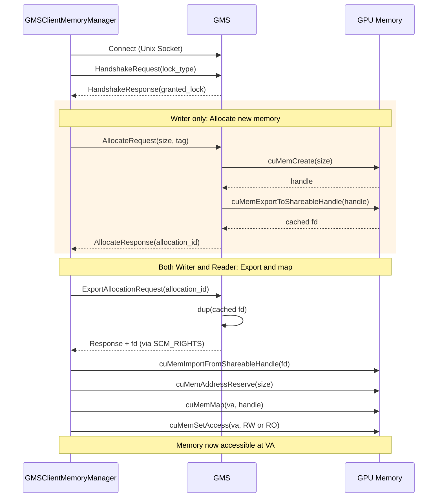
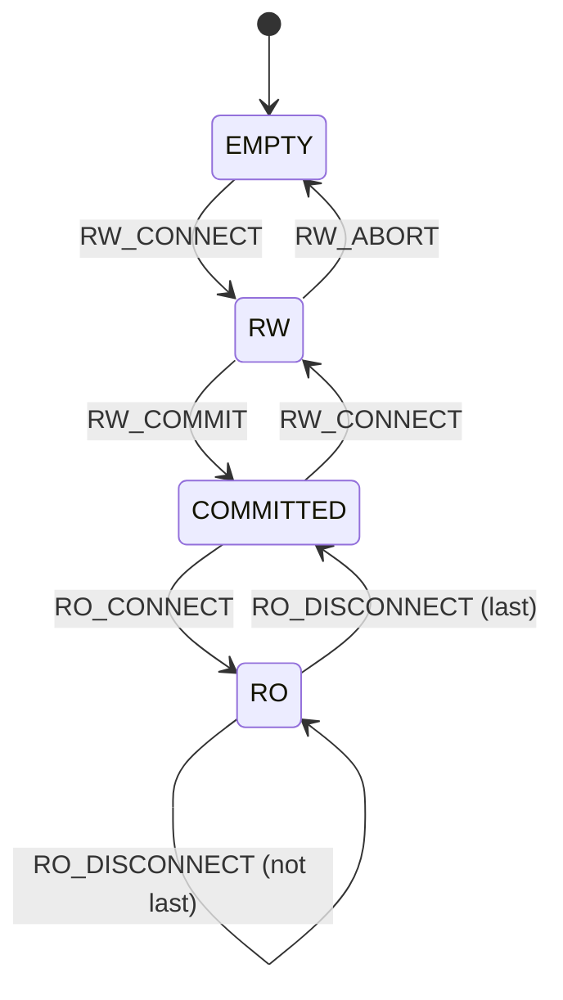
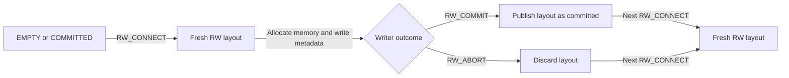
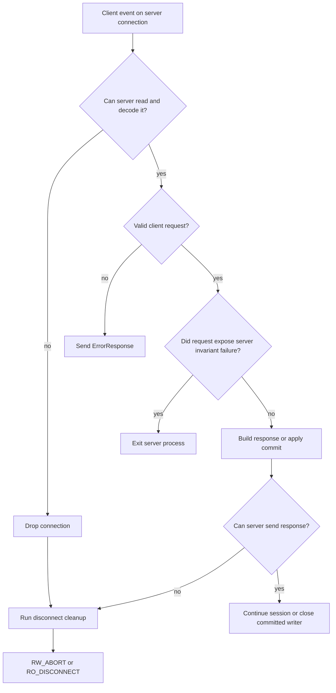
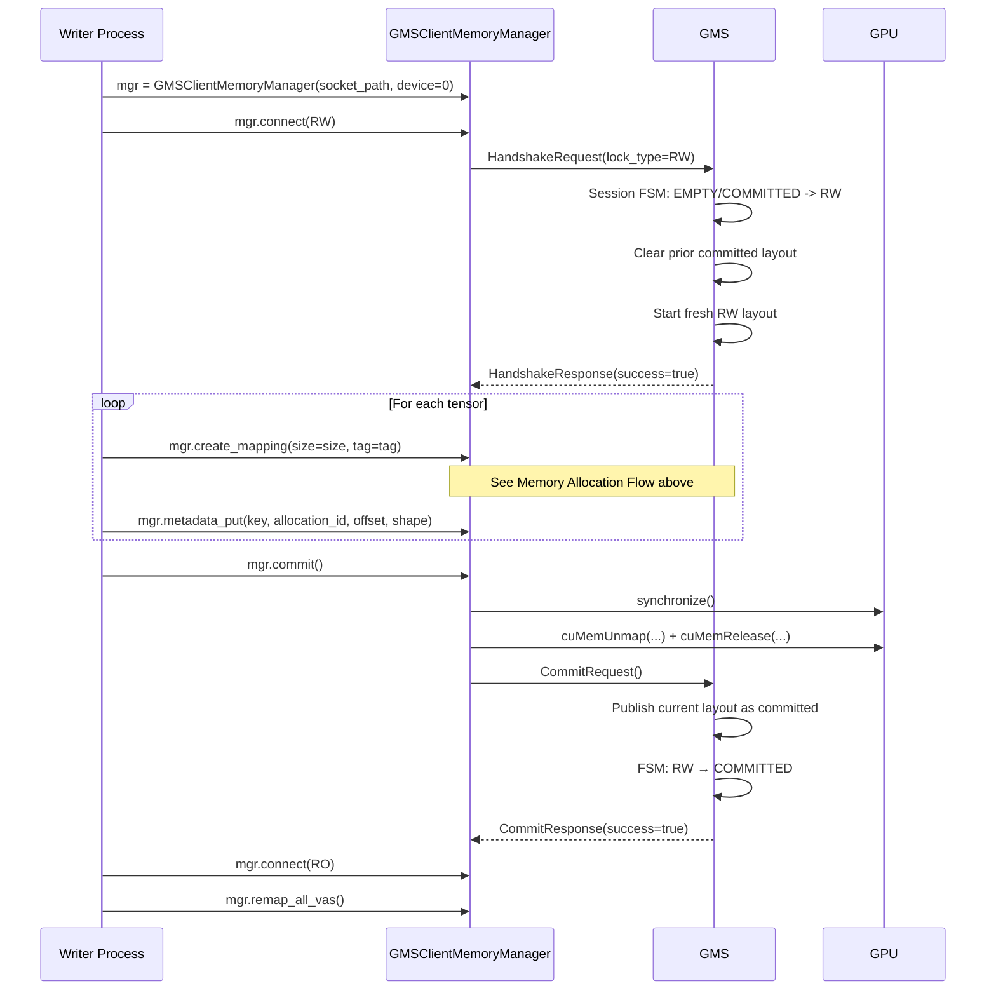
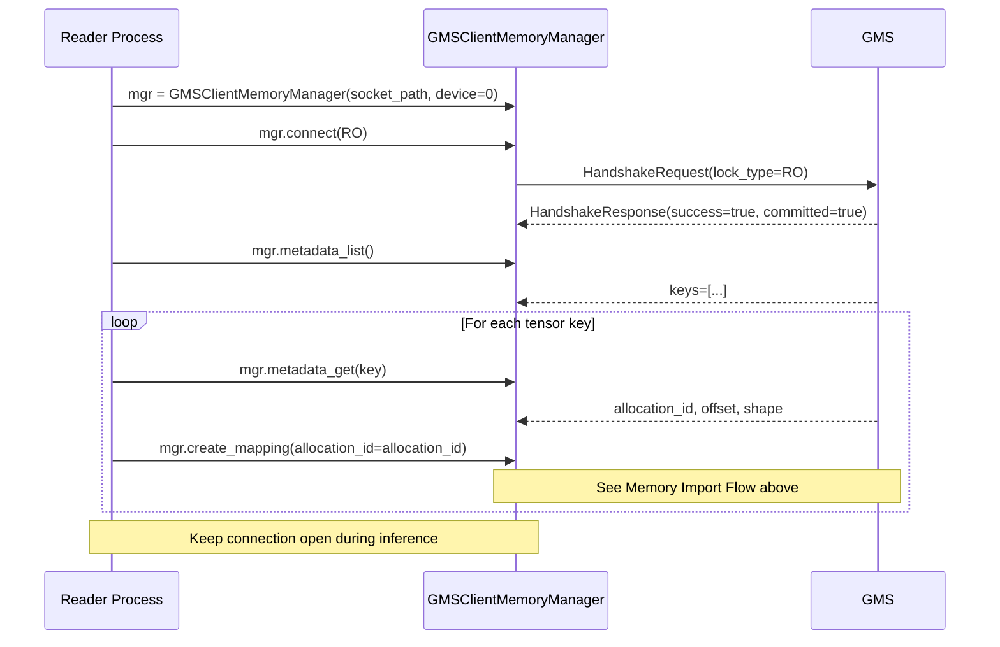
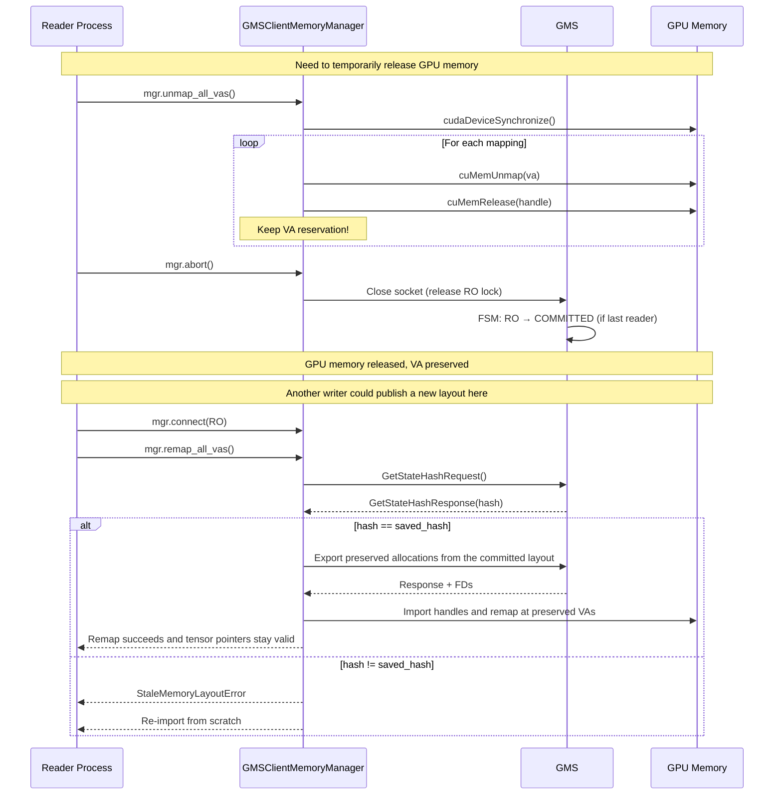

# GPU Memory Service (GMS)

## Overview

The **GPU Memory Service (GMS)** is an out-of-process GPU memory manager that decouples ownership of GPU memory from the processes that use it. This enables:

- **Zero-copy sharing** of GPU memory across multiple processes
- **Data survival** across process crashes
- **Fast model loading** via memory import instead of disk I/O for subsequent workers

GMS provides PyTorch integration via `CUDAPluggableAllocator` and pre-built integrations for inference frameworks like **vLLM** and **SGLang**.

## Problem Statement

In traditional LLM inference deployments, each worker process:
1. Loads model weights from disk/network into GPU memory
2. Owns that GPU memory for the lifetime of the process
3. Cannot share weights with other workers on the same GPU

This leads to:
- **Slow worker startup** (weight loading is I/O bound)
- **Memory waste** (duplicate weights when running multiple workers)
- **No crash resilience** (GPU memory lost when process dies)

## Solution Architecture

Each GPU hosts **two GMS daemons**, one per tag — `weights` and `kv_cache`.
Each daemon owns one `(GPU UUID, tag)` pair, listens on its own Unix socket,
and is fronted by clients (writers and readers) that map its memory into
their own address spaces.

```
                          ┌──────────────────────────────────────────┐
                          │  GPU (one UUID)                          │
                          │                                          │
    ┌─────────────────┐   │   ┌────────────────────────┐             │
    │  Writer client  │◄──┼──►│  GMS daemon (weights)  │             │
    │  (RW_OR_RO)     │   │   │  gms_<UUID>_weights    │             │
    └─────────────────┘   │   │       .sock            │             │
    ┌─────────────────┐   │   └────────────────────────┘             │
    │  Reader client  │◄──┤                                          │
    │  (RO)           │   │   ┌────────────────────────┐             │
    └─────────────────┘   │   │  GMS daemon (kv_cache) │             │
    ┌─────────────────┐   │   │  gms_<UUID>_kv_cache   │             │
    │  Writer client  │◄──┼──►│       .sock            │             │
    │  (RW)           │   │   └────────────────────────┘             │
    └─────────────────┘   │                                          │
                          └──────────────────────────────────────────┘

         Unix sockets carry msgpack-framed RPCs + FDs via SCM_RIGHTS.
```

### Deployment Topology

- **One daemon per `(GPU UUID, tag)` pair.** `lib/gpu_memory_service/cli/server.py`
  forks one `python -m gpu_memory_service --device <i> --tag <tag>` process per
  visible CUDA device and per tag, and writes a `gms-ready` marker file once
  all expected sockets exist.
- **Two tags today**, defined in `integrations/common/utils.py` as
  `GMS_TAGS = ("weights", "kv_cache")`.
  - `weights`: publish/import flow (`RW_OR_RO`, then `RO` after commit).
  - `kv_cache`: RW-only, recreated fresh on every wake.
  - Other tags (e.g. SGLang's `cuda_graph`) are intentionally **rejected** in
    GMS mode: there is no LD_PRELOAD torch-memory-saver fallback.
- **Socket paths** are derived from the GPU UUID via
  `common/utils.py::get_socket_path` and follow
  `<GMS_SOCKET_DIR or /tmp>/gms_<UUID>_<tag>.sock`. UUIDs are stable across
  `CUDA_VISIBLE_DEVICES` changes.
- **Split-brain startup protection.** On bind, each daemon probes its socket
  and refuses to start if another live daemon is already serving the same
  `(device, tag)` path (`server/rpc.py::_prepare_socket_path`).

## Core Components

GMS follows a client-server architecture where the **server** owns GPU memory allocations and the **clients** map that memory into their own address spaces. The key insight is that the socket connection itself acts as a distributed lock.

### Server

The GMS server runs as an independent process that manages GPU memory without ever mapping it to its own address space. This design allows the server to:

- **Survive GPU driver failures** - no CUDA context means no vulnerability to driver resets
- **Outlive client processes** - memory persists across client crashes
- **Arbitrate access** - enforce single-writer, multiple-reader semantics

The server consists of three main components:

1. **Memory Manager** - Allocates physical GPU memory via CUDA VMM (`cuMemCreate`) and eagerly exports one shareable file descriptor (`cuMemExportToShareableHandle`) per allocation. Later export RPCs `dup()` that cached FD instead of calling back into CUDA again. Critically, it never calls `cuMemMap` - clients handle all virtual address mapping. Allocation requests retry on OOM until they succeed or the optional retry timeout is reached.

2. **State Machine (FSM)** - Manages global lock state, waiter coordination, and disconnect cleanup.

3. **Metadata Store / Layout State** - `GMS` owns the metadata table and committed layout hash. Allocations and metadata live in one flat store that is cleared on each new writer connect or writer abort.

Each GMS daemon is responsible for one `(GPU UUID, tag)` pair and does not coordinate with GMS daemons for other GPUs or other tags.

### Client

Clients connect to the server to acquire locks and access GPU memory. The supported client API is:

1. **GMSClientMemoryManager** - High-level client that wraps an internal RPC transport layer and handles all CUDA VMM operations for memory import and mapping safely:
   - Imports file descriptors and converts them to CUDA memory handles
   - Reserves virtual address space and maps physical memory
   - Sets appropriate access permissions (RW for writers, RO for readers)
   - Supports **unmap/remap** for VA-stable memory release under memory pressure

> **Note**: Always use `GMSClientMemoryManager` to interact with GMS from client code. The underlying `_GMSClientSession` and `_GMSRPCTransport` (in `client/session.py` and `client/rpc.py`) are package-private and may change without notice.

### Memory Allocation and Import Flow

The following diagram shows how `GMSClientMemoryManager` interacts with the server and GPU. **Writers** allocate new memory while **readers** import existing allocations - both flows share the same export/import/map sequence.


```mermaid
sequenceDiagram
    participant C as GMSClientMemoryManager
    participant S as GMS
    participant GPU as GPU Memory

    %% Connection
    C->>S: Connect (Unix Socket)
    C->>S: HandshakeRequest(lock_type)
    S-->>C: HandshakeResponse(granted_lock)

    %% Allocation (Writer only)
    rect rgb(255, 245, 230)
        Note over C,GPU: Writer only: Allocate new memory
        C->>S: AllocateRequest(size, tag)
        S->>GPU: cuMemCreate(size)
        GPU-->>S: handle
        S->>GPU: cuMemExportToShareableHandle(handle)
        GPU-->>S: cached fd
        S-->>C: AllocateResponse(allocation_id)
    end

    %% Export/Import (Both Writer and Reader)
    Note over C,GPU: Both Writer and Reader: Export and map
    C->>S: ExportAllocationRequest(allocation_id)
    S->>S: dup(cached fd)
    S-->>C: Response + fd (via SCM_RIGHTS)

    C->>GPU: cuMemImportFromShareableHandle(fd)
    C->>GPU: cuMemAddressReserve(size)
    C->>GPU: cuMemMap(va, handle)
    C->>GPU: cuMemSetAccess(va, RW or RO)

    Note over C,GPU: Memory now accessible at VA
```

---

## State Machine

The server maintains a finite state machine (FSM) that governs lock acquisition and memory access. The state is **derived** from the current connections rather than stored explicitly.

### States and Transitions


```mermaid
stateDiagram-v2
    [*] --> EMPTY

    EMPTY --> RW : RW_CONNECT
    RW --> COMMITTED : RW_COMMIT
    RW --> EMPTY : RW_ABORT

    COMMITTED --> RW : RW_CONNECT
    COMMITTED --> RO : RO_CONNECT

    RO --> RO : RO_CONNECT
    RO --> RO : RO_DISCONNECT (not last)
    RO --> COMMITTED : RO_DISCONNECT (last)
```

### State Descriptions

| State | Description | Can Connect RW | Can Connect RO |
|-------|-------------|:--------------:|:--------------:|
| `EMPTY` | No connections, no committed layout visible | ✓ | ✗ |
| `RW` | Writer connected (exclusive access) | ✗ | ✗ |
| `COMMITTED` | Committed layout visible to readers, no active connections | ✓ | ✓ |
| `RO` | One or more readers connected (shared access) | ✗ | ✓ |

### Events

| Event | Trigger | Description |
|-------|---------|-------------|
| `RW_CONNECT` | Writer connects | Acquires exclusive write lock, clears the previous committed layout **eagerly on connect**, and starts a fresh RW layout build |
| `RW_COMMIT` | Writer calls `commit()` | Publishes the current RW layout as the committed layout and releases the lock |
| `RW_ABORT` | Writer disconnects without commit | Drops the active RW layout and returns to `EMPTY` |
| `RO_CONNECT` | Reader connects | Acquires shared read lock |
| `RO_DISCONNECT` | Reader disconnects | Releases shared lock; if last reader, returns to COMMITTED |

### Lock Semantics

A handshaken socket connection **is** the lock:

- **Crash resilience**: Connection close (including process crash) automatically releases the lock
- **No explicit unlock**: Eliminates forgotten locks and deadlocks
- **Atomic transitions**: State changes happen atomically with socket operations

**Read-only diagnostic probes** are served outside the handshake FSM: the
client connects, sends one request, reads the response, and closes without
ever acquiring RW or RO. These message types live in
`common/protocol/messages.py`:

- `GetRuntimeState` — FSM state, committed flag, `allocation_count`,
  current layout hash.
- `GetEventHistory` — ordered list of `GMSRuntimeEvent`s (e.g.
  `rw_connected`, `rw_aborted`, `allocations_cleared`).
- `GetLockState` — session counts and `waiting_writers`.
- `GetAllocationState` — just `allocation_count`.

Test harnesses use these to wait for state transitions without taking the
lock.

### Layout Lifecycle

Layout creation and publication work like this:


```mermaid
flowchart LR
    A[EMPTY or COMMITTED] -->|RW_CONNECT| B[Fresh RW layout]
    B -->|Allocate memory and write metadata| C{Writer outcome}
    C -->|RW_COMMIT| D[Publish layout as committed]
    C -->|RW_ABORT| E[Discard layout]
    D -->|Next RW_CONNECT| F[Fresh RW layout]
    E -->|Next RW_CONNECT| F
```

- `RW_CONNECT` starts a fresh RW layout build.
- `RW_COMMIT` publishes the current layout; it does not create another one.
- `RW_ABORT` discards the current RW layout and returns the system to `EMPTY`.
- `RW -> EMPTY` does not require allocating a new layout first; it happens immediately when the writer drops the session before commit.
- There is no RPC that clears the active RW layout while keeping the same writer session alive. To abandon a partially built RW layout, the writer must disconnect or call `abort()`, and any later RW build starts from a fresh `RW_CONNECT`.
- Allocations and metadata live in one flat store that is cleared on `RW_CONNECT` and `RW_ABORT`.
- RO requests are served only from the committed layout, while RW requests mutate only the active layout.
- Read RPCs (`export`, allocation lookup/listing, metadata lookup/listing) operate on that single live store. This is safe because the FSM prevents RW and RO sessions from coexisting.
- `metadata_put` validates allocation ownership and offset bounds, `free` cascades metadata cleanup, and `commit` rejects dangling metadata references.

### Allocation Backpressure on OOM

When a writer requests a new allocation, GMS treats CUDA OOM as a transient condition:

- `cuMemCreate` OOM does **not** immediately fail the request.
- The server retries in a loop and only returns success after allocation is created.
- Server CLI flags:
  - `--alloc-retry-interval` (default `0.5`)
  - `--alloc-retry-timeout` (default unset = wait indefinitely)

This ensures the "new writer gets fresh allocations" workflow can wait for memory reclamation instead of racing into immediate OOM failures.

### Guarantees

- GMS guarantees that its own RPCs do not mix committed and active generations, and that `GMSClientMemoryManager.commit()` performs a CUDA synchronize and unmaps the writer's local mappings before publish.
- After local unmap, `commit()` does not attempt in-process recovery. Non-CUDA failures raise, and CUDA VMM failures exit the process.
- The only non-fatal client connection failure is lock acquisition timeout. Other client-side GMS transport, protocol, and server error responses raise.
- Any non-OOM CUDA VMM failure on either client or server is fatal and exits the process.
- On the server, an untrusted client connection is isolated to that connection: transport loss and response-send failures unwind the connection state, and only server invariant violations or CUDA failures kill the server.
- Runtime-state `allocation_count` and `allocations_cleared` report server-owned allocation handles only. Imported handles in other processes can still keep VRAM alive after the server clears its own layout state.
- GMS *does not* prove that a disconnected or already-submitted writer has no in-flight GPU work left on the device. The mitigation in this design is that new RW layouts use fresh allocations and may wait for memory reclamation before allocation succeeds.

---

### Server Trust Boundary


```mermaid
flowchart TD
    A[Client event on server connection] --> B{Can server read and decode it?}
    B -- no --> C[Drop connection]
    C --> D[Run disconnect cleanup]
    D --> E[RW_ABORT or RO_DISCONNECT]

    B -- yes --> F{Valid client request?}
    F -- no --> G[Send ErrorResponse]

    F -- yes --> H{Did request expose server invariant failure?}
    H -- yes --> I[Exit server process]

    H -- no --> J[Build response or apply commit]
    J --> K{Can server send response?}
    K -- no --> D
    K -- yes --> L[Continue session or close committed writer]
```

- `Drop connection` means the server stops trusting that socket and unwinds only that connection's lock state.
- After `RW_COMMIT`, disconnect cleanup only closes the committed writer socket; it does not roll the server back to `RW_ABORT`.
- `Valid client request?` covers mode/state violations, unknown requests, and request validation failures like bad metadata offsets.
- `Did request expose server invariant failure?` covers impossible layout/FSM states and commit-time metadata integrity failures.

## Sequence Diagrams

### Writer Flow (Cold Start)

The first worker loads weights from disk and publishes them to GMS.


```mermaid
sequenceDiagram
    participant W as Writer Process
    participant C as GMSClientMemoryManager
    participant S as GMS

    W->>C: mgr = GMSClientMemoryManager(socket_path, device=0)
    W->>C: mgr.connect(RW)
    C->>S: HandshakeRequest(lock_type=RW)
    S->>S: Session FSM: EMPTY/COMMITTED -> RW
    S->>S: Clear prior committed layout
    S->>S: Start fresh RW layout
    S-->>C: HandshakeResponse(success=true)

    loop For each tensor
        W->>C: mgr.create_mapping(size=size, tag=tag)
        Note over C,S: See Memory Allocation Flow above
        W->>C: mgr.metadata_put(key, allocation_id, offset, shape)
    end

    W->>C: mgr.commit()
    C->>GPU: synchronize()
    C->>GPU: cuMemUnmap(...) + cuMemRelease(...)
    C->>S: CommitRequest()
    S->>S: Publish current layout as committed
    S->>S: FSM: RW → COMMITTED
    S-->>C: CommitResponse(success=true)
    W->>C: mgr.connect(RO)
    W->>C: mgr.remap_all_vas()
```

### Reader Flow (Warm Start)

Subsequent workers import weights from GMS instead of loading from disk.


```mermaid
sequenceDiagram
    participant R as Reader Process
    participant C as GMSClientMemoryManager
    participant S as GMS

    R->>C: mgr = GMSClientMemoryManager(socket_path, device=0)
    R->>C: mgr.connect(RO)
    C->>S: HandshakeRequest(lock_type=RO)
    S-->>C: HandshakeResponse(success=true, committed=true)

    R->>C: mgr.metadata_list()
    S-->>C: keys=[...]

    loop For each tensor key
        R->>C: mgr.metadata_get(key)
        S-->>C: allocation_id, offset, shape
        R->>C: mgr.create_mapping(allocation_id=allocation_id)
        Note over C,S: See Memory Import Flow above
    end

    Note over R,C: Keep connection open during inference
```

### Unmap/Remap Flow (Memory Pressure)

Readers can temporarily release GPU memory while preserving virtual address reservations. This enables "shadow engine" patterns where inactive workers release memory for active ones.


```mermaid
sequenceDiagram
    participant R as Reader Process
    participant C as GMSClientMemoryManager
    participant S as GMS
    participant GPU as GPU Memory

    Note over R,GPU: Need to temporarily release GPU memory

    R->>C: mgr.unmap_all_vas()
    C->>GPU: cudaDeviceSynchronize()

    loop For each mapping
        C->>GPU: cuMemUnmap(va)
        C->>GPU: cuMemRelease(handle)
        Note over C: Keep VA reservation!
    end

    R->>C: mgr.abort()
    C->>S: Close socket (release RO lock)
    S->>S: FSM: RO → COMMITTED (if last reader)

    Note over R,GPU: GPU memory released, VA preserved
    Note over R,GPU: Another writer could publish a new layout here

    R->>C: mgr.connect(RO)
    R->>C: mgr.remap_all_vas()
    C->>S: GetStateHashRequest()
    S-->>C: GetStateHashResponse(hash)

    alt hash == saved_hash
        C->>S: Export preserved allocations from the committed layout
        S-->>C: Response + FDs
        C->>GPU: Import handles and remap at preserved VAs
        C-->>R: Remap succeeds and tensor pointers stay valid
    else hash != saved_hash
        C-->>R: StaleMemoryLayoutError
        C-->>R: Re-import from scratch
    end
```

### Auto-Mode (RW_OR_RO)

The `RW_OR_RO` mode automatically selects writer or reader based on server state, simplifying multi-worker deployments.

```mermaid
sequenceDiagram
    participant P as Process
    participant C as GMSClientMemoryManager
    participant S as GMS

    Note over P,S: Auto-mode: try RW only when no committed layout exists

    P->>C: mgr = GMSClientMemoryManager(socket_path, device=0)
    P->>C: mgr.connect(RW_OR_RO)
    C->>S: HandshakeRequest(lock_type=RW_OR_RO)

    alt No committed weights AND no RW holder
        S->>S: Grant RW lock
        S->>S: FSM: EMPTY → RW
        S-->>C: HandshakeResponse(granted=RW, committed=false)
        Note over P: First process - load from disk
    else Weights already committed
        S->>S: Grant RO lock
        S->>S: FSM: COMMITTED → RO
        S-->>C: HandshakeResponse(granted=RO, committed=true)
        Note over P: Subsequent process - import from GMS
    else RW held by another
        S->>S: Wait for current writer to either commit or abort
        alt current writer commits
            S->>S: Grant RO from COMMITTED
            S-->>C: HandshakeResponse(granted=RO, committed=true)
            Note over P: Import published weights
        else current writer aborts
            S->>S: Grant RW from EMPTY
            S-->>C: HandshakeResponse(granted=RW, committed=false)
            Note over P: Previous writer gave up; this process becomes the writer
        end
    end
```

---

## Key Design Decisions

### 1. No VA Mapping on Server

The server never maps memory to virtual addresses (`cuMemMap`). This means:
- **No CUDA context** required on the server
- Server can survive GPU driver resets
- Memory management is fully delegated to clients

### 2. Socket-as-Lock

The socket connection **is** the lock:
- RW lock: Exclusive connection (only one RW at a time)
- RO lock: Shared connection (multiple RO allowed)
- Lock release = socket close (automatic on crash)

Benefits:
- **Crash resilience**: If a reader crashes, its lock is automatically released
- **No explicit unlock**: No forgotten locks or deadlocks

### 3. VA-Stable Unmap/Remap

During `unmap_all_vas()`:
- Physical memory is released (`cuMemUnmap` + `cuMemRelease`)
- VA reservations are **kept** (`cuMemAddressReserve` still valid)

During `remap_all_vas()`:
- Same VAs are reused for mapping
- **Tensor pointers remain valid** (no need to update PyTorch tensors)

### 4. Memory Layout Hash

On commit, the server computes a hash of:
- All allocation layout slots, sizes, aligned sizes, and tags
- All metadata keys, offsets, and values

On `remap_all_vas()`, this hash is checked:
- If match: Safe to remap (layout unchanged)
- If mismatch: Raise `StaleMemoryLayoutError` (must re-import)

The hash is tied to the currently committed layout and is cleared as soon as a writer acquires RW.

**Important**: This detects **structural** changes, not **content** changes.
Weight values can be modified in-place (e.g., RL training updates) as long as the structure is preserved.

---

## Wire Protocol

### Message Format

```
┌──────────────┬────────────────────────────────────────┐
│ Length (4B)  │  msgpack-encoded Message               │
│ big-endian   │                                        │
└──────────────┴────────────────────────────────────────┘
```

### FD Passing

File descriptors are passed out-of-band using Unix socket `SCM_RIGHTS`. The
synchronous client path in `common/protocol/wire.py` is:

```python
# Client (sync): send a request and receive a response + optional FD
socket.send_fds(sock, [message_bytes], [fd])
data, fds, _, _ = socket.recv_fds(sock, bufsize, maxfds=1)
fd = fds[0] if fds else -1
```

The server uses the same `socket.send_fds` / `socket.recv_fds` kernel
primitives but wraps them in an asyncio executor so a blocking FD send
does not stall the event loop.

---

## API Reference

### GMSClientMemoryManager

The API is organized in two tiers. **Tier 2 (convenience)** is what integrations normally use. **Tier 1 (atomic)** exposes individual operations for advanced callers.

```python
class GMSClientMemoryManager:
    def __init__(socket_path: str, *, device: int = 0): ...

    # Properties
    @property granted_lock_type: Optional[GrantedLockType]
    @property is_connected: bool
    @property is_unmapped: bool
    @property total_bytes: int

    # --- Tier 1: Connection ---
    def connect(lock_type: RequestedLockType, timeout_ms: Optional[int] = None) -> None
    def abort() -> None

    # --- Tier 1: Handle ops (server-side, RW only) ---
    def allocate_handle(size: int, tag: str = "default") -> Tuple[str, int]  # Returns allocation_id, layout_slot
    def export_handle(allocation_id: str) -> int                     # Returns FD
    def get_handle_info(allocation_id: str) -> GetAllocationResponse
    def free_handle(allocation_id: str) -> bool
    def commit() -> bool                                             # Sync + unmap local mappings + publish; raises on non-CUDA failure after unmap
    def get_memory_layout_hash() -> str
    def list_handles(tag: Optional[str] = None) -> List[GetAllocationResponse]

    # --- Tier 1: VA ops (local) ---
    def reserve_va(size: int) -> int                                 # Returns VA
    def map_va(fd, va, size, allocation_id, tag) -> int              # Returns handle
    def unmap_va(va: int) -> None                                    # Keeps VA reservation
    def free_va(va: int) -> None                                     # Releases VA reservation

    # --- Tier 1: Metadata ---
    def metadata_put(key: str, allocation_id: str, offset_bytes: int, value: bytes) -> bool
    def metadata_get(key: str) -> Optional[Tuple[str, int, bytes]]
    def metadata_list(prefix: str = "") -> List[str]
    def metadata_delete(key: str) -> bool

    # --- Tier 2: Convenience ---
    def create_mapping(allocation_id=None, size=0, tag="default") -> int  # Allocate or import
    def destroy_mapping(va: int) -> None
    def unmap_all_vas() -> None          # Sync + unmap all, preserve VA reservations
    def remap_all_vas() -> None          # Re-import at preserved VAs (checks layout hash)
    def reallocate_all_handles(tag="default") -> None  # Fresh server handles for preserved VAs
    def close(*, best_effort: bool = False) -> None    # best_effort=True skips sync/swallows errors for post-CRIU teardown
```

---

## Framework Integration (vLLM / SGLang)

GMS provides pre-built integrations for vLLM and SGLang. Enable GMS by passing `--load-format gms` when launching an engine.

### How It Works

When `--load-format gms` is set:

1. **Two GMS daemons must already be running** for the target GPU — one for
   `weights` and one for `kv_cache`. Each backend opens its own client
   against the per-tag Unix socket derived from the GPU UUID
   (`gms_<UUID>_weights.sock` and `gms_<UUID>_kv_cache.sock`).
2. The `weights` client uses `RW_OR_RO` mode by default: if no committed
   layout exists and no writer holds the lock, the first process gets RW and
   loads weights from disk. If another writer is already active, later
   clients wait until that writer either commits or aborts; after a commit
   they get RO to import published weights, and after an abort one of them
   can become the new RW writer.
3. The `kv_cache` client is always RW and the layout is rebuilt fresh on
   every wake — KV cache state is not meant to survive a quiesce.
4. Both backends also patch `torch.cuda.empty_cache()` so it cannot free
   GMS-managed memory.

#### vLLM

```bash
python -m dynamo.vllm \
  --model <model> \
  --load-format gms \
  --enable-sleep-mode
```

The Dynamo vLLM entry point (`components/src/dynamo/vllm/main.py`)
auto-injects `--worker-cls gpu_memory_service.integrations.vllm.worker.GMSWorker`
whenever `--load-format gms` is set; you do **not** need to pass it
yourself. Pass `--gms-shadow-mode` on top if this engine is a shadow
replica in a failover deployment (see *Shadow Engine Failover* below).

The integration uses a custom worker class (`GMSWorker`) that:
- Establishes the `weights` GMS connection early in `init_device()` so
  vLLM's `MemorySnapshot` can account for committed weights
- Registers a custom model loader (`GMSModelLoader`) for the `gms` load format
- Patches `torch.cuda.empty_cache` to avoid releasing GMS-managed memory
- Owns two independent clients on the GPU, one per daemon:
  - `weights`: `RW_OR_RO` then `RO` after commit
  - `kv_cache`: RW-only; in shadow mode the `kv_cache` client is deferred
    to the first `wake_up()` call to avoid cross-engine RW contention
- Routes `kv_cache` allocations through a `CUDAPluggableAllocator` mempool
  backed by the `kv_cache` GMS daemon. Weight tensors are allocated
  directly by `GMSModelLoader`, not through the vLLM tagged-allocator hook.

#### SGLang

```bash
python -m dynamo.sglang \
  --model-path <model> \
  --load-format gms \
  --enable-memory-saver
```

The integration patches `torch_memory_saver` to route both weight and
KV-cache operations through their respective GMS daemons:
- Weights (`"weights"`) connect to the `weights` daemon.
- KV cache (`"kv_cache"`) connects to the separate RW-only `kv_cache` daemon
  and rebuilds its layout on every resume.
- The `cuda_graph` tag is rejected with a hard error; the LD_PRELOAD
  torch-memory-saver path is intentionally not available in GMS mode.
  Other unsupported region/pause tags become no-ops with a warning.
- `--enable-memory-saver` is required to activate the memory-saver
  pathway. Tune `--mem-fraction-static` for the target GPU (values
  around `0.8` have been needed on smaller-memory devices like L4 to
  leave room for the shadow-failover flow).

### Shadow Engine Failover (Sleep / Wake)

Both integrations support releasing and reclaiming GPU memory for
shadow-engine deployments. The user-visible quiesce/resume API names
differ by framework:

- **vLLM**: `sleep` / `wake_up` (via `/engine/sleep` and `/engine/wake_up` HTTP endpoints).
- **SGLang**: `release_memory_occupation` / `resume_memory_occupation` (via the corresponding HTTP endpoints).

Because each backend holds a separate client per daemon, sleep and wake run
**independently for `weights` and `kv_cache`**.

- **Sleep (both tags)**: `unmap_all_vas()` + `abort()` — physical memory is
  released (`cuMemUnmap` + `cuMemRelease`) but the VA reservations are
  preserved so tensor pointers stay valid.
- **Wake, `weights`**: `connect(RO)` + `remap_all_vas()`. Published weights
  come back read-only at the same VAs; the layout hash is cross-checked.
- **Wake, `kv_cache`**: `connect(RW)` + `reallocate_all_handles("kv_cache")`
  + `remap_all_vas()`. KV cache always resumes in a fresh RW epoch, so the
  server-side handles are re-created before the VA range is mapped again.

**Enabling shadow mode.** vLLM exposes `--gms-shadow-mode` on
`python -m dynamo.vllm`, which requires `--load-format gms`. The flag sets
`DYN_GMS_SHADOW_MODE=1` in the worker environment; the `GMSWorker` reads
that to adjust startup behavior:

- The `kv_cache` client is **not** created in `initialize_from_config()`.
  It is created lazily on the first `wake_up()` so concurrent shadow
  engines do not fight over the single RW lock on the `kv_cache` daemon.
- CUDA-graph capture mode is constrained to `PIECEWISE` or `NONE`.
- Shadow engines must stay **cold** before the first quiesce: they must
  not serve any request in between startup and `sleep` / quiesce.
  Warmup traffic against a shadow engine can trip SGLang's
  "release_memory_occupation should be called only when no ongoing request"
  guard and, on vLLM, interact badly with the deferred `kv_cache` client.

This enables a shadow engine to release its GPU memory, let a primary
engine use the GPU, and then reclaim the memory after the primary is
killed. The mutable KV cache always moves through a fresh RW layout on its
own daemon before it is reallocated.

### Configuration via `model_loader_extra_config`

To force read-only mode (import only, never load from disk), pass `gms_read_only` via the framework's `--model-loader-extra-config` flag:

```bash
--model-loader-extra-config '{"gms_read_only": true}'
```

This forces `RO` lock mode instead of the default `RW_OR_RO` auto-detection. The engine will only import existing committed weights and fail if none are available.

**Shadow mode with TP>1 (vLLM).** When `--gms-shadow-mode` is set, the
Dynamo vLLM entry point auto-configures `gms_read_only` per rank via
`configure_gms_lock_mode()` in `integrations/vllm/utils.py`: only
`ENGINE_ID="0"` is allowed to be the primary writer (`RW_OR_RO`), and all
other ranks are forced to `gms_read_only=true`. You do not need to set
`gms_read_only` manually for non-primary ranks; an explicit value that
conflicts with `ENGINE_ID` raises.
