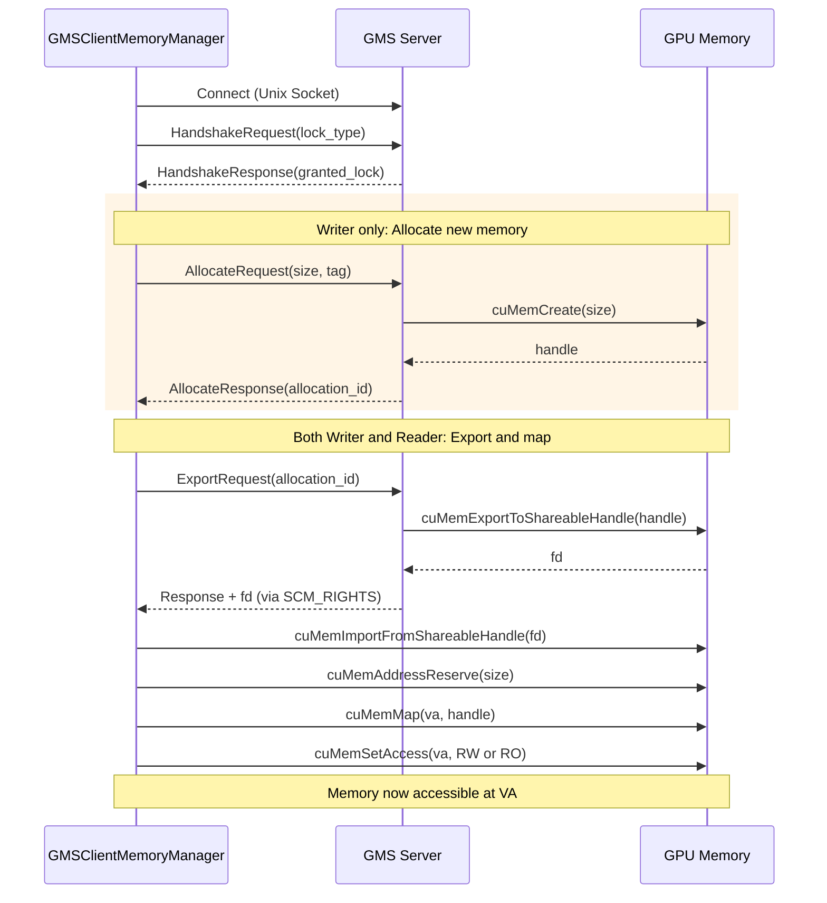
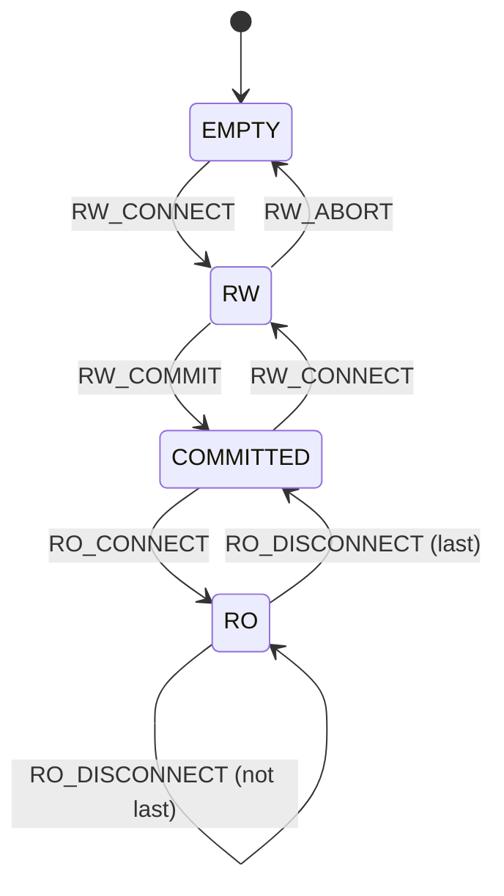
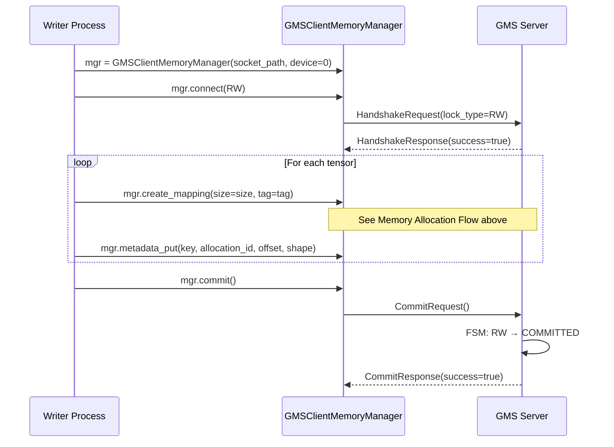
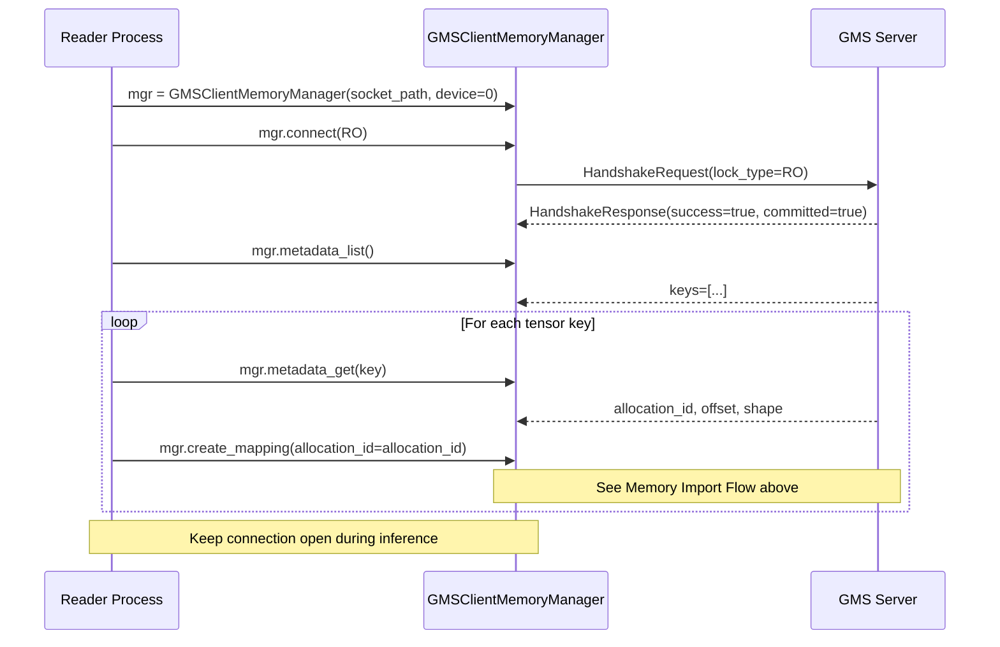
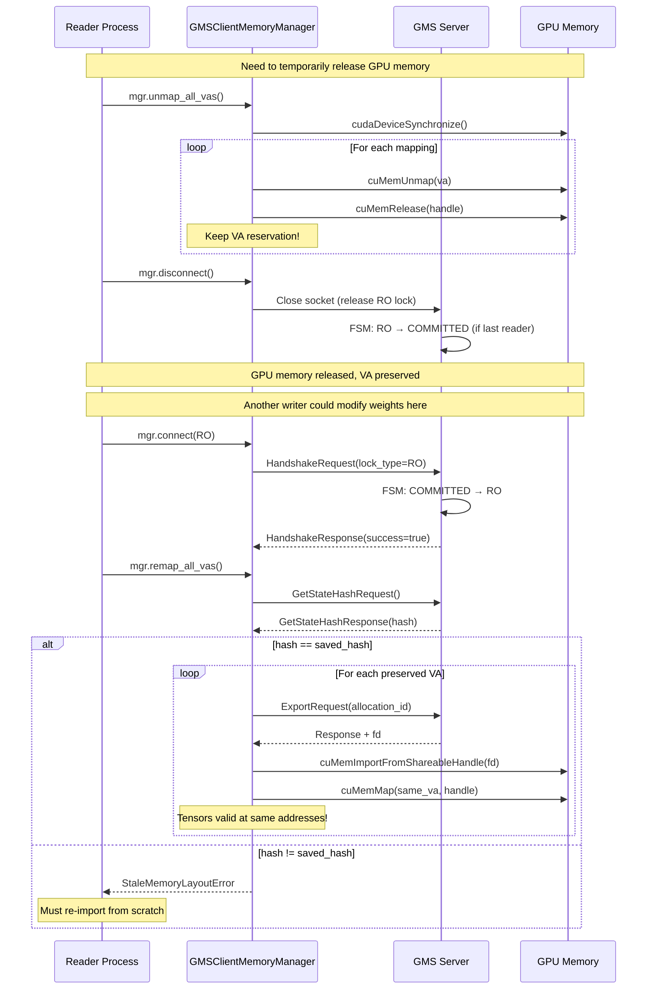
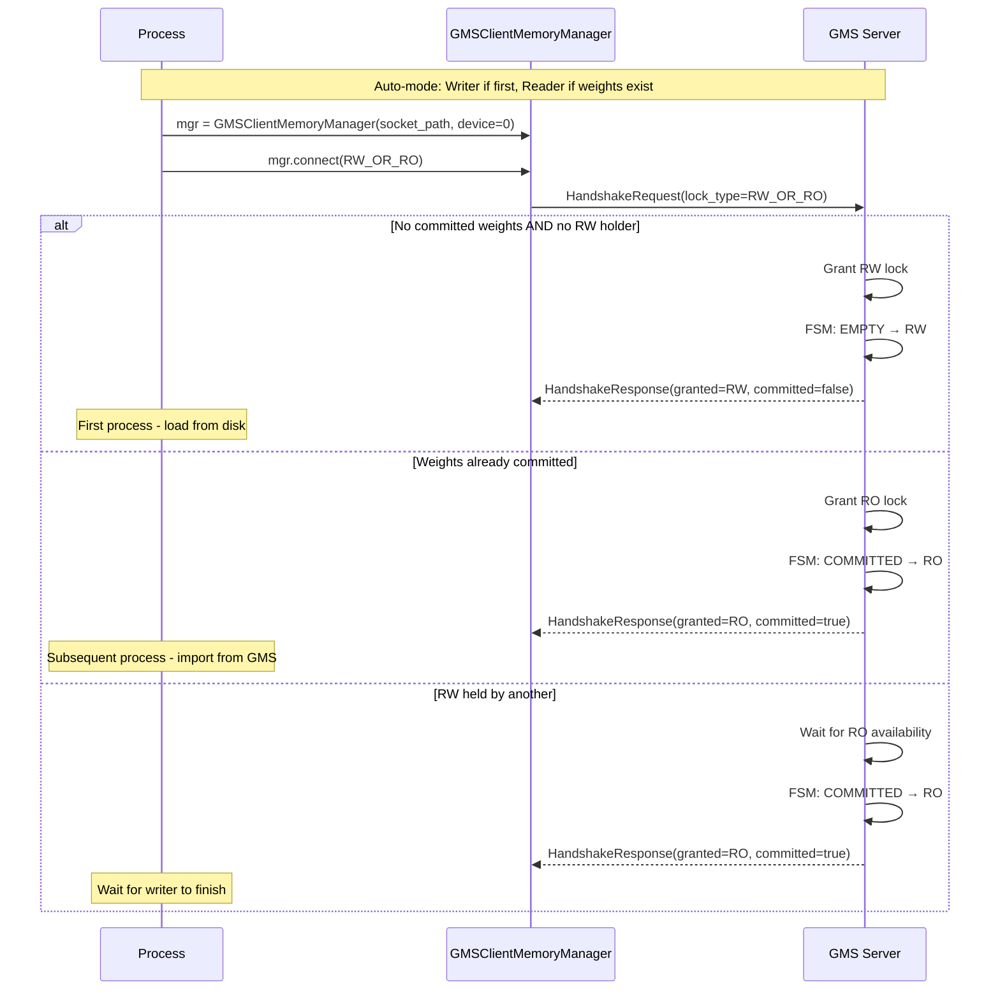

# GPU Memory Service (GMS)

## Overview

The **GPU Memory Service (GMS)** is an out-of-process GPU memory manager that decouples ownership of GPU memory from the processes that use it. This enables:

- **Zero-copy sharing** of GPU memory across multiple processes
- **Data survival** across process crashes
- **Fast model loading** via memory import instead of disk I/O for subsequent workers

GMS provides PyTorch integration via `CUDAPluggableAllocator` and pre-built integrations for inference frameworks like **vLLM** and **SGLang**.

## Problem Statement

In traditional LLM inference deployments, each worker process:
1. Loads model weights from disk/network into GPU memory
2. Owns that GPU memory for the lifetime of the process
3. Cannot share weights with other workers on the same GPU

This leads to:
- **Slow worker startup** (weight loading is I/O bound)
- **Memory waste** (duplicate weights when running multiple workers)
- **No crash resilience** (GPU memory lost when process dies)

## Solution Architecture

```
┌──────────────────────────────────────────────────────────────────────────────────────┐
│                                                                                      │
│  ┌────────────────────┐                  ┌─────────────────────────────────────────┐ │
│  │    GMS Server      │                  │    GMSClientMemoryManager (Writer)      │ │
│  │                    │                  │                                         │ │
│  │ ┌────────────────┐ │                  │  ┌─────────────────────────────────┐    │ │
│  │ │ Memory Manager │ │ ◄── Unix ───────►│  │         GMSRPCClient            │    │ │
│  │ └────────────────┘ │    Socket        │  └─────────────────────────────────┘    │ │
│  │                    │       +          │                                         │ │
│  │ ┌────────────────┐ │      FD          │  Writer-only: create_mapping, commit    │ │
│  │ │ State Machine  │ │  (SCM_RIGHTS)    └─────────────────────────────────────────┘ │
│  │ └────────────────┘ │                                                              │
│  │                    │                  ┌─────────────────────────────────────────┐ │
│  │ ┌────────────────┐ │                  │    GMSClientMemoryManager (Reader)      │ │
│  │ │ Metadata Store │ │                  │                                         │ │
│  │ └────────────────┘ │ ◄── Unix ───────►│  ┌─────────────────────────────────┐    │ │
│  │                    │    Socket        │  │         GMSRPCClient            │    │ │
│  └────────────────────┘       +          │  └─────────────────────────────────┘    │ │
│                              FD          │                                         │ │
│                          (SCM_RIGHTS)    │  Reader-only: create_mapping (import),   │ │
│                                          │               unmap_all_vas, remap      │ │
│                                          └─────────────────────────────────────────┘ │
│                                                                                      │
└──────────────────────────────────────────────────────────────────────────────────────┘
```

## Core Components

GMS follows a client-server architecture where the **server** owns GPU memory allocations and the **clients** map that memory into their own address spaces. The key insight is that the socket connection itself acts as a distributed lock.

### Server

The GMS server runs as an independent process that manages GPU memory without ever mapping it to its own address space. This design allows the server to:

- **Survive GPU driver failures** - no CUDA context means no vulnerability to driver resets
- **Outlive client processes** - memory persists across client crashes
- **Arbitrate access** - enforce single-writer, multiple-reader semantics

The server consists of three main components:

1. **Memory Manager** - Allocates physical GPU memory via CUDA VMM (`cuMemCreate`) and exports shareable file descriptors (`cuMemExportToShareableHandle`). Critically, it never calls `cuMemMap` - clients handle all virtual address mapping.

2. **State Machine (FSM)** - Manages the global lock state and enforces access rules that ensures consistency across multiple clients. See [State Machine](#state-machine) below for details.

3. **Metadata Store** - Key-value store for tensor metadata (shapes, dtypes, offsets), enabling clients to reconstruct model structure.

### Client

Clients connect to the server to acquire locks and access GPU memory. Two client classes are provided:

1. **GMSRPCClient** - Low-level RPC client for direct protocol access. Handles socket communication, msgpack serialization, and file descriptor passing via `SCM_RIGHTS`. The socket connection **is** the lock - connection lifetime equals lock lifetime, providing automatic crash resilience.

2. **GMSClientMemoryManager** - High-level client that wraps `GMSRPCClient` and handles all CUDA VMM operations for memory import and mapping safely:
   - Imports file descriptors and converts them to CUDA memory handles
   - Reserves virtual address space and maps physical memory
   - Sets appropriate access permissions (RW for writers, RO for readers)
   - Supports **unmap/remap** for VA-stable memory release under memory pressure

> **Note**: Always use `GMSClientMemoryManager` to interact with GMS from client code. The low-level `GMSRPCClient` is an implementation detail and should not be used directly.

### Memory Allocation and Import Flow

The following diagram shows how `GMSClientMemoryManager` interacts with the server and GPU. **Writers** allocate new memory while **readers** import existing allocations - both flows share the same export/import/map sequence.



---

## State Machine

The server maintains a finite state machine (FSM) that governs lock acquisition and memory access. The state is **derived** from the current connections rather than stored explicitly.

### States and Transitions



### State Descriptions

| State | Description | Can Connect RW | Can Connect RO |
|-------|-------------|:--------------:|:--------------:|
| `EMPTY` | No connections, no committed weights | ✓ | ✗ |
| `RW` | Writer connected (exclusive access) | ✗ | ✗ |
| `COMMITTED` | Weights published, no active connections | ✓ | ✓ |
| `RO` | One or more readers connected (shared access) | ✗ | ✓ |

### Events

| Event | Trigger | Description |
|-------|---------|-------------|
| `RW_CONNECT` | Writer connects | Acquires exclusive write lock |
| `RW_COMMIT` | Writer calls `commit()` | Publishes weights, releases lock |
| `RW_ABORT` | Writer disconnects without commit | Discards allocations, releases lock |
| `RO_CONNECT` | Reader connects | Acquires shared read lock |
| `RO_DISCONNECT` | Reader disconnects | Releases shared lock; if last reader, returns to COMMITTED |

### Lock Semantics

The socket connection **is** the lock:

- **Crash resilience**: Connection close (including process crash) automatically releases the lock
- **No explicit unlock**: Eliminates forgotten locks and deadlocks
- **Atomic transitions**: State changes happen atomically with socket operations

---

## Sequence Diagrams

### Writer Flow (Cold Start)

The first worker loads weights from disk and publishes them to GMS.



### Reader Flow (Warm Start)

Subsequent workers import weights from GMS instead of loading from disk.



### Unmap/Remap Flow (Memory Pressure)

Readers can temporarily release GPU memory while preserving virtual address reservations. This enables "shadow engine" patterns where inactive workers release memory for active ones.



### Auto-Mode (RW_OR_RO)

The `RW_OR_RO` mode automatically selects writer or reader based on server state, simplifying multi-worker deployments.



---

## Key Design Decisions

### 1. No VA Mapping on Server

The server never maps memory to virtual addresses (`cuMemMap`). This means:
- **No CUDA context** required on the server
- Server can survive GPU driver resets
- Memory management is fully delegated to clients

### 2. Socket-as-Lock

The socket connection **is** the lock:
- RW lock: Exclusive connection (only one RW at a time)
- RO lock: Shared connection (multiple RO allowed)
- Lock release = socket close (automatic on crash)

Benefits:
- **Crash resilience**: If a reader crashes, its lock is automatically released
- **No explicit unlock**: No forgotten locks or deadlocks

### 3. VA-Stable Unmap/Remap

During `unmap_all_vas()`:
- Physical memory is released (`cuMemUnmap` + `cuMemRelease`)
- VA reservations are **kept** (`cuMemAddressReserve` still valid)

During `remap_all_vas()`:
- Same VAs are reused for mapping
- **Tensor pointers remain valid** (no need to update PyTorch tensors)

### 4. Memory Layout Hash

On commit, the server computes a hash of:
- All allocation IDs, sizes, and tags
- All metadata entries

On `remap_all_vas()`, this hash is checked:
- If match: Safe to remap (layout unchanged)
- If mismatch: Raise `StaleMemoryLayoutError` (must re-import)

**Important**: This detects **structural** changes, not **content** changes.
Weight values can be modified in-place (e.g., RL training updates) as long as the structure is preserved.

---

## Wire Protocol

### Message Format

```
┌──────────────┬────────────────────────────────────────┐
│ Length (4B)  │  msgpack-encoded Message               │
│ big-endian   │                                        │
└──────────────┴────────────────────────────────────────┘
```

### FD Passing

File descriptors are passed out-of-band using Unix socket `SCM_RIGHTS`:

```python
# Server side (send FD)
socket.send_fds(sock, [message_bytes], [fd])

# Client side (receive FD)
data, fds, _, _ = socket.recv_fds(sock, bufsize, maxfds=1)
fd = fds[0] if fds else -1
```

---

## API Reference

### GMSClientMemoryManager

The API is organized in two tiers. **Tier 2 (convenience)** is what integrations normally use. **Tier 1 (atomic)** exposes individual operations for advanced callers.

```python
class GMSClientMemoryManager:
    def __init__(socket_path: str, *, device: int = 0): ...

    # Properties
    @property granted_lock_type: Optional[GrantedLockType]
    @property is_connected: bool
    @property is_unmapped: bool
    @property total_bytes: int

    # --- Tier 1: Connection ---
    def connect(lock_type: RequestedLockType, timeout_ms: Optional[int] = None) -> None
    def disconnect() -> None

    # --- Tier 1: Handle ops (server-side, RW only) ---
    def allocate_handle(size: int, tag: str = "default") -> str     # Returns allocation_id
    def export_handle(allocation_id: str) -> int                     # Returns FD
    def get_handle_info(allocation_id: str) -> AllocationInfo
    def free_handle(allocation_id: str) -> bool
    def clear_all_handles() -> int                                   # Returns count cleared
    def commit() -> bool                                             # Transition to COMMITTED
    def get_memory_layout_hash() -> str
    def list_handles(tag: Optional[str] = None) -> List[Dict]

    # --- Tier 1: VA ops (local) ---
    def reserve_va(size: int) -> int                                 # Returns VA
    def map_va(fd, va, size, allocation_id, tag) -> int              # Returns handle
    def unmap_va(va: int) -> None                                    # Keeps VA reservation
    def free_va(va: int) -> None                                     # Releases VA reservation

    # --- Tier 1: Metadata ---
    def metadata_put(key: str, allocation_id: str, offset: int, value: bytes) -> bool
    def metadata_get(key: str) -> Optional[Tuple[str, int, bytes]]
    def metadata_list(prefix: str = "") -> List[str]
    def metadata_delete(key: str) -> bool

    # --- Tier 2: Convenience ---
    def create_mapping(allocation_id=None, size=0, tag="default") -> int  # Allocate or import
    def destroy_mapping(va: int) -> None
    def unmap_all_vas() -> None          # Sync + unmap all, preserve VA reservations
    def remap_all_vas() -> None          # Re-import at preserved VAs (checks layout hash)
    def reallocate_all_handles(tag="default") -> None  # Fresh server handles for preserved VAs
    def close(free: bool = False) -> None
```

## Limitations

1. **Single-GPU per server**: Each GMS server manages one GPU device
2. **CUDA VMM required**: Requires a GPU with Virtual Memory Management support. Check at runtime via `CU_DEVICE_ATTRIBUTE_VIRTUAL_MEMORY_MANAGEMENT_SUPPORTED` - there is no guaranteed minimum compute capability
3. **No content validation**: Remap doesn't detect in-place weight modifications

---

## Framework Integration (vLLM / SGLang)

GMS provides pre-built integrations for vLLM and SGLang. Enable GMS by passing `--load-format gms` when launching an engine.

### How It Works

When `--load-format gms` is set:

1. **A GMS server must already be running** for the target GPU device. The engine connects to it via a Unix socket derived from the GPU UUID.
2. The engine uses `RW_OR_RO` mode by default: the **first** process gets RW (loads weights from disk, commits to GMS), and **subsequent** processes get RO (import weights from GMS metadata).
3. Weights are managed by GMS; KV cache is managed by the framework's own allocator (e.g., vLLM's `CuMemAllocator`).

#### vLLM

```bash
python -m dynamo.vllm \
  --model <model> \
  --load-format gms \
  --enable-sleep-mode \
  --gpu-memory-utilization 0.9
```

The integration uses a custom worker class (`GMSWorker`) that:
- Establishes the GMS connection early in `init_device()` so vLLM's `MemorySnapshot` can account for committed weights
- Registers a custom model loader (`GMSModelLoader`) for the `gms` load format
- Patches `torch.cuda.empty_cache` to avoid releasing GMS-managed memory
- Routes weight allocation through a `CUDAPluggableAllocator` backed by GMS

#### SGLang

```bash
python -m dynamo.sglang \
  --model-path <model> \
  --load-format gms \
  --enable-memory-saver \
  --mem-fraction-static 0.9
```

The integration patches `torch_memory_saver` to route weight operations through GMS:
- Weights (`"weights"` / `"model_weights"` tags) go through `GMSMemorySaverImpl`
- Other tags (e.g., `"kv_cache"`) are delegated to the default torch mempool implementation
- The `--enable-memory-saver` flag is required to activate the memory saver pathway

### Shadow Engine Failover (Sleep / Wake)

Both integrations support releasing and reclaiming GPU memory for shadow engine patterns. The API names differ by framework:

- **vLLM**: `sleep` / `wake_up` (via `/engine/sleep` and `/engine/wake_up` HTTP endpoints)
- **SGLang**: `release_memory_occupation` / `resume_memory_occupation` (via the corresponding HTTP endpoints)

Under the hood, sleeping calls `unmap_all_vas()` + `disconnect()` to release GPU memory while preserving VA reservations, and waking calls `connect(RO)` + `remap_all_vas()` to re-import weights at the same virtual addresses. Tensor pointers remain valid, so no model re-initialization is needed.

This enables a shadow engine to release its GPU memory, let a primary engine use the GPU, and then reclaim the memory after the primary is killed.

### Configuration via `model_loader_extra_config`

To force read-only mode (import only, never load from disk), pass `gms_read_only` via the framework's `--model-loader-extra-config` flag:

```bash
--model-loader-extra-config '{"gms_read_only": true}'
```

This forces `RO` lock mode instead of the default `RW_OR_RO` auto-detection. The engine will only import existing committed weights and fail if none are available.
