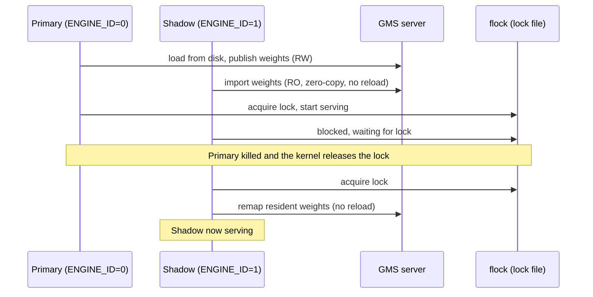
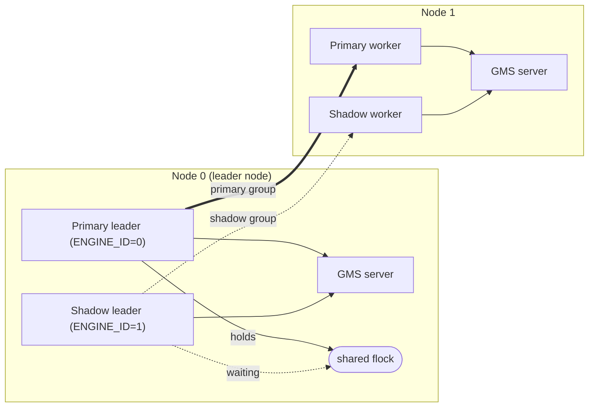

<!--
SPDX-FileCopyrightText: Copyright (c) 2026 NVIDIA CORPORATION & AFFILIATES. All rights reserved.
SPDX-License-Identifier: Apache-2.0
-->

# GPU Memory Service: shadow-engine failover with plain processes

How to get **shadow-engine failover with plain inference-engine processes** (no
Kubernetes), starting from a single node and adding only what multi-node needs on
top. On Kubernetes the Dynamo operator automates all of this
([k8s workflow](../../../docs/kubernetes/shadow-engine-failover.md)); this is the
from-scratch version. See also [GMS internals](../README.md) and the runnable
[recipe](../examples/shadow_failover/README.md).

> ⚠️ **Experimental.** APIs may change; for non-production evaluation only.

## What GMS gives you

GMS is an **out-of-process, per-GPU memory server**: it owns GPU memory (CUDA VMM
mappings) and hands it to engines over a Unix socket, so an engine **attaches to**
GPU-resident weights instead of owning them. That buys you:

- **No weight reload on restart:** a restarted engine re-imports the resident
  weights zero-copy.
- **Warm shadows:** a pre-initialized shadow engine shares the *same* resident
  weights and takes over a process-level crash **without reloading them**.

It is **not** GPU/node-loss recovery and does **not** preserve in-flight requests
or KV-cache contents; it recovers from a software/process crash on a healthy GPU.

GMS provides exactly two things: the resident weights and a **`flock` lock
primitive**. It does not decide which engine is the primary; that is up to the
engine and you.

## Single node

1. **Run a GMS server on the node:**

   ```bash
   GMS_SOCKET_DIR=/tmp/gms python -m gpu_memory_service.cli.server
   ```

   It serves one socket per `(device, tag)` for `weights` and `kv_cache`. The
   server and all engines share one `GMS_SOCKET_DIR`.

2. **Launch a primary and one or more shadows on the same GPU(s)** as GMS clients
   (`--load-format gms`), sharing that `GMS_SOCKET_DIR` and one lock file. The
   first (`ENGINE_ID=0`) loads the model from disk and publishes the weights; the
   rest import them read-only, with no second disk load and no second copy.

3. **Promotion is automatic.** In shadow mode each engine boots, parks, and blocks
   on a kernel **`flock`** over the shared lock file; one acquires it and serves,
   the rest wait. When the primary's process dies (even on `SIGKILL`) the kernel
   releases the lock and a shadow takes over, with no health-check needed. (Or
   drive `/engine/control/{sleep,wake_up}` yourself to control promotion.)



So on one node you supply: a shared lock file; a way to **route traffic to the
current lock holder** (with `dynamo.vllm` the engine registers with discovery only
*after* acquiring the lock, so a router sees only the primary); and a way to
relaunch a fresh shadow after a failover, to restore redundancy. The runnable
[recipe](../examples/shadow_failover/README.md) shows the whole flow.

## What the engine must support

A vanilla engine can't share GMS weights and stand by: its normal "sleep" copies
GPU buffers to host (which breaks on GMS's `cuMemMap`'d memory) and its memory
accounting assumes it owns the whole GPU. A GMS shadow engine needs:

- **GMS weight load** (`--load-format gms`) with a per-process RW/RO role (one
  writer via `ENGINE_ID`; this also avoids a deadlock under tensor parallelism).
- **GMS-aware sleep/wake:** sleep unmaps the GMS virtual addresses and releases
  physical backing; wake reconnects and **remaps the same virtual addresses**,
  which is how a shadow re-attaches to the resident weights without reloading.
- **Memory-accounting fixes** so a co-resident engine doesn't think the GPU is
  full and doesn't size its KV cache against the primary's allocation.
- **Scratch KV:** a (re)initializing shadow captures its CUDA graphs against
  placeholder, un-backed KV-cache memory instead of a full real allocation, so it
  doesn't consume GPU memory for KV while the primary is still running. On
  promotion it swaps in the real GMS-backed KV **at the same virtual addresses**,
  so the already-captured CUDA graphs stay valid.
- **Hold until promoted:** boot, initialize, then wait (on the `flock` or your
  signal) and serve only once promoted.

In Dynamo's vLLM these are split across two layers: the **vLLM patches for GMS
integration** (`gpu_memory_service.integrations.vllm`) provide the weight load,
GMS-aware sleep/wake, memory-accounting fixes, and scratch KV; the **Dynamo vLLM
wrapper** (`components/src/dynamo/vllm`) drives the hold-until-promoted
activation (the `flock` gate and deferred discovery registration) and wires the
two together. Integrating a different engine means providing this list yourself;
the low-level primitives (`flock`, scratch managers, unmap/remap) are in the wheel.

| Engine | Shadow lifecycle today |
| --- | --- |
| **vLLM** | **Full:** the vLLM patches for GMS integration plus the Dynamo vLLM wrapper provide load, sleep/wake, scratch KV, and `flock` activation. See the [recipe](../examples/shadow_failover/README.md). |
| **TensorRT-LLM** | **Weight load only (prototype):** `LoadFormat.GMS` RW/RO; no sleep/wake, scratch KV, or `flock` activation yet. |
| **SGLang** | GMS weight / memory-saver integration via the Dynamo runtime. |

## Multiple nodes: what's extra

Everything above still holds. A multi-node engine is just one **distributed
group**: a leader plus workers across the nodes, which you already know how to
launch (a shared master address/port, `--node-rank`, etc.). Standing up such a
group, and the second/shadow copy of it, is ordinary multi-node deployment and is
*not* GMS-specific. Only three things are special to GMS shadow failover:

- **A shadow is a whole group, not a process.** Run the primary group plus one or
  more complete shadow groups; each spans all the nodes and imports the same
  per-node GMS weights (RO), so the shadow groups add **no** weight memory (the
  whole point of GMS here).
- **Promotion is still one `flock`.** Only the leaders serve, so co-locate the
  groups' leaders on a single node and let them share one lock file, the exact
  same election as single node. Workers just follow their own group's leader and
  never touch the lock.
- **Failover is whole-group.** A distributed collective can't be partially
  recovered, so the unit you fail over is the entire group: when you kill the
  primary leader, also tear down that group's orphaned workers and start a fresh
  shadow group to restore redundancy.



The failover trigger is still yours (you kill the primary); GMS just gives each
replacement fast per-rank weight re-materialization (it imports its shard from GMS
instead of reloading from disk). **Wide expert parallelism (WideEP) is simply a
large instance of this:** more groups, same leader `flock`, same whole-group
failover.
