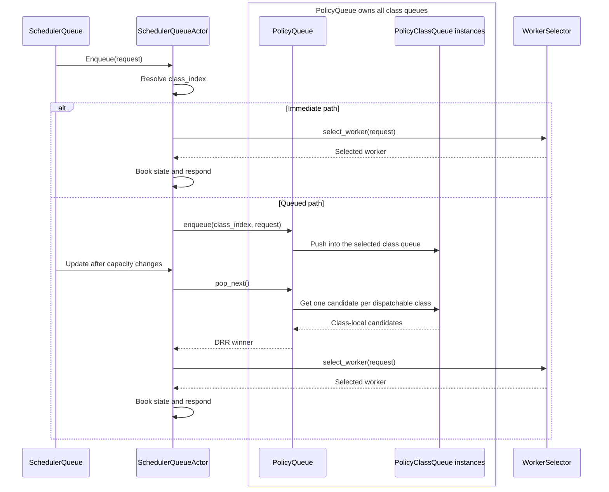

# lib/kv-router/src/scheduling

Scheduling owns request admission, queueing, worker selection, and the handoff
from projected load into sequence-state booking.

## Queue hierarchy

There is one `SchedulerQueueActor` per scheduler, not one per policy class. It owns one outer `PolicyQueue`, which owns one `PolicyClassQueue` for every class in the resolved profile.

- `SchedulerQueue` is the public handle that sends commands to the actor.
- `SchedulerQueueActor` classifies each request and chooses the immediate or queued path.
- `PolicyQueue` does not classify requests. It owns all class queues and runs DRR across their candidates.
- Each `PolicyClassQueue` owns ordering and accounting for one class such as `latency`, `agents`, or `batch`.
- `SchedulerQueueActor::admit_one` performs final worker selection and booking after either path.
- A single-class profile still uses `PolicyQueue`, but DRR has no cross-class effect.

## Guardrails

- `SchedulerQueueActor::admit_one` is the canonical admission path: compute projected
  load, select worker, skip booking if the response receiver is closed, then
  book state before responding. Failed response delivery must roll back the
  booking. Do not bypass this for normal scheduling.
- Do not remove or weaken `admission_gate` without proving selection plus
  booking remains serialized enough to avoid oversubscription regressions.
- Potential-load projection must go through
  `ActiveSequencesMultiWorker::potential_blocks_and_tokens_at(...)` with
  `SchedulingRequest::prefill_token_deltas()`. Do not scan per-worker
  `ActiveSequences` directly from scheduling.
- `SchedulingRequest` helper methods are the canonical source for effective
  cached tokens, effective overlap, worker allowance, prefill-token defaults,
  and request block count. Do not duplicate this logic in policies or selectors.
- WSPT must remain prefill-hint aware: pinned requests use the pinned worker's
  effective cached tokens; unpinned requests use the best allowed worker. Do not
  silently fall back to raw ISL unless tracking is disabled or cache data is
  absent.
- Pinned-worker and allowed-worker constraints must be validated before
  selection and respected by queue capacity checks, selector candidate
  iteration, and WSPT priority.
- Prefill load hints are computed at scheduler/request boundaries from
  selected-worker `cached_tokens`. Do not move ISL/cache-token math back into
  `ActiveSequences`.
- Selectors should be side-effect free: no booking, no queue mutation, and no
  `PromptRegistry` mutation.
- Do not hold the pending-heap lock while selecting, calling slot state,
  responding, or awaiting. The queue heap is only for parked requests.
- Do not hold `workers_with_configs.borrow()` across `.await`; take a short
  synchronous snapshot or borrow for selection only.
- Any change to queue ordering, WSPT keys, capacity checks, admission
  serialization, or selector scoring should include focused tests and
  before/after routing or queue benchmarks.
- Keep text and external IDs such as request IDs on standard hash collections.
  Use `FxHashMap` / `FxHashSet` for internal numeric hot-path keys only.
