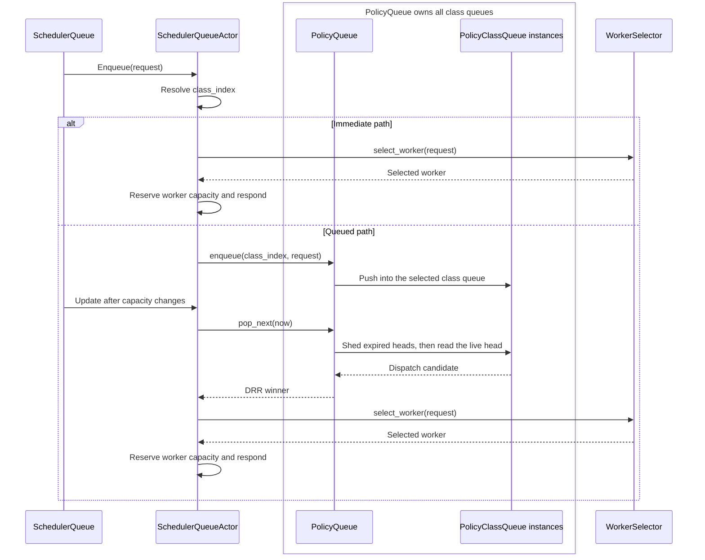

# lib/kv-router/src/scheduling

Scheduling decides whether a request can run now, which worker should receive it, and how its load is recorded while it runs.

## Queue hierarchy

There is one `SchedulerQueueActor` per scheduler. It owns one outer `PolicyQueue`, which owns one `PolicyClassQueue` for every class in the resolved profile.


```mermaid
sequenceDiagram
    participant H as SchedulerQueue
    participant A as SchedulerQueueActor
    box PolicyQueue owns all class queues
        participant P as PolicyQueue
        participant C as PolicyClassQueue instances
    end
    participant S as WorkerSelector

    H->>A: Enqueue(request)
    A->>A: Resolve class_index
    alt Immediate path
        A->>S: select_worker(request)
        S-->>A: Selected worker
        A->>A: Reserve worker capacity and respond
    else Queued path
        A->>P: enqueue(class_index, request)
        P->>C: Push into the selected class queue
        H->>A: Update after capacity changes
        A->>P: pop_next(now)
        P->>C: Shed expired heads, then read the live head
        C-->>P: Dispatch candidate
        P-->>A: DRR winner
        A->>S: select_worker(request)
        S-->>A: Selected worker
        A->>A: Reserve worker capacity and respond
    end
```

- `SchedulerQueue` is the public handle that sends commands to the actor.
- `SchedulerQueueActor` resolves each request's class and chooses the immediate or queued path.
- `PolicyQueue` does not resolve classes. It owns all class queues and uses deficit round robin (DRR) to give each class weighted turns.
- Each `PolicyClassQueue` owns ordering and accounting for one class such as `latency`, `standard`, or `batch`.
- `SchedulerQueueActor::admit_one` performs final worker selection and reserves worker capacity after either path.
- A single-class profile still uses `PolicyQueue`, but DRR has no cross-class effect.

## Per-class ready storage

A policy class holds **exactly one** runnable queue: a due-time `MinMaxHeap`. Do not add a second runnable structure for a class, and do not partition it by worker. The deferred map is unordered non-runnable holding storage owned by a custom `QueueAdmissionPolicy`, not a second queue.

```text
PolicyClassQueue("latency")
├── config: PolicyClassConfig            # name, ordering, quantum, thresholds, limits
├── ready:  MinMaxHeap<PolicyQueueEntry> # the one runnable queue
├── stats:  PolicyQueueStats
└── deficit: usize                       # DRR credit
```

`PolicyQueueEntry<T>` is one queued payload plus its class index, ordering key, worker placement, and token/accounting snapshot. In production, `T` is `QueuedRequest`, which wraps the `SchedulingRequest`, enqueue timestamp, and optional block hashes.

- The ordering key has exactly two shapes, and every entry in a class uses its class's shape:
  - A configured flat class orders by `(deadline, enqueue sequence)` ascending. The minimum is the earliest deadline with FIFO ties; the maximum is the latest deadline with LIFO ties. Nothing else enters that key — not strict priority, not `priority_jump`, not request cost.
  - The fallback profile, used when no `router_policy_config` defines classes, keeps the pre-existing `--router-queue-policy` key of `(strict_priority, policy score, enqueue sequence)`. It has no SLO, so its entries carry no deadline and never expire. Do not regress this path while changing configured-class behavior.
- `MinMaxHeap::peek_min`/`peek_max` are O(1); push and pop are O(log n). `pop_max` has no Stage 0 production caller and exists so the maximum end of the contract stays tested.
- `WorkerPlacement` is recorded on the entry but does not affect ordering. Only the class head is tested for dispatch, so a head that cannot run holds its class's line; DRR keeps other classes moving. This head-of-line behavior inside a class is accepted, not a bug to route around with a second queue.
- `round_cursor` marks which class receives the next weighted turn. `carry_class` lets a class spend its unused share before that turn, but only if `next_dispatchable` confirms that its next request can run.

## Class SLO deadlines

- Each configured class sets one required, positive `slo_ms`. A request's absolute deadline is derived **once**, from the router-acceptance instant captured before the bounded actor-channel wait, and is then carried on the entry. Never recompute it from a later clock read, and never re-derive it in a second place.
- Deadline expiry is rejected, never dispatched, at three points: class-queue admission, deferred wake-up, and the head of a class during a DRR poll. A request dispatched without queueing does not pass the admission check.
- Expiry must reverse queue and class accounting exactly once, report exactly one `Aborted` lifecycle event for admission-managed work, spend no class deficit, and not advance the DRR cursor. Prune expired heads **before** a class offers a dispatch candidate; do not add a post-pop recheck, refund, or inspect/commit transaction.
- Work released by an abort that expired while it was parked is attributed to `DeadlineStage::DeferredWake`, not to the stage that started the rejection pass.

## Guardrails

- A request ID identifies at most one active scheduler booking. Duplicate adds
  conflict regardless of the target worker. A serialized migration retry may
  reuse the ID only after the previous booking has been released.
- Before an unpinned retry, exclude every worker already failed by that migration state machine. Preserve caller allowlists and routing constraints. An affinity-derived pin may be invalidated and rebound; an explicit request pin remains exact.
- A failed stream releases its scheduler booking before the error reaches the retry manager. This ordering prevents a later attempt from overlapping stale cleanup.
- Cleanup that can outlive a request attempt must be conditional on the worker that acquired the booking. `RequestGuard` uses `free_if_worker` (ownership mismatch = no-op). The admission lifecycle lease ends before handoff and remains request-ID-only.
- `SchedulerQueueActor::admit_one` is the required admission path: compute projected
  load, select a worker, skip the capacity reservation if the response receiver
  is closed, then reserve capacity before responding. Failed response delivery
  must release that capacity. Do not bypass this for normal scheduling.
- Do not remove or weaken `admission_gate` without proving selection and
  capacity reservation cannot assign more work than the workers can hold.
- Potential-load projection must go through
  `ActiveSequencesMultiWorker::potential_blocks_and_tokens_at(...)` with
  `SchedulingRequest::prefill_token_deltas()`. Do not scan per-worker
  `ActiveSequences` directly from scheduling.
- `SchedulingRequest` helper methods are the single source for effective
  cached tokens, effective overlap, worker allowance, prefill-token defaults,
  and request block count. Do not duplicate this logic in policies or selectors.
- The fallback profile's weighted shortest processing time (WSPT) ordering must use cache-aware prefill cost: pinned requests use the pinned worker's
  effective cached tokens; unpinned requests use the best allowed worker. Do not
  silently fall back to raw input sequence length (ISL) unless tracking is disabled or cache data is
  absent. Configured classes do not use WSPT; they order by deadline.
- Pinned-worker and allowed-worker constraints must be validated before
  selection and respected by queue capacity checks and selector candidate
  iteration. They do not affect queue ordering.
- Prefill load hints are computed at scheduler/request boundaries from
  selected-worker `cached_tokens`. Do not move ISL/cache-token math back into
  `ActiveSequences`.
- Selectors should be side-effect free: no capacity reservation, no queue mutation, and no
  `PromptRegistry` mutation.
- Do not hold the pending-heap lock while selecting, reading worker capacity,
  responding, or awaiting. The queue heap is only for waiting requests.
- Do not hold `workers_with_configs.borrow()` across `.await`; take a short
  synchronous snapshot or borrow for selection only.
- Any change to queue ordering, class deadlines, capacity checks, admission
  serialization, or selector scoring should include focused tests and
  before/after routing or queue benchmarks.
- Keep text and external IDs such as request IDs on standard hash collections.
  Use `FxHashMap` / `FxHashSet` for internal numeric hot-path keys only.

## Public Worker-Selection API

The `selector` module contains the public Rust contract for custom worker filters, scorers, and pickers. Treat each public item as a versioned external API.

- Do not add a public field, accessor, input group, type, or re-export unless the task explicitly requires a new external policy capability.
- An internal need in the default scorer, logging, tests, or SelectionService does not justify a public API addition.
- Trace a proposed value to its source before you expose it. Record whether it is raw state, a derived estimate, or an intermediate in Dynamo's default formula.
- Expose raw facts or complete user-facing abstractions. Do not expose partial credit, weighted overlap, legacy arithmetic, or another intermediate whose meaning depends on the default policy.
- Keep struct fields private. Add the narrowest accessor that supports the approved use case.
- When a protocol context is projected into a worker-selection type, destructure the source without `..` and handle every field explicitly. Map only approved policy fields. Bind each field that stays internal by name and explain why. A new source field must cause a compile error until its policy meaning, cost, documentation, and contract test are reviewed.
- Return `Option` for absent data. Do not replace absence with a sentinel value.
- Document the source, units, lifetime, staleness, missing-data behavior, weighting, and clamping for each public value.
- Require callers to name each `WorkerInputs` group that they use. Do not add a public `ALL` shortcut.
- Before you add a value to an existing input group, account for its calculation and retained-column cost for every policy that requests that group.
- Do not pass the full `SchedulingRequest`, worker maps, router configuration internals, default-score weights, or host-owned eligibility and reservation state to custom policies.
- Keep `DefaultWorkerScorer` and `DefaultWorkerPicker` internal. External policies own their filters and both scoring and picking stages.
- Keep eligibility, picker-row validation, accounting, and reservation in the host path.

Before each public API addition:

1. Search all accessors, re-exports, documentation, examples, and external-looking call sites.
2. Add one focused contract test that uses the new value through `WorkerFilter`, `WorkerScorer`, or `WorkerPicker`.
3. Update `docs/fern/pages/developer-guide/advanced-customizations/custom-worker-selection.mdx` and one canonical example.
4. If the signal adds work, storage, allocation, or another scan to the selection path, run the worker-selection benchmark.
