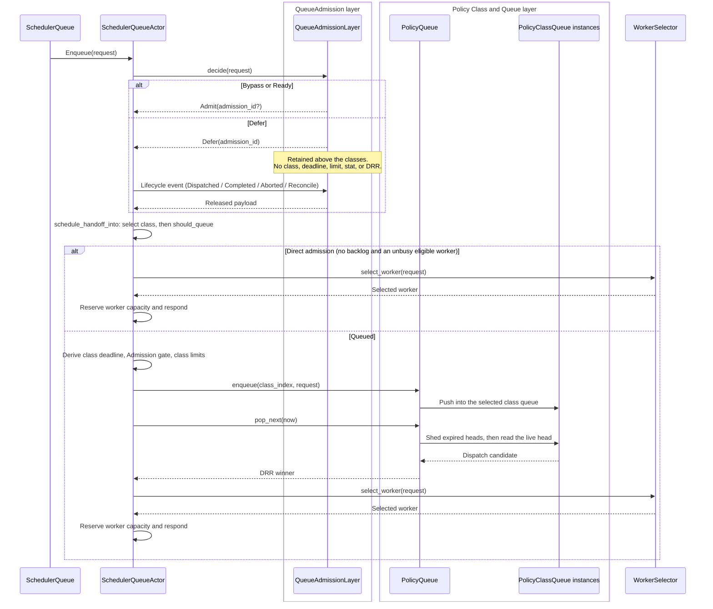

# lib/kv-router/src/scheduling

Scheduling decides whether a request can run now, which worker should receive it, and how its load is recorded while it runs.

## Queue hierarchy

There is one `SchedulerQueueActor` per scheduler. It coordinates **two independent layers** that must not mix their internal ownership or concepts:

```text
SchedulerQueueActor
├── QueueAdmission layer                 # queue_admission/host.rs
│   ├── QueueAdmissionPolicy             # the user's plugin
│   ├── deferred request payloads        # unordered, non-runnable holding storage
│   └── QAP-managed lifecycle state      # lifecycle IDs, managed IDs, bookings
└── Policy Class and Queue layer         # policy_queue.rs
    ├── flat policy-class selection and default-class handling
    ├── the direct-versus-queued decision (should_queue)
    └── PolicyQueue
        ├── classes: Vec<PolicyClassQueue>   # exactly one runnable MinMaxHeap per class
        └── cross-class DRR state
```

Class selection and the direct-versus-queued decision are the **actor's**, not the admission policy's and not `PolicyQueue`'s. `PolicyQueue` only stores what the actor decides to queue.


```mermaid
sequenceDiagram
    participant H as SchedulerQueue
    participant A as SchedulerQueueActor
    box QueueAdmission layer
        participant Q as QueueAdmissionLayer
    end
    box Policy Class and Queue layer
        participant P as PolicyQueue
        participant C as PolicyClassQueue instances
    end
    participant S as WorkerSelector

    H->>A: Enqueue(request)
    A->>Q: decide(request)
    alt Bypass or Ready
        Q-->>A: Admit(admission_id?)
    else Defer
        Q-->>A: Defer(admission_id)
        Note over Q: Retained above the classes.<br/>No class, deadline, limit, stat, or DRR.
        A->>Q: Lifecycle event (Dispatched / Completed / Aborted / Reconcile)
        Q-->>A: Released payload
    end
    A->>A: schedule_handoff_into: select class, then should_queue
    alt Direct admission (no backlog and an unbusy eligible worker)
        A->>S: select_worker(request)
        S-->>A: Selected worker
        A->>A: Reserve worker capacity and respond
    else Queued
        A->>A: Derive class deadline, Admission gate, class limits
        A->>P: enqueue(class_index, request)
        P->>C: Push into the selected class queue
        A->>P: pop_next(now)
        P->>C: Shed expired heads, then read the live head
        C-->>P: Dispatch candidate
        P-->>A: DRR winner
        A->>S: select_worker(request)
        S-->>A: Selected worker
        A->>A: Reserve worker capacity and respond
    end
```

- `SchedulerQueue` is the public handle that sends commands to the actor.
- `SchedulerQueueActor::schedule_handoff_into` is the **one** decision every request handed over by the admission layer reaches. Bypass, Ready, and a woken Defer all arrive there and are indistinguishable from that point on. It selects the class and then chooses between direct admission and queue storage.
- `PolicyQueue` does not resolve classes and knows nothing about queue admission. It owns all class queues and uses deficit round robin (DRR) to give each class weighted turns.
- Each `PolicyClassQueue` owns ordering and accounting for one class such as `latency`, `standard`, or `batch`.
- `SchedulerQueueActor::admit_one` performs final worker selection and reserves worker capacity after either route.
- A single-class profile still uses `PolicyQueue`, but DRR has no cross-class effect.

## Layer boundary

The two layers are independent. Keep them that way:

- `policy_queue.rs` must not import QAP-specific types, name a `QueueAdmissionPolicy` in its documentation, store a `QueueAdmissionId`, invoke a QAP callback, own a deferred map, or distinguish a QAP wake-up from ordinary policy-class admission.
- QAP code must not select a policy class, inspect or modify class queues, participate in DRR, or implement class SLO ordering or rejection.
- Queue admission runs **first and unconditionally** for every arrival. Nothing the class layer owns — an unknown class name included — may run before it, short-circuit it, or reorder it. A request that names a class the profile does not configure still reaches the policy, and is refused at the downstream handoff like any other class-layer rejection; a deferred one is refused only when the policy wakes it.
- Policy-class selection happens when a request crosses from the admission layer into the actor's scheduling decision. A deferred request is not assigned to or accounted against a class before the policy wakes it, so it is absent from class limits, class statistics, and pending accounting until then.
- The direct-versus-queued decision belongs to the actor. A queue-admission policy may not force queue storage, and `PolicyQueue` may not ask to be skipped: `should_queue` is class queueing enabled **and** (a runnable same-class backlog **or** no unbusy eligible worker). The queue Admission gate and class limits bind only when it says yes; direct admission meets neither, exactly as it always has.
- A woken request repeats that same decision at wake time, keeping its original arrival. If it queues, the time it spent deferred has already consumed its class SLO. If it can be admitted directly, it is — being woken is not a reason to force it through queue gates.
- When the decision says queue, the Admission gate reads the clock at that point — after any policy callback returned, and after class resolution and the eligible-worker busy scan. Both can run arbitrarily long, and that time belongs to the class SLO of anything the decision sends to storage. Do not reuse an earlier sample for the gate.
- Cancellation retracts a request and reverses its class accounting **before** its abort reaches the policy. An abort returns released work to the actor's scheduling decision, and any of it that decision sends to queue storage must be measured against the room the cancellation made, not the counts it found.
- The admission layer retains only neutral request information, including the original router-arrival instant. That instant survives deferral, and the class selected at handoff derives its fixed-SLO deadline from it — but only on the queue branch. Time spent deferred therefore consumes the latency budget of work that ends up waiting, and costs nothing to work the decision can dispatch outright, all without the policy understanding classes or SLOs.
- Downstream lifecycle outcomes (`Dispatched`, `Completed`, `Aborted`) reach the policy through `SchedulerQueueActor`, never from `PolicyQueue`. A downstream rejection of QAP-managed work must still produce exactly one `Aborted` event, reported by the actor.
- `QueuedRequest` is opaque to both layers: `PolicyQueue<T>` never reads it, and the admission layer only stores and returns it.

## Per-class ready storage

A policy class holds **exactly one** runnable queue: a due-time `MinMaxHeap`. Do not add a second runnable structure for a class, and do not partition it by worker. The admission layer's deferred map is unordered non-runnable holding storage above the classes, not a second queue.

```text
PolicyClassQueue("latency")
├── config: PolicyClassConfig            # name, ordering, quantum, thresholds, limits
├── ready:  MinMaxHeap<PolicyQueueEntry> # the one runnable queue
├── stats:  PolicyQueueStats
└── deficit: usize                       # DRR credit
```

`PolicyQueueEntry<T>` is one queued payload plus its class index, ordering key, worker placement, and token/accounting snapshot. In production, `T` is `QueuedRequest`, which wraps the `SchedulingRequest`, the router-arrival instant, optional block hashes, and the optional admission identity the actor reports lifecycle under.

- The ordering key has exactly two shapes, and every entry in a class uses its class's shape:
  - A configured flat class orders by `(deadline, enqueue sequence)` ascending. The minimum is the earliest deadline with FIFO ties; the maximum is the latest deadline with LIFO ties. Nothing else enters that key — not strict priority, not `priority_jump`, not request cost.
  - The fallback profile, used when no `router_policy_config` defines classes, keeps the pre-existing `--router-queue-policy` key of `(strict_priority, policy score, enqueue sequence)`. It has no SLO, so its entries carry no deadline and never expire. Do not regress this path while changing configured-class behavior.
- `MinMaxHeap::peek_min`/`peek_max` are O(1); push and pop are O(log n). `pop_max` has no Stage 0 production caller and exists so the maximum end of the contract stays tested.
- `WorkerPlacement` is recorded on the entry but does not affect ordering. Only the class head is tested for dispatch, so a head that cannot run holds its class's line; DRR keeps other classes moving. This head-of-line behavior inside a class is accepted, not a bug to route around with a second queue.
- `round_cursor` marks which class receives the next weighted turn. `carry_class` lets a class spend its unused share before that turn, but only if `next_dispatchable` confirms that its next request can run.

## Class SLO deadlines

- Each configured class sets one required, positive `slo_ms`. Selecting a class does not by itself derive a deadline: derivation happens only when `should_queue` requires storage, because a deadline bounds waiting and a directly admitted request never waits. When it does happen, the absolute deadline is derived **once**, from the router-acceptance instant captured before the bounded actor-channel wait, and is then carried on the entry. Never recompute it from a later clock read, and never re-derive it in a second place.
- Deadline expiry is rejected, never dispatched, at two points: class-queue admission and the head of a class during a DRR poll. A request admitted directly does not pass the admission check.
- Expiry must reverse queue and class accounting exactly once, report exactly one `Aborted` lifecycle event for admission-managed work, spend no class deficit, and not advance the DRR cursor. Prune expired heads **before** a class offers a dispatch candidate; do not add a post-pop recheck, refund, or inspect/commit transaction.
- Do not add a wake-specific deadline stage. Work the admission layer releases into queue storage meets the ordinary Admission gate, and nothing downstream may learn that it was woken.
- Aborting managed work can release more deferred work, which can itself be queued, admitted directly, or expired. Keep that chain iterative: low-level dispatch and abort append newly released payloads to the caller's worklist (`admit_one_into`, `release_lifecycle_into`) rather than re-entering `admit_woken`, whose loop owns them. Recursing there would make the chain's depth the number of deferred requests. It terminates because deferred storage only shrinks during a pass.

## Guardrails

- A request ID identifies at most one active scheduler booking. Duplicate adds
  conflict regardless of the target worker. A serialized migration retry may
  reuse the ID only after the previous booking has been released.
- Before an unpinned retry, exclude every worker already failed by that migration state machine. Preserve caller allowlists and routing constraints. An affinity-derived pin may be invalidated and rebound; an explicit request pin remains exact.
- A failed stream releases its scheduler booking before the error reaches the retry manager. This ordering prevents a later attempt from overlapping stale cleanup.
- Cleanup that can outlive a request attempt must be conditional on the worker that acquired the booking. `RequestGuard` uses `free_if_worker` (ownership mismatch = no-op). The admission lifecycle lease ends before handoff and remains request-ID-only.
- The admission layer records the booked worker for every tracked request that dispatches, bypassed work included, and a worker-qualified terminal event must match an existing booking exactly. A missing booking is a **non-match**, never a match: a request that is only queued has none, and treating that as a match lets a late event from an abandoned attempt clear a newer attempt that reused the ID. An unqualified terminal event names no worker, makes no claim about which attempt it belongs to, and keeps releasing the request.
- The `Enqueue` arm arms its lease only **after** it has scheduled the request and after any drain that ran in the same command, and only when the actor still owns that request. Dispatch can lose the lifecycle the arrival took — selection, booking, and response delivery can all fail, on the direct route as readily as from a drain — and a lease armed for a released request lets its cleanup kill a later attempt with the same ID.
- `SchedulerQueueActor::admit_one_into` is the required admission path and the
  shared dispatch pipeline both routes end in: compute projected load, select a
  worker, skip the capacity reservation if the response receiver is closed, then
  reserve capacity before responding. Failed response delivery must release that
  capacity. `admit_one` is only its queued-route wrapper, which additionally
  drives the wake pass for what that dispatch releases. Do not bypass either for
  normal scheduling, and do not add a third route into worker selection.
- Do not remove or weaken `admission_gate` without proving selection and
  capacity reservation cannot assign more work than the workers can hold.
- Potential-load projection must go through
  `ActiveSequencesMultiWorker::potential_blocks_and_tokens_at(...)` with
  `SchedulingRequest::prefill_token_deltas()`. Do not scan per-worker
  `ActiveSequences` directly from scheduling.
- `SchedulingRequest` helper methods are the single source for effective
  cached tokens, effective overlap, worker allowance, prefill-token defaults,
  and request block count. Do not duplicate this logic in policies or selectors.
- The fallback profile's weighted shortest processing time (WSPT) ordering must use cache-aware prefill cost: pinned requests use the pinned worker's
  effective cached tokens; unpinned requests use the best allowed worker. Do not
  silently fall back to raw input sequence length (ISL) unless tracking is disabled or cache data is
  absent. Configured classes do not use WSPT; they order by deadline.
- Pinned-worker and allowed-worker constraints must be validated before
  selection and respected by queue capacity checks and selector candidate
  iteration. They do not affect queue ordering.
- Prefill load hints are computed at scheduler/request boundaries from
  selected-worker `cached_tokens`. Do not move ISL/cache-token math back into
  `ActiveSequences`.
- Selectors should be side-effect free: no capacity reservation, no queue mutation, and no
  `PromptRegistry` mutation.
- Do not hold the pending-heap lock while selecting, reading worker capacity,
  responding, or awaiting. The queue heap is only for waiting requests.
- Do not hold `workers_with_configs.borrow()` across `.await`; take a short
  synchronous snapshot or borrow for selection only.
- Any change to queue ordering, class deadlines, capacity checks, admission
  serialization, or selector scoring should include focused tests and
  before/after routing or queue benchmarks.
- Keep text and external IDs such as request IDs on standard hash collections.
  Use `FxHashMap` / `FxHashSet` for internal numeric hot-path keys only.

## Public Worker-Selection API

The `selector` module contains the public Rust contract for custom worker filters, scorers, and pickers. Treat each public item as a versioned external API.

- Do not add a public field, accessor, input group, type, or re-export unless the task explicitly requires a new external policy capability.
- An internal need in the default scorer, logging, tests, or SelectionService does not justify a public API addition.
- Trace a proposed value to its source before you expose it. Record whether it is raw state, a derived estimate, or an intermediate in Dynamo's default formula.
- Expose raw facts or complete user-facing abstractions. Do not expose partial credit, weighted overlap, legacy arithmetic, or another intermediate whose meaning depends on the default policy.
- Keep struct fields private. Add the narrowest accessor that supports the approved use case.
- When a protocol context is projected into a worker-selection type, destructure the source without `..` and handle every field explicitly. Map only approved policy fields. Bind each field that stays internal by name and explain why. A new source field must cause a compile error until its policy meaning, cost, documentation, and contract test are reviewed.
- Return `Option` for absent data. Do not replace absence with a sentinel value.
- Document the source, units, lifetime, staleness, missing-data behavior, weighting, and clamping for each public value.
- Require callers to name each `WorkerInputs` group that they use. Do not add a public `ALL` shortcut.
- Before you add a value to an existing input group, account for its calculation and retained-column cost for every policy that requests that group.
- Do not pass the full `SchedulingRequest`, worker maps, router configuration internals, default-score weights, or host-owned eligibility and reservation state to custom policies.
- Keep `DefaultWorkerScorer` and `DefaultWorkerPicker` internal. External policies own their filters and both scoring and picking stages.
- Keep eligibility, picker-row validation, accounting, and reservation in the host path.

Before each public API addition:

1. Search all accessors, re-exports, documentation, examples, and external-looking call sites.
2. Add one focused contract test that uses the new value through `WorkerFilter`, `WorkerScorer`, or `WorkerPicker`.
3. Update `docs/fern/pages/developer-guide/advanced-customizations/custom-worker-selection.mdx` and one canonical example.
4. If the signal adds work, storage, allocation, or another scan to the selection path, run the worker-selection benchmark.
