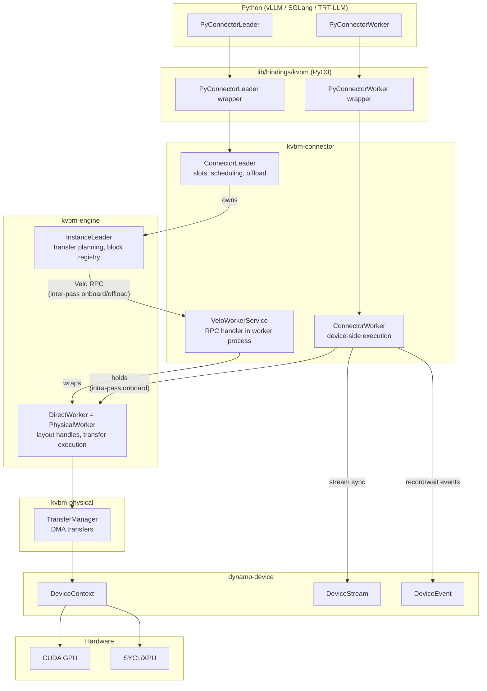

# KVBM-Connector XPU/SYCL Support

How Intel XPU (SYCL/oneAPI) is integrated into kvbm-connector for framework
integrations (vLLM, SGLang, TensorRT-LLM). This document covers the Leader/Worker
architecture, Velo messenger protocol, and backend-agnostic device handling.

For the broader architecture — how kvbm-connector fits into KVBM v2, the
device abstraction layer, and how XPU/SYCL compares to CUDA — see
[`kvbm_v2_xpu_sycl_enablement.md`](../../kvbm-physical/docs/kvbm_v2_xpu_sycl_enablement.md).

## Overview

kvbm-connector is the framework integration layer that bridges external
inference runtimes (vLLM, SGLang, TensorRT-LLM) with the KVBM v2 engine. It provides:

- **Leader/Worker architecture** — `InstanceLeader` orchestrates transfers;
  `ConnectorWorker` executes on each device
- **Velo messenger protocol** — async Leader↔Worker communication via typed handlers
- **Backend-agnostic device handling** — CUDA and SYCL/XPU share the same
  code path through `dynamo-device` abstractions

## Architecture

kvbm-connector sits between external frameworks and the KVBM engine:



## Leader/Worker Communication

### Velo Messenger Protocol

kvbm-connector uses the Velo messenger system for async Leader↔Worker
communication. The messenger is an RPC-like protocol with typed handlers.

```rust
// From kvbm-connector/src/connector/worker/velo/client.rs
pub struct ConnectorWorkerClient {
    messenger: Arc<Messenger>,
    remote: InstanceId,
}

impl ConnectorWorkerClient {
    pub fn initialize(&self, config: LeaderLayoutConfig) -> Result<velo::TypedUnaryResult<WorkerLayoutResponse>>;
    pub async fn mark_onboarding_complete(&self, request_id: String) -> Result<()>;
    pub async fn mark_offloading_complete(&self, request_id: String) -> Result<()>;
    pub async fn mark_failed_onboarding(&self, request_id: String, block_ids: Vec<BlockId>) -> Result<()>;
}
```

### LeaderLayoutConfig

```rust
// From kvbm-engine/src/worker/protocol.rs
pub struct LeaderLayoutConfig {
    pub rank: usize,
    pub host_block_count: usize,
    pub disk_block_count: Option<usize>,
    pub object: Option<kvbm_config::ObjectConfig>,
    pub parallelism: kvbm_config::ParallelismMode,
    pub backend: DeviceBackend,  // Cuda or Sycl
}
```

## Worker State Management

```rust
// From kvbm-connector/src/connector/worker/state.rs
pub struct WorkerState {
    pub finished_onboarding: Arc<Mutex<HashSet<String>>>,
    pub finished_offloading: Arc<Mutex<HashSet<String>>>,
    pub failed_onboarding: Arc<Mutex<HashMap<String, Vec<BlockId>>>>,
    // ...
}
```

## vLLM Integration

kvbm-connector provides a vLLM connector that implements the KV cache
management interface:

```rust
// From kvbm-connector/src/vllm/mod.rs
pub mod layout;      // Layout configuration
pub mod config;      // vLLM-specific config
```

### Python/Rust Boundary

The Python/Rust boundary uses backend-agnostic `DeviceEvent` synchronization
through the `dynamo-device` layer:

```rust
// From kvbm-connector/src/connector/worker/mod.rs
pub struct PyKvConnectorWorker {
    inner: Arc<WorkerState>,  // Backend-agnostic worker state
    // ...
}

// From lib/device/src/lib.rs - DeviceEvent synchronization
impl DeviceEvent {
    /// Block until event completes
    pub fn synchronize(&self) -> Result<()> {
        self.ops.synchronize()
    }
    
    /// Record event on raw stream handle (FFI boundary)
    pub fn record_on_raw(&self, stream_handle: u64) -> Result<()> {
        self.ops.record_on_raw_stream(stream_handle)
    }
    
    /// Make stream wait on this event
    pub fn wait_on_raw(&self, stream_handle: u64) -> Result<()> {
        self.ops.wait_on_raw_stream(stream_handle)
    }
}
```

### Layer-wise Synchronization

The connector uses `DeviceEvent` for layer-wise operations:

```rust
// From kvbm-connector/src/connector/worker/state.rs
pub(crate) onboard_layer_events: OnceLock<Vec<Arc<DeviceEvent>>>;
pub(crate) compute_layer_events: OnceLock<Vec<Arc<DeviceEvent>>>;
pub(crate) offload_complete_event: OnceLock<Arc<DeviceEvent>>;
```

Usage in `wait_for_layer_load`:
```rust
// From kvbm-connector/src/connector/worker/mod.rs
intra_pass_offload_state.stream.wait_event(event)?;
```

## Related Documentation

- [`kvbm_v2_xpu_sycl_enablement.md`](../../kvbm-physical/docs/kvbm_v2_xpu_sycl_enablement.md) — Full KVBM v2 architecture overview
- [`planner_executor_flow.md`](../../kvbm-physical/docs/planner_executor_flow.md) — Planner-driven transfer executor (preferred path)
- [`transfer_executor_overview.md`](../../kvbm-physical/docs/transfer_executor_overview.md) — Legacy direct executor
- [`sycl_pool_and_numa.md`](../../memory/docs/sycl_pool_and_numa.md) — SYCL memory pool and NUMA support
- [`collectives.md`](../../kvbm-engine/docs/collectives.md) — NCCL and oneCCL collectives
- [`event_sync.md`](../../bindings/kvbm/docs/event_sync.md) — Python event synchronization
