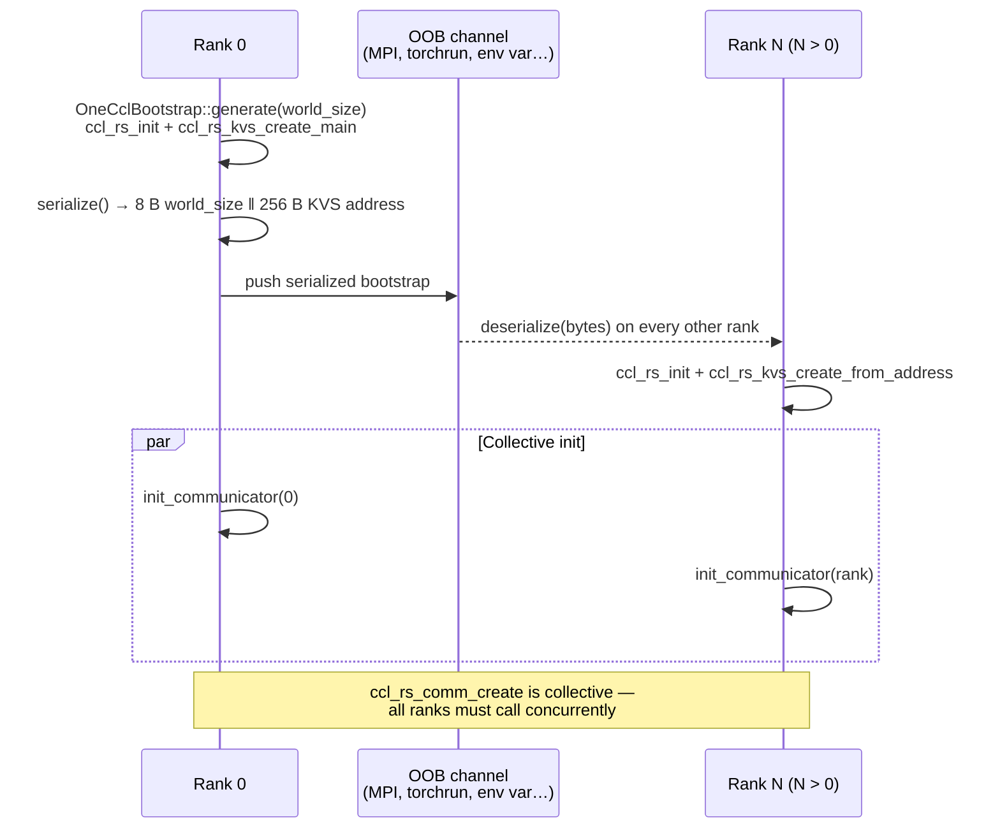
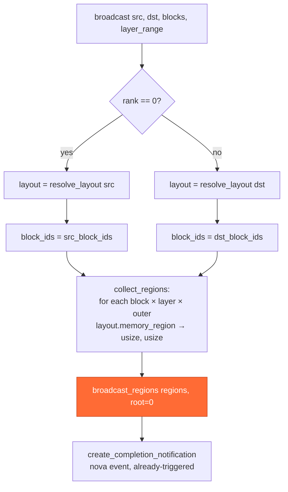

# Collectives — NCCL and oneCCL

Runtime behavior of the two `CollectiveOps` implementations in
`kvbm-engine`. This document focuses on *how broadcasts execute*: the
bootstrap protocol, the event model, and the differences between the two
backends at the call level.

For the broader architecture — which crates own which traits, how the
device backend is selected, what `kvbm-v2` as a whole looks like — see
[`kvbm_v2_xpu_sycl_enablement.md`](../../kvbm-physical/docs/kvbm_v2_xpu_sycl_enablement.md).

## The trait

```rust
pub trait CollectiveOps: Send + Sync {
    fn broadcast(
        &self,
        src: LogicalLayoutHandle,   // e.g. G1 on rank 0
        dst: LogicalLayoutHandle,   // e.g. G1 on all ranks
        src_block_ids: &[BlockId],
        dst_block_ids: &[BlockId],
        layer_range: Option<Range<usize>>,
    ) -> Result<TransferCompleteNotification>;

    fn rank(&self) -> usize;
    fn world_size(&self) -> usize;
}
```

Three concrete implementations ship in the crate:

| Impl | Module | Feature | Backend |
|---|---|---|---|
| `StubCollectiveOps` | `collectives::stub` | always available | no-op; tests and single-worker paths |
| `NcclCollectives` | `collectives::nccl` | `nccl` | CUDA via `cudarc::nccl` |
| `OneCclCollectives` | `collectives::oneccl` | `oneccl` | SYCL/XPU via `oneapi-rs::ccl` |

Both real backends take a `LayoutResolver` (for mapping logical G1/G2/G3
handles to physical layouts) and an `EventManager` from the runtime.

## Construction paths

Each real backend exposes the same two construction shapes:

| Path | NCCL | oneCCL | Used by |
|---|---|---|---|
| From-scratch bootstrap | `NcclCollectives::from_bootstrap` | `OneCclCollectives::from_bootstrap` | tests, standalone Rust apps |
| Borrowed communicator | `NcclCollectives::from_borrowed` | `OneCclCollectives::from_borrowed` | production via PyTorch / vLLM / torchrun |

The "borrowed" paths exist because inference runtimes already own a
communicator — `torch.distributed` creates one for `nccl` and for
`ccl`. KVBM borrows it rather than creating a second one, which would
fight for the same NIC / XeLink ports.

## oneCCL bootstrap — step by step



Key invariants:

- `SERIALIZED_SIZE = 8 + CCL_RS_KVS_ADDRESS_SIZE` (264 bytes). Transport
  is opaque — KVBM does not prescribe OOB (env var, TCP, filesystem
  token, whatever the launcher offers).
- `ccl_rs_init` is idempotent but must be called before
  `ccl_rs_kvs_create_*`. Both `generate` and `deserialize` call it.
- `init_communicator` is **collective**: all ranks must call it
  concurrently or `ccl_rs_comm_create` hangs.

NCCL follows the same shape with `ncclUniqueId` in place of the KVS
address.

## Broadcast flow



### `broadcast_regions` — the two backends differ here

**NCCL** calls one `ncclBroadcast` per region and relies on the NCCL
group API to coalesce them, then records a single CUDA event via the
registered `CudaEventRegistrar` so the returned
`TransferCompleteNotification` can be awaited asynchronously.

**oneCCL**:

```rust
ccl_rs_group_start();                           // begin batch
for (ptr, size) in regions {
    ccl_rs_broadcast(ptr, size, UINT8, root, comm, stream, &mut event);
    // keep only the last event
}
ccl_rs_group_end();                             // submit batch
ccl_rs_event_wait(last_event);                  // host-side wait
ccl_rs_event_destroy(last_event);
```

All broadcasts submit as a single group, but the host still waits on
the last event before returning. The returned notification is
constructed with `event_system.new_event() → trigger() → awaiter`, i.e.
already-triggered, so callers see immediate completion. This is
semantically equivalent to the NCCL path *for correctness*, but loses
the overlap opportunity that `CudaEventRegistrar` gives to NCCL.

A TODO in `oneccl.rs` near `create_completion_notification` tracks
replacing the synchronous wait with an equivalent
`OneCclEventRegistrar` to match NCCL's overlap profile.

## MLA pattern — where this gets used

In Multi-head Latent Attention replicas, only rank 0 loads G2/G3:

```
Rank 0:   G3 disk ←→ G2 host ←→ G1 GPU ─── broadcast ───→ Other ranks G1
Rank 1-N:                       G1 GPU ←──────────────────────────┘
```

`ReplicatedDataWorker` in `kvbm-engine` owns a `CollectiveOps` trait
object and calls `broadcast(G1, G1, src_blocks, dst_blocks, None)`
after rank 0 finishes its local onboard. Each rank synchronizes on the
returned `TransferCompleteNotification` before using the blocks.

## Error and cleanup semantics

| Event | NCCL | oneCCL |
|---|---|---|
| Per-rank init failure before broadcast | `ncclResult_t` returned from `ncclCommInitRankConfig` | `ccl_rs_result_t` returned from `ccl_rs_comm_create` |
| Mid-broadcast failure | group aborts; communicator is unusable | broadcast returns error; `ccl_rs_group_end` still called so the submission queue is drained |
| Communicator destruction (owned) | `ncclCommDestroy` on `Drop` | `ccl_rs_comm_destroy` on `Drop` |
| Communicator destruction (borrowed) | host runtime (PyTorch) owns it | host runtime owns it |
| Stream destruction (owned) | same ownership rule | `ccl_rs_stream_destroy` on `Drop` only for `CclStream::Owned` |

The `CommOwnership` enum in `oneccl.rs` distinguishes `Owned` vs.
`Borrowed` so `Drop` does not call destroy on a handle the runtime
still owns.

## Feature flags

```toml
# lib/kvbm-engine/Cargo.toml
nccl       = ["dep:cudarc"]
oneccl     = ["dep:oneapi-rs"]
collectives = ["nccl"]          # historical alias; see gotcha below
```

**Current gotcha**: `collectives = ["nccl"]` still gates
`worker/physical::replicated` at the source level, which means a
`--features oneccl` (no `nccl`) build does **not** include
`ReplicatedDataWorker`. Fix: change the module gate in
`worker/physical.rs` to `#[cfg(any(feature = "nccl", feature =
"oneccl"))]` and drop the `collectives = ["nccl"]` indirection, or add
`collectives` to the `oneccl` feature list. Tracked separately.

## Test layout

| Test | Scope | Gated on |
|---|---|---|
| `collectives::stub::tests` | sanity on the no-op impl | always |
| `collectives::nccl::tests` | NCCL path, 2-GPU broadcast roundtrip | `feature = "testing-nccl"` |
| `collectives::oneccl::tests::oneccl_worker` | spawns one process per rank via the test binary itself (`std::process::Command` + env vars), verifies 1 MB / multi-region / 64 MB broadcasts | `feature = "testing-oneccl"` |

The oneCCL tests use multi-process rendezvous because `ccl_rs_comm_create`
requires distinct OS processes to exercise realistic behavior; in-process
"ranks" share a single oneCCL runtime and would not catch KVS-address
mismatch bugs.
