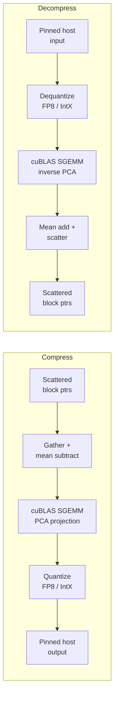
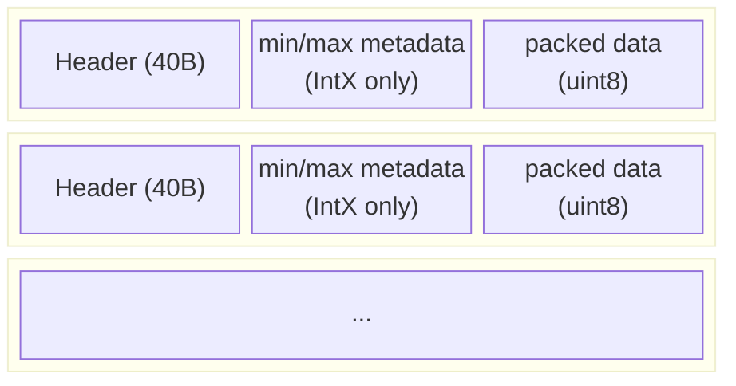
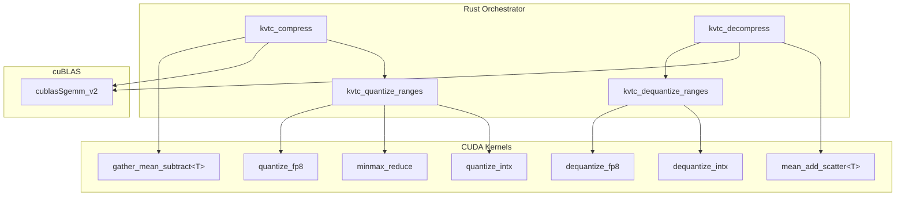

# KVTC Design Document

KVTC (KV Cache Transform Coding) compresses KV cache blocks for storage and network transfer. It implements the GPU-accelerated pipeline described in [arXiv:2511.01815](https://arxiv.org/abs/2511.01815), achieving ~15x compression with minimal accuracy loss.

## Pipeline Overview



### Compression stages

1. **Gather + mean-subtract** — Read from scattered KV cache block pointers, cast to float32, subtract the pre-calibrated mean vector. Produces a contiguous `[batch, features]` workspace.
2. **PCA projection** — cuBLAS SGEMM multiplies the centered data by a pre-calibrated projection matrix, reducing `features` dimensions to `pca_components`. This decorrelates the data and concentrates energy in fewer components.
3. **Mixed-precision quantization** — Each range of PCA components is quantized independently. High-variance components use FP8 (1 byte/value); low-variance components use 2-bit or 4-bit IntX (sub-byte packing). The quantized bytes write directly to pinned host memory.

### Decompression stages

1. **Dequantize** — Read packed bytes from host, reconstruct float32 PCA components.
2. **Inverse PCA** — cuBLAS SGEMM with the transposed projection matrix.
3. **Mean-add + scatter** — Add mean, cast to target dtype, scatter-write to block pointers.

## Configuration

### KvtcConfig

The caller provides a `KvtcConfig` struct containing calibration data and quantization ranges:

```rust
use kvbm_kernels::kvtc_kernels::*;

let config = KvtcConfig::new(
    mean_device_ptr,        // [features] f32 — pre-calibrated mean
    projection_device_ptr,  // [features, pca_components] f32, row-major
    features,               // input dimension (e.g., num_kv_heads * head_dim * tokens_per_block)
    pca_components,         // output dimension after PCA (< features)
    vec![
        // High-variance components: FP8 (1 byte each)
        KvtcTypeRange {
            start_idx: 0,
            end_idx: 2048,
            quant_type: KvtcQuantType::Fp8,
            int_bits: 0,
        },
        // Medium-variance components: 4-bit integer
        KvtcTypeRange {
            start_idx: 2048,
            end_idx: 6144,
            quant_type: KvtcQuantType::IntX,
            int_bits: 4,
        },
        // Low-variance components: 2-bit integer
        KvtcTypeRange {
            start_idx: 6144,
            end_idx: 10240,
            quant_type: KvtcQuantType::IntX,
            int_bits: 2,
        },
    ],
);
```

### Calibration

The `mean` and `projection` matrices are **pre-calibrated** on a representative dataset. This is a one-time offline step per model. The calibration process (PCA on KV cache activations, dynamic programming for optimal bit allocation) is outside the scope of the runtime kernels. The caller loads calibration data and provides device pointers.

### Quantization types

| Type | Bits/value | Bytes/value | Description |
|------|-----------|-------------|-------------|
| `Fp8` | 8 | 1.0 | FP8 E4M3FN — direct float cast, no scaling. Native intrinsics on SM89+. |
| `IntX(8)` | 8 | 1.0 | Min/max affine scaling, 255 quantization levels per row. |
| `IntX(4)` | 4 | 0.5 | Min/max affine scaling, 15 levels. Bit-packed 2 values per byte. |
| `IntX(2)` | 2 | 0.25 | Min/max affine scaling, 3 levels. Bit-packed 4 values per byte. |

IntX quantization computes per-row (per-block) min/max values and stores them as metadata alongside the packed data. Bit-packing is LSB-first within each byte.

## Usage

### Compress

```rust
// 1. Compute buffer sizes
let compressed_size = config.compressed_size(num_blocks);
let workspace_size = config.workspace_size(num_blocks);

// 2. Allocate buffers
let output = pinned_host_alloc(compressed_size);   // pinned host (or device)
let workspace = device_alloc(workspace_size);       // GPU workspace
let minmax = device_alloc(num_blocks * 2 * 4);     // min/max scratch (f32 pairs)

// 3. Create cuBLAS handle (reuse across calls)
let cublas = unsafe { kvtc_create_cublas_handle()? };

// 4. Compress
let bytes_written = unsafe {
    kvtc_compress(
        block_ptrs,          // [num_blocks] device ptrs to scattered KV blocks
        &config,
        output,              // compressed bytes written here
        workspace,
        minmax,
        num_blocks,
        block_stride,        // elements per block (= features for contiguous blocks)
        TensorDataType::BF16, // input dtype
        cublas,
        stream,
    )?
};
```

### Decompress

```rust
unsafe {
    kvtc_decompress(
        compressed_input,    // self-describing compressed buffer
        &config,
        output_block_ptrs,   // [num_blocks] device ptrs for reconstructed blocks
        workspace,
        minmax,
        num_blocks,
        block_stride,
        TensorDataType::BF16, // output dtype
        cublas,
        stream,
    )?;
};
```

## Compressed Buffer Format

The output is self-describing — it can be stored or transmitted and decompressed without out-of-band metadata.



Each range header (`KvtcRangeHeader`, 40 bytes) contains:

| Field | Type | Description |
|-------|------|-------------|
| `quant_type` | i32 | 0 = FP8, 1 = IntX |
| `int_bits` | i32 | Bits per value (1/2/4/8 for IntX) |
| `start_idx` | u64 | First PCA component index |
| `end_idx` | u64 | End PCA component index (exclusive) |
| `packed_data_bytes` | u64 | Size of packed data following metadata |
| `metadata_bytes` | u64 | Size of min/max metadata (0 for FP8) |

## Architecture

### CUDA kernels (`cuda/kvtc_kernels.cu`)

Seven thin kernels, each doing one operation. All orchestration is in Rust.



### SM89+ FP8 optimization

On Ada Lovelace and Hopper GPUs (SM89+), FP8 quantize/dequantize uses native `cuda_fp8.h` intrinsics (`__nv_cvt_float_to_fp8`, `__nv_cvt_fp8_to_halfraw`). Older architectures fall back to software bit manipulation. Both paths produce identical results.

### Direct-to-host writes

Quantization kernels write directly to pinned host memory via CUDA unified addressing. This fuses compression with the D2H transfer — no separate `cudaMemcpy` needed. The output buffer can be either pinned host or device memory; the kernels don't distinguish.

### cuBLAS integration

PCA projection uses `cublasSgemm_v2` via direct FFI (not cudarc's dlopen loader, which has compatibility issues with CUDA 13.x). The caller provides a cuBLAS handle; the library does not own CUDA state.

Row-major matrices are reinterpreted as column-major for cuBLAS without explicit transposes:
- **Compress**: `C[pca,batch] = A[pca,feat] * B[feat,batch]` (both OP_N)
- **Decompress**: `C[feat,batch] = A^T[feat,pca] * B[pca,batch]` (A is OP_T)

## Future: Entropy Coding (nvcomp)

An optional DEFLATE pass using [nvcomp](https://developer.nvidia.com/nvcomp) could add ~1.3x additional lossless compression on top of quantization (~15x to ~20x total). This is a clean layer on top of the current API — the quantized uint8 output is the natural boundary.

**Requirements**: `libnvcomp5-dev-cuda-13` (apt), new `entropy_coding` feature flag, ~10 extern "C" FFI bindings for the batched DEFLATE API.

**Expected gains by range type**:
- FP8 ranges: 10-30% (near-uniform distribution)
- IntX 2/4-bit ranges: 20-50% (peaked distribution after PCA decorrelation)
- Net: ~30% additional compression

This is most valuable for **network transfer** (KV cache disaggregation over RDMA) where bandwidth is the bottleneck.
