# Device Abstraction Architecture

Multi-backend device abstraction layer in `kvbm-physical`.

**Key changes from the original design:**

1. **Pattern-based copy API** — replaces directional `copy_h2d` / `copy_d2h` / `copy_d2d`
   with `batch_copy` (N×DMA) + `vectorized_copy` (GPU kernel) + `memcpy_htod` (pointer-array upload).
2. **Stream-ordered memory pool** — `DeviceMemPoolOps` with async alloc/free.
   XPU uses real `ZeMemPoolWrapper` (Level-Zero USM pools), not a sync stub.
3. **Engine selection** — `EngineHint` enum lets callers pick `Copy` (BCS/DMA)
   vs `Compute` (CCS/kernel) engine class per stream.

> **Legend**
> - 🟧 Orange — **New copy API** (`DeviceStreamOps`: `batch_copy` + `vectorized_copy` + `memcpy_htod`)
> - 🟦 Blue — **New pool API** (`DeviceMemPoolOps`: `alloc_async` / `free_async`)
> - 🟩 Green — **New engine hint** (`EngineHint`: `Copy` / `Compute`)
> - Grey — Existing / unchanged infrastructure

```mermaid
classDiagram
    direction TB

    class EngineHint {
        <<enum NEW>>
        Copy
        Compute
    }

    class DeviceBackend {
        <<enum>>
        Cuda
        Ze
        +is_available() bool
    }

    class DeviceContext {
        -backend: DeviceBackend
        -device_id: u32
        -ops: Box~dyn DeviceContextOps~
        +new(backend, device_id) Result~Self~
        +create_stream(hint: EngineHint) Result~DeviceStream~
        +allocate_device(size) Result~u64~
        +free_device(ptr) Result
        +allocate_pinned(size) Result~u64~
        +free_pinned(ptr) Result
        +create_memory_pool(reserve, threshold) Result~DeviceMemPool~
    }

    class DeviceStream {
        -backend: DeviceBackend
        +ops: Box~dyn DeviceStreamOps~
        +batch_copy(src, dst, size) Result
        +memcpy_htod(dst_device, src_host) Result
        +vectorized_copy(src_dev, dst_dev, chunk, count) Result
        +record_event() Result~DeviceEvent~
        +synchronize() Result
    }

    class DeviceEvent {
        -backend: DeviceBackend
        +ops: Box~dyn DeviceEventOps~
        +is_complete() Result~bool~
        +synchronize() Result
    }

    class DeviceMemPool {
        -backend: DeviceBackend
        -ops: Box~dyn DeviceMemPoolOps~
        +alloc_async(size, stream) Result~u64~
        +free_async(ptr, stream) Result
    }

    class DeviceContextOps {
        <<trait>>
        +device_id() u32
        +create_stream(hint: EngineHint) Result~Box dyn DeviceStreamOps~
        +allocate_device(size) Result~u64~
        +free_device(ptr) Result
        +allocate_pinned(size) Result~u64~
        +free_pinned(ptr) Result
        +bind_to_thread() Result*
        +disable_event_tracking() Result*
        +create_memory_pool(reserve, threshold) Result~Box dyn DeviceMemPoolOps~
        +raw_handle() Option~u64~*
    }

    class DeviceStreamOps {
        <<trait NEW copy API>>
        +batch_copy(src, dst, size) Result
        +memcpy_htod(dst_device, src_host) Result
        +vectorized_copy(src_dev, dst_dev, chunk, count) Result
        +record_event() Result~Box dyn DeviceEventOps~
        +synchronize() Result
        +raw_handle() Option~u64~*
    }

    class DeviceEventOps {
        <<trait>>
        +is_complete() Result~bool~
        +synchronize() Result
        +raw_handle() Option~u64~*
    }

    class DeviceMemPoolOps {
        <<trait NEW pool API>>
        +alloc_async(size, stream) Result~u64~
        +free_async(ptr, stream) Result
    }

    class CudaContext {
        <<cuda backend>>
        +create_stream(_hint) CudaStreamWrapper
        +allocate_device()
        +create_memory_pool() CudaMemPoolWrapper
    }

    class CudaStreamWrapper {
        <<cuda backend>>
        +batch_copy()
        +memcpy_htod()
        +vectorized_copy()
        +record_event() CudaEventWrapper
    }

    class CudaEventWrapper {
        <<cuda backend>>
        +is_complete()
        +synchronize()
    }

    class CudaMemPoolWrapper {
        <<cuda backend>>
        -pool: CudaMemPool
        +alloc_async()
        +free_async()
    }

    class ZeContext {
        <<xpu backend>>
        -cache: DeviceContextCache
        +create_stream(hint) ZeStreamWrapper
        +allocate_device()
        +create_memory_pool() ZeMemPoolWrapper
    }

    class ZeStreamWrapper {
        <<xpu backend>>
        +batch_copy()
        +memcpy_htod()
        +vectorized_copy()
        +record_event() ZeEventWrapper
    }

    class ZeEventWrapper {
        <<xpu backend>>
        +is_complete()
        +synchronize()
    }

    class ZeMemPoolWrapper {
        <<xpu backend>>
        -pool: ZeMemPool
        -pending_frees: Vec~PendingFree~
        +alloc_async()
        +free_async()
    }

    DeviceContext --> DeviceBackend : has
    DeviceContext *-- DeviceContextOps : ops
    DeviceContext ..> DeviceStream : creates
    DeviceContext ..> DeviceMemPool : creates
    DeviceContext ..> EngineHint : uses

    DeviceStream --> DeviceBackend : has
    DeviceStream *-- DeviceStreamOps : ops
    DeviceStream ..> DeviceEvent : creates

    DeviceEvent --> DeviceBackend : has
    DeviceEvent *-- DeviceEventOps : ops

    DeviceMemPool --> DeviceBackend : has
    DeviceMemPool *-- DeviceMemPoolOps : ops

    DeviceContextOps ..> DeviceStreamOps : creates
    DeviceContextOps ..> DeviceMemPoolOps : creates
    DeviceContextOps ..> EngineHint : accepts
    DeviceStreamOps ..> DeviceEventOps : creates

    CudaContext ..|> DeviceContextOps : implements
    CudaStreamWrapper ..|> DeviceStreamOps : implements
    CudaEventWrapper ..|> DeviceEventOps : implements
    CudaMemPoolWrapper ..|> DeviceMemPoolOps : implements

    ZeContext ..|> DeviceContextOps : implements
    ZeStreamWrapper ..|> DeviceStreamOps : implements
    ZeEventWrapper ..|> DeviceEventOps : implements
    ZeMemPoolWrapper ..|> DeviceMemPoolOps : implements

    style EngineHint fill:#4caf50,stroke:#2e7d32,color:#fff,stroke-width:3px

    style DeviceStreamOps fill:#ff6b35,stroke:#c44520,color:#fff,stroke-width:3px
    style DeviceStream fill:#ff8c5a,stroke:#c44520,color:#fff,stroke-width:2px
    style CudaStreamWrapper fill:#ffb088,stroke:#c44520,stroke-width:2px
    style ZeStreamWrapper fill:#ffb088,stroke:#c44520,stroke-width:2px

    style DeviceMemPoolOps fill:#2196f3,stroke:#1565c0,color:#fff,stroke-width:3px
    style DeviceMemPool fill:#64b5f6,stroke:#1565c0,color:#fff,stroke-width:2px
    style CudaMemPoolWrapper fill:#90caf9,stroke:#1565c0,stroke-width:2px
    style ZeMemPoolWrapper fill:#90caf9,stroke:#1565c0,stroke-width:2px
```

## Key Design Decisions

- **Pattern-based, not direction-based**: `batch_copy` and `vectorized_copy`
  auto-detect transfer direction from pointer addresses
  (`cudaMemcpyDefault` / `zeCommandListAppendMemoryCopy`).

- **`vectorized_copy` takes device pointers**: The caller uploads
  pointer arrays to device memory via `memcpy_htod`, then passes the device
  pointers + `count` to `vectorized_copy`. This avoids per-call host→device
  copies inside the kernel launch path.

- **`EngineHint` for engine selection**: `create_stream(EngineHint::Copy)`
  binds to the DMA/BCS engine; `create_stream(EngineHint::Compute)` binds to
  the compute/CCS engine. CUDA ignores the hint (unified queue). XPU uses it
  to pick the correct queue-group ordinal.

- **Feature-gated dispatch**: `DeviceContext::new()` selects the concrete
  backend at runtime via `#[cfg(feature = "cuda")]` / `#[cfg(feature = "xpu")]`.

- **`ZeMemPoolWrapper`** (real pool): Wraps `dynamo_memory::ZeMemPool` with
  a `PendingFree` deferred-free mechanism. Replaces the original `ZeMemPoolStub`.

- **`CudaMemPoolWrapper`**: Wraps `dynamo_memory::CudaMemPool` using
  `cuMemAllocFromPoolAsync` / `cuMemFreeAsync` via raw stream handles.
