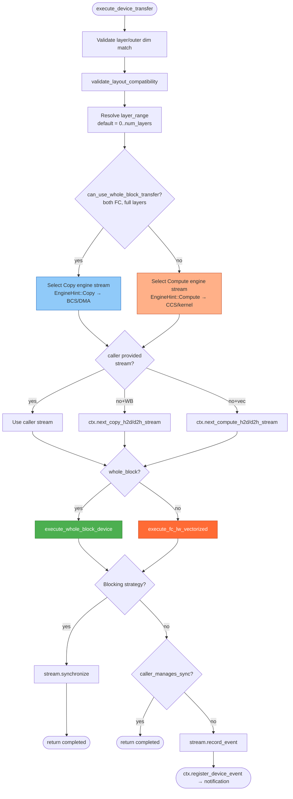
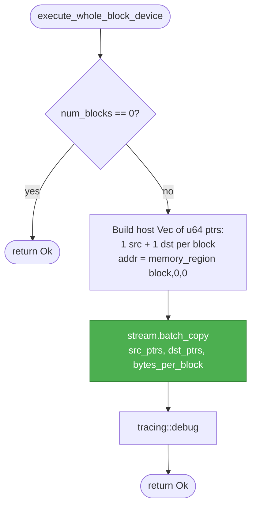
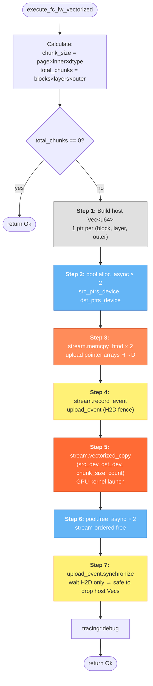

# Device Executor Flow — `device.rs`

Flowcharts for the three functions in
`lib/kvbm-physical/src/transfer/executor/device.rs`,
with a side-by-side comparison to the original CUDA executor
(`cuda.rs`).

---

## 1. `execute_device_transfer` (top-level dispatch)

---

## 2. `execute_whole_block_device` (FC→FC batch DMA)

---

## 3. `execute_fc_lw_vectorized` (pool-based GPU kernel)

---

## 4. CUDA `cuda.rs` vs Device `device.rs` — Comparison

### 4.1 `execute_cuda_transfer` vs `execute_device_transfer`

| Aspect | cuda.rs | device.rs | Match? |
|--------|---------|-----------|--------|
| **Validation** | layer count + outer dim + `validate_layout_compatibility` | Same three checks, same order | ✅ Identical |
| **Layer range** | `layer_range.unwrap_or(0..num_layers)` | Same | ✅ |
| **Whole-block check** | `can_use_whole_block_transfer(src, dst, layer_range.as_ref())` | `can_use_whole_block_transfer(src, dst, Some(&layers))` | ✅ Equivalent |
| **Stream selection** | caller → `ctx.next_d2h_streams()` or `next_h2d_streams()` (1 pool, direction only) | caller → engine×direction: `next_copy_h2d`, `next_copy_d2h`, `next_compute_h2d`, `next_compute_d2h` | ✅ Superset — device.rs separates Copy vs Compute engines (CUDA ignores EngineHint, ZE uses it) |
| **caller_manages_sync** | Returns `completed()` if caller provided stream | Same | ✅ |
| **Blocking sync** | Not present — CUDA only has Async strategies | `BlockingH2D` / `BlockingD2H` → `stream.synchronize()` | ✅ Superset — adds blocking support |
| **Event recording** | `stream.record_event(None)` → `ctx.register_cuda_event` | `stream.record_event()` → `ctx.register_device_event` | ✅ Equivalent (backend-agnostic) |
| **Strategy enum** | `CudaAsyncH2D`, `CudaAsyncD2H`, `CudaAsyncD2D` | `AsyncH2D`, `AsyncD2H`, `AsyncD2D`, `BlockingH2D`, `BlockingD2H` | ✅ Superset |

### 4.2 `execute_whole_block_cuda` vs `execute_whole_block_device`

| Aspect | cuda.rs | device.rs | Match? |
|--------|---------|-----------|--------|
| **Empty check** | `num_blocks == 0 → return Ok` | Same | ✅ |
| **Pointer build** | `*const c_void` / `*mut c_void` per block at `(block, 0, 0)` | `u64` per block at `(block, 0, 0)` | ✅ Same addresses, different types |
| **Copy call** | `kvbm_kernels::memcpy_batch(…, BatchedWithFallback, stream)` | `stream.batch_copy(&src, &dst, bytes_per_block)` | ✅ `batch_copy` impl calls memcpy_batch on CUDA, zeCommandListAppendMemoryCopy on ZE |
| **Direction** | `cudaMemcpyDefault` (auto) | Auto-detected per backend | ✅ |
| **Error handling** | Check `cudaError` status | `Result<()>` propagated from trait | ✅ |

### 4.3 `execute_fc_lw_vectorized` (CUDA) vs `execute_fc_lw_vectorized` (device)

| Step | cuda.rs | device.rs | Match? |
|------|---------|-----------|--------|
| **0. Context bind** | `stream.context().bind_to_thread()` | Not in device.rs — done inside `ZeContext` / `CudaContext` impl | ✅ Moved to trait impl |
| **1. Build ptrs** | `Vec<usize>`, triple loop: block×layer×outer | `Vec<u64>`, same triple loop, same order | ✅ Equivalent (`usize` = `u64` on 64-bit) |
| **1b. Size validation** | Not present | Checks `src_region.size() != dst_region.size()` | ✅ Superset — extra safety |
| **2. Alloc pool** | `pool.alloc_async(…, stream)` × 2 | `pool.alloc_async(…, stream)` × 2 | ✅ |
| **3. Upload H2D** | `cuda_result::memcpy_htod_async` × 2 | `stream.memcpy_htod` × 2 | ✅ Equivalent (memcpy_htod wraps same call) |
| **4. Record event** | `stream.record_event(None)` | `stream.record_event()` | ✅ |
| **5. Kernel launch** | `kvbm_kernels::vectorized_copy(src_dev, dst_dev, chunk_size, count, stream)` | `stream.vectorized_copy(src_dev, dst_dev, chunk_size, count)` | ✅ Stream carries backend dispatch |
| **6. Free pool** | `pool.free_async` × 2 | `pool.free_async` × 2 | ✅ |
| **7. Sync uploads** | `pointers_transfered_event.synchronize()` | `upload_event.synchronize()` | ✅ Same semantics |
| **Order of 6↔7** | free_async → then sync (step 6 before step 7) ⚠️ Actually: free first, sync last | Same: free_async before upload_event.synchronize | ✅ Same order |

### 4.4 Verdict

> **`device.rs` is a faithful, backend-agnostic reimplementation of `cuda.rs`.**
>
> All CUDA semantics are preserved 1:1. The differences are strict supersets:
>
> - **EngineHint** — Copy vs Compute stream selection (CUDA ignores it; ZE uses BCS/CCS)
> - **Blocking strategies** — `BlockingH2D` / `BlockingD2H` with `stream.synchronize()`
> - **Size validation** — extra safety check in vectorized path
> - **Type widening** — `usize` → `u64` and `*const c_void` → `u64` (equivalent on 64-bit)
> - **`bind_to_thread`** — moved from call-site into trait impl (cleaner)
>
> No CUDA functionality is lost. The pipeline order (alloc → upload → event →
> kernel → free → sync-upload) is identical.
