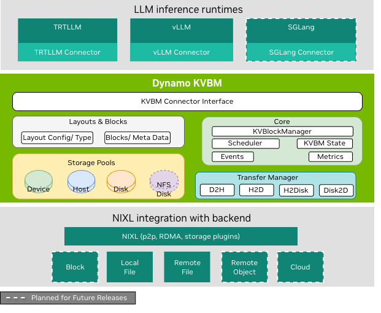

<!--
SPDX-FileCopyrightText: Copyright (c) 2024-2025 NVIDIA CORPORATION & AFFILIATES. All rights reserved.
SPDX-License-Identifier: Apache-2.0

Licensed under the Apache License, Version 2.0 (the "License");
you may not use this file except in compliance with the License.
You may obtain a copy of the License at

https://www.apache.org/licenses/LICENSE-2.0

Unless required by applicable law or agreed to in writing, software
distributed under the License is distributed on an "AS IS" BASIS,
WITHOUT WARRANTIES OR CONDITIONS OF ANY KIND, either express or implied.
See the License for the specific language governing permissions and
limitations under the License.
-->

# Dynamo KVBM

The Dynamo KVBM is a distributed KV-cache block management system designed for scalable LLM inference. It cleanly separates memory management from inference runtimes (vLLM, TensorRT-LLM, and SGLang), enabling GPU↔CPU↔Disk/Remote tiering, asynchronous block offload/onboard, and efficient block reuse.




## Feature Highlights

- **Distributed KV-Cache Management:** Unified GPU↔CPU↔Disk↔Remote tiering for scalable LLM inference.
- **Async Offload & Reuse:** Seamlessly move KV blocks between memory tiers using GDS-accelerated transfers powered by NIXL, without recomputation.
- **Runtime-Agnostic:** Works out-of-the-box with vLLM, TensorRT-LLM, and SGLang via lightweight connectors.
- **Memory-Safe & Modular:** RAII lifecycle and pluggable design for reliability, portability, and backend extensibility.

## Build and Installation

Build the KVBM pip wheel by running the `./container/build_kvbm_wheel.sh` script.
The pip wheel is built through a Docker build process.

```bash
# run this command in the top level dynamo repo
./container/build_kvbm_wheel.sh -o /tmp/kvbm_wheel
```

The resulting KVBM pip wheel will be located in the `/tmp/kvbm_wheel` directory.
You can either copy the wheel file into a Docker container or mount the directory when launching the container.

To install the pip wheel, run:
```bash
pip install /tmp/kvbm_wheel/kvbm*.whl
```

## Integrations

### Environment Variables

| Variable | Description | Default |
|-----------|--------------|----------|
| `DYN_KVBM_CPU_CACHE_GB` | CPU pinned memory cache size (GB) | required |
| `DYN_KVBM_DISK_CACHE_GB` | SSD Disk/Storage system cache size (GB) | optional |
| `DYN_KVBM_METRICS` | Enable metrics endpoint | `false` |
| `DYN_KVBM_METRICS_PORT` | Metrics port | `6880` |
| `DYN_KVBM_DISABLE_DISK_OFFLOAD_FILTER` | Disable disk offload filtering to protect SSD life span | `false` |

### vLLM

```bash
DYN_KVBM_CPU_CACHE_GB=100 vllm serve \
  --kv-transfer-config '{"kv_connector":"DynamoConnector","kv_role":"kv_both","kv_connector_module_path":"kvbm.vllm_integration.connector"}' \
  Qwen/Qwen3-8B
```

For more detailed integration with dynamo, disaggregated serving support and benchmarking, please check [vllm-setup](../../docs/kvbm/vllm-setup.md)

### TensorRT-LLM

```bash
cat >/tmp/kvbm_llm_api_config.yaml <<EOF
cuda_graph_config: null
kv_cache_config:
  enable_partial_reuse: false
  free_gpu_memory_fraction: 0.80
kv_connector_config:
  connector_module: kvbm.trtllm_integration.connector
  connector_scheduler_class: DynamoKVBMConnectorLeader
  connector_worker_class: DynamoKVBMConnectorWorker
EOF

DYN_KVBM_CPU_CACHE_GB=100 trtllm-serve Qwen/Qwen3-8B \
  --host localhost --port 8000 \
  --backend pytorch \
  --extra_llm_api_options /tmp/kvbm_llm_api_config.yaml
```

For more detailed integration with dynamo and benchmarking, please check [trtllm-setup](../../docs/kvbm/trtllm-setup.md)


## 📚 Docs

- [Architecture](../../docs/kvbm/kvbm_architecture.md)
- [Motivation](../../docs/kvbm/kvbm_motivation.md)
- [Design Deepdive](../../docs/kvbm/kvbm_design_deepdive.md)
- [NIXL Overview](https://github.com/ai-dynamo/nixl/blob/main/docs/nixl.md)
