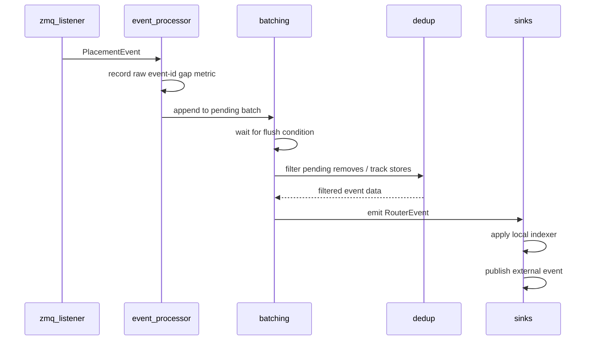

# KV Publisher Event Pipeline

This module turns engine KV-cache events into Dynamo router events. The ZMQ
source is the common production path for vLLM, while the event processor keeps
the downstream publish path shared across Event Plane and JetStream.

## Files

- `zmq_listener.rs`: receives engine ZMQ batches and converts wire events into
  placement-aware events.
- `event_processor.rs`: owns the async receive loop and preserves event ordering.
- `batching.rs`: coalesces adjacent store/remove events before publish.
- `dedup.rs`: gates duplicate removes with per-rank, per-tier refcounts.
- `sinks.rs`: applies events to the local worker indexer and publishes them
  externally.
- `worker_metrics.rs`: emits worker-local runtime metrics.

## Stage Notes

`zmq_listener.rs` skips ignored raw events before assigning the publisher-local
event id. This preserves the current contract that filtered ZMQ events do not
advance the core-router event id.

`event_processor.rs` checks for gaps in the raw input event id stream before
batching. That metric is about events dropped before this processor receives
them; batching and dedup do not affect it.

`batching.rs` merges compatible adjacent removes or stores. It flushes when the
event kind changes, the DP rank changes, the storage tier changes, the store
parent chain breaks, the timeout expires, or the pending block cap is exceeded.

`dedup.rs` is applied during flush. Stores update refcounts and still pass
through. Removes only pass through when the refcount for a block reaches zero;
unknown removes pass through defensively.

`sinks.rs` applies the emitted router event to the optional local indexer before
publishing it externally. Both side effects receive the same `RouterEvent`.

## Direct Valkey Integrity Fence

Direct worker-to-Valkey mode uses a bounded 4,096-event ingress. Queue
overflow, raw event-id discontinuity, ZMQ batch-sequence discontinuity/source
failure, replica-WAIT timeout, and permanent `APPLY_OWNED` rejection all enter
one worker-wide integrity fence shared by every DP rank and the lease
heartbeat. New input is rejected, queued input is discarded, heartbeat renewal
stops, and one owner-fenced `UNREGISTER_WORKER` is attempted. The publisher
never automatically resumes: an ambiguous unregister response cannot safely be
followed by registration without an atomic module clear-and-reregister
primitive. A confirmed unregister removes metadata and admission immediately;
otherwise worker-lease expiry is the fail-closed backstop. Process restart
acquires a fresh owner lease.

Each registered worker also runs lifecycle GC independently of the lease
heartbeat. The default cadence is 60 seconds with a 256-record inspection
budget; the first tick is deterministically phased by owner nonce over one
additional interval. `DYN_ROUTER_VALKEY_GC_INTERVAL_MS=0` disables it, while
`DYN_ROUTER_VALKEY_GC_INSPECTION_BUDGET` tunes the bounded module scan. GC only
runs while integrity is healthy and the worker mutation gate is idle. Failure
is logged and counted but never fences serving or delays the next heartbeat.

## Ordering

