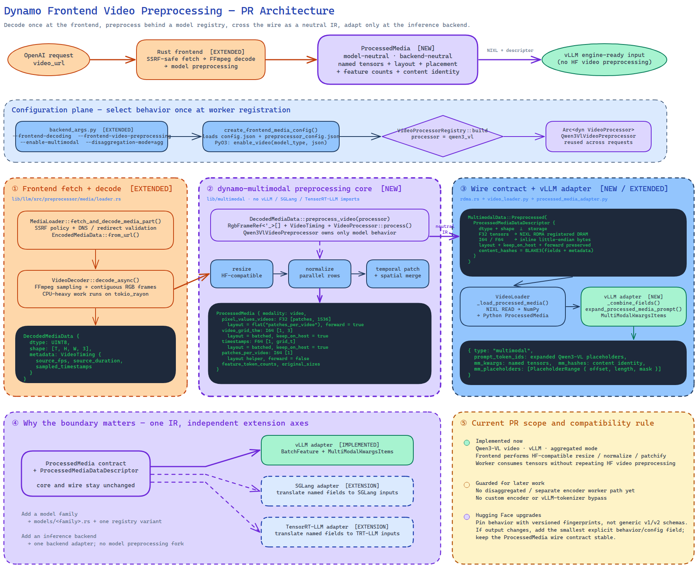

<!--
SPDX-FileCopyrightText: Copyright (c) 2026 NVIDIA CORPORATION & AFFILIATES. All rights reserved.
SPDX-License-Identifier: Apache-2.0
-->

# Dynamo multimodal preprocessing

This crate owns CPU preprocessing from decoded modality data to a
backend-neutral `ProcessedMedia` contract. It does not fetch or decode media,
move tensors between processes, or translate tensors into a particular engine's
request type.

## Architecture

The editable source is
[`frontend_video_preprocessing.excalidraw`](frontend_video_preprocessing.excalidraw).

## Boundaries

- `types`: borrowed decoded inputs and modality/layout vocabulary.
- `processed`: named, typed tensors plus batching and placement semantics.
- `vision`: reusable transforms and model-family processing primitives.
- `models`: Hugging Face configuration mapping and model-specific output names.
- `registry`: the small runtime factory for configured processor instances.

The frontend owns a configured processor instance and reuses it across
requests. vLLM, SGLang, and TensorRT-LLM adapters consume `ProcessedMedia`; they
must not be referenced by this crate. Adding a model therefore adds a model
module and one registry variant without changing transport or backend code.
The registry resolves Hugging Face `model_type` values to processor configs, so
Python and PyO3 do not add model-specific configuration methods.

The processed-media wire representation keeps tensor dtype and shape separate
from storage. Storage can therefore move between inline bytes and NIXL without
adding dtype-specific wire variants.

## Hugging Face compatibility

There is no crate-wide schema version tied to a Transformers release. The
serialized processor enum identifies behavior by processor family, while each
model config uses named fields and rejects unknown fields. A Transformers
upgrade is handled as a compatibility change:

1. Generate fixtures with the target Transformers and Pillow versions.
2. Run the existing version-pinned fingerprints to detect changed behavior.
3. If behavior is unchanged, add the new version to the tested compatibility
   range without changing the wire contract.
4. If behavior changed, add an explicit behavior/config field only where the
   outputs differ. Keep both behaviors only when deployments need both; do not
   create generic `v1`/`v2` processor names.

Qwen3-VL currently has an x86 FP32 bit-exact fixture generated with
Transformers 4.57.1 and Pillow 12.2.0. The generator is
`scripts/generate_qwen3_vl_video_fingerprint.py`.

See `BENCHMARKS.md` for the decode-free preprocessing benchmark and the latest
optimization log.
