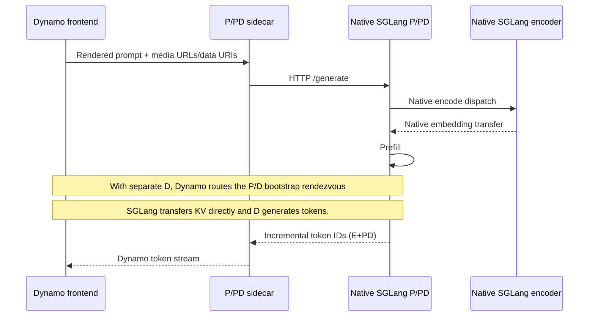

# SGLang sidecar

> [!WARNING]
> **Experimental.** These deployment examples and the sidecar image
> are experimental and not yet packaged for distribution (the launcher module
> ships inside `ai-dynamo-runtime`). The manifests, flags, and behavior may change
> without notice.

`dynamo-sglang-sidecar` connects Dynamo's unified worker lifecycle to an
out-of-process SGLang engine through SGLang's native gRPC service. It is a
standalone Rust executable and is also compiled into `ai-dynamo-runtime` for
the importable `dynamo.sglang.sidecar` launcher.

## Run

Build and run it directly from the Dynamo workspace:

```bash
cargo build --release -p dynamo-sglang-sidecar
./target/release/dynamo-sglang-sidecar \
    --grpc-endpoint http://127.0.0.1:30001
```

There is no published image yet; see
[Build the image](../README.md#build-the-image), which produces one image
containing all three sidecar executables. Official packaging is deferred to a
follow-up.

Use `DYN_SIDECAR_GRPC_ENDPOINT` instead of `--grpc-endpoint` when the endpoint is provided through the environment.

Native Dynamo `/generate` requests are forwarded opaquely to SGLang's HTTP
endpoint using the gRPC host and the HTTP port returned by `GetServerInfo`.
The sidecar advertises this capability only after the HTTP health probe passes
and discovery confirms `--incremental-streaming-output`; otherwise it continues
serving the native gRPC path without advertising `/generate`.

The sidecar discovers the model and tokenizer paths, served model name, parser defaults, worker role, context length, KV capacity, scheduler limits, data-parallel topology, and KV-event sources through SGLang's native discovery RPCs. Explicit Dynamo parser options override parser names discovered from SGLang.

SGLang remains the source of truth for the worker's aggregated, prefill, or decode role. The inherited `--disaggregation-mode` option and `DYN_DISAGGREGATION_MODE` environment variable have no effect in this sidecar. The SGLang sidecar rejects `--route-to-encoder`: native SGLang language servers own encoder dispatch through `--language-only --encoder-urls`, as described below. Disaggregated workers continue to register under their fixed role components; aggregated workers honor `--component` or `DYN_COMPONENT`.

The sidecar opens eight gRPC connections by default. Override the pool size with `--grpc-connections` or `DYN_SIDECAR_GRPC_CONNECTIONS`.

Connection startup uses a 30-second timeout per attempt, a one-second retry and readiness interval, and a 30-minute deadline for establishing the full connection pool. Override them with `--grpc-connect-attempt-timeout-secs`, `--grpc-retry-interval-secs`, and `--grpc-startup-deadline-secs`, or with the corresponding `DYN_SIDECAR_GRPC_*` environment variables.

## Native encoder disaggregation (E+PD and E+P+D)

Multimodal `/v1/chat/completions` requests use the engine's native HTTP
`/generate` endpoint, carrying the frontend-rendered prompt and image/video/audio
sources. SGLang tokenizes and expands the multimodal prompt, as in native serving.
The sidecar converts incremental output IDs, finish reasons, usage, and logprobs
back into Dynamo's token stream. Text-only requests continue to use gRPC.
Both paths use gRPC for discovery and cancellation.



Start an encoder with `--encoder-only`. Configure **P or PD** with
`--language-only --encoder-urls http://encoder:30000` and the same
`--encoder-transfer-backend` as E. With separate decode, configure D as a
normal native `--disaggregation-mode decode` server, without encoder URLs.
Only P/PD and D need Dynamo sidecars. E does not register with Dynamo, and
there is no frontend `encoder_result` handoff.

All language servers need `--grpc-port` and `--incremental-streaming-output`.
Their HTTP endpoints must be reachable from their sidecars at the discovered
host and port. Use SGLang v0.5.19+ for the launch example. Encoder dispatch,
batching, cache behavior, supported models/modalities, and embedding transport
remain governed by the installed SGLang version. The default example uses
`zmq_to_scheduler`; `ENCODER_TRANSFER_BACKEND=mooncake` requires the matching
native SGLang Mooncake environment and interconnect.

```bash
# Build the sidecar, and activate an environment containing Dynamo and SGLang.
cargo build --release -p dynamo-sglang-sidecar
export PATH="$PWD/target/release:$PATH"

# E + aggregated PD, two GPUs. etcd and NATS must already be running.
bash lib/sidecar/sglang/launch/epd.sh

# E + P + D, three GPUs. NIXL transfers the P/D KV cache.
bash lib/sidecar/sglang/launch/epd.sh --disaggregated
```

The launcher defaults to `Qwen/Qwen3-VL-2B-Instruct`. Set `MODEL` to override
it; additional command-line options apply to the language servers. Use ordinary
OpenAI image content parts against the Dynamo frontend. Multiple encoder URLs
can be configured directly on a manually launched native language server.

Use frontend URL passthrough (the default), not `--frontend-decoding`.
Pre-decoded RDMA media, UUID-only media, user-supplied multimodal UUIDs,
`mm_processor_kwargs`, `media_io_kwargs`, and frontend `encoder_result` payloads are rejected on
this typed multimodal path. Sampling retains the sidecar's existing supported
parameter set. Explicit token-input multimodal requests are forwarded as token IDs and require
a native SGLang processor/EPD receiver that supports that input form (the Qwen
EPD path in v0.5.19 requires rendered text). Native Dynamo `/generate` continues to forward SGLang payloads
opaquely for callers needing the installed engine's full request surface.

## SGLang-managed module contract

SGLang can load the Python entry point and supply the gRPC endpoint arguments:

```bash
python3 -m sglang.launch_server \
    <args> \
    --grpc-port 30001 \
    --incremental-streaming-output \
    --sidecar dynamo.sglang.sidecar
```

The entry point configures Dynamo logging when `main()` runs, then calls the
private `dynamo._core.backend._run_sglang_sidecar(argv)` binding. The binding
prepends the executable name expected by clap, releases the GIL, and runs the
same unified worker lifecycle as the standalone executable.

## Deploy on Kubernetes (quick start)

`deploy/agg.yaml` runs an aggregated deployment (a frontend plus one worker pod
that colocates the sidecar with an SGLang engine). `deploy/agg_kv_router.yaml`
runs two aggregated workers behind Dynamo's KV-aware router.
`deploy/disagg.yaml` runs disaggregated prefill/decode with NIXL KV transfer;
`deploy/disagg_kv_router.yaml` expands it to two workers per role and publishes
KV-cache events for exact routing.

There is no published sidecar image yet, so build and push the image from
`lib/sidecar/Dockerfile`. It contains all three engine-specific sidecar
executables; these manifests run `dynamo-sglang-sidecar` as the container
command.

> [!NOTE]
> The engine image must be a stock SGLang **v0.5.16+** build: the native gRPC
> server (`--grpc-port`) landed there. The KV-routing examples require
> **v0.5.18+** because the sidecar discovers their structured KV-event
> descriptor through `GetServerInfo`. They use `lmsysorg/sglang:v0.5.19`.

### Prerequisites

- A Kubernetes cluster (**v1.29+**, or v1.28 with the `SidecarContainers` feature
  gate) with the Dynamo operator and a GPU node (two GPUs for
  `agg_kv_router.yaml`; two or four GPUs plus an RDMA fabric for `disagg.yaml` or
  `disagg_kv_router.yaml`, respectively). The engine runs as a native sidecar
  (`initContainers` with `restartPolicy: Always`), which requires that version.
- `kubectl` set to that cluster, and a namespace to deploy into.
- A Hugging Face token for the model.
- A container registry you can push to and the cluster can pull from.

### 1. Build and push the sidecar image

Build and push the image to a registry your cluster can pull from:

```bash
docker buildx build --platform linux/amd64,linux/arm64 \
  -f lib/sidecar/Dockerfile \
  -t <your-registry>/dynamo-sidecar:1.3.0 --push .
```

See [Build the image](../README.md#build-the-image) for a single-architecture
build. These manifests set the container `command` to
`dynamo-sglang-sidecar`.

### 2. Point the manifest at your image

In the selected manifest under `deploy/`, set the `main` worker image to the one
you just pushed. If your registry is private, add `imagePullSecrets` to the
worker pod spec.

### 3. Create the Hugging Face token secret

```bash
kubectl create secret generic hf-token-secret \
  --from-literal=HF_TOKEN="$HF_TOKEN" -n <namespace>
```

### 4. Deploy

```bash
kubectl apply -f lib/sidecar/sglang/deploy/agg.yaml -n <namespace>
```

Wait for the worker pod to reach `2/2 Running`:

```bash
kubectl get pods -n <namespace> -w
```

### 5. Send a request

```bash
kubectl port-forward -n <namespace> svc/sglang-sidecar-agg-frontend 8000:8000 &

curl -s localhost:8000/v1/models | jq .

curl -s localhost:8000/v1/chat/completions \
  -H 'Content-Type: application/json' \
  -d '{"model":"Qwen/Qwen3-0.6B","messages":[{"role":"user","content":"Hello"}],"max_tokens":32}' | jq .
```

### KV routing

The KV-routing manifests run multiple workers and configure each SGLang engine
to publish ZMQ KV-cache events on all pod interfaces. Each sidecar connects to
the engine over its pod IP and advertises that routable address to the frontend
for exact KV-aware routing. Restrict the unauthenticated gRPC and ZMQ ports with
NetworkPolicy.

```bash
# Aggregated: two workers, two GPUs.
kubectl apply -f lib/sidecar/sglang/deploy/agg_kv_router.yaml -n <namespace>

# Disaggregated: two prefill + two decode workers, four GPUs and RDMA.
kubectl apply -f lib/sidecar/sglang/deploy/disagg_kv_router.yaml -n <namespace>
```

After deploying one of the KV-routing manifests, port-forward its frontend:

```bash
# Aggregated.
kubectl port-forward -n <namespace> svc/sglang-sidecar-agg-kv-router-frontend 8000:8000

# Disaggregated.
kubectl port-forward -n <namespace> svc/sglang-sidecar-disagg-kv-router-frontend 8000:8000
```

### Disaggregated

`deploy/disagg.yaml` runs prefill and decode as separate worker pods that hand
off KV cache over a bootstrap server + NIXL. It needs multiple GPUs and an RDMA
fabric, and both worker pods must reach `2/2 Running`.
`deploy/disagg_kv_router.yaml` uses two replicas per role and enables exact KV
routing from all four event streams.
