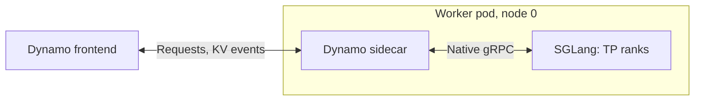
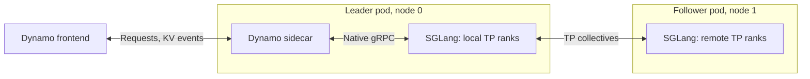
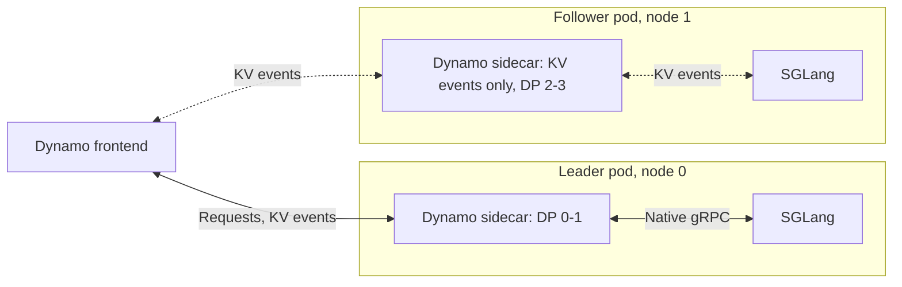

<!--
SPDX-FileCopyrightText: Copyright (c) 2026 NVIDIA CORPORATION & AFFILIATES. All rights reserved.
SPDX-License-Identifier: Apache-2.0

Note to AI agents: keep this README minimal (intro, support matrix, launch example,
Kubernetes example, topologies). Do not edit it unless the user explicitly asks
you to.
-->

# SGLang sidecar

> [!WARNING]
> **Experimental.** The sidecars and their deployment examples are
> experimental. Manifests, flags, and behavior may change without notice.

`dynamo-sglang-sidecar` connects a Dynamo worker to SGLang's native gRPC
server. See the [sidecar overview](../README.md) for installation.

## Support matrix

| Feature | Supported |
|---------|-----------|
| Aggregated | Yes |
| Disaggregated | Yes |
| KV routing | Yes |

## Run locally

See [`launch/`](launch/) for all topologies. For example, aggregated serving on
one GPU:

```bash
export DYN_DISCOVERY_BACKEND=file   # single host: no etcd or NATS needed
lib/sidecar/sglang/launch/agg.sh
```

In a second terminal:

```bash
curl -s localhost:8000/v1/chat/completions \
  -H 'Content-Type: application/json' \
  -d '{"model":"Qwen/Qwen3-0.6B","messages":[{"role":"user","content":"Hello"}],"max_tokens":32}'
```

## Deploy on Kubernetes

See [`deploy/`](deploy/) for all manifests. For example, aggregated serving:

```bash
kubectl apply -f lib/sidecar/sglang/deploy/agg.yaml -n <namespace>
kubectl port-forward -n <namespace> svc/sglang-sidecar-agg-frontend 8000:8000
```

## Topologies

Arrows carry requests and responses, and KV cache events flow back to the
frontend for routing. Dotted arrows carry KV cache events only.

### Single-node TP

One engine on one node, with one sidecar.


```mermaid
flowchart LR
  F[Dynamo frontend] <-->|Requests, KV events| S
  subgraph P[Worker pod, node 0]
    S[Dynamo sidecar] <-->|Native gRPC| E[SGLang: TP ranks]
  end
```

### Multi-node TP

One engine spans two nodes. Only the leader pod has a sidecar; the follower
pod holds the remaining TP ranks.


```mermaid
flowchart LR
  F[Dynamo frontend] <-->|Requests, KV events| S
  subgraph L[Leader pod, node 0]
    S[Dynamo sidecar] <-->|Native gRPC| E0[SGLang: local TP ranks]
  end
  subgraph W[Follower pod, node 1]
    E1[SGLang: remote TP ranks]
  end
  E0 <-->|TP collectives| E1
```

### Multi-node DP

The leader sidecar registers every DP rank and serves all requests; SGLang
dispatches each one to the right scheduler across nodes. The follower sidecar
accepts no requests and relays its node's KV events directly to the frontend.


```mermaid
flowchart LR
  F[Dynamo frontend] <-->|Requests, KV events| SL
  F <-.->|KV events| SW
  subgraph L[Leader pod, node 0]
    SL[Dynamo sidecar: DP 0-1] <-->|Native gRPC| EL[SGLang]
  end
  subgraph W[Follower pod, node 1]
    SW[Dynamo sidecar: KV events only, DP 2-3] <-.->|KV events| EW[SGLang]
  end
```
