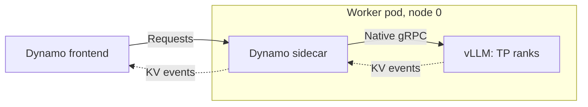
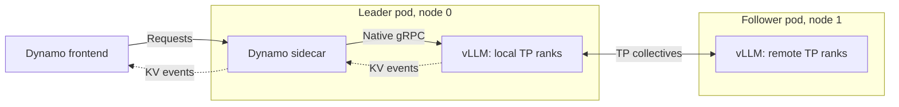
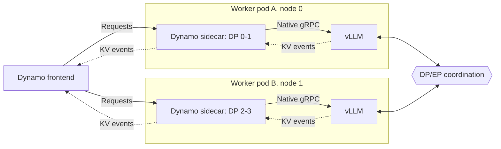

<!--
SPDX-FileCopyrightText: Copyright (c) 2025-2026 NVIDIA CORPORATION & AFFILIATES. All rights reserved.
SPDX-License-Identifier: Apache-2.0

Note to AI agents: keep this README minimal (intro, support matrix, launch example,
Kubernetes example, topologies). Do not edit it unless the user explicitly asks
you to.
-->

# vLLM sidecar

> [!WARNING]
> **Experimental.** The sidecars and their deployment examples are
> experimental. Manifests, flags, and behavior may change without notice.

`dynamo-vllm-sidecar` connects a Dynamo worker to vLLM's native gRPC server
(`vllm-rs`). See the [sidecar overview](../README.md) for installation.

## Support matrix

| Feature | Supported |
|---------|-----------|
| Aggregated | Yes |
| Disaggregated | Yes |
| KV routing | Yes |

## Run locally

See [`launch/`](launch/) for all topologies. For example, aggregated serving on
one GPU:

```bash
export DYN_DISCOVERY_BACKEND=file   # single host: no etcd or NATS needed
lib/sidecar/vllm/launch/agg.sh
```

In a second terminal:

```bash
curl -s localhost:8000/v1/chat/completions \
  -H 'Content-Type: application/json' \
  -d '{"model":"Qwen/Qwen3-0.6B","messages":[{"role":"user","content":"Hello"}],"max_tokens":32}'
```

## Deploy on Kubernetes

See [`deploy/`](deploy/) for all manifests. For example, aggregated serving:

```bash
kubectl apply -f lib/sidecar/vllm/deploy/agg.yaml -n <namespace>
kubectl port-forward -n <namespace> svc/vllm-sidecar-agg-frontend 8000:8000
```

## Topologies

Solid arrows carry inference requests; dotted arrows carry KV cache events.

### Single-node TP

One engine on one node, with one sidecar.



### Multi-node TP

One engine spans two nodes. Only the leader pod has a sidecar; the follower
pod holds the remaining TP ranks.



### Multi-node DP

Hybrid DP load balancing: each node runs vLLM for its local DP ranks plus a
sidecar that serves requests. The frontend routes to either pod.


