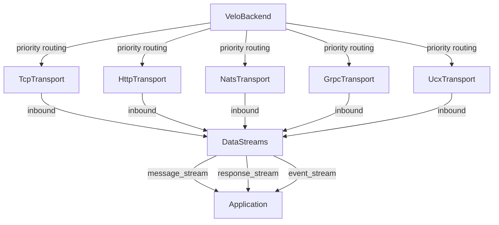

# velo-backend

Multi-transport active message routing for distributed systems.

## Overview

`velo-backend` abstracts TCP, HTTP, NATS, gRPC, and UCX behind a unified `Transport` trait. It provides:

- **Zero-copy `Bytes`** — inbound frames share the receive buffer via `bytes::Bytes` slicing
- **Fire-and-forget with error callbacks** — `send_message` is non-blocking; failures are reported through `TransportErrorHandler`
- **Priority-based peer routing** — each peer is registered with all compatible transports; the highest-priority one becomes the primary
- **3-phase graceful shutdown** — Gate → Drain → Teardown with RAII in-flight tracking
- **Peer discovery via `WorkerAddress`** — MessagePack-encoded map of transport key → endpoint bytes

## Architecture



`VeloBackend` is the central orchestrator. It starts each transport, builds a composite `WorkerAddress` advertising all endpoints, and manages the peer registry. Inbound frames arrive via three independent `flume` channels in `DataStreams`.

## Feature Flags

| Feature | Default | Dependencies | Description |
|---------|---------|-------------|-------------|
| `http`  | ✓ | axum, reqwest | HTTP transport with Axum server |
| `nats`  | ✓ | async-nats, bs58 | NATS pub-sub transport |
| `grpc`  | ✓ | tonic, prost, tower | gRPC bidirectional streaming |
| `ucx`   | ✗ | async-ucx | UCX/RDMA transport (requires UCX libraries) |

TCP transport is always available (no feature gate).

## Transport Summary

| Transport | Protocol | Framing | Key Properties |
|-----------|----------|---------|----------------|
| **TCP** | Raw TCP | 11-byte preamble + header + payload | Zero-copy codec, DashMap connection pool, CPU pinning, keepalive |
| **HTTP** | HTTP/1.1 POST | Base64 header in `X-Transport-Header`, raw body | Fire-and-forget (202 Accepted), Axum server, drain → 503 |
| **NATS** | NATS pub-sub | Base64 header in NATS HeaderMap, raw payload | Subject scheme `velo.{b58}.{type}`, request/reply health, drain via unsub |
| **gRPC** | HTTP/2 streaming | Protobuf `FramedData` wrapper (preamble + header + payload) | Bidirectional streaming, tonic channels, exponential backoff reconnect |
| **UCX** | RDMA Active Messages | 3 fixed lanes (msg/resp/event) | `LocalSet` thread for `Rc<Worker>`, lazy endpoints, zero-copy RDMA |

## Shutdown Model

Graceful shutdown follows three phases:

1. **Gate** — `begin_drain()` flips an atomic flag. Transports reject new inbound `Message` frames (TCP sends `ShuttingDown` response, HTTP returns 503, NATS unsubscribes from message subject).
2. **Drain** — `wait_for_drain()` blocks until all `InFlightGuard`s are dropped. Policy is either `WaitForever` or `Timeout(Duration)`.
3. **Teardown** — Cancel the teardown token, stopping all listener loops and writer tasks. Call `shutdown()` on each transport to clean up connections.

Response, Ack, and Event frames continue flowing during drain so in-flight work can complete.

## Wire Format (TCP)

```text
┌──────────────┬───────────┬──────────────┬───────────────┬────────┬─────────┐
│ version (2B) │ type (1B) │ hdr_len (4B) │ pay_len (4B)  │ header │ payload │
│   u16 BE     │   u8      │   u32 BE     │   u32 BE      │ bytes  │ bytes   │
└──────────────┴───────────┴──────────────┴───────────────┴────────┴─────────┘
```

- **version**: Schema version (currently 1)
- **type**: `Message(0)`, `Response(1)`, `Ack(2)`, `Event(3)`, `ShuttingDown(4)`
- **hdr_len / pay_len**: Lengths of the following header and payload sections
- **Max frame size**: 16 MB

The gRPC transport wraps the same preamble + header + payload in a Protobuf `FramedData` message.
