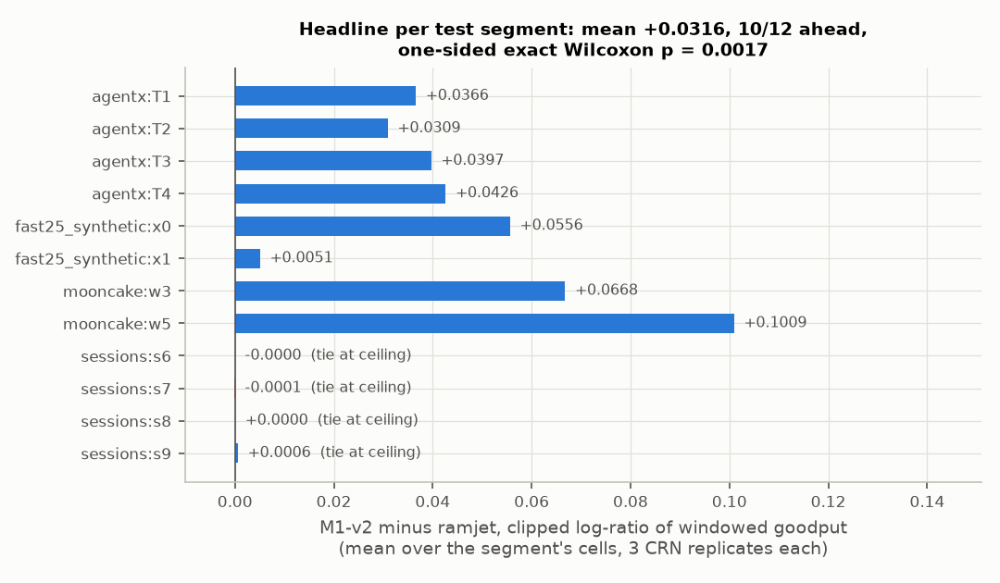
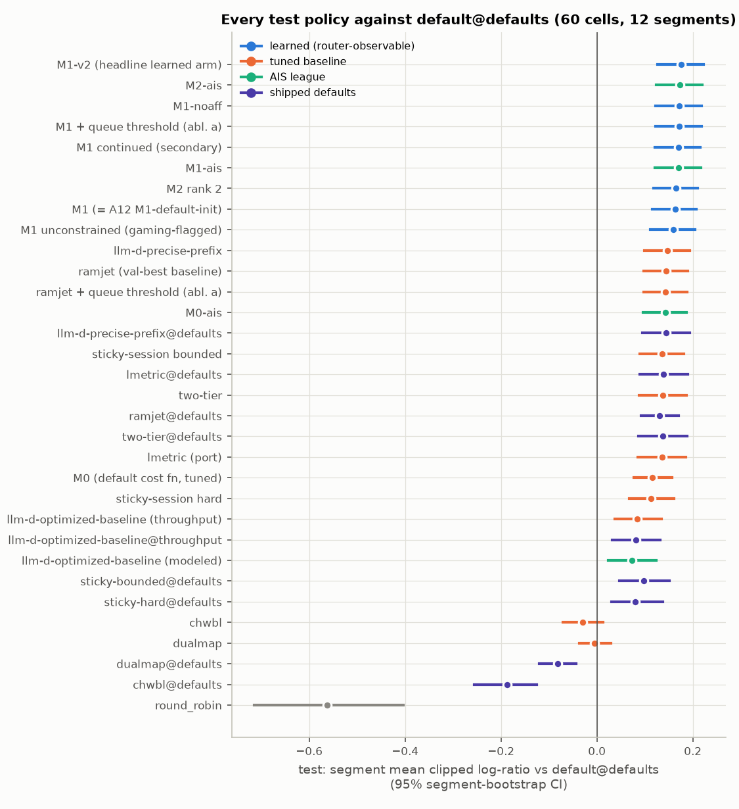
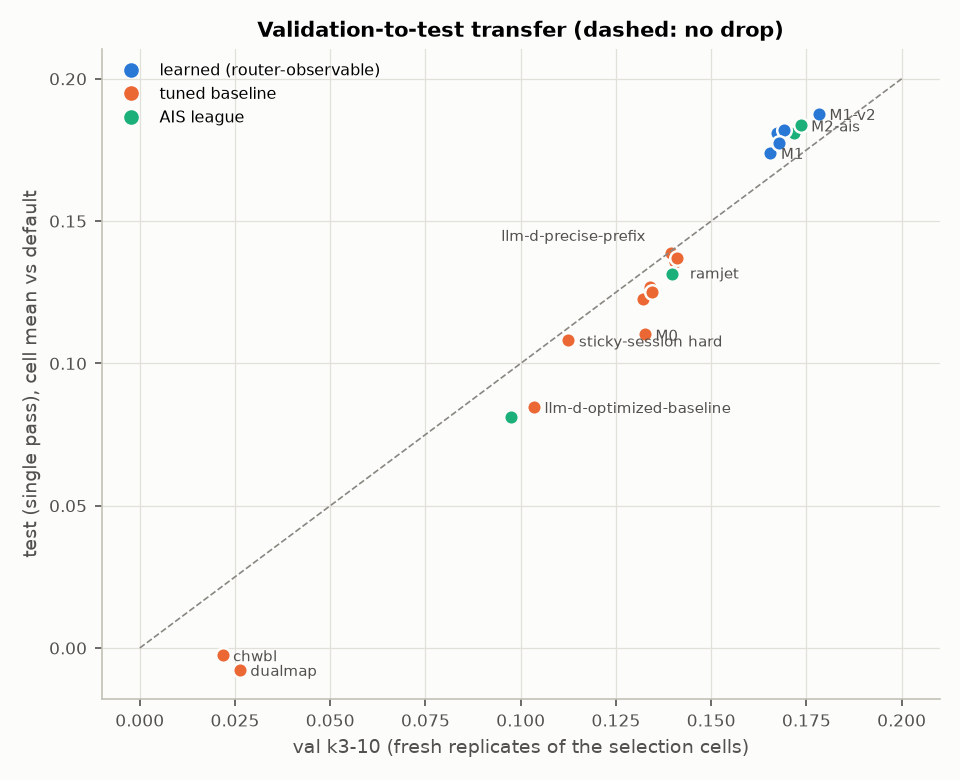
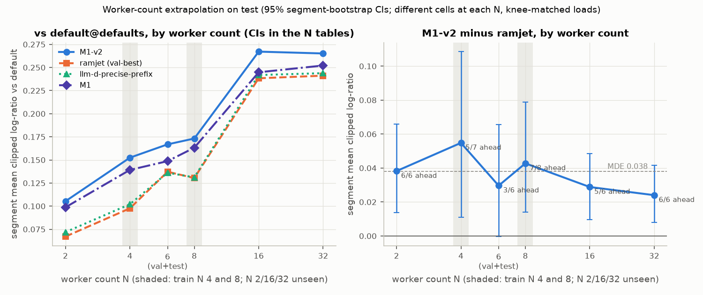
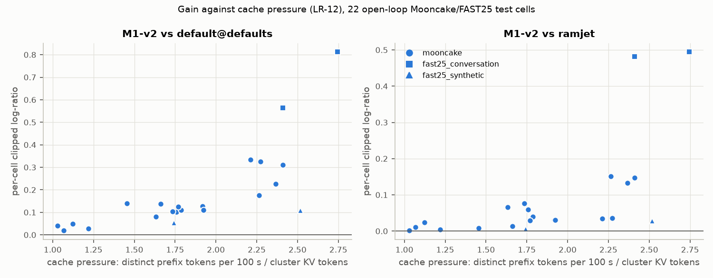
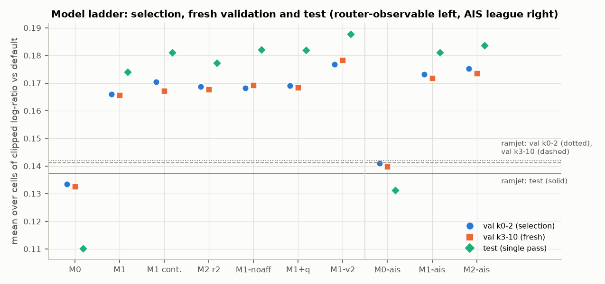
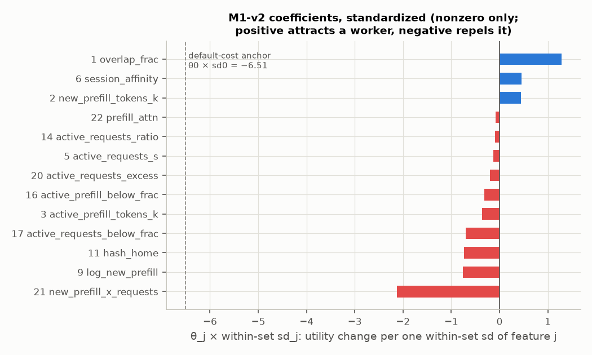
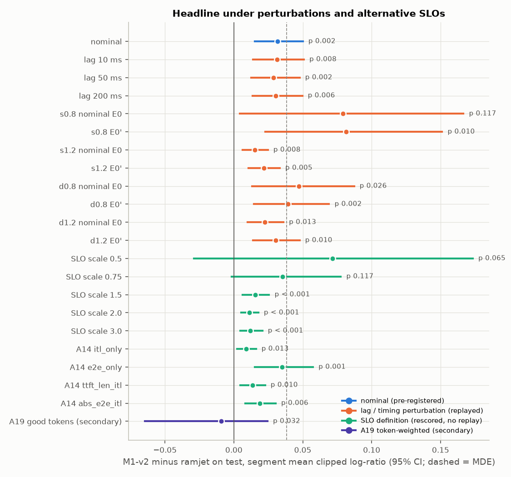
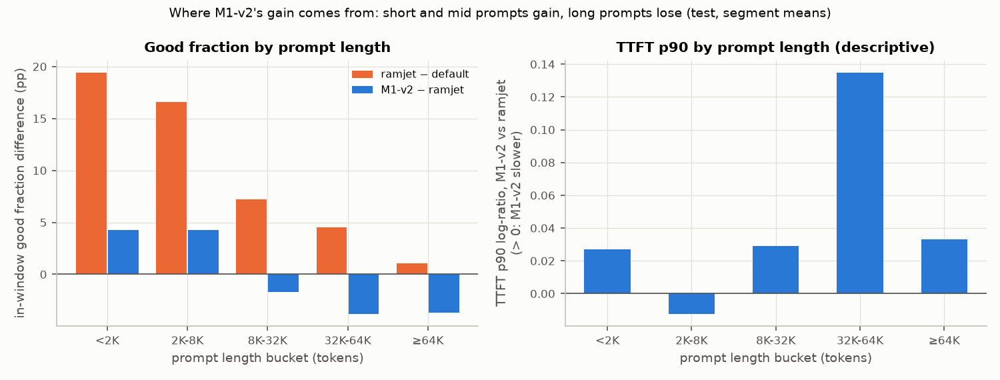
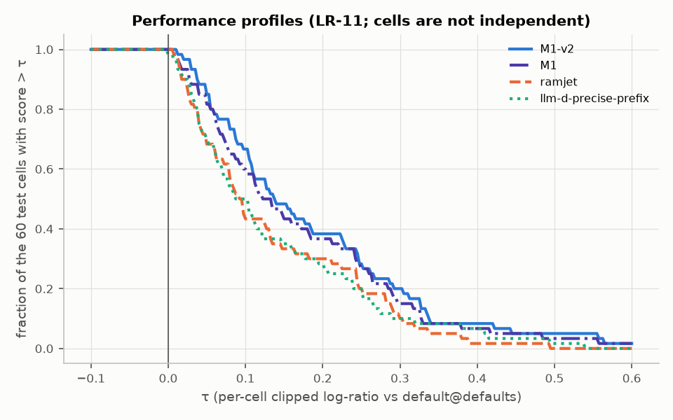

<!-- SPDX-FileCopyrightText: Copyright (c) 2026 NVIDIA CORPORATION & AFFILIATES. All rights reserved.
SPDX-License-Identifier: Apache-2.0 -->

# Learned routing in AISim: final report

- **Campaign:** learned worker selection for Dynamo's KV router, developed in AIS-timed offline replay
  (AISim). Plan: `notes/learned-routing/PLAN.md`. Contract and amendments A1–A21:
  `CR/CONTRACT.md`. `CR` is the campaign root named in `notes/learned-routing/README.md`.
- **Report written:** 2026-10-05, after the final audit checkpoint and its fixer.
- **The `lmetric` port changed after the freeze (A21).** After this campaign froze its results, the
  `lmetric` port in ai-dynamo/dynamo#15450 was fixed to count the worker's queued prefill
  (`active_prefill_tokens`) in LMetric's P-token, as the LMetric paper defines it. The campaign
  branch keeps the port as evaluated. Every `lmetric` number in this report, the in-class
  faithful-LMetric diagnostic (§9) and the headline's scope refer to the port before that fix; none
  was re-run.
- **Deployment (fixed by the operator):** Qwen/Qwen3-32B, vLLM 0.24.0, H100 SXM, TP2, aggregated,
  `max_model_len` 131,072. Engine timing from AIS. Every number in §1–§14 is **simulated**; nothing
  there was measured on GPUs except the one-cell live smoke in §11. §15, added after the live
  finalist runs, is the live GPU validation of the policy ranking and of the sign of M1-v2 − ramjet; it changes no simulated number.
- **Generated content.** Every table marked "generated" is written by
  `CR/report/scripts/build_report_data.py` from the single test pass and the robustness records (no
  replay), and pasted in by `CR/report/scripts/assemble_report.py`. The script asserts that its
  headline, leaderboard and robustness numbers equal `facts/test_results.json` and
  `facts/robustness.json` exactly. Hand-written numbers cite the fact file they come from. The body
  of §15 is generated the same way by `CR/runs/live/finalists/scripts/live_results.py` from the live
  records (`facts/live_results.json`).

## 1. Headline

**Stated as the final audit allows** (`facts/test_results.json` `report_must_state`;
`audits/final/`):

> In AIS-timed simulation, the learned router **M1-v2 beats the branch's ported heuristics, each
> tuned with an equal budget.** Against the validation-selected best baseline (tuned `ramjet`), its
> windowed goodput on the 60 frozen test cells is higher by a segment-mean clipped log-ratio of
> **+0.0316** (95% segment-bootstrap CI [+0.0150, +0.0501]; geometric-mean ratio 1.032, CI
> [1.015, 1.051]). It is ahead on **10 of 12** independent test segments, and on all 8 informative
> ones: the 4 synthetic-sessions segments are ties at ceiling. The pre-registered one-sided exact
> Wilcoxon test gives **p = 0.0017** (α = 0.05), and P(M1-v2 > ramjet) = 0.833 with CI
> [0.583, 1.0], which is significant and meaningful by the registered rule.

The claim is pre-registered (`facts/HEADLINE_TEST.json`), evaluated once, reproduced exactly by an
independent auditor from the raw per-request rows (`audits/final/refute-headline-1.md`), and not
refuted by the robustness and simulator-dependence audit (`audits/final/refute-headline-3.md`).
Read it with these limits, each of which the final audit requires:

1. **Only the sign is a claim.** The effect is below the pre-registered minimum detectable effect
   (MDE 0.038) and below the spread that timing perturbations induce (0.060, LR-14). The magnitude
   depends on the perturbation.
2. **It is not "learning beats every heuristic".** CONTRACT A2.5 kept paper-faithful baselines out
   of the pool, so the pool's `lmetric` port lacks LMetric's queued-prefill term (LR-04). That is the
   port as evaluated: it has since been fixed to count queued prefill (A21), and "the branch's ported
   heuristics" in the claim means the ports as evaluated here. Faithful
   LMetric is inside M1-v2's hypothesis class and was its s3 initialization. Untuned, it beats all
   11 tuned baselines on validation, and default + faithful LMetric reproduces 53–66% of M1-v2's
   fresh-validation margin over ramjet. The learned increment over that heuristic is about
   **+0.011 per segment on validation (≈ 0.29 × MDE), and it was never measured on test** (§9).
3. **It holds at the calibrated SLO and looser** (scales 1–3 × (I, S)). At 0.75× and 0.5× the sign
   holds but significance does not (p 0.117 and 0.065), and at 0.75× all four sessions segments turn
   against M1-v2 (§7).
4. **It is a request-count property.** The pre-registered secondary token-weighted goodput (A19) is
   mixed: segment mean −0.0092, driven by one FAST25-synthetic segment at −0.29. M1-v2 gains on short
   and mid prompts and loses on prompts of 32K tokens and more: TTFT p90 at 32K–64K is about 14%
   higher than ramjet's on 11 of 12 segments, and good fraction falls 3.8 points there (§10).
5. **The headline is simulated.** The A13.2 live finalist runs (§15, validation only: 6 N = 4 test
   cells chosen after the test pass, not at random, one run per policy; the earlier one-cell smoke is
   in §11) agree with the simulated policy ranking (pooled τ_b 1.00, per cell 0.87–1.00) and the sign
   of M1-v2 − ramjet on hardware. They test neither the magnitude nor the significance of the headline.
   They validate neither absolute goodput (live/sim 0.72–2.18, policy-dependent) nor the size of the
   gaps between policies: on the sessions cell the simulated gain of every tuned policy over default
   is not reproduced beyond live noise (§15.2).

Secondary statements that hold:

- **Each tuned baseline.** M1-v2 is Wilcoxon-significant against each of the 11 tuned baselines
  (intersection-union test, largest p 0.0105, `facts/test_results.json`
  `secondary.beats_every_tuned_baseline_IUT`). The effect-size leg of LR-11 fails for `lmetric` and
  sticky-bounded, where M1-v2 trails by up to 0.5% on the at-ceiling sessions segments
  (refute-headline-1 F1).
- **Shipped defaults.** M1-v2 also beats every heuristic at its shipped defaults (largest p 0.0105,
  `audits/final/completeness.md`). `thunderagent` was never evaluated and is outside every claim
  (§11).
- **The best baseline on test.** On test the best baseline is `llm-d-precise-prefix` (tuned), not
  ramjet. M1-v2 beats it by +0.0293 with 12 of 12 segments ahead (p 0.00024); this comparison was
  registered as a secondary before the test pass.
- **Robustness.** The ranking holds under router-state lag of 10, 50 and 200 ms and under all four
  timing perturbations; M1-v2 ranks first among the 17 robustness policies in every condition
  (§7).



## 2. What was compared

**Policies.** Every policy is one configuration, tuned on the pooled train split with the same
CMA-ES budget, then selected on validation (A2.1, LR-10):

- **Tuned baselines (11).** `dynamo-default-cost-fn` (M0), two-tier, the branch's `lmetric` (as
  evaluated, without queued prefill; fixed after the freeze, A21),
  `ramjet`, `dualmap`, `chwbl`, `llm-d-precise-prefix` and `llm-d-optimized-baseline` (throughput)
  ports, `sticky-session` hard and bounded, and ramjet with a tuned `router_queue_threshold`
  (ablation a's baseline arm).
- **Learned arms.** All are the `learned-choice` catalog policy: a conditional logit over
  router-observable features, argmax at τ = 0, O(N·d) per request.
  - **Headline candidates (5):** M1, M2 rank 2, M1-noaff (A15), M1 with a tuned queue threshold
    (ablation a), and M1-v2 (A17.1).
  - **Secondary rows:** M1 continued and the unconstrained, gaming-flagged tier-A M1.
- **AIS league (secondary, A16):** M1-ais, M2-ais, M0-ais and `llm-d-optimized-baseline`
  (modeled). These may read AIS-derived estimates at runtime.
- **Also on test, untuned:** default@defaults (the reference), round_robin and 9 heuristics at
  shipped defaults.

**Objective and good request (A2).** A request is good iff its mean ITL ≤ I and its E2E latency ≤
S × E0(ISL, OSL), where E0 is its AIS-timed idle, no-reuse latency (evaluation only; no policy sees
it). There is no TTFT SLO. I and S are calibrated per family (`facts/calibration.json`):

| Family | I (ms) | S |
|---|---|---|
| Mooncake, FAST25 conversation and FAST25 synthetic | 252.117 | 3.46625 |
| Synthetic sessions | 46.0478 | 2.11784 |
| AgentX (128K plays) | 38.6205 | 1.16134 |

The metric is windowed goodput: good in-window requests per second (LR-01). Per cell and CRN
replicate, a policy scores clip(ln(goodput / goodput of the comparator), ±ln 3).

**Splits.** 34 train cells (N 4 and 8), 14 validation cells (N 4, 6 and 8), and 60 frozen test
cells in 12 independent segments: N 2–32, held-out Mooncake windows, held-out AgentX plays, held-out
session seeds, the test-only FAST25 family, and transform values beyond the train ranges. Loads are
knee-matched per N, at the default router's good fractions 0.95, 0.85 and 0.65 (L1–L3). The 7 test
cells at N = 6 are **selection-exposed**: validation also uses N = 6 (A11.3).

**Statistics** (`facts/HEADLINE_TEST.json`).
- A cell's score is the mean over 3 CRN replicates. A segment's score is the mean over its cells.
- The primary test is a one-sided exact Wilcoxon signed-rank test over the 12 segment scores.
- CIs come from a segment cluster bootstrap. Where a stratum has fewer than 3 segments, the
  generated tables use a stratified cell bootstrap instead, marked **†**; those intervals are
  optimistic because cells of one segment are not independent.
- Per-family, per-mode and per-N results are descriptive. Only the pooled 12-segment test is
  confirmatory, and per-N significance claims need Holm correction (all Holm-adjusted per-N
  p ≥ 0.070).

**Selection.** Each policy's config is the argmax on validation replicates k0–2 over its 3
restarts × checkpoints. The val-best baseline and the headline learned arm were then chosen on
**fresh** validation replicates k3–10 by the same rule (A17.2), and `facts/finalists.json` was
frozen before the first test record.

## 3. Results on test

### 3.1 Every policy against default@defaults and against ramjet

Generated. "Segment mean" is the headline aggregation. "Val k3-10 minus test" is LR-11's
validation-to-test drop. It compares different cells: test has more N = 16 and 32, where every
cache-aware policy gains more over default. Heuristics at defaults and round_robin have no val
k3-10 records.

| Policy | Group | Selected config (val k0-2) | Val k0-2 | Val k3-10 | Test vs default: cell mean | Test vs default: segment mean [95% CI] | Test vs ramjet: segment mean [95% CI] | Segments ahead of ramjet | One-sided Wilcoxon p vs ramjet | Val k3-10 minus test (cell mean) |
|---|---|---|---|---|---|---|---|---|---|---|
| M1-v2 (headline learned arm) | learned (router-observable) | m1v2-s1 g20 best_so_far | 0.1767 | 0.1783 | +0.1877 | +0.1758 [+0.1270, +0.2218] | +0.0316 [+0.0150, +0.0501] | 10/12 | 0.0017 | -0.0094 |
| M2-ais | AIS league | m2ais-s3 g10 mean | 0.1751 | 0.1735 | +0.1837 | +0.1729 [+0.1239, +0.2191] | +0.0286 [+0.0138, +0.0458] | 11/12 | 0.0005 | -0.0102 |
| M1-noaff | learned (router-observable) | m1noaff-s1 g25 best_so_far | 0.1682 | 0.1692 | +0.1821 | +0.1712 [+0.1218, +0.2178] | +0.0270 [+0.0109, +0.0443] | 8/12 | 0.0134 | -0.0129 |
| M1 + queue threshold (abl. a) | learned (router-observable) | ablam1-s1 g25 mean | 0.1690 | 0.1684 | +0.1819 | +0.1714 [+0.1222, +0.2179] | +0.0272 [+0.0115, +0.0444] | 8/12 | 0.0171 | -0.0135 |
| M1 continued (secondary) | learned (router-observable) | m1cont-s3 g25 best_so_far | 0.1704 | 0.1672 | +0.1811 | +0.1699 [+0.1211, +0.2158] | +0.0256 [+0.0090, +0.0437] | 8/12 | 0.0212 | -0.0139 |
| M1-ais | AIS league | m1ais-s1 g25 best_so_far | 0.1731 | 0.1718 | +0.1810 | +0.1699 [+0.1208, +0.2163] | +0.0256 [+0.0113, +0.0423] | 11/12 | 0.0012 | -0.0092 |
| M2 rank 2 | learned (router-observable) | m2r2-s3 g25 mean | 0.1688 | 0.1677 | +0.1774 | +0.1653 [+0.1176, +0.2107] | +0.0211 [+0.0043, +0.0406] | 7/12 | 0.0549 | -0.0096 |
| M1 (= A12 M1-default-init) | learned (router-observable) | m1c-s1 g20 mean | 0.1660 | 0.1656 | +0.1741 | +0.1628 [+0.1156, +0.2072] | +0.0186 [+0.0013, +0.0378] | 7/12 | 0.0549 | -0.0085 |
| M1 unconstrained (gaming-flagged) | learned (router-observable) | m1-s2 g15 mean | 0.1636 | n/a | +0.1687 | +0.1590 [+0.1114, +0.2047] | +0.0147 [+0.0032, +0.0284] | 7/12 | 0.0386 | n/a |
| llm-d-precise-prefix | tuned baseline | llmdpp-s2 g25 mean | 0.1414 | 0.1393 | +0.1386 | +0.1464 [+0.0986, +0.1939] | +0.0022 [-0.0089, +0.0139] | 4/12 | 0.4548 | +0.0007 |
| ramjet (val-best baseline) | tuned baseline | ramjet-s3 g25 best_so_far | 0.1420 | 0.1411 | +0.1372 | +0.1442 [+0.0983, +0.1894] | (reference) |  |  | +0.0040 |
| ramjet + queue threshold (abl. a) | tuned baseline | ablabase-s3 g5 best_so_far | 0.1423 | 0.1405 | +0.1355 | +0.1426 [+0.0970, +0.1875] | -0.0016 [-0.0050, +0.0010] | 4/12 | 0.8833 | +0.0051 |
| M0-ais | AIS league | m0ais-s2 g20 best_so_far | 0.1410 | 0.1397 | +0.1313 | +0.1423 [+0.0967, +0.1874] | -0.0019 [-0.0086, +0.0048] | 6/12 | 0.6890 | +0.0084 |
| llm-d-precise-prefix@defaults | shipped defaults | shipped parameters | n/a | n/a | +0.1290 | +0.1442 [+0.0952, +0.1932] | -0.0000 [-0.0137, +0.0139] | 4/12 | 0.5452 | n/a |
| sticky-session bounded | tuned baseline | stickybounded-s2 g25 mean | 0.1376 | 0.1338 | +0.1268 | +0.1357 [+0.0893, +0.1818] | -0.0086 [-0.0157, -0.0024] | 3/12 | 0.9866 | +0.0071 |
| lmetric@defaults | shipped defaults | shipped parameters | n/a | n/a | +0.1251 | +0.1392 [+0.0889, +0.1901] | -0.0050 [-0.0174, +0.0068] | 8/12 | 0.5750 | n/a |
| two-tier | tuned baseline | twotier-s1 g15 mean | 0.1363 | 0.1345 | +0.1250 | +0.1374 [+0.0879, +0.1866] | -0.0068 [-0.0174, +0.0029] | 6/12 | 0.7407 | +0.0095 |
| ramjet@defaults | shipped defaults | shipped parameters | n/a | n/a | +0.1248 | +0.1312 [+0.0926, +0.1706] | -0.0130 [-0.0227, -0.0036] | 3/12 | 0.9788 | n/a |
| two-tier@defaults | shipped defaults | shipped parameters | n/a | n/a | +0.1237 | +0.1371 [+0.0867, +0.1875] | -0.0071 [-0.0184, +0.0036] | 6/12 | 0.7881 | n/a |
| lmetric (port) | tuned baseline | lmetric-s2 g10 mean | 0.1334 | 0.1321 | +0.1226 | +0.1356 [+0.0860, +0.1857] | -0.0086 [-0.0192, +0.0011] | 6/12 | 0.8303 | +0.0095 |
| M0 (default cost fn, tuned) | tuned baseline | m0-s3 g20 mean | 0.1334 | 0.1326 | +0.1102 | +0.1162 [+0.0777, +0.1562] | -0.0281 [-0.0439, -0.0137] | 1/12 | 0.9993 | +0.0225 |
| sticky-session hard | tuned baseline | stickyhard-s1 g25 mean | 0.1160 | 0.1125 | +0.1081 | +0.1127 [+0.0682, +0.1609] | -0.0316 [-0.0603, -0.0073] | 4/12 | 0.9539 | +0.0044 |
| llm-d-optimized-baseline (throughput) | tuned baseline | llmdob-s1 g5 mean | 0.1047 | 0.1035 | +0.0848 | +0.0844 [+0.0377, +0.1341] | -0.0598 [-0.0946, -0.0277] | 0/12 | 1.0000 | +0.0187 |
| llm-d-optimized-baseline@throughput | shipped defaults | shipped parameters | n/a | n/a | +0.0812 | +0.0809 [+0.0325, +0.1314] | -0.0633 [-0.0979, -0.0321] | 0/12 | 1.0000 | n/a |
| llm-d-optimized-baseline (modeled) | AIS league | llmdobm-s2 g15 mean | 0.0983 | 0.0973 | +0.0812 | +0.0724 [+0.0241, +0.1232] | -0.0718 [-0.1057, -0.0392] | 0/12 | 1.0000 | +0.0161 |
| sticky-bounded@defaults | shipped defaults | shipped parameters | n/a | n/a | +0.0697 | +0.0982 [+0.0475, +0.1514] | -0.0460 [-0.0760, -0.0201] | 1/12 | 0.9983 | n/a |
| sticky-hard@defaults | shipped defaults | shipped parameters | n/a | n/a | +0.0565 | +0.0806 [+0.0305, +0.1368] | -0.0637 [-0.0970, -0.0311] | 2/12 | 0.9976 | n/a |
| chwbl | tuned baseline | chwbl-s1 g5 mean | 0.0290 | 0.0218 | -0.0024 | -0.0299 [-0.0711, +0.0132] | -0.1741 [-0.2378, -0.1115] | 0/12 | 1.0000 | +0.0242 |
| dualmap | tuned baseline | dualmap-s3 g10 mean | 0.0402 | 0.0263 | -0.0076 | -0.0044 [-0.0366, +0.0297] | -0.1486 [-0.1794, -0.1148] | 0/12 | 1.0000 | +0.0339 |
| dualmap@defaults | shipped defaults | shipped parameters | n/a | n/a | -0.1006 | -0.0817 [-0.1200, -0.0428] | -0.2257 [-0.2779, -0.1769] | 0/12 | 1.0000 | n/a |
| chwbl@defaults | shipped defaults | shipped parameters | n/a | n/a | -0.1847 | -0.1866 [-0.2557, -0.1258] | -0.3254 [-0.4185, -0.2435] | 0/12 | 1.0000 | n/a |
| round_robin | shipped defaults | shipped parameters | n/a | n/a | -0.4479 | -0.5631 [-0.7147, -0.4031] | -0.6657 [-0.8234, -0.5019] | 0/12 | 1.0000 | n/a |



`lr-report`'s plain-ratio view of the same records, with a two-stage segment-then-replicate
bootstrap, is in `CR/report/lr-report/test-tuning/report.md` (29 tuning-build policies) and
`CR/report/lr-report/test-ais/report.md` (AIS league). M1-v2's mean normalized goodput there is
1.222 [1.154, 1.286]; ramjet's is 1.156 [1.108, 1.216].

**Per-cell view** (`facts/test_results.json` `per_cell_winner_map`,
`per_cell_gap_to_best_tuned_baseline`):
- M1-v2 is the single best of the 29 router-observable test policies (AIS league excluded) on 31
  of 60 cells.
- It is at or above the per-cell best tuned baseline (the virtual best) on 42 of 60 cells, with a
  mean gap of +0.037.
- It beats default@defaults on 60 of 60 cells.



### 3.2 The headline by stratum

Generated. Only the "all" row is a test. The others are descriptive.

| Stratum | Cells | Segments | M1-v2 minus ramjet, segment mean [95% CI] | Segments ahead | One-sided exact Wilcoxon p (descriptive except 'all') |
|---|---|---|---|---|---|
| all | 60 | 12 | +0.0316 [+0.0150, +0.0501] | 10/12 | 0.0017 |
| mode:open_speedup | 31 | 8 | +0.0281 [+0.0032, +0.0608] | 5/8 | 0.0742 |
| mode:closed_concurrency | 15 | 6 | +0.0354 [+0.0106, +0.0633] | 4/6 | 0.0781 |
| mode:agentic_lanes | 14 | 4 | +0.0374 [+0.0331, +0.0411] | 4/4 | 0.0625 |
| N:2 | 8 | 6 | +0.0382 [+0.0138, +0.0660] | 6/6 | 0.0156 |
| N:4 | 13 | 7 | +0.0548 [+0.0110, +0.1085] | 5/7 | 0.0391 |
| N:6 | 7 | 6 | +0.0296 [-0.0004, +0.0655] | 3/6 | 0.2188 |
| N:8 | 17 | 8 | +0.0427 [+0.0140, +0.0788] | 7/8 | 0.0117 |
| N:16 | 7 | 6 | +0.0288 [+0.0096, +0.0484] | 5/6 | 0.0312 |
| N:32 | 8 | 6 | +0.0240 [+0.0079, +0.0416] | 6/6 | 0.0156 |
| unseen_N | 23 | 7 | +0.0342 [+0.0159, +0.0515] | 7/7 | 0.0078 |
| seen_N | 30 | 12 | +0.0346 [+0.0123, +0.0610] | 9/12 | 0.0081 |
| transform_extrapolation | 10 | 7 | +0.0250 [+0.0071, +0.0443] | 4/7 | 0.1094 |
| family:mooncake | 25 | 2 | +0.0505 [+0.0368, +0.0645]† | 2/2 | 0.2500 |
| family:fast25_conversation | 3 | 2 | +0.3868 [+0.2857, +0.4879]† | 2/2 | 0.2500 |
| family:fast25_synthetic | 3 | 2 | +0.0304 [+0.0164, +0.0443]† | 2/2 | 0.2500 |
| family:synthetic_sessions | 15 | 4 | +0.0001 [-0.0001, +0.0004] | 2/4 | 0.4375 |
| family:agentx | 14 | 4 | +0.0374 [+0.0331, +0.0411] | 4/4 | 0.0625 |

**Not significant on their own:**
- **Transform extrapolation:** +0.025, 4 of 7 segments ahead, p 0.109. Generalization to held-out
  transform values is not established.
- **N = 6:** 3 of 6 segments ahead, p 0.219, and selection-exposed besides.
- **Each load mode:** p 0.06–0.08.

**Unseen worker counts (2, 16, 32):** M1-v2 is ahead on 7 of 7 segments (+0.034, uncorrected
p 0.008). This stratum was not pre-registered as a test. The pre-registered no-regression check
holds at N = 2, 16 and 32 against both ramjet and default: the lower CI bound exceeds −ln 1.005
(`facts/test_results.json` `parity_and_no_regression`).

### 3.3 By family (generated)

The family claims are descriptive: each family has 2–4 segments (HEADLINE_TEST). The two
FAST25-conversation segments share their segment IDs with Mooncake w3 and w5, and contribute their
own cells to those segments in the headline.

**Against default@defaults:**

| Policy | mooncake (25 cells, 2 seg) | fast25_conversation (3 cells, 2 seg) | fast25_synthetic (3 cells, 2 seg) | synthetic_sessions (15 cells, 4 seg) | agentx (14 cells, 4 seg) |
|---|---|---|---|---|---|
| M1-v2 (headline learned arm) | +0.154 [+0.126, +0.181]† | +0.587 [+0.486, +0.688]† | +0.120 [+0.080, +0.159]† | +0.178 [+0.089, +0.264] | +0.192 [+0.096, +0.257] |
| M2-ais | +0.150 [+0.122, +0.178]† | +0.562 [+0.471, +0.653]† | +0.118 [+0.079, +0.157]† | +0.179 [+0.089, +0.265] | +0.186 [+0.089, +0.252] |
| M1-noaff | +0.146 [+0.119, +0.174]† | +0.562 [+0.463, +0.662]† | +0.117 [+0.081, +0.152]† | +0.174 [+0.087, +0.259] | +0.188 [+0.083, +0.260] |
| M1 + queue threshold (abl. a) | +0.146 [+0.118, +0.173]† | +0.566 [+0.469, +0.664]† | +0.117 [+0.081, +0.153]† | +0.176 [+0.088, +0.261] | +0.187 [+0.084, +0.254] |
| M1 continued (secondary) | +0.148 [+0.120, +0.175]† | +0.553 [+0.453, +0.653]† | +0.116 [+0.077, +0.154]† | +0.171 [+0.085, +0.257] | +0.187 [+0.085, +0.256] |
| M1-ais | +0.148 [+0.120, +0.176]† | +0.554 [+0.468, +0.640]† | +0.112 [+0.079, +0.145]† | +0.180 [+0.090, +0.266] | +0.181 [+0.085, +0.246] |
| M2 rank 2 | +0.148 [+0.120, +0.176]† | +0.567 [+0.463, +0.671]† | +0.125 [+0.089, +0.162]† | +0.175 [+0.087, +0.260] | +0.165 [+0.065, +0.229] |
| M1 (= A12 M1-default-init) | +0.144 [+0.116, +0.172]† | +0.565 [+0.463, +0.667]† | +0.122 [+0.086, +0.158]† | +0.176 [+0.088, +0.261] | +0.159 [+0.065, +0.221] |
| M1 unconstrained (gaming-flagged) | +0.132 [+0.104, +0.159]† | +0.543 [+0.445, +0.641]† | +0.092 [+0.057, +0.127]† | +0.176 [+0.088, +0.260] | +0.170 [+0.074, +0.233] |
| llm-d-precise-prefix | +0.090 [+0.065, +0.116]† | +0.296 [+0.289, +0.302]† | +0.069 [+0.034, +0.103]† | +0.168 [+0.084, +0.251] | +0.184 [+0.089, +0.249] |
| ramjet (val-best baseline) | +0.104 [+0.077, +0.132]† | +0.200 [+0.200, +0.200]† | +0.089 [+0.064, +0.115]† | +0.178 [+0.088, +0.264] | +0.155 [+0.063, +0.219] |
| ramjet + queue threshold (abl. a) | +0.103 [+0.077, +0.131]† | +0.174 [+0.172, +0.175]† | +0.089 [+0.058, +0.120]† | +0.176 [+0.088, +0.262] | +0.153 [+0.057, +0.218] |
| M0-ais | +0.099 [+0.074, +0.126]† | +0.076 [+0.066, +0.086]† | +0.082 [+0.054, +0.111]† | +0.172 [+0.086, +0.257] | +0.165 [+0.069, +0.228] |
| llm-d-precise-prefix@defaults | +0.078 [+0.052, +0.106]† | +0.132 [+0.130, +0.134]† | +0.067 [+0.038, +0.096]† | +0.172 [+0.087, +0.254] | +0.186 [+0.086, +0.251] |
| sticky-session bounded | +0.096 [+0.071, +0.123]† | +0.085 [+0.082, +0.088]† | +0.064 [+0.038, +0.091]† | +0.180 [+0.089, +0.266] | +0.147 [+0.060, +0.209] |
| lmetric@defaults | +0.077 [+0.051, +0.104]† | +0.103 [+0.102, +0.105]† | +0.055 [+0.017, +0.093]† | +0.180 [+0.090, +0.266] | +0.170 [+0.076, +0.238] |
| two-tier | +0.079 [+0.054, +0.104]† | +0.143 [+0.142, +0.143]† | +0.055 [+0.023, +0.087]† | +0.178 [+0.088, +0.263] | +0.165 [+0.075, +0.228] |
| ramjet@defaults | +0.102 [+0.078, +0.129]† | +0.156 [+0.154, +0.158]† | +0.096 [+0.072, +0.120]† | +0.162 [+0.081, +0.247] | +0.130 [+0.060, +0.179] |
| two-tier@defaults | +0.074 [+0.048, +0.101]† | +0.150 [+0.147, +0.153]† | +0.056 [+0.018, +0.095]† | +0.180 [+0.089, +0.266] | +0.163 [+0.064, +0.234] |
| lmetric (port) | +0.077 [+0.051, +0.104]† | +0.103 [+0.102, +0.105]† | +0.055 [+0.017, +0.093]† | +0.180 [+0.090, +0.266] | +0.159 [+0.067, +0.224] |
| M0 (default cost fn, tuned) | +0.094 [+0.070, +0.120]† | +0.049 [+0.045, +0.053]† | +0.053 [+0.026, +0.081]† | +0.165 [+0.082, +0.248] | +0.111 [+0.051, +0.144] |
| sticky-session hard | +0.096 [+0.073, +0.121]† | +0.119 [+0.118, +0.119]† | +0.093 [+0.068, +0.117]† | +0.178 [+0.088, +0.265] | +0.065 [+0.000, +0.114] |
| llm-d-optimized-baseline (throughput) | +0.084 [+0.061, +0.108]† | +0.086 [+0.077, +0.094]† | +0.065 [+0.040, +0.089]† | +0.164 [+0.079, +0.234] | +0.016 [-0.044, +0.054] |
| llm-d-optimized-baseline@throughput | +0.074 [+0.050, +0.101]† | +0.123 [+0.113, +0.132]† | +0.061 [+0.035, +0.087]† | +0.159 [+0.072, +0.229] | +0.015 [-0.055, +0.076] |
| llm-d-optimized-baseline (modeled) | +0.087 [+0.065, +0.109]† | +0.060 [+0.053, +0.067]† | +0.019 [-0.000, +0.038]† | +0.156 [+0.078, +0.220] | +0.009 [-0.049, +0.058] |
| sticky-bounded@defaults | +0.004 [+0.001, +0.008]† | -0.012 [-0.012, -0.011]† | +0.003 [+0.002, +0.003]† | +0.170 [+0.084, +0.255] | +0.122 [+0.058, +0.176] |
| sticky-hard@defaults | +0.004 [+0.001, +0.008]† | -0.012 [-0.012, -0.011]† | +0.003 [+0.002, +0.003]† | +0.178 [+0.089, +0.263] | +0.061 [-0.001, +0.114] |
| chwbl | +0.036 [+0.018, +0.055]† | -0.053 [-0.059, -0.047]† | -0.085 [-0.099, -0.071]† | +0.031 [-0.036, +0.088] | -0.093 [-0.131, -0.068] |
| dualmap | -0.012 [-0.080, +0.035]† | -0.011 [-0.011, -0.010]† | -0.026 [-0.030, -0.023]† | +0.044 [+0.005, +0.102] | -0.036 [-0.098, +0.023] |
| dualmap@defaults | -0.147 [-0.279, -0.033]† | -0.037 [-0.052, -0.023]† | -0.027 [-0.037, -0.016]† | -0.110 [-0.164, -0.027] | -0.053 [-0.115, +0.004] |
| chwbl@defaults | -0.107 [-0.184, -0.043]† | -0.717 [-0.814, -0.620]† | -0.133 [-0.147, -0.118]† | -0.326 [-0.411, -0.245] | -0.088 [-0.107, -0.074] |
| round_robin | -0.168 [-0.208, -0.133]† | -0.229 [-0.232, -0.227]† | -0.270 [-0.283, -0.258]† | -0.811 [-0.904, -0.687] | -0.656 [-0.742, -0.528] |

**Against ramjet:**

| Policy | mooncake (25 cells, 2 seg) | fast25_conversation (3 cells, 2 seg) | fast25_synthetic (3 cells, 2 seg) | synthetic_sessions (15 cells, 4 seg) | agentx (14 cells, 4 seg) |
|---|---|---|---|---|---|
| M1-v2 (headline learned arm) | +0.050 [+0.037, +0.064]† | +0.387 [+0.286, +0.488]† | +0.030 [+0.016, +0.044]† | +0.000 [-0.000, +0.000] | +0.037 [+0.033, +0.041] |
| M2-ais | +0.046 [+0.034, +0.059]† | +0.362 [+0.270, +0.453]† | +0.029 [+0.016, +0.042]† | +0.002 [+0.000, +0.004] | +0.031 [+0.025, +0.034] |
| M1-noaff | +0.043 [+0.030, +0.056]† | +0.362 [+0.263, +0.462]† | +0.027 [+0.017, +0.037]† | -0.003 [-0.005, -0.001] | +0.033 [+0.019, +0.041] |
| M1 + queue threshold (abl. a) | +0.042 [+0.030, +0.055]† | +0.366 [+0.269, +0.464]† | +0.028 [+0.017, +0.038]† | -0.002 [-0.003, -0.001] | +0.032 [+0.021, +0.042] |
| M1 continued (secondary) | +0.044 [+0.032, +0.057]† | +0.353 [+0.253, +0.453]† | +0.027 [+0.014, +0.040]† | -0.006 [-0.010, -0.003] | +0.032 [+0.021, +0.039] |
| M1-ais | +0.045 [+0.032, +0.057]† | +0.354 [+0.268, +0.440]† | +0.022 [+0.015, +0.030]† | +0.002 [+0.001, +0.003] | +0.026 [+0.019, +0.033] |
| M2 rank 2 | +0.044 [+0.032, +0.057]† | +0.367 [+0.263, +0.471]† | +0.036 [+0.025, +0.047]† | -0.003 [-0.004, -0.001] | +0.010 [-0.000, +0.022] |
| M1 (= A12 M1-default-init) | +0.041 [+0.029, +0.053]† | +0.365 [+0.263, +0.467]† | +0.033 [+0.022, +0.043]† | -0.001 [-0.002, -0.000] | +0.004 [-0.019, +0.025] |
| M1 unconstrained (gaming-flagged) | +0.028 [+0.017, +0.040]† | +0.343 [+0.245, +0.441]† | +0.002 [-0.007, +0.012]† | -0.002 [-0.003, -0.000] | +0.015 [+0.010, +0.020] |
| llm-d-precise-prefix | -0.014 [-0.019, -0.008]† | +0.095 [+0.088, +0.102]† | -0.021 [-0.030, -0.012]† | -0.010 [-0.015, -0.004] | +0.029 [+0.025, +0.034] |
| ramjet + queue threshold (abl. a) | -0.000 [-0.002, +0.002]† | -0.026 [-0.028, -0.025]† | -0.000 [-0.006, +0.005]† | -0.002 [-0.002, -0.001] | -0.002 [-0.011, +0.005] |
| M0-ais | -0.004 [-0.007, -0.002]† | -0.124 [-0.134, -0.114]† | -0.007 [-0.010, -0.004]† | -0.006 [-0.010, -0.002] | +0.010 [+0.004, +0.017] |
| llm-d-precise-prefix@defaults | -0.025 [-0.030, -0.021]† | -0.068 [-0.070, -0.066]† | -0.023 [-0.026, -0.019]† | -0.006 [-0.010, -0.002] | +0.031 [+0.022, +0.039] |
| sticky-session bounded | -0.008 [-0.010, -0.005]† | -0.115 [-0.118, -0.113]† | -0.025 [-0.026, -0.024]† | +0.002 [+0.001, +0.003] | -0.008 [-0.011, -0.003] |
| lmetric@defaults | -0.027 [-0.033, -0.021]† | -0.097 [-0.098, -0.095]† | -0.034 [-0.046, -0.022]† | +0.003 [+0.001, +0.005] | +0.015 [+0.006, +0.026] |
| two-tier | -0.025 [-0.030, -0.020]† | -0.058 [-0.058, -0.057]† | -0.035 [-0.041, -0.028]† | -0.000 [-0.001, +0.001] | +0.010 [+0.008, +0.013] |
| ramjet@defaults | -0.001 [-0.005, +0.002]† | -0.044 [-0.046, -0.042]† | +0.007 [+0.005, +0.008]† | -0.016 [-0.025, -0.005] | -0.025 [-0.040, -0.003] |
| two-tier@defaults | -0.029 [-0.034, -0.025]† | -0.050 [-0.053, -0.048]† | -0.033 [-0.046, -0.020]† | +0.002 [+0.000, +0.003] | +0.008 [-0.005, +0.021] |
| lmetric (port) | -0.027 [-0.031, -0.022]† | -0.097 [-0.098, -0.095]† | -0.034 [-0.046, -0.022]† | +0.003 [+0.001, +0.005] | +0.004 [-0.004, +0.012] |
| M0 (default cost fn, tuned) | -0.010 [-0.014, -0.005]† | -0.151 [-0.155, -0.147]† | -0.036 [-0.038, -0.034]† | -0.012 [-0.019, -0.005] | -0.044 [-0.079, -0.010] |
| sticky-session hard | -0.007 [-0.011, -0.003]† | -0.082 [-0.082, -0.081]† | +0.003 [+0.002, +0.004]† | +0.000 [-0.001, +0.002] | -0.090 [-0.129, -0.058] |
| llm-d-optimized-baseline (throughput) | -0.020 [-0.027, -0.013]† | -0.115 [-0.123, -0.106]† | -0.025 [-0.026, -0.023]† | -0.013 [-0.029, -0.002] | -0.139 [-0.165, -0.107] |
| llm-d-optimized-baseline@throughput | -0.029 [-0.035, -0.024]† | -0.078 [-0.087, -0.068]† | -0.028 [-0.029, -0.028]† | -0.018 [-0.035, -0.004] | -0.140 [-0.172, -0.109] |
| llm-d-optimized-baseline (modeled) | -0.017 [-0.030, -0.004]† | -0.140 [-0.148, -0.133]† | -0.070 [-0.077, -0.064]† | -0.021 [-0.043, -0.005] | -0.146 [-0.165, -0.112] |
| sticky-bounded@defaults | -0.100 [-0.126, -0.074]† | -0.212 [-0.212, -0.211]† | -0.087 [-0.112, -0.062]† | -0.008 [-0.011, -0.004] | -0.033 [-0.057, -0.005] |
| sticky-hard@defaults | -0.100 [-0.126, -0.074]† | -0.212 [-0.212, -0.211]† | -0.087 [-0.112, -0.062]† | +0.001 [-0.001, +0.002] | -0.094 [-0.135, -0.055] |
| chwbl | -0.067 [-0.081, -0.054]† | -0.253 [-0.259, -0.247]† | -0.174 [-0.186, -0.163]† | -0.147 [-0.285, -0.038] | -0.248 [-0.334, -0.140] |
| dualmap | -0.115 [-0.172, -0.076]† | -0.211 [-0.211, -0.210]† | -0.116 [-0.138, -0.094]† | -0.133 [-0.174, -0.081] | -0.191 [-0.222, -0.155] |
| dualmap@defaults | -0.249 [-0.369, -0.145]† | -0.237 [-0.252, -0.223]† | -0.116 [-0.131, -0.101]† | -0.287 [-0.374, -0.204] | -0.208 [-0.250, -0.168] |
| chwbl@defaults | -0.207 [-0.290, -0.135]† | -0.759 [-0.855, -0.662]† | -0.222 [-0.233, -0.211]† | -0.494 [-0.638, -0.384] | -0.243 [-0.313, -0.147] |
| round_robin | -0.272 [-0.324, -0.223]† | -0.430 [-0.432, -0.427]† | -0.360 [-0.373, -0.347]† | -0.935 [-1.040, -0.829] | -0.740 [-0.865, -0.562] |
| default@defaults (reference) | -0.104 [-0.132, -0.077]† | -0.200 [-0.200, -0.200]† | -0.089 [-0.115, -0.064]† | -0.178 [-0.264, -0.088] | -0.155 [-0.219, -0.063] |

The three FAST25-conversation cells carry about 35% of M1-v2's cell-mean gain over ramjet. Without
them, the headline is +0.026 with p 0.0017 unchanged (refute-headline-1 F3). Their request-count
gains (+0.48, +0.49, +0.08) contrast with token-weighted deltas of +0.02, −0.15 and +0.02.

### 3.4 By load mode (generated)

**Against default@defaults:**

| Policy | open_speedup (31 cells, 8 seg) | closed_concurrency (15 cells, 6 seg) | agentic_lanes (14 cells, 4 seg) |
|---|---|---|---|
| M1-v2 (headline learned arm) | +0.126 [+0.065, +0.199] | +0.241 [+0.208, +0.273] | +0.192 [+0.096, +0.257] |
| M2-ais | +0.124 [+0.064, +0.196] | +0.243 [+0.211, +0.274] | +0.186 [+0.089, +0.252] |
| M1-noaff | +0.124 [+0.064, +0.196] | +0.232 [+0.201, +0.262] | +0.188 [+0.083, +0.260] |
| M1 + queue threshold (abl. a) | +0.124 [+0.064, +0.195] | +0.235 [+0.205, +0.266] | +0.187 [+0.084, +0.254] |
| M1 continued (secondary) | +0.123 [+0.063, +0.195] | +0.231 [+0.201, +0.261] | +0.187 [+0.085, +0.256] |
| M1-ais | +0.123 [+0.063, +0.195] | +0.239 [+0.209, +0.271] | +0.181 [+0.085, +0.246] |
| M2 rank 2 | +0.126 [+0.065, +0.197] | +0.236 [+0.203, +0.268] | +0.165 [+0.065, +0.229] |
| M1 (= A12 M1-default-init) | +0.125 [+0.065, +0.195] | +0.236 [+0.203, +0.269] | +0.159 [+0.065, +0.221] |
| M1 unconstrained (gaming-flagged) | +0.114 [+0.056, +0.186] | +0.222 [+0.187, +0.259] | +0.170 [+0.074, +0.233] |
| llm-d-precise-prefix | +0.090 [+0.040, +0.157] | +0.191 [+0.145, +0.236] | +0.184 [+0.089, +0.249] |
| ramjet (val-best baseline) | +0.098 [+0.051, +0.162] | +0.205 [+0.154, +0.258] | +0.155 [+0.063, +0.219] |
| ramjet + queue threshold (abl. a) | +0.096 [+0.049, +0.160] | +0.206 [+0.158, +0.255] | +0.153 [+0.057, +0.218] |
| M0-ais | +0.091 [+0.047, +0.155] | +0.195 [+0.147, +0.245] | +0.165 [+0.069, +0.228] |
| llm-d-precise-prefix@defaults | +0.083 [+0.039, +0.149] | +0.189 [+0.137, +0.242] | +0.186 [+0.086, +0.251] |
| sticky-session bounded | +0.087 [+0.042, +0.152] | +0.199 [+0.141, +0.260] | +0.147 [+0.060, +0.209] |
| lmetric@defaults | +0.077 [+0.031, +0.146] | +0.200 [+0.140, +0.259] | +0.170 [+0.076, +0.238] |
| two-tier | +0.080 [+0.034, +0.148] | +0.194 [+0.136, +0.254] | +0.165 [+0.075, +0.228] |
| ramjet@defaults | +0.099 [+0.052, +0.162] | +0.188 [+0.148, +0.229] | +0.130 [+0.060, +0.179] |
| two-tier@defaults | +0.078 [+0.030, +0.146] | +0.199 [+0.139, +0.258] | +0.163 [+0.064, +0.234] |
| lmetric (port) | +0.078 [+0.030, +0.146] | +0.200 [+0.140, +0.259] | +0.159 [+0.067, +0.224] |
| M0 (default cost fn, tuned) | +0.082 [+0.037, +0.148] | +0.182 [+0.135, +0.230] | +0.111 [+0.051, +0.144] |
| sticky-session hard | +0.096 [+0.051, +0.160] | +0.202 [+0.147, +0.257] | +0.065 [+0.000, +0.114] |
| llm-d-optimized-baseline (throughput) | +0.076 [+0.039, +0.127] | +0.182 [+0.116, +0.249] | +0.016 [-0.044, +0.054] |
| llm-d-optimized-baseline@throughput | +0.069 [+0.033, +0.119] | +0.182 [+0.119, +0.249] | +0.015 [-0.055, +0.076] |
| llm-d-optimized-baseline (modeled) | +0.060 [+0.021, +0.109] | +0.168 [+0.096, +0.241] | +0.009 [-0.049, +0.058] |
| sticky-bounded@defaults | +0.056 [+0.008, +0.129] | +0.124 [+0.037, +0.220] | +0.122 [+0.058, +0.176] |
| sticky-hard@defaults | +0.056 [+0.008, +0.130] | +0.132 [+0.040, +0.233] | +0.061 [-0.001, +0.114] |
| chwbl | -0.013 [-0.058, +0.031] | +0.032 [-0.017, +0.082] | -0.093 [-0.131, -0.068] |
| dualmap | +0.016 [-0.025, +0.081] | +0.008 [-0.022, +0.042] | -0.036 [-0.098, +0.023] |
| dualmap@defaults | -0.127 [-0.195, -0.065] | -0.044 [-0.087, -0.004] | -0.053 [-0.115, +0.004] |
| chwbl@defaults | -0.248 [-0.386, -0.141] | -0.178 [-0.266, -0.102] | -0.088 [-0.107, -0.074] |
| round_robin | -0.550 [-0.825, -0.302] | -0.426 [-0.623, -0.230] | -0.656 [-0.742, -0.528] |

**Against ramjet:**

| Policy | open_speedup (31 cells, 8 seg) | closed_concurrency (15 cells, 6 seg) | agentic_lanes (14 cells, 4 seg) |
|---|---|---|---|
| M1-v2 (headline learned arm) | +0.028 [+0.003, +0.061] | +0.035 [+0.011, +0.063] | +0.037 [+0.033, +0.041] |
| M2-ais | +0.026 [+0.003, +0.055] | +0.037 [+0.013, +0.064] | +0.031 [+0.025, +0.034] |
| M1-noaff | +0.026 [+0.003, +0.056] | +0.026 [+0.002, +0.053] | +0.033 [+0.019, +0.041] |
| M1 + queue threshold (abl. a) | +0.026 [+0.004, +0.055] | +0.030 [+0.006, +0.057] | +0.032 [+0.021, +0.042] |
| M1 continued (secondary) | +0.025 [+0.002, +0.055] | +0.025 [-0.003, +0.056] | +0.032 [+0.021, +0.039] |
| M1-ais | +0.025 [+0.003, +0.054] | +0.034 [+0.013, +0.055] | +0.026 [+0.019, +0.033] |
| M2 rank 2 | +0.028 [+0.005, +0.059] | +0.030 [+0.003, +0.062] | +0.010 [-0.000, +0.022] |
| M1 (= A12 M1-default-init) | +0.027 [+0.005, +0.056] | +0.030 [+0.006, +0.059] | +0.004 [-0.019, +0.025] |
| M1 unconstrained (gaming-flagged) | +0.016 [-0.003, +0.042] | +0.017 [+0.001, +0.033] | +0.015 [+0.010, +0.020] |
| llm-d-precise-prefix | -0.008 [-0.019, -0.000] | -0.014 [-0.021, -0.008] | +0.029 [+0.025, +0.034] |
| ramjet + queue threshold (abl. a) | -0.002 [-0.005, -0.000] | +0.001 [-0.003, +0.005] | -0.002 [-0.011, +0.005] |
| M0-ais | -0.007 [-0.017, +0.001] | -0.010 [-0.013, -0.006] | +0.010 [+0.004, +0.017] |
| llm-d-precise-prefix@defaults | -0.015 [-0.027, -0.005] | -0.016 [-0.022, -0.010] | +0.031 [+0.022, +0.039] |
| sticky-session bounded | -0.011 [-0.023, -0.002] | -0.007 [-0.019, +0.003] | -0.008 [-0.011, -0.003] |
| lmetric@defaults | -0.021 [-0.038, -0.006] | -0.006 [-0.016, +0.004] | +0.015 [+0.006, +0.026] |
| two-tier | -0.018 [-0.031, -0.005] | -0.011 [-0.021, -0.002] | +0.010 [+0.008, +0.013] |
| ramjet@defaults | +0.000 [-0.003, +0.004] | -0.017 [-0.030, -0.004] | -0.025 [-0.040, -0.003] |
| two-tier@defaults | -0.020 [-0.036, -0.006] | -0.006 [-0.016, +0.003] | +0.008 [-0.005, +0.021] |
| lmetric (port) | -0.021 [-0.037, -0.006] | -0.006 [-0.016, +0.004] | +0.004 [-0.004, +0.012] |
| M0 (default cost fn, tuned) | -0.016 [-0.032, -0.002] | -0.024 [-0.034, -0.014] | -0.044 [-0.079, -0.010] |
| sticky-session hard | -0.003 [-0.009, +0.002] | -0.003 [-0.010, +0.003] | -0.090 [-0.129, -0.058] |
| llm-d-optimized-baseline (throughput) | -0.022 [-0.036, -0.010] | -0.023 [-0.038, -0.009] | -0.139 [-0.165, -0.107] |
| llm-d-optimized-baseline@throughput | -0.029 [-0.045, -0.015] | -0.024 [-0.040, -0.008] | -0.140 [-0.172, -0.109] |
| llm-d-optimized-baseline (modeled) | -0.038 [-0.061, -0.017] | -0.037 [-0.068, -0.011] | -0.146 [-0.165, -0.112] |
| sticky-bounded@defaults | -0.043 [-0.080, -0.012] | -0.081 [-0.138, -0.030] | -0.033 [-0.057, -0.005] |
| sticky-hard@defaults | -0.042 [-0.080, -0.011] | -0.073 [-0.136, -0.016] | -0.094 [-0.135, -0.055] |
| chwbl | -0.111 [-0.199, -0.039] | -0.174 [-0.257, -0.113] | -0.248 [-0.334, -0.140] |
| dualmap | -0.082 [-0.123, -0.048] | -0.198 [-0.231, -0.166] | -0.191 [-0.222, -0.155] |
| dualmap@defaults | -0.225 [-0.326, -0.129] | -0.249 [-0.320, -0.191] | -0.208 [-0.250, -0.168] |
| chwbl@defaults | -0.332 [-0.517, -0.197] | -0.384 [-0.510, -0.265] | -0.243 [-0.313, -0.147] |
| round_robin | -0.597 [-0.844, -0.372] | -0.631 [-0.867, -0.400] | -0.740 [-0.865, -0.562] |
| default@defaults (reference) | -0.098 [-0.162, -0.051] | -0.205 [-0.258, -0.154] | -0.155 [-0.219, -0.063] |

AgentX ran only in closed-loop lanes. Its open-loop arrival process (A3) was built but never used
in any cell.

### 3.5 By worker count (generated; N = 6 is selection-exposed)

**Against default@defaults:**

| Policy | N=2 unseen N (8 cells, 6 seg) | N=4 train N (13 cells, 7 seg) | N=6 selection-exposed (7 cells, 6 seg) | N=8 train N (17 cells, 8 seg) | N=16 unseen N (7 cells, 6 seg) | N=32 unseen N (8 cells, 6 seg) |
|---|---|---|---|---|---|---|
| M1-v2 (headline learned arm) | +0.105 [+0.060, +0.166] | +0.152 [+0.079, +0.233] | +0.167 [+0.104, +0.222] | +0.173 [+0.106, +0.241] | +0.267 [+0.140, +0.399] | +0.265 [+0.146, +0.379] |
| M2-ais | +0.091 [+0.041, +0.158] | +0.151 [+0.076, +0.237] | +0.166 [+0.101, +0.223] | +0.169 [+0.102, +0.237] | +0.266 [+0.141, +0.397] | +0.267 [+0.147, +0.381] |
| M1-noaff | +0.100 [+0.057, +0.159] | +0.156 [+0.077, +0.248] | +0.166 [+0.100, +0.226] | +0.164 [+0.097, +0.231] | +0.262 [+0.138, +0.396] | +0.261 [+0.144, +0.375] |
| M1 + queue threshold (abl. a) | +0.104 [+0.061, +0.163] | +0.147 [+0.075, +0.228] | +0.165 [+0.099, +0.225] | +0.165 [+0.098, +0.233] | +0.264 [+0.139, +0.396] | +0.262 [+0.144, +0.375] |
| M1 continued (secondary) | +0.097 [+0.058, +0.149] | +0.150 [+0.075, +0.235] | +0.165 [+0.100, +0.224] | +0.164 [+0.098, +0.231] | +0.261 [+0.136, +0.394] | +0.262 [+0.143, +0.377] |
| M1-ais | +0.092 [+0.043, +0.158] | +0.141 [+0.074, +0.214] | +0.166 [+0.100, +0.224] | +0.166 [+0.099, +0.232] | +0.267 [+0.140, +0.401] | +0.264 [+0.146, +0.377] |
| M2 rank 2 | +0.099 [+0.058, +0.159] | +0.143 [+0.072, +0.222] | +0.154 [+0.094, +0.205] | +0.163 [+0.092, +0.234] | +0.251 [+0.136, +0.366] | +0.255 [+0.144, +0.362] |
| M1 (= A12 M1-default-init) | +0.099 [+0.056, +0.161] | +0.139 [+0.065, +0.221] | +0.149 [+0.093, +0.202] | +0.163 [+0.094, +0.232] | +0.245 [+0.133, +0.354] | +0.252 [+0.143, +0.356] |
| M1 unconstrained (gaming-flagged) | +0.083 [+0.038, +0.151] | +0.139 [+0.066, +0.229] | +0.151 [+0.091, +0.207] | +0.154 [+0.090, +0.219] | +0.245 [+0.130, +0.362] | +0.254 [+0.142, +0.362] |
| llm-d-precise-prefix | +0.072 [+0.031, +0.128] | +0.102 [+0.041, +0.198] | +0.136 [+0.075, +0.198] | +0.131 [+0.079, +0.188] | +0.242 [+0.121, +0.379] | +0.244 [+0.129, +0.356] |
| ramjet (val-best baseline) | +0.067 [+0.021, +0.141] | +0.098 [+0.044, +0.182] | +0.137 [+0.077, +0.198] | +0.130 [+0.075, +0.191] | +0.238 [+0.124, +0.357] | +0.241 [+0.137, +0.338] |
| ramjet + queue threshold (abl. a) | +0.069 [+0.025, +0.144] | +0.100 [+0.043, +0.193] | +0.132 [+0.076, +0.189] | +0.129 [+0.074, +0.191] | +0.231 [+0.125, +0.334] | +0.240 [+0.136, +0.336] |
| M0-ais | +0.072 [+0.032, +0.135] | +0.091 [+0.041, +0.170] | +0.135 [+0.075, +0.196] | +0.120 [+0.070, +0.179] | +0.238 [+0.124, +0.361] | +0.243 [+0.133, +0.348] |
| llm-d-precise-prefix@defaults | +0.078 [+0.026, +0.145] | +0.095 [+0.038, +0.187] | +0.131 [+0.069, +0.194] | +0.119 [+0.068, +0.177] | +0.240 [+0.121, +0.374] | +0.244 [+0.128, +0.358] |
| sticky-session bounded | +0.072 [+0.027, +0.145] | +0.088 [+0.039, +0.166] | +0.130 [+0.077, +0.184] | +0.115 [+0.062, +0.178] | +0.229 [+0.123, +0.336] | +0.227 [+0.134, +0.316] |
| lmetric@defaults | +0.071 [+0.021, +0.148] | +0.089 [+0.031, +0.184] | +0.132 [+0.068, +0.196] | +0.114 [+0.057, +0.179] | +0.234 [+0.122, +0.350] | +0.242 [+0.129, +0.353] |
| two-tier | +0.069 [+0.021, +0.143] | +0.087 [+0.035, +0.169] | +0.130 [+0.070, +0.193] | +0.116 [+0.062, +0.179] | +0.227 [+0.118, +0.343] | +0.236 [+0.127, +0.343] |
| ramjet@defaults | +0.060 [+0.014, +0.121] | +0.077 [+0.046, +0.113] | +0.120 [+0.074, +0.165] | +0.126 [+0.076, +0.182] | +0.208 [+0.118, +0.295] | +0.219 [+0.130, +0.307] |
| two-tier@defaults | +0.075 [+0.021, +0.150] | +0.079 [+0.027, +0.166] | +0.129 [+0.071, +0.190] | +0.119 [+0.062, +0.183] | +0.228 [+0.117, +0.345] | +0.239 [+0.127, +0.348] |
| lmetric (port) | +0.070 [+0.018, +0.148] | +0.089 [+0.031, +0.184] | +0.124 [+0.067, +0.181] | +0.114 [+0.057, +0.180] | +0.228 [+0.116, +0.344] | +0.229 [+0.129, +0.327] |
| M0 (default cost fn, tuned) | +0.055 [+0.014, +0.118] | +0.047 [+0.031, +0.063] | +0.107 [+0.068, +0.150] | +0.108 [+0.058, +0.167] | +0.195 [+0.113, +0.266] | +0.212 [+0.129, +0.292] |
| sticky-session hard | +0.059 [+0.011, +0.129] | +0.072 [+0.015, +0.141] | +0.081 [+0.025, +0.148] | +0.113 [+0.049, +0.182] | +0.177 [+0.103, +0.248] | +0.193 [+0.125, +0.256] |
| llm-d-optimized-baseline (throughput) | +0.054 [-0.000, +0.135] | +0.035 [+0.005, +0.061] | +0.075 [+0.022, +0.141] | +0.079 [+0.008, +0.151] | +0.153 [+0.085, +0.217] | +0.143 [+0.070, +0.215] |
| llm-d-optimized-baseline@throughput | +0.050 [-0.010, +0.134] | +0.056 [+0.011, +0.120] | +0.062 [+0.001, +0.134] | +0.077 [+0.005, +0.148] | +0.140 [+0.073, +0.202] | +0.130 [+0.044, +0.213] |
| llm-d-optimized-baseline (modeled) | +0.051 [-0.016, +0.137] | +0.061 [+0.014, +0.121] | +0.067 [+0.003, +0.139] | +0.056 [-0.010, +0.128] | +0.138 [+0.066, +0.204] | +0.134 [+0.064, +0.201] |
| sticky-bounded@defaults | +0.046 [-0.007, +0.128] | +0.056 [+0.005, +0.139] | +0.082 [+0.024, +0.146] | +0.066 [+0.008, +0.142] | +0.158 [+0.047, +0.288] | +0.160 [+0.059, +0.267] |
| sticky-hard@defaults | +0.048 [-0.007, +0.133] | +0.048 [-0.009, +0.137] | +0.049 [+0.004, +0.123] | +0.058 [-0.004, +0.140] | +0.121 [+0.031, +0.217] | +0.133 [+0.055, +0.208] |
| chwbl | +0.016 [-0.038, +0.081] | -0.026 [-0.071, +0.016] | -0.026 [-0.099, +0.042] | -0.038 [-0.083, +0.014] | -0.006 [-0.082, +0.068] | +0.027 [-0.019, +0.084] |
| dualmap | -0.013 [-0.080, +0.056] | -0.025 [-0.118, +0.065] | -0.037 [-0.078, +0.001] | -0.017 [-0.070, +0.040] | +0.052 [+0.026, +0.079] | +0.048 [+0.007, +0.081] |
| dualmap@defaults | -0.040 [-0.074, -0.004] | -0.196 [-0.406, -0.004] | -0.081 [-0.200, +0.009] | -0.092 [-0.133, -0.047] | +0.032 [-0.032, +0.089] | +0.017 [-0.056, +0.074] |
| chwbl@defaults | -0.042 [-0.087, +0.003] | -0.144 [-0.221, -0.092] | -0.185 [-0.256, -0.115] | -0.185 [-0.285, -0.099] | -0.242 [-0.404, -0.095] | -0.312 [-0.688, -0.003] |
| round_robin | -0.325 [-0.455, -0.185] | -0.388 [-0.534, -0.263] | -0.684 [-0.964, -0.397] | -0.477 [-0.690, -0.277] | -0.675 [-0.950, -0.376] | -0.640 [-0.940, -0.322] |

**Against ramjet:**

| Policy | N=2 unseen N (8 cells, 6 seg) | N=4 train N (13 cells, 7 seg) | N=6 selection-exposed (7 cells, 6 seg) | N=8 train N (17 cells, 8 seg) | N=16 unseen N (7 cells, 6 seg) | N=32 unseen N (8 cells, 6 seg) |
|---|---|---|---|---|---|---|
| M1-v2 (headline learned arm) | +0.038 [+0.014, +0.066] | +0.055 [+0.011, +0.109] | +0.030 [-0.000, +0.065] | +0.043 [+0.014, +0.079] | +0.029 [+0.010, +0.048] | +0.024 [+0.008, +0.042] |
| M2-ais | +0.024 [+0.002, +0.054] | +0.053 [+0.014, +0.101] | +0.029 [+0.004, +0.060] | +0.039 [+0.012, +0.073] | +0.028 [+0.011, +0.045] | +0.026 [+0.009, +0.043] |
| M1-noaff | +0.033 [+0.009, +0.058] | +0.058 [+0.019, +0.106] | +0.029 [+0.006, +0.055] | +0.033 [+0.007, +0.067] | +0.024 [+0.006, +0.042] | +0.020 [+0.005, +0.037] |
| M1 + queue threshold (abl. a) | +0.037 [+0.010, +0.064] | +0.050 [+0.010, +0.100] | +0.028 [+0.005, +0.055] | +0.035 [+0.008, +0.068] | +0.026 [+0.007, +0.045] | +0.021 [+0.006, +0.035] |
| M1 continued (secondary) | +0.030 [-0.001, +0.062] | +0.052 [+0.013, +0.101] | +0.027 [+0.005, +0.054] | +0.034 [+0.007, +0.067] | +0.023 [+0.004, +0.041] | +0.021 [+0.003, +0.038] |
| M1-ais | +0.025 [+0.006, +0.053] | +0.044 [+0.001, +0.095] | +0.029 [+0.004, +0.061] | +0.035 [+0.010, +0.068] | +0.029 [+0.011, +0.048] | +0.023 [+0.008, +0.037] |
| M2 rank 2 | +0.032 [+0.007, +0.060] | +0.046 [+0.002, +0.101] | +0.016 [-0.014, +0.050] | +0.033 [+0.004, +0.069] | +0.013 [+0.002, +0.026] | +0.014 [+0.002, +0.026] |
| M1 (= A12 M1-default-init) | +0.032 [+0.007, +0.058] | +0.042 [-0.002, +0.096] | +0.011 [-0.023, +0.047] | +0.033 [+0.006, +0.066] | +0.006 [-0.004, +0.022] | +0.011 [+0.000, +0.023] |
| M1 unconstrained (gaming-flagged) | +0.015 [+0.000, +0.036] | +0.042 [+0.006, +0.089] | +0.014 [-0.005, +0.037] | +0.024 [+0.003, +0.053] | +0.007 [+0.001, +0.012] | +0.013 [+0.003, +0.023] |
| llm-d-precise-prefix | +0.005 [-0.018, +0.028] | +0.004 [-0.013, +0.021] | -0.001 [-0.018, +0.019] | +0.001 [-0.010, +0.013] | +0.004 [-0.018, +0.026] | +0.003 [-0.013, +0.019] |
| ramjet + queue threshold (abl. a) | +0.002 [-0.003, +0.008] | +0.003 [-0.004, +0.012] | -0.005 [-0.012, -0.001] | -0.001 [-0.006, +0.003] | -0.008 [-0.024, +0.003] | -0.001 [-0.003, -0.000] |
| M0-ais | +0.005 [-0.010, +0.018] | -0.006 [-0.016, +0.004] | -0.003 [-0.008, +0.002] | -0.010 [-0.027, +0.001] | -0.000 [-0.009, +0.010] | +0.002 [-0.007, +0.011] |
| llm-d-precise-prefix@defaults | +0.011 [-0.013, +0.037] | -0.003 [-0.018, +0.014] | -0.006 [-0.027, +0.020] | -0.012 [-0.031, +0.006] | +0.002 [-0.017, +0.023] | +0.003 [-0.014, +0.020] |
| sticky-session bounded | +0.005 [+0.000, +0.013] | -0.009 [-0.023, +0.002] | -0.008 [-0.025, +0.007] | -0.016 [-0.032, -0.003] | -0.010 [-0.020, -0.000] | -0.014 [-0.028, -0.001] |
| lmetric@defaults | +0.004 [-0.005, +0.013] | -0.008 [-0.029, +0.011] | -0.006 [-0.025, +0.017] | -0.017 [-0.040, +0.001] | -0.005 [-0.024, +0.018] | +0.001 [-0.015, +0.017] |
| two-tier | +0.002 [-0.007, +0.014] | -0.011 [-0.026, +0.006] | -0.007 [-0.022, +0.009] | -0.015 [-0.030, -0.001] | -0.011 [-0.029, +0.010] | -0.005 [-0.021, +0.010] |
| ramjet@defaults | -0.007 [-0.026, +0.009] | -0.021 [-0.071, +0.007] | -0.018 [-0.037, -0.002] | -0.004 [-0.013, +0.003] | -0.030 [-0.064, -0.007] | -0.022 [-0.038, -0.007] |
| two-tier@defaults | +0.008 [-0.010, +0.026] | -0.018 [-0.034, -0.005] | -0.008 [-0.026, +0.014] | -0.012 [-0.028, +0.002] | -0.010 [-0.029, +0.008] | -0.003 [-0.018, +0.012] |
| lmetric (port) | +0.003 [-0.008, +0.013] | -0.009 [-0.029, +0.010] | -0.014 [-0.039, +0.013] | -0.016 [-0.037, -0.000] | -0.010 [-0.024, +0.004] | -0.012 [-0.023, -0.001] |
| M0 (default cost fn, tuned) | -0.012 [-0.024, -0.002] | -0.050 [-0.130, -0.003] | -0.030 [-0.067, -0.006] | -0.022 [-0.044, -0.006] | -0.044 [-0.095, -0.010] | -0.029 [-0.052, -0.008] |
| sticky-session hard | -0.008 [-0.019, +0.002] | -0.026 [-0.055, -0.000] | -0.056 [-0.126, -0.002] | -0.018 [-0.035, -0.004] | -0.061 [-0.126, -0.004] | -0.048 [-0.096, -0.002] |
| llm-d-optimized-baseline (throughput) | -0.013 [-0.026, +0.001] | -0.062 [-0.134, -0.011] | -0.062 [-0.128, -0.008] | -0.052 [-0.081, -0.026] | -0.085 [-0.169, -0.012] | -0.098 [-0.175, -0.025] |
| llm-d-optimized-baseline@throughput | -0.018 [-0.036, -0.003] | -0.042 [-0.067, -0.018] | -0.075 [-0.161, -0.010] | -0.054 [-0.086, -0.027] | -0.098 [-0.201, -0.013] | -0.111 [-0.183, -0.039] |
| llm-d-optimized-baseline (modeled) | -0.016 [-0.049, +0.013] | -0.037 [-0.071, -0.006] | -0.071 [-0.146, -0.008] | -0.074 [-0.102, -0.047] | -0.101 [-0.193, -0.016] | -0.107 [-0.190, -0.026] |
| sticky-bounded@defaults | -0.021 [-0.032, -0.009] | -0.042 [-0.066, -0.018] | -0.056 [-0.097, -0.018] | -0.064 [-0.116, -0.020] | -0.081 [-0.156, -0.023] | -0.081 [-0.162, -0.023] |
| sticky-hard@defaults | -0.019 [-0.034, -0.005] | -0.050 [-0.074, -0.024] | -0.089 [-0.153, -0.027] | -0.073 [-0.120, -0.030] | -0.117 [-0.188, -0.042] | -0.108 [-0.189, -0.034] |
| chwbl | -0.051 [-0.078, -0.026] | -0.123 [-0.219, -0.044] | -0.164 [-0.276, -0.067] | -0.168 [-0.236, -0.109] | -0.244 [-0.430, -0.088] | -0.214 [-0.344, -0.085] |
| dualmap | -0.080 [-0.122, -0.039] | -0.122 [-0.200, -0.062] | -0.174 [-0.270, -0.083] | -0.147 [-0.181, -0.113] | -0.186 [-0.292, -0.087] | -0.193 [-0.270, -0.110] |
| dualmap@defaults | -0.107 [-0.202, -0.042] | -0.292 [-0.481, -0.126] | -0.219 [-0.311, -0.137] | -0.222 [-0.302, -0.145] | -0.206 [-0.324, -0.107] | -0.224 [-0.290, -0.136] |
| chwbl@defaults | -0.109 [-0.164, -0.057] | -0.241 [-0.320, -0.169] | -0.320 [-0.437, -0.208] | -0.302 [-0.445, -0.187] | -0.473 [-0.599, -0.314] | -0.543 [-0.841, -0.271] |
| round_robin | -0.392 [-0.552, -0.213] | -0.480 [-0.645, -0.332] | -0.786 [-1.043, -0.500] | -0.584 [-0.804, -0.386] | -0.817 [-1.058, -0.530] | -0.813 [-1.080, -0.494] |
| default@defaults (reference) | -0.067 [-0.141, -0.021] | -0.098 [-0.182, -0.044] | -0.137 [-0.198, -0.077] | -0.130 [-0.191, -0.075] | -0.238 [-0.357, -0.124] | -0.241 [-0.338, -0.137] |

**Hold-out strata against default@defaults:**

| Policy | unseen N 2/16/32 (23 cells) | seen N 4/8 (30 cells) | transform extrapolation (10 cells) |
|---|---|---|---|
| M1-v2 (headline learned arm) | +0.246 [+0.145, +0.362] | +0.152 [+0.097, +0.212] | +0.116 [+0.070, +0.183] |
| M2-ais | +0.241 [+0.141, +0.356] | +0.151 [+0.094, +0.213] | +0.113 [+0.065, +0.182] |
| M1-noaff | +0.241 [+0.141, +0.358] | +0.150 [+0.091, +0.215] | +0.106 [+0.059, +0.173] |
| M1 + queue threshold (abl. a) | +0.244 [+0.142, +0.359] | +0.146 [+0.090, +0.206] | +0.108 [+0.061, +0.176] |
| M1 continued (secondary) | +0.240 [+0.139, +0.355] | +0.147 [+0.091, +0.209] | +0.108 [+0.062, +0.173] |
| M1-ais | +0.241 [+0.140, +0.358] | +0.144 [+0.091, +0.200] | +0.111 [+0.064, +0.181] |
| M2 rank 2 | +0.231 [+0.138, +0.334] | +0.141 [+0.085, +0.201] | +0.102 [+0.053, +0.172] |
| M1 (= A12 M1-default-init) | +0.226 [+0.137, +0.322] | +0.140 [+0.083, +0.200] | +0.101 [+0.053, +0.171] |
| M1 unconstrained (gaming-flagged) | +0.223 [+0.132, +0.326] | +0.140 [+0.085, +0.203] | +0.102 [+0.057, +0.171] |
| llm-d-precise-prefix | +0.221 [+0.119, +0.341] | +0.122 [+0.069, +0.185] | +0.090 [+0.049, +0.155] |
| ramjet (val-best baseline) | +0.212 [+0.120, +0.317] | +0.118 [+0.066, +0.177] | +0.091 [+0.043, +0.166] |
| ramjet + queue threshold (abl. a) | +0.205 [+0.121, +0.298] | +0.119 [+0.065, +0.182] | +0.093 [+0.045, +0.167] |
| M0-ais | +0.216 [+0.123, +0.325] | +0.112 [+0.064, +0.169] | +0.090 [+0.044, +0.160] |
| llm-d-precise-prefix@defaults | +0.221 [+0.120, +0.339] | +0.116 [+0.065, +0.177] | +0.088 [+0.044, +0.156] |
| sticky-session bounded | +0.203 [+0.116, +0.302] | +0.108 [+0.059, +0.166] | +0.094 [+0.046, +0.170] |
| lmetric@defaults | +0.210 [+0.115, +0.314] | +0.111 [+0.057, +0.175] | +0.088 [+0.039, +0.166] |
| two-tier | +0.206 [+0.112, +0.307] | +0.109 [+0.059, +0.168] | +0.091 [+0.044, +0.165] |
| ramjet@defaults | +0.182 [+0.110, +0.260] | +0.103 [+0.066, +0.146] | +0.091 [+0.050, +0.154] |
| two-tier@defaults | +0.209 [+0.112, +0.313] | +0.108 [+0.056, +0.169] | +0.084 [+0.036, +0.162] |
| lmetric (port) | +0.205 [+0.111, +0.310] | +0.111 [+0.057, +0.175] | +0.088 [+0.038, +0.166] |
| M0 (default cost fn, tuned) | +0.170 [+0.107, +0.234] | +0.081 [+0.047, +0.126] | +0.084 [+0.041, +0.149] |
| sticky-session hard | +0.156 [+0.094, +0.218] | +0.093 [+0.038, +0.153] | +0.069 [-0.002, +0.157] |
| llm-d-optimized-baseline (throughput) | +0.125 [+0.065, +0.189] | +0.055 [+0.007, +0.109] | +0.059 [-0.012, +0.147] |
| llm-d-optimized-baseline@throughput | +0.110 [+0.053, +0.170] | +0.067 [+0.012, +0.126] | +0.053 [-0.021, +0.144] |
| llm-d-optimized-baseline (modeled) | +0.112 [+0.054, +0.176] | +0.059 [+0.007, +0.116] | +0.049 [-0.030, +0.141] |
| sticky-bounded@defaults | +0.150 [+0.054, +0.252] | +0.077 [+0.024, +0.141] | +0.069 [+0.018, +0.146] |
| sticky-hard@defaults | +0.120 [+0.045, +0.201] | +0.067 [+0.009, +0.137] | +0.052 [-0.013, +0.142] |
| chwbl | -0.008 [-0.071, +0.047] | -0.037 [-0.075, +0.004] | -0.028 [-0.076, +0.021] |
| dualmap | +0.033 [+0.013, +0.057] | -0.010 [-0.059, +0.046] | -0.070 [-0.152, -0.004] |
| dualmap@defaults | +0.003 [-0.025, +0.023] | -0.110 [-0.185, -0.031] | -0.245 [-0.343, -0.156] |
| chwbl@defaults | -0.181 [-0.333, -0.057] | -0.162 [-0.227, -0.112] | -0.165 [-0.209, -0.124] |
| round_robin | -0.605 [-0.840, -0.356] | -0.498 [-0.640, -0.364] | -0.498 [-0.732, -0.312] |

**Hold-out strata against ramjet:**

| Policy | unseen N 2/16/32 (23 cells) | seen N 4/8 (30 cells) | transform extrapolation (10 cells) |
|---|---|---|---|
| M1-v2 (headline learned arm) | +0.034 [+0.016, +0.052] | +0.035 [+0.012, +0.061] | +0.025 [+0.007, +0.044] |
| M2-ais | +0.030 [+0.014, +0.046] | +0.033 [+0.013, +0.057] | +0.022 [+0.006, +0.039] |
| M1-noaff | +0.030 [+0.012, +0.047] | +0.032 [+0.012, +0.056] | +0.015 [+0.001, +0.030] |
| M1 + queue threshold (abl. a) | +0.032 [+0.013, +0.050] | +0.028 [+0.008, +0.053] | +0.017 [+0.003, +0.032] |
| M1 continued (secondary) | +0.029 [+0.009, +0.048] | +0.029 [+0.009, +0.053] | +0.016 [+0.000, +0.034] |
| M1-ais | +0.030 [+0.013, +0.047] | +0.026 [+0.005, +0.051] | +0.020 [+0.007, +0.035] |
| M2 rank 2 | +0.020 [+0.005, +0.036] | +0.023 [+0.001, +0.050] | +0.011 [-0.001, +0.023] |
| M1 (= A12 M1-default-init) | +0.015 [-0.001, +0.032] | +0.022 [+0.000, +0.048] | +0.010 [+0.001, +0.018] |
| M1 unconstrained (gaming-flagged) | +0.012 [+0.003, +0.021] | +0.023 [+0.006, +0.043] | +0.011 [-0.000, +0.023] |
| llm-d-precise-prefix | +0.009 [-0.009, +0.028] | +0.004 [-0.006, +0.016] | -0.001 [-0.019, +0.018] |
| ramjet + queue threshold (abl. a) | -0.006 [-0.020, +0.002] | +0.001 [-0.002, +0.006] | +0.002 [-0.003, +0.010] |
| M0-ais | +0.004 [-0.005, +0.014] | -0.006 [-0.014, +0.002] | -0.001 [-0.007, +0.005] |
| llm-d-precise-prefix@defaults | +0.010 [-0.009, +0.029] | -0.002 [-0.016, +0.011] | -0.003 [-0.025, +0.021] |
| sticky-session bounded | -0.009 [-0.017, -0.002] | -0.010 [-0.019, -0.001] | +0.003 [-0.002, +0.011] |
| lmetric@defaults | -0.001 [-0.015, +0.013] | -0.007 [-0.022, +0.006] | -0.003 [-0.024, +0.017] |
| two-tier | -0.006 [-0.019, +0.007] | -0.009 [-0.020, +0.003] | +0.000 [-0.020, +0.020] |
| ramjet@defaults | -0.030 [-0.060, -0.007] | -0.015 [-0.045, +0.003] | -0.000 [-0.013, +0.011] |
| two-tier@defaults | -0.003 [-0.019, +0.013] | -0.010 [-0.021, -0.000] | -0.007 [-0.023, +0.008] |
| lmetric (port) | -0.007 [-0.016, +0.001] | -0.007 [-0.021, +0.005] | -0.003 [-0.021, +0.015] |
| M0 (default cost fn, tuned) | -0.042 [-0.086, -0.012] | -0.037 [-0.085, -0.007] | -0.007 [-0.017, -0.001] |
| sticky-session hard | -0.056 [-0.111, -0.013] | -0.025 [-0.045, -0.007] | -0.022 [-0.051, -0.001] |
| llm-d-optimized-baseline (throughput) | -0.087 [-0.156, -0.027] | -0.062 [-0.108, -0.026] | -0.032 [-0.061, -0.009] |
| llm-d-optimized-baseline@throughput | -0.102 [-0.186, -0.034] | -0.051 [-0.076, -0.027] | -0.038 [-0.070, -0.014] |
| llm-d-optimized-baseline (modeled) | -0.099 [-0.180, -0.030] | -0.059 [-0.084, -0.035] | -0.042 [-0.075, -0.016] |
| sticky-bounded@defaults | -0.062 [-0.107, -0.026] | -0.041 [-0.069, -0.016] | -0.022 [-0.048, +0.001] |
| sticky-hard@defaults | -0.092 [-0.147, -0.038] | -0.051 [-0.078, -0.026] | -0.039 [-0.064, -0.014] |
| chwbl | -0.220 [-0.379, -0.089] | -0.155 [-0.222, -0.094] | -0.119 [-0.207, -0.050] |
| dualmap | -0.178 [-0.262, -0.100] | -0.127 [-0.162, -0.092] | -0.161 [-0.239, -0.093] |
| dualmap@defaults | -0.208 [-0.309, -0.120] | -0.227 [-0.307, -0.151] | -0.335 [-0.431, -0.236] |
| chwbl@defaults | -0.387 [-0.517, -0.237] | -0.274 [-0.375, -0.192] | -0.256 [-0.363, -0.173] |
| round_robin | -0.718 [-0.928, -0.470] | -0.597 [-0.753, -0.453] | -0.576 [-0.815, -0.367] |
| default@defaults (reference) | -0.212 [-0.317, -0.120] | -0.118 [-0.177, -0.066] | -0.091 [-0.166, -0.043] |

## 4. Worker-count extrapolation



- **Learned and tuned alike.** Every learned arm was trained on N ∈ {4, 8} only and runs unchanged
  at any N, because the utility is per worker and the set statistics are N-stable (LR-06).
- **Gains grow with N.** Against default, every cache-aware policy gains more at N = 16 and 32
  (M1-v2 +0.27) than at N = 2 (+0.105).
- **The learned margin persists at unseen N.** Over ramjet it is positive at every N: +0.038 at
  N = 2, then +0.029 and +0.024 at N = 16 and 32. It does not grow at the unseen large N, and every
  per-N p is non-significant after Holm correction.
- **Caveat: the curve is not a pure N effect.** Each N holds different cells and segments, and the
  loads are knee-matched per N, so per-worker load varies 1.2–1.9× across N
  (`audits/calibration/independent-rerun-r1.md` F3).
- **What was not done:** LR-12's per-worker-matched N extrapolation. Calibration made only
  knee-matched cells.
- **Cache pressure.** On the 22 open-loop Mooncake and FAST25 test cells, M1-v2's gain over
  default rises with cache pressure: Spearman ρ 0.79 against default and 0.71 against ramjet. Cache
  pressure is distinct prefix tokens per 100 s over cluster KV capacity; values range from 1.0 to
  2.7. Pressure is confounded with load level (L3 cells sit at the top), and the cells are not
  independent, so the trend is descriptive. Sessions cells are excluded, because their open-loop
  pressure entries predate calibration fix r0.



## 5. The model ladder and the ablations

Generated. "Restart bests" are each restart's selected val k0-2 value (s1 is the default-router
init θ0 = −e0; s2 and s3 are A11.1's informed inits).

| Rung | Policy key | Selected restart | Restart bests, val k0-2 | Val k0-2 (selection) | Val k3-10 (fresh) | Test vs default (cell mean) | Test vs ramjet, segment mean [95% CI] | One-sided p vs ramjet |
|---|---|---|---|---|---|---|---|---|
| M0 | `m0` | m0-s3 g20 mean | s1 0.13204, s2 0.13185, s3 0.13343 | 0.1334 | 0.1326 | +0.1102 | -0.0281 [-0.0439, -0.0137] | 0.9993 |
| M1 | `m1` | m1c-s1 g20 mean | s1 0.16599, s2 0.16238, s3 0.13750 | 0.1660 | 0.1656 | +0.1741 | +0.0186 [+0.0013, +0.0378] | 0.0549 |
| M1 continued (+400 evals) | `m1cont` | m1cont-s3 g25 best_so_far | s1 0.16735, s2 0.16622, s3 0.17040 | 0.1704 | 0.1672 | +0.1811 | +0.0256 [+0.0090, +0.0437] | 0.0212 |
| M2 rank 2 | `m2r2` | m2r2-s3 g25 mean | s1 0.16818, s2 0.16868, s3 0.16879 | 0.1688 | 0.1677 | +0.1774 | +0.0211 [+0.0043, +0.0406] | 0.0549 |
| M1-noaff (A15) | `m1noaff` | m1noaff-s1 g25 best_so_far | s1 0.16820, s2 0.16578, s3 0.16611 | 0.1682 | 0.1692 | +0.1821 | +0.0270 [+0.0109, +0.0443] | 0.0134 |
| M1 + queue threshold (ablation a) | `ablam1` | ablam1-s1 g25 mean | s1 0.16900, s2 0.16592, s3 0.16742 | 0.1690 | 0.1684 | +0.1819 | +0.0272 [+0.0115, +0.0444] | 0.0171 |
| M1-v2 (A17.1) | `m1v2` | m1v2-s1 g20 best_so_far | s1 0.17674, s2 0.16085, s3 0.17237 | 0.1767 | 0.1783 | +0.1877 | +0.0316 [+0.0150, +0.0501] | 0.0017 |
| M1 unconstrained (tier A, gaming-flagged) | `m1u` | m1-s2 g15 mean | s1 0.16148, s2 0.16363, s3 0.15782 | 0.1636 | n/a | +0.1687 | +0.0147 [+0.0032, +0.0284] | 0.0386 |
| M0-ais | `m0ais` | m0ais-s2 g20 best_so_far | s1 0.14062, s2 0.14102, s3 0.13881 | 0.1410 | 0.1397 | +0.1313 | -0.0019 [-0.0086, +0.0048] | 0.6890 |
| M1-ais | `m1ais` | m1ais-s1 g25 best_so_far | s1 0.17314, s2 0.16623, s3 0.16706 | 0.1731 | 0.1718 | +0.1810 | +0.0256 [+0.0113, +0.0423] | 0.0012 |
| M2-ais | `m2ais` | m2ais-s3 g10 mean | s1 0.17513, s2 0.17508, s3 0.17515 | 0.1751 | 0.1735 | +0.1837 | +0.0286 [+0.0138, +0.0458] | 0.0005 |



**Rung-to-rung comparisons on test** (generated, descriptive):

| Comparison (A minus B) | Segment mean [95% CI] | Segments ahead | One-sided p (A > B) | Cell mean |
|---|---|---|---|---|
| M1 (= A12 M1-default-init) − M0 (default cost fn, tuned) | +0.0467 [+0.0248, +0.0700] | 11/12 | 0.0007 | +0.0639 |
| M2 rank 2 − M1 (= A12 M1-default-init) | +0.0025 [-0.0008, +0.0070] | 6/12 | 0.2349 | +0.0033 |
| M1 continued (secondary) − M1 (= A12 M1-default-init) | +0.0071 [-0.0024, +0.0195] | 6/12 | 0.3386 | +0.0070 |
| M2 rank 2 − M1 continued (secondary) | -0.0045 [-0.0134, +0.0029] | 8/12 | 0.5452 | -0.0037 |
| M1-v2 (headline learned arm) − M1 (= A12 M1-default-init) | +0.0130 [+0.0039, +0.0244] | 11/12 | 0.0034 | +0.0137 |
| M1-noaff − M1 (= A12 M1-default-init) | +0.0084 [-0.0012, +0.0211] | 7/12 | 0.2119 | +0.0081 |
| M1 + queue threshold (abl. a) − M1 continued (secondary) | +0.0015 [-0.0002, +0.0035] | 8/12 | 0.0549 | +0.0008 |
| ramjet + queue threshold (abl. a) − ramjet (val-best baseline) | -0.0016 [-0.0050, +0.0010] | 4/12 | 0.8833 | -0.0017 |
| M1 (= A12 M1-default-init) − M1 unconstrained (gaming-flagged) | +0.0039 [-0.0065, +0.0144] | 8/12 | 0.1902 | +0.0053 |
| M1-ais − M0-ais | +0.0275 [+0.0104, +0.0486] | 10/12 | 0.0017 | +0.0497 |
| M2-ais − M1-ais | +0.0030 [+0.0010, +0.0053] | 9/12 | 0.0046 | +0.0027 |
| M2-ais − M1-v2 (headline learned arm) | -0.0029 [-0.0052, -0.0006] | 3/12 | 0.9788 | -0.0040 |
| M0-ais − M0 (default cost fn, tuned) | +0.0262 [+0.0101, +0.0445] | 10/12 | 0.0017 | +0.0211 |

**Reading the ladder.**

- **M0 → M1: the one clear step.** Learning over the default cost's features beats tuning the
  default cost's knobs: +0.047 per segment over M0, 11 of 12 segments.
- **M1 is the sign-constrained re-run (A11.2).** The tier-A M1 learned positive load coefficients.
  θ7 > 0 made active prefill attractive above about 77K tokens and kept a 0%-good "dump" worker
  (`audits/phase2-mid/gaming-concentration.md`). All later learned arms clamp load-increasing
  coefficients ≤ 0. The unconstrained row (`m1u`) is reported only as a flagged secondary.
- **M1 → M2 rank 2: no gain.** M2 adds a named-source context term (sources `isl_k` and the set
  mean of active prefill).
  - It adds +0.0025 on test (6 of 12 segments) and does not beat M1 continued for the same added
    400 evaluations (−0.0045).
  - The pre-registered rank 3–4 gate failed: M2 rank 2 minus max(M1, M1 continued) on val k0-2 was
    −0.0016, against MDE 0.038 (`facts/tierBC.json` `m2_rank34_gate`), so ranks 3–4 were not run.
  - M3 (nested logit) was never built: DP = 1 here.
  - The LR-15 drift check was recorded as inconclusive. It shows no evidence of coefficient drift
    across load level or N (`facts/tierA.json` `drift.interpretation`).
- **M1 → M1-v2: the step that passes.** M1-v2 is feature set v2, adding log, set-relative,
  interaction and prefill-attention terms (A17.1).
  - It beats M1 by +0.013 on 11 of 12 segments (p 0.0034).
  - The pre-registered M1 and M2 alone do **not** pass against ramjet on test (p 0.055 each). The
    passing arm is the post-pilot redesign (refute-headline-2 F2).
- **A15, session affinity.**
  - Retrained without θ6, M1-noaff is not worse than M1 on test (+0.0084, p 0.21).
  - Post hoc, θ6 = 0 changes M1 by −0.0010 on val.
  - Under lag, M1 − M1-noaff stays −0.008 to −0.005, so the hypothesis that affinity gains value
    under staleness is not supported.
  - For M1-v2, zeroing θ6 changes val k0-2 by +0.0005 (refute-headline-2).
- **Ablation a, a jointly tuned `router_queue_threshold`: nothing measurable.**
  - The learned arm vs M1 continued: +0.0015 (p 0.055).
  - The ramjet arm vs ramjet: −0.0016.
  - Removing the tuned threshold post hoc changes val k0-2 by +0.0001 and −0.0006
    (`facts/tierBC.json` `ablation_a_q_removed`).
- **Ablation b, simulator-only signals: skipped** by the pre-registered cut order (gate cut 1,
  A17.3). The reason recorded was implementation cost: a new feature set, replay plumbing and a
  separate build. It was not a compute shortfall; free capacity existed later. The AIS league
  measures part of the same question (§8).
- **A12, M1-default-init.** The headline M1 came from the s1 restart (θ0 = −e0), so the A12 row is
  the same policy as M1. **M1-v2 also came from s1**, the default-router init. The informed s2
  (behavior clone of llm-d-precise-prefix) and s3 (faithful LMetric point) restarts reached 0.1609
  and 0.1724 on val k0-2, against s1's 0.1767.
- **LR-11 count.** 314 learned variants were validated (every val checkpoint of every learned run,
  the pilot and the post-hoc variants). 5 learned arms competed for the headline on fresh val
  k3-10 (`facts/test_results.json` `lr11`).

## 6. The learned coefficients

The shipped artifact is one YAML (`facts/finalists.json` `headline.learned.spec`):
`learned-choice`, `feature_set: v2`, `temperature: 0`, `tie_break: one_draw`, θ0 pinned at −1. The
utility is u_i = θ·x_i over the candidates; the highest u wins. Feature definitions are in
`lib/router-plugins/builtin/src/learned_choice/FEATURES.md`.

The table scales each θ_j by the feature's pooled within-candidate-set standard deviation on train
(`runs/phase2/m1v2/prep.json`). θ_j × sd_j is the utility change for a typical difference between
two candidates. The anchor, the default cost function's own logit, has θ0 × sd0 = −6.51.

| # | Feature | θ | Within-set sd (train) | θ × sd (utility per sd) | Sign constraint | Reading |
|---|---|---|---|---|---|---|
| 0 | `default_logit_scaled` | -1 | 6.51 | -6.510 | pinned −1 | anchor: minus the default cost function's cost per request block, pinned |
| 1 | `overlap_frac` | +5.034 | 0.2561 | +1.289 | free | attracts to cached prefix beyond what the default credit gives |
| 2 | `new_prefill_tokens_k` | +1.275 | 0.3519 | +0.449 | free | with 21: linear weight on uncached prefill = +1.275 - 0.525 x active requests per 8K tokens (attracts only on near-idle workers) |
| 3 | `active_prefill_tokens_k` | -0.2811 | 1.285 | -0.361 | ≤ 0 | repels active prefill (sign rule) |
| 4 | `kv_load_frac` | +0 | 0.08438 | +0.000 | ≤ 0 | unused (clamped at 0) |
| 5 | `active_requests_s` | -2.146 | 0.06 | -0.129 | ≤ 0 | repels active requests (sign rule) |
| 6 | `session_affinity` | +1.391 | 0.3244 | +0.451 | free | follows the session's last worker (ablation: removable on val) |
| 7 | `isl_x_prefill_load` | +0 | 2.13 | +0.000 | ≤ 0 | unused (clamped at 0) |
| 8 | `log_ptok` | +0 | 1.156 | +0.000 | ≤ 0 | LMetric P-token (with queue) unused at the optimum |
| 9 | `log_new_prefill` | -0.9276 | 0.8219 | -0.762 | free | repels large new prefill on a log scale (the lmetric port's factor) |
| 10 | `log_bs` | +0 | 0.2708 | +0.000 | ≤ 0 | LMetric batch size unused at the optimum |
| 11 | `hash_home` | -1.582 | 0.4668 | -0.738 | free | slightly avoids the prefix's rendezvous home pair (ablation: removable on val) |
| 12 | `kv_load_ratio` | +0 | 0.2377 | +0.000 | ≤ 0 | unused (0) |
| 13 | `active_prefill_ratio` | +0 | 0.9491 | +0.000 | ≤ 0 | unused (0) |
| 14 | `active_requests_ratio` | -0.348 | 0.2576 | -0.090 | ≤ 0 | repels above-mean request count (set-relative) |
| 15 | `kv_load_below_frac` | +0 | 0.2817 | +0.000 | ≤ 0 | unused (0) |
| 16 | `active_prefill_below_frac` | -1.326 | 0.2398 | -0.318 | ≤ 0 | repels being above the others in active prefill (rank-like) |
| 17 | `active_requests_below_frac` | -2.617 | 0.267 | -0.699 | ≤ 0 | repels being above the others in request count (rank-like) |
| 18 | `kv_load_excess` | +0 | 0.05047 | +0.000 | ≤ 0 | unused (0) |
| 19 | `active_prefill_excess` | +0 | 0.9154 | +0.000 | ≤ 0 | unused (0) |
| 20 | `active_requests_excess` | -5.845 | 0.03463 | -0.202 | ≤ 0 | repels request-count excess over the set mean |
| 21 | `new_prefill_x_requests` | -16.79 | 0.1268 | -2.128 | ≤ 0 | largest learned term: uncached prefill is penalized in proportion to the worker's active requests |
| 22 | `prefill_attn` | -0.2967 | 0.2846 | -0.084 | free | mildly repels attention-heavy prefill |



**Interpretation.** LR-15 says to read coefficients by ablation, not raw magnitude.

1. **Default-cost router plus corrections.** M1-v2 is the default cost router (θ0 = −1 dominates)
   plus corrections that are each a fraction of its spread.
2. **Uncached prefill gets more expensive the busier the worker.** This is the largest learned term,
   `new_prefill_x_requests`, with θ21 × sd = −2.13.
   - Combined with θ2, the linear weight on uncached prefill is +1.275 − 0.525 × (active requests)
     per 8K tokens. It is negative on any worker with 3 or more active requests.
   - So uncached work is steered to near-idle workers, while cache affinity is kept on lightly
     loaded ones.
   - Zeroing θ21 costs 0.018 on val k0-2 (13 of 14 cells worse). refute-headline-2 attributes
     M1-v2's increment over the in-class LMetric heuristic to this term.
3. **Cache terms reward hits on top of the default credit.** `overlap_frac` (+1.29 per sd) and the
   log of uncached prefill (−0.76 per sd) both favor the worker holding more of the prompt. Because
   the log acts on the uncached remainder, its marginal reward per cached token, 0.93 / (uncached
   tokens in 8K units), is largest for near-complete hits. The attention-weighted prefill term is
   small (−0.08). Zeroing θ1 alone costs only 0.002 on val: overlap is largely redundant with the
   default logit and the prefill terms.
4. **Rank-like load terms do the balancing.** The set-relative load terms are `active_requests`
   and `active_prefill` below-fraction (−0.70 and −0.32), request excess and ratio. The absolute
   load terms are small (θ3 × sd = −0.36, θ5 × sd = −0.13). LMetric's own product terms (`log_ptok`,
   `log_bs`) are 0 in the selected policy, which came from the s1 restart. The s3 restart, which
   started at the LMetric point, reached 0.1724 on val k0-2, below s1's 0.1767.
5. **Session and prefix-home terms are unneeded.** `session_affinity` (+0.45) and `hash_home`
   (−0.74, mild anti-home) can be zeroed with no val loss (+0.0005 and +0.0010). The selected policy
   does not depend on session IDs or rendezvous homes.

**The v1 arms** for comparison, as θ (θ × sd). M2 rank 2 also has a context term, whose `p` rows
are in `facts/finalists.json` and are not shown here:

| Arm | θ0 `default_logit_scaled` | θ1 `overlap_frac` | θ2 `new_prefill_tokens_k` | θ3 `active_prefill_tokens_k` | θ4 `kv_load_frac` | θ5 `active_requests_s` | θ6 `session_affinity` | θ7 `isl_x_prefill_load` |
|---|---|---|---|---|---|---|---|---|
| M1 (= A12 M1-default-init) | -1 (-6.51) | +16.5 (+4.24) | -2.27 (-0.80) | +0 (+0.00) | +0 (+0.00) | -39.2 (-2.35) | +0.206 (+0.07) | +0 (+0.00) |
| M1-noaff | -1 (-6.51) | +18.9 (+4.84) | +0.996 (+0.35) | +0 (+0.00) | +0 (+0.00) | -44.2 (-2.65) | +0 (+0.00) | +0 (+0.00) |
| M1 + queue threshold (abl. a) | -1 (-6.51) | +19.1 (+4.88) | +1.04 (+0.36) | +0 (+0.00) | +0 (+0.00) | -38.3 (-2.30) | +0.00905 (+0.00) | +0 (+0.00) |
| M2 rank 2 | -1 (-6.51) | +16.2 (+4.16) | -0.954 (-0.34) | +0 (+0.00) | +0 (+0.00) | -34.6 (-2.07) | -0.493 (-0.16) | +0 (+0.00) |
| M1 continued (secondary) | -1 (-6.51) | +17.9 (+4.58) | +0.748 (+0.26) | +0 (+0.00) | +0 (+0.00) | -47.5 (-2.85) | -0.794 (-0.26) | +0 (+0.00) |
| M1 unconstrained (gaming-flagged) | -1 (-6.51) | +61.3 (+15.71) | +1.98 (+0.70) | -0.724 (-0.93) | -0.222 (-0.02) | -146 (-8.74) | -2.85 (-0.92) | +0.0878 (+0.19) |

The v1 arms agree on the same structure: a strong extra overlap credit (θ1 × sd +4.2 to +4.9) and
a strong active-request penalty (θ5 × sd −2.1 to −2.9) on top of the default. The unconstrained
tier-A M1 used overlap and request weights about 3.5–3.7× larger and a positive θ7 (the gaming
pattern above).

## 7. Robustness

### 7.1 Lag, timing, SLO scale and SLO definition

Generated. "Nominal E0" scores timing-perturbed replays against the unperturbed E0. "E0′" uses the
perturbation-consistent E0′ = prefill/s + decode/(s·d) (`facts/phase2_mid_fix.json`). Kendall τ-b
compares the condition's ranking with the nominal ranking: of the 17 robustness policies for lag
and timing, of all 32 non-default policies for SLO variants.

| Condition | M1-v2 minus ramjet, segment mean [95% CI] | Segments ahead | One-sided p | Kendall τ-b vs nominal ranking | Rank of M1-v2 / ramjet |
|---|---|---|---|---|---|
| nominal | +0.0316 [+0.0150, +0.0501] | 10/12 | 0.0017 | 1.000 | 1 / 7 of 17 |
| lag 10 ms | +0.0312 [+0.0139, +0.0508] | 9/12 | 0.0081 | 0.950 | 1 / 7 of 17 |
| lag 50 ms | +0.0288 [+0.0125, +0.0477] | 10/12 | 0.0024 | 0.950 | 1 / 6 of 17 |
| lag 200 ms | +0.0304 [+0.0135, +0.0497] | 9/12 | 0.0061 | 0.917 | 1 / 7 of 17 |
| s0.8 nominal E0 | +0.0790 [+0.0042, +0.1666] | 8/12 | 0.1167 | 0.783 | 1 / 10 of 17 |
| s0.8 E0' | +0.0814 [+0.0229, +0.1511] | 9/12 | 0.0105 | 0.800 | 1 / 10 of 17 |
| s1.2 nominal E0 | +0.0151 [+0.0064, +0.0247] | 10/12 | 0.0081 | 0.950 | 1 / 6 of 17 |
| s1.2 E0' | +0.0219 [+0.0105, +0.0333] | 10/12 | 0.0046 | 0.950 | 1 / 6 of 17 |
| d0.8 nominal E0 | +0.0473 [+0.0131, +0.0872] | 9/12 | 0.0261 | 0.817 | 1 / 7 of 17 |
| d0.8 E0' | +0.0391 [+0.0145, +0.0691] | 10/12 | 0.0024 | 0.917 | 1 / 8 of 17 |
| d1.2 nominal E0 | +0.0224 [+0.0099, +0.0360] | 8/12 | 0.0134 | 0.950 | 1 / 6 of 17 |
| d1.2 E0' | +0.0304 [+0.0140, +0.0477] | 9/12 | 0.0105 | 0.950 | 1 / 6 of 17 |
| SLO scale 0.5 | +0.0716 [-0.0289, +0.1734] | 10/12 | 0.0647 | 0.544 | 1 / 13 of 32 |
| SLO scale 0.75 | +0.0353 [-0.0015, +0.0776] | 8/12 | 0.1167 | 0.907 | 1 / 10 of 32 |
| SLO scale 1.5 | +0.0156 [+0.0064, +0.0256] | 12/12 | 0.0002 | 0.956 | 1 / 10 of 32 |
| SLO scale 2.0 | +0.0113 [+0.0052, +0.0178] | 12/12 | 0.0002 | 0.931 | 2 / 10 of 32 |
| SLO scale 3.0 | +0.0120 [+0.0048, +0.0207] | 12/12 | 0.0002 | 0.919 | 2 / 10 of 32 |
| A14 itl_only | +0.0089 [+0.0022, +0.0161] | 10/12 | 0.0134 | 0.879 | 1 / 16 of 32 |
| A14 e2e_only | +0.0351 [+0.0152, +0.0574] | 11/12 | 0.0012 | 0.988 | 1 / 11 of 32 |
| A14 ttft_len_itl | +0.0134 [+0.0046, +0.0227] | 10/12 | 0.0105 | 0.847 | 1 / 10 of 32 |
| A14 abs_e2e_itl | +0.0189 [+0.0082, +0.0303] | 10/12 | 0.0061 | 0.891 | 1 / 15 of 32 |
| A19 good tokens (secondary) | -0.0092 [-0.0645, +0.0244] | 10/12 | 0.0320 | n/a | n/a |



- **Router-state lag (A5).** Lag of 10, 50 and 200 ms was replayed on the separate lag build. The
  sign holds, M1-v2 stays first among the 17 robustness policies, and τ-b is 0.92–0.95.
  - **Lag-0 identity.** The lag build equals the tuning build per request at lag 0 on test for
    default and M1 (180 of 180 each, `facts/robustness.json`), and on val k3-10 for M1-v2, ramjet,
    llm-d-precise-prefix and default (448 of 448, refute-headline-3 F3).
  - **Beyond the registered range** (val only), 1,000 ms gives +0.033 against +0.029 at 0 ms. The
    baselines lose more to staleness than M1-v2 does.
- **Timing.** The sign holds under speedup and decode-speedup 0.8 and 1.2 on both E0 bases, and
  with the ITL bound also rescaled, I/(s·d), the lead is +0.022 to +0.080 with p ≤ 0.0081
  (refute-headline-3).
  - Speedup 0.8 on nominal E0 is not significant (p 0.117). On nominal E0, no zero-reuse AgentX
    request can be good at speedup 0.8, a degenerate scoring (flagged in `facts/robustness.json`).
  - **LR-14 rule:** the condition spread (0.060, set by speedup 0.8) exceeds the nominal delta, so
    the direction is robust and the magnitude is perturbation-dependent.
- **SLO scale (A2.2, LR-08).** The sign is positive at every scale; significance holds at 1–3 and
  is lost at 0.75 and 0.5.
  - At 0.75×, the four sessions segments reverse (−0.014 to −0.042), and so do they at speedup 0.8
    on nominal E0. "Sessions at ceiling" holds only where the SLO does not bind.
  - At 0.5×, scale × S < 1 for AgentX, so only cache hits can be good there (degenerate).
- **SLO definition (A14, pre-registered).** M1-v2 ranks first under all four alternative SLAs, and
  the ranking τ-b is 0.85–0.99 against the trained SLA:
  - ITL-only: +0.0089, p 0.013;
  - E2E-slowdown-only: +0.035, p 0.0012;
  - length-scaled TTFT + ITL: +0.013, p 0.0105;
  - absolute E2E + ITL: +0.019, p 0.0061.
- **Window and warm-up** (rescored, refute-headline-3):
  - starting the window 25% or 50% later: +0.0345 and +0.0297;
  - halved warm-up, doubled warm-up, and a common completion window: unchanged against nominal on
    the same cells.
- **Simulator model** (val k3-10 only, an audit-only AISim build; refute-headline-3 §5). Against
  +0.0290 on upstream AISim, the lead is:
  - pricing mixed prefill passes attention-equivalent: +0.0274;
  - pricing them as a per-request sum: +0.0291;
  - +0.1 ms decode cost per running sequence: +0.0268;
  - charging decode inside a prefill pass at 0.25×: +0.0269.

  These bracket fidelity errors that act on M1-v2's concentration mechanism. They are not
  measurements of reality. FAST25 exists only in test, so none of them covers it.

### 7.2 Temperature and hash_home guards (LR-14, LR-15)

These variants were registered before M1-v2 won, so they are **M1 (v1) variants, not M1-v2**. They
were evaluated on test at lags 0–200 ms on the lag build. The per-N breakdown is computed here from
the lag-0 records. Generated:

| Variant (lag build, lag 0) | vs M1: segment mean [95% CI], all cells | N=2 | N=16 | N=32 | vs ramjet (tuning build), all cells |
|---|---|---|---|---|---|
| m1-tau0.747 | -0.0044 [-0.0103, +0.0008] | -0.0114 [-0.0328, +0.0006] | -0.0016 [-0.0049, +0.0019] | -0.0044 [-0.0077, -0.0014] | +0.0142 [-0.0003, +0.0315] |
| m1-tau2.75 | -0.0277 [-0.0352, -0.0202] | -0.0162 [-0.0227, -0.0092] | -0.0391 [-0.0557, -0.0199] | -0.0383 [-0.0566, -0.0184] | -0.0091 [-0.0243, +0.0082] |
| m1-hashhome | -0.2626 [-0.4025, -0.1394] | +0.0000 [+0.0000, +0.0000] | -0.5716 [-0.7895, -0.3406] | -0.6844 [-0.9727, -0.3910] | -0.2517 [-0.3884, -0.1298] |

- **τ > 0 does not help.** τ = 0.747 is within noise of M1, and τ = 2.75 costs 0.028. As LR-15
  predicts, it costs more at N = 16 and 32 (−0.039, −0.038) than at N = 2 (−0.016): at fixed τ the
  softmax mass on non-best workers grows with N.
- **Restricting candidates to the prefix's hash_home pair is harmful at large N:** −0.57 at N = 16
  and −0.68 at N = 32. At N = 2 every worker is home, so the variant is identical there.
- No herding failure of τ = 0 appears under the tested lags: M1-v2 keeps rank 1 at every lag, and
  its lead stays inside the nominal CI.

## 8. The AIS league (secondary, A16)

The AIS league may read AIS-modeled prefill and decode estimates at runtime. Its results are from
`facts/test_results.json` `secondary.ais` and the generated ladder tables.

- **M2-ais vs M0-ais** (best AIS-informed baseline on val): +0.0305, p 0.0012.
- **M2-ais vs ramjet:** +0.0286, p 0.0005.
- **M2-ais vs M1-v2:** −0.0029, ahead on 3 of 12 segments. **AIS-derived features add nothing at
  the learned level** over the router-observable M1-v2.
- **The AIS load model helps the default cost function.** M0-ais beats M0 by +0.026, roughly
  matching ramjet (−0.002).
- **No robustness evidence.** The AIS league has neither lag robustness (the lag build predates
  feature set v3) nor timing robustness (never registered or run). Under LR-14, even its direction
  is unverified under perturbation (completeness F2).
- **Not portable as is.** M1-ais and M2-ais read `REQUEST_PREFILL_TIME`, a research input that only
  offline replay fills (`UPSTREAM_FOLLOWUPS.md` #15).

## 9. Fairness

**Equal budgets (verified from raw histories by two auditors).**
- Every tuned policy, baseline or learned, ran 3 restarts × 400 CMA-ES evaluations: 25 generations ×
  popsize 16 over all 34 train cells, K = 2 CRN replicates per evaluation.
- Each run had 5 validation checkpoints (10 validated candidates: best-so-far and mean) on val
  k0–2, with the same clipped-log-ratio objective, eps and reference.
- That is 66 restarts in tiers A, B, C and the AIS league (`audits/final/completeness.md`,
  `audits/final/refute-headline-2.md`).
- **Baselines are not under-tuned.** Val-oracle ceiling probes that deliberately favor them reach
  0.1421 for ramjet (38 configs, all three bases; tuned 0.1420), 0.1299 for M0 (tuned 0.1334) and
  0.1202 for llm-d-precise-prefix (tuned 0.1414). All are far below M1-v2's 0.1767.
- **No leakage.** The splits share no trace files, and M1-v2's feature scales and inits come from
  train cells only.

**A11.1 initialization disclosure** (A12 requires it).
- **What the learned arms got.** M1 and M1-v2 restarts started from three inits:
  - s1: θ0 = −e0, the default router;
  - s2: a behavior clone of `llm-d-precise-prefix@defaults`, fit on train-split decisions only;
  - s3: for M1 a cache-heavy point; for M1-v2 the faithful LMetric point, θ = −e0 − 20.7
    (e_log_ptok + e_log_bs).
- **What the baselines got.** Every baseline started from its shipped defaults (gate rule). The
  informed inits used no objective evaluations, so they are not extra budget. They do carry
  heuristic knowledge the baselines never got.
- **The s3 point alone is strong.** Scored as a policy, M1-v2's s3 point gets 0.1612 on fresh val
  k3-10, above every tuned baseline (refute-headline-2 F3).
- **The selected configs came from the default-router init:** both the headline M1-v2 and M1 came
  from s1.

**The in-class heuristic** (auditor diagnostic, **not pre-registered, never used for selection,
validation and train only; the test split was not evaluated**; `facts/fairness_in_class_heuristic.json`):

| Policy (tuning) | Train k0-1 | Val k0-2 | Val k3-10 (fresh) | vs ramjet on k3-10: cell / segment |
|---|---|---|---|---|
| M1-v2 (3 × 400 evaluations) | 0.1851 | 0.1767 | **0.1783** | +0.0372 / +0.0290 (5 of 6 segments) |
| default + 10 × faithful LMetric (8 train evaluations) | 0.1566 | 0.1609 | **0.1609** | +0.0197 / +0.0179 (4 of 6) |
| M1-v2's s3 start, c = 20.7 (untuned) | 0.1566 | 0.1596 | **0.1612** | +0.0200 / +0.0190 (6 of 6) |
| faithful LMetric alone (untuned) | 0.1466 | 0.1493 | **0.1490** | +0.0079 / +0.0110 (6 of 6) |
| ramjet (val-best of the 11 tuned baselines, 3 × 400) | 0.1435 | 0.1420 | **0.1411** | — |

- **Faithful LMetric beats every tuned baseline untuned:** on val k0-2 (0.1493 against at most
  0.1423, ablabase) and on fresh val k3-10.
- **Most of the margin is the heuristic.** Default + faithful LMetric reproduces 53–66% of M1-v2's
  fresh-val margin over ramjet.
- **The learned increment** over it is +0.0110 per segment (SE 0.0065, 5 of 6 segments; cell
  +0.0174), about 0.29 × MDE. It sits mostly on Mooncake w1 (+0.044); AgentX gets +0.002 to +0.012.
  **It was not measured on test.**
- **Escalation.** The final fixer escalated to the operator a pre-registered follow-up: faithful
  LMetric and an SMetric-style baseline, each tuned with the equal budget and evaluated on fresh
  segments or live runs over cells outside the frozen test set, never the frozen test cells
  (`audits/final/fix.md`). The A20 live finalist runs used frozen test cells (§15), so they cannot
  serve that follow-up.
- **The port has changed since (A21).** After the freeze, the `lmetric` port in
  ai-dynamo/dynamo#15450 was fixed to count queued prefill, so it now scores the same product as the
  faithful LMetric rows above, plus its hot-spot filter. This diagnostic is unchanged: its faithful
  LMetric rows are `learned-choice` points (θ = −(e_log_ptok + e_log_bs)), not the port, and the tuned
  baselines it compares against include the pre-fix `lmetric` port. The fixed port was not evaluated
  here, and the equal-budget follow-up has still not been run.

**Asymmetric iteration** (refute-headline-2 F2).
- The learned side was redesigned on validation evidence:
  - A11 multi-start;
  - A11.2 sign rules;
  - A17.1 M1-v2, written to target the pilot's headline risk;
  - M2, M1-noaff and the queue-threshold arm.
- The baseline side gained one arm (ablabase) and no new heuristic types.
- Selection among the 5 learned arms used the same fresh-val rule as the baselines, and the test
  pass was single, so the headline p-value is valid for the selected arm. The originally planned M1
  and M2 do not pass on test.

**Registration timing** (completeness F5, refute-headline-1 F6).
- `runs/select_test/REGISTRATION.json` excluded M1 continued from the headline candidates and
  included ablabase in the baseline pool. It cannot be shown to predate the val k3-10 results, and
  the file was rewritten after selection referenced it.
- Both choices were outcome-neutral on those values:
  - M1 continued (0.1672) is below M1-v2 (0.1783);
  - ablabase (0.1405) is below ramjet (0.1411).
- This report does not claim strict pre-registration for those two choices.

## 10. Concentration, guards and secondary metrics

### 10.1 LR-13 flags on test

Generated from `facts/test_results.json` `lr13_flags`. The flags are:
- the window-basis max worker request share above min(2/N, 1/N + 0.25);
- NMI(worker; ISL quartile) above 0.10;
- good fraction of ≥ 32K, ≥ 64K or top-decile prompts more than 0.05 below default's;
- a worker with 0% good requests (a "dump" worker).

Counts are cells of 60.

| Policy | Worker share above cap (cells of 60) | NMI(worker; ISL quartile) > 0.10 | Long-request sacrifice: ≥32K good < default − 0.05 | ≥64K | Top-ISL-decile | Cells with a dump worker | Mean of min per-worker good fraction |
|---|---|---|---|---|---|---|---|
| M1-v2 (headline learned arm) | 24 | 19 | 11 | 10 | 10 | 5 | 0.841 |
| M2-ais | 22 | 20 | 13 | 7 | 10 | 3 | 0.844 |
| M1-noaff | 23 | 19 | 11 | 6 | 11 | 2 | 0.836 |
| M1 + queue threshold (abl. a) | 24 | 19 | 12 | 7 | 11 | 3 | 0.840 |
| M1 continued (secondary) | 23 | 18 | 14 | 8 | 11 | 2 | 0.830 |
| M1-ais | 25 | 22 | 11 | 6 | 10 | 5 | 0.837 |
| M2 rank 2 | 23 | 20 | 11 | 6 | 10 | 3 | 0.832 |
| M1 (= A12 M1-default-init) | 21 | 20 | 11 | 7 | 10 | 1 | 0.834 |
| M1 unconstrained (gaming-flagged) | 20 | 20 | 20 | 20 | 15 | 9 | 0.753 |
| llm-d-precise-prefix | 5 | 6 | 6 | 4 | 5 | 2 | 0.845 |
| ramjet (val-best baseline) | 5 | 5 | 1 | 0 | 3 | 3 | 0.849 |
| ramjet + queue threshold (abl. a) | 5 | 5 | 0 | 0 | 1 | 2 | 0.852 |
| M0-ais | 5 | 5 | 3 | 1 | 2 | 2 | 0.850 |
| llm-d-precise-prefix@defaults | 6 | 8 | 4 | 2 | 4 | 3 | 0.840 |
| sticky-session bounded | 3 | 3 | 2 | 0 | 4 | 2 | 0.850 |
| lmetric@defaults | 2 | 2 | 5 | 3 | 5 | 4 | 0.835 |
| two-tier | 3 | 1 | 5 | 1 | 4 | 3 | 0.832 |
| ramjet@defaults | 3 | 2 | 2 | 1 | 3 | 2 | 0.854 |
| two-tier@defaults | 4 | 5 | 3 | 2 | 3 | 3 | 0.827 |
| lmetric (port) | 2 | 0 | 5 | 3 | 5 | 3 | 0.837 |
| M0 (default cost fn, tuned) | 3 | 3 | 2 | 1 | 3 | 1 | 0.848 |
| sticky-session hard | 0 | 0 | 3 | 6 | 11 | 1 | 0.843 |
| llm-d-optimized-baseline (throughput) | 3 | 4 | 2 | 4 | 9 | 3 | 0.799 |
| llm-d-optimized-baseline@throughput | 5 | 5 | 1 | 3 | 11 | 2 | 0.793 |
| llm-d-optimized-baseline (modeled) | 5 | 5 | 15 | 8 | 19 | 2 | 0.792 |
| sticky-bounded@defaults | 0 | 0 | 1 | 0 | 2 | 1 | 0.800 |
| sticky-hard@defaults | 0 | 0 | 1 | 6 | 10 | 1 | 0.785 |
| chwbl | 14 | 7 | 14 | 18 | 27 | 0 | 0.724 |
| dualmap | 14 | 16 | 11 | 11 | 31 | 3 | 0.646 |
| dualmap@defaults | 13 | 22 | 18 | 19 | 33 | 4 | 0.542 |
| chwbl@defaults | 14 | 16 | 25 | 22 | 44 | 1 | 0.555 |
| round_robin | 0 | 0 | 39 | 30 | 57 | 0 | 0.419 |
| default@defaults (reference) | 0 | 0 | 0 | 0 | 0 | 0 | 0.755 |

Every learned arm concentrates and segregates by prompt length far more than the strong baselines
do. M1-v2 exceeds the share cap on 24 of 60 cells, against 5 for ramjet.

- **What the earlier audits found** (`audits/phase2-mid/gaming-concentration.md`, the fixer's
  re-audit and the tier-B re-audit):
  - in requests, not work: the prefill-token share stays near 1/N;
  - short requests are packed onto a hot worker;
  - after the sign constraint, the long-request sacrifice is milder.
- **The operator's decision** (CONTRACT A19): keep the request-count objective. Report the flags on
  every row, plus one token-weighted secondary metric. No retune.
- **Engine state** (LR-14 action 4; refute-headline-3 §6).
  - On Mooncake, M1-v2's hottest worker carries 1.85× the per-worker mean in-flight requests
    (ramjet 1.04, default 1.18). On FAST25 conversation and synthetic it carries 2.21× and 1.67×.
  - Peak in-flight is 59 on Mooncake and 65 on FAST25 conversation. That stays inside AIS's measured
    vLLM decode grid (batch up to 2,048, context up to 131,071) and far below `max_num_seqs` 1,024,
    so it does not push the engine into AIS extrapolation.
  - M1-v2 has fewer below-E0 rows than ramjet or llm-d-precise-prefix, and no preference for pairing
    short prompts with long prefill chunks. This closes `UPSTREAM_FOLLOWUPS.md` #17's exploit check
    for M1-v2.

### 10.2 Where the gain comes from: prompt length (A2.2, A19)

Generated from `facts/test_results.json` `secondary_metrics` (descriptive, computed after the test
pass from its records, no replay):

| ISL bucket (tokens) | Good fraction: M1-v2 − ramjet (pp) | segments higher | Good fraction: ramjet − default (pp) | TTFT p90: M1-v2 vs ramjet (log-ratio) | segments higher |
|---|---|---|---|---|---|
| 0-2048 | +4.3 | 8/12 | +19.4 | +0.027 | 6/12 |
| 2048-8192 | +4.3 | 8/12 | +16.6 | -0.012 | 5/12 |
| 8192-32768 | -1.7 | 7/12 | +7.2 | +0.029 | 10/12 |
| 32768-65536 | -3.8 | 5/10 | +4.5 | +0.135 | 11/12 |
| 65536- | -3.7 | 4/8 | +1.1 | +0.033 | 4/8 |



- **The gain sits in short and mid prompts.** M1-v2 gains +4.3 points of good fraction below 8K
  tokens and gives up 1.7–3.8 points at 8K and above.
- **Long prompts wait longer than under ramjet.** Its TTFT p90 for 32K–64K prompts is higher than
  ramjet's on 11 of 12 segments (+0.135 log-ratio, ×1.145). With at least 20 such prompts in both
  arms, it is +0.169 on 8 of 8 segments. That is about default's own long-prompt TTFT, while ramjet
  is −0.180 below default.
- **A19, token-weighted goodput (secondary):** segment mean −0.0092, ahead on 10 of 12 segments,
  p 0.032. It is driven by fast25_synthetic:x0 at −0.29. It never selects a policy or decides the
  headline.

### 10.3 Other secondary metrics (PLAN)

Generated. Each entry is the segment-mean log-ratio, with the number of segments where the policy is
higher. Lower is better for latencies; higher is better for throughput and reuse.

**Against ramjet:**

| Policy | TTFT p50 | TTFT p90 | TTFT p99 | TTFT p90 32K-64K (n≥20) | E2E p90 (in window) | mean-ITL p90 | per-token ITL p99 | output throughput | prefix reuse | AgentX trajectory mean |
|---|---|---|---|---|---|---|---|---|---|---|
| M1-v2 (headline learned arm) | +0.006 (9/12) | -0.002 (6/12) | -0.082 (4/12) | +0.169 (8/8) | -0.048 (3/12) | +0.006 (3/12) | -0.077 (4/12) | +0.006 (7/12) | -0.024 (1/12) | -0.012 (0/4) |
| M2-ais | +0.018 (7/12) | -0.018 (3/12) | -0.105 (4/12) | +0.111 (6/8) | -0.054 (0/12) | +0.020 (1/12) | -0.107 (0/12) | +0.007 (10/12) | -0.013 (6/12) | -0.010 (0/4) |
| M1-noaff | +0.023 (9/12) | +0.036 (5/12) | -0.057 (5/12) | +0.123 (5/8) | -0.043 (4/12) | +0.017 (5/12) | -0.090 (4/12) | +0.005 (7/12) | -0.015 (6/12) | -0.011 (0/4) |
| M1 + queue threshold (abl. a) | +0.025 (9/12) | +0.028 (6/12) | -0.069 (4/12) | +0.104 (6/8) | -0.042 (4/12) | +0.012 (5/12) | -0.084 (4/12) | +0.006 (7/12) | -0.014 (7/12) | -0.011 (0/4) |
| M1 continued (secondary) | +0.025 (7/12) | +0.060 (5/12) | -0.047 (4/12) | +0.147 (7/8) | -0.037 (4/12) | +0.028 (5/12) | -0.070 (4/12) | +0.004 (7/12) | -0.018 (7/12) | -0.010 (0/4) |
| M1-ais | +0.012 (7/12) | -0.019 (2/12) | -0.108 (4/12) | +0.103 (5/8) | -0.047 (1/12) | +0.029 (1/12) | -0.127 (0/12) | +0.007 (10/12) | -0.013 (8/12) | -0.009 (0/4) |
| M2 rank 2 | +0.028 (9/12) | +0.054 (7/12) | +0.013 (5/12) | +0.139 (5/8) | -0.034 (5/12) | +0.011 (5/12) | -0.082 (5/12) | +0.004 (5/12) | -0.012 (5/12) | -0.004 (1/4) |
| M1 (= A12 M1-default-init) | +0.020 (9/12) | +0.046 (7/12) | +0.032 (5/12) | +0.105 (5/8) | -0.032 (5/12) | +0.023 (6/12) | -0.080 (5/12) | +0.006 (7/12) | -0.011 (5/12) | -0.002 (1/4) |
| M1 unconstrained (gaming-flagged) | +0.015 (9/12) | +0.053 (8/12) | +0.065 (7/12) | +0.207 (5/8) | -0.031 (4/12) | +0.035 (5/12) | -0.091 (5/12) | -0.006 (4/12) | -0.010 (7/12) | -0.006 (0/4) |
| llm-d-precise-prefix | +0.125 (12/12) | +0.144 (9/12) | +0.002 (7/12) | +0.075 (7/8) | -0.005 (6/12) | -0.010 (5/12) | +0.027 (4/12) | -0.000 (4/12) | -0.008 (3/12) | -0.012 (0/4) |
| ramjet + queue threshold (abl. a) | +0.006 (9/12) | +0.015 (8/12) | +0.010 (9/12) | +0.004 (5/8) | +0.001 (8/12) | -0.005 (5/12) | +0.010 (7/12) | -0.001 (4/12) | +0.001 (4/12) | -0.000 (2/4) |
| M0-ais | +0.019 (9/12) | -0.006 (5/12) | -0.091 (1/12) | -0.010 (2/8) | +0.007 (10/12) | +0.020 (9/12) | +0.034 (10/12) | -0.001 (4/12) | -0.031 (0/12) | -0.003 (0/4) |
| llm-d-precise-prefix@defaults | +0.106 (11/12) | +0.119 (8/12) | -0.008 (7/12) | +0.039 (7/8) | -0.006 (6/12) | -0.010 (5/12) | +0.007 (5/12) | +0.001 (7/12) | -0.005 (6/12) | -0.012 (0/4) |
| sticky-session bounded | -0.007 (4/12) | -0.031 (2/12) | -0.062 (2/12) | +0.024 (5/8) | +0.010 (7/12) | +0.026 (7/12) | +0.003 (4/12) | -0.002 (5/12) | -0.052 (4/12) | +0.000 (3/4) |
| lmetric@defaults | +0.115 (8/12) | +0.101 (6/12) | +0.046 (7/12) | +0.079 (8/8) | -0.005 (4/12) | -0.001 (2/12) | -0.034 (0/12) | -0.000 (5/12) | +0.002 (5/12) | -0.006 (0/4) |
| two-tier | +0.103 (8/12) | +0.139 (12/12) | +0.119 (9/12) | +0.108 (8/8) | -0.000 (5/12) | +0.001 (4/12) | -0.024 (0/12) | -0.001 (4/12) | -0.013 (2/12) | -0.004 (0/4) |
| ramjet@defaults | +0.070 (8/12) | +0.114 (10/12) | -0.041 (6/12) | +0.011 (6/8) | +0.021 (9/12) | +0.027 (9/12) | +0.091 (8/12) | -0.005 (2/12) | -0.049 (0/12) | +0.004 (3/4) |
| two-tier@defaults | +0.125 (8/12) | +0.118 (8/12) | +0.103 (10/12) | +0.066 (8/8) | -0.002 (5/12) | -0.002 (3/12) | -0.028 (1/12) | -0.001 (5/12) | -0.002 (6/12) | -0.003 (2/4) |
| lmetric (port) | +0.125 (8/12) | +0.134 (7/12) | +0.058 (8/12) | +0.130 (8/8) | -0.004 (4/12) | -0.003 (2/12) | -0.037 (0/12) | -0.001 (4/12) | -0.004 (5/12) | -0.003 (1/4) |
| M0 (default cost fn, tuned) | +0.090 (10/12) | +0.047 (10/12) | -0.071 (4/12) | +0.036 (7/8) | +0.038 (12/12) | +0.066 (11/12) | +0.103 (10/12) | -0.006 (1/12) | -0.133 (0/12) | +0.009 (3/4) |
| sticky-session hard | +0.014 (7/12) | +0.078 (6/12) | +0.182 (7/12) | +0.079 (6/8) | +0.040 (7/12) | +0.041 (7/12) | -0.005 (5/12) | -0.013 (3/12) | -0.029 (4/12) | +0.036 (4/4) |
| llm-d-optimized-baseline (throughput) | +0.011 (5/12) | +0.027 (5/12) | +0.036 (5/12) | +0.079 (6/8) | +0.066 (12/12) | +0.115 (12/12) | +0.083 (11/12) | -0.010 (1/12) | -0.023 (4/12) | +0.026 (4/4) |
| llm-d-optimized-baseline@throughput | +0.023 (6/12) | +0.071 (7/12) | +0.097 (8/12) | +0.087 (7/8) | +0.069 (12/12) | +0.123 (12/12) | +0.082 (10/12) | -0.011 (0/12) | -0.011 (4/12) | +0.029 (4/4) |
| llm-d-optimized-baseline (modeled) | -0.015 (5/12) | +0.075 (6/12) | +0.193 (10/12) | +0.231 (8/8) | +0.099 (12/12) | +0.217 (12/12) | +0.078 (9/12) | -0.015 (1/12) | -0.055 (4/12) | +0.037 (4/4) |
| sticky-bounded@defaults | +0.198 (12/12) | +0.207 (12/12) | -0.015 (5/12) | +0.147 (7/8) | +0.032 (10/12) | +0.151 (9/12) | +0.043 (8/12) | -0.006 (1/12) | -0.139 (0/12) | +0.001 (2/4) |
| sticky-hard@defaults | +0.134 (8/12) | +0.109 (12/12) | +0.138 (5/12) | +0.096 (7/8) | +0.064 (9/12) | +0.185 (11/12) | +0.032 (5/12) | -0.017 (2/12) | -0.117 (4/12) | +0.039 (4/4) |
| chwbl | +0.618 (12/12) | +0.714 (12/12) | +0.386 (11/12) | +0.327 (8/8) | +0.136 (12/12) | +0.330 (11/12) | +0.297 (10/12) | -0.030 (0/12) | -0.252 (0/12) | +0.052 (4/4) |
| dualmap | +0.143 (12/12) | +0.230 (12/12) | +0.163 (9/12) | +0.205 (8/8) | +0.158 (12/12) | +0.309 (12/12) | +0.135 (11/12) | -0.028 (0/12) | -0.050 (0/12) | +0.044 (4/4) |
| dualmap@defaults | +0.291 (12/12) | +0.483 (12/12) | +0.562 (12/12) | +0.356 (8/8) | +0.241 (12/12) | +0.405 (12/12) | +0.260 (12/12) | -0.043 (0/12) | -0.033 (0/12) | +0.049 (4/4) |
| chwbl@defaults | +0.664 (12/12) | +0.858 (12/12) | +0.510 (11/12) | +0.430 (8/8) | +0.243 (12/12) | +0.458 (11/12) | +0.473 (10/12) | -0.046 (0/12) | -0.255 (0/12) | +0.056 (4/4) |
| round_robin | +1.705 (12/12) | +1.340 (12/12) | +1.037 (12/12) | +0.897 (8/8) | +0.512 (12/12) | +0.759 (12/12) | +1.045 (12/12) | -0.115 (0/12) | -0.960 (0/12) | +0.248 (4/4) |
| default@defaults (reference) | +0.579 (12/12) | +0.451 (12/12) | +0.034 (5/12) | +0.180 (6/8) | +0.116 (12/12) | +0.277 (11/12) | +0.387 (10/12) | -0.025 (1/12) | -0.262 (0/12) | +0.030 (3/4) |

**Against default@defaults:**

| Policy | TTFT p50 | TTFT p90 | TTFT p99 | TTFT p90 32K-64K (n≥20) | E2E p90 (in window) | mean-ITL p90 | per-token ITL p99 | output throughput | prefix reuse | AgentX trajectory mean |
|---|---|---|---|---|---|---|---|---|---|---|
| M1-v2 (headline learned arm) | -0.573 (0/12) | -0.452 (1/12) | -0.116 (5/12) | -0.011 (3/8) | -0.164 (0/12) | -0.271 (2/12) | -0.464 (2/12) | +0.031 (10/12) | +0.238 (12/12) | -0.042 (0/4) |
| M2-ais | -0.562 (0/12) | -0.469 (1/12) | -0.139 (4/12) | -0.069 (3/8) | -0.170 (0/12) | -0.257 (2/12) | -0.494 (2/12) | +0.032 (10/12) | +0.249 (12/12) | -0.041 (0/4) |
| M1-noaff | -0.556 (0/12) | -0.415 (1/12) | -0.092 (4/12) | -0.057 (3/8) | -0.158 (0/12) | -0.260 (2/12) | -0.477 (2/12) | +0.029 (10/12) | +0.246 (12/12) | -0.041 (0/4) |
| M1 + queue threshold (abl. a) | -0.554 (0/12) | -0.422 (1/12) | -0.103 (4/12) | -0.075 (3/8) | -0.158 (0/12) | -0.265 (2/12) | -0.470 (2/12) | +0.031 (10/12) | +0.248 (12/12) | -0.041 (1/4) |
| M1 continued (secondary) | -0.554 (0/12) | -0.391 (1/12) | -0.081 (5/12) | -0.033 (3/8) | -0.153 (0/12) | -0.249 (2/12) | -0.457 (2/12) | +0.028 (10/12) | +0.244 (12/12) | -0.041 (0/4) |
| M1-ais | -0.567 (0/12) | -0.469 (1/12) | -0.142 (4/12) | -0.077 (3/8) | -0.163 (0/12) | -0.248 (2/12) | -0.514 (2/12) | +0.031 (10/12) | +0.248 (12/12) | -0.040 (0/4) |
| M2 rank 2 | -0.552 (0/12) | -0.396 (1/12) | -0.021 (6/12) | -0.040 (3/8) | -0.150 (1/12) | -0.266 (2/12) | -0.469 (2/12) | +0.028 (10/12) | +0.249 (12/12) | -0.034 (1/4) |
| M1 (= A12 M1-default-init) | -0.560 (0/12) | -0.405 (1/12) | -0.002 (5/12) | -0.075 (3/8) | -0.147 (0/12) | -0.254 (2/12) | -0.467 (2/12) | +0.030 (11/12) | +0.250 (12/12) | -0.033 (1/4) |
| M1 unconstrained (gaming-flagged) | -0.564 (0/12) | -0.397 (4/12) | +0.031 (7/12) | +0.027 (4/8) | -0.147 (0/12) | -0.243 (2/12) | -0.477 (2/12) | +0.019 (8/12) | +0.252 (12/12) | -0.036 (1/4) |
| llm-d-precise-prefix | -0.454 (1/12) | -0.307 (3/12) | -0.032 (5/12) | -0.105 (3/8) | -0.120 (0/12) | -0.287 (1/12) | -0.359 (2/12) | +0.024 (10/12) | +0.253 (12/12) | -0.042 (0/4) |
| ramjet (val-best baseline) | -0.579 (0/12) | -0.451 (0/12) | -0.034 (7/12) | -0.180 (2/8) | -0.116 (0/12) | -0.277 (1/12) | -0.387 (2/12) | +0.025 (10/12) | +0.262 (12/12) | -0.030 (1/4) |
| ramjet + queue threshold (abl. a) | -0.573 (0/12) | -0.436 (1/12) | -0.024 (7/12) | -0.176 (3/8) | -0.115 (0/12) | -0.282 (1/12) | -0.377 (2/12) | +0.024 (10/12) | +0.263 (12/12) | -0.031 (1/4) |
| M0-ais | -0.561 (0/12) | -0.457 (0/12) | -0.125 (5/12) | -0.190 (1/8) | -0.109 (0/12) | -0.257 (1/12) | -0.353 (2/12) | +0.024 (10/12) | +0.230 (12/12) | -0.033 (1/4) |
| llm-d-precise-prefix@defaults | -0.473 (1/12) | -0.332 (4/12) | -0.042 (5/12) | -0.141 (3/8) | -0.122 (0/12) | -0.288 (1/12) | -0.380 (2/12) | +0.025 (10/12) | +0.257 (12/12) | -0.042 (0/4) |
| sticky-session bounded | -0.586 (0/12) | -0.482 (0/12) | -0.096 (6/12) | -0.156 (1/8) | -0.106 (0/12) | -0.251 (1/12) | -0.384 (2/12) | +0.023 (10/12) | +0.209 (12/12) | -0.030 (1/4) |
| lmetric@defaults | -0.464 (1/12) | -0.350 (4/12) | +0.012 (8/12) | -0.100 (4/8) | -0.120 (0/12) | -0.278 (2/12) | -0.421 (1/12) | +0.025 (10/12) | +0.263 (12/12) | -0.036 (1/4) |
| two-tier | -0.477 (1/12) | -0.312 (4/12) | +0.085 (8/12) | -0.072 (4/8) | -0.116 (0/12) | -0.276 (2/12) | -0.410 (2/12) | +0.024 (10/12) | +0.248 (12/12) | -0.035 (1/4) |
| ramjet@defaults | -0.510 (0/12) | -0.336 (1/12) | -0.075 (6/12) | -0.169 (3/8) | -0.095 (0/12) | -0.250 (1/12) | -0.295 (2/12) | +0.020 (10/12) | +0.213 (12/12) | -0.027 (1/4) |
| two-tier@defaults | -0.455 (1/12) | -0.332 (4/12) | +0.069 (8/12) | -0.114 (4/8) | -0.118 (1/12) | -0.279 (1/12) | -0.415 (2/12) | +0.024 (10/12) | +0.259 (12/12) | -0.033 (1/4) |
| lmetric (port) | -0.455 (1/12) | -0.317 (4/12) | +0.024 (8/12) | -0.050 (4/8) | -0.119 (0/12) | -0.280 (2/12) | -0.423 (1/12) | +0.023 (10/12) | +0.258 (12/12) | -0.034 (1/4) |
| M0 (default cost fn, tuned) | -0.489 (0/12) | -0.404 (0/12) | -0.105 (7/12) | -0.144 (1/8) | -0.077 (0/12) | -0.211 (1/12) | -0.284 (3/12) | +0.018 (10/12) | +0.128 (12/12) | -0.021 (1/4) |
| sticky-session hard | -0.565 (0/12) | -0.373 (2/12) | +0.148 (7/12) | -0.100 (4/8) | -0.076 (4/12) | -0.236 (2/12) | -0.392 (2/12) | +0.012 (7/12) | +0.233 (12/12) | +0.006 (3/4) |
| llm-d-optimized-baseline (throughput) | -0.568 (0/12) | -0.423 (0/12) | +0.002 (6/12) | -0.100 (2/8) | -0.049 (4/12) | -0.162 (1/12) | -0.304 (5/12) | +0.014 (9/12) | +0.239 (12/12) | -0.004 (1/4) |
| llm-d-optimized-baseline@throughput | -0.557 (0/12) | -0.380 (1/12) | +0.063 (7/12) | -0.092 (2/8) | -0.046 (3/12) | -0.154 (1/12) | -0.305 (4/12) | +0.013 (8/12) | +0.250 (12/12) | -0.001 (1/4) |
| llm-d-optimized-baseline (modeled) | -0.594 (0/12) | -0.375 (3/12) | +0.159 (8/12) | +0.051 (5/8) | -0.017 (6/12) | -0.061 (3/12) | -0.309 (5/12) | +0.009 (6/12) | +0.207 (12/12) | +0.006 (3/4) |
| sticky-bounded@defaults | -0.382 (1/12) | -0.244 (2/12) | -0.049 (4/12) | -0.032 (2/8) | -0.084 (0/12) | -0.126 (1/12) | -0.344 (1/12) | +0.019 (9/12) | +0.123 (10/12) | -0.029 (0/4) |
| sticky-hard@defaults | -0.445 (1/12) | -0.341 (3/12) | +0.104 (5/12) | -0.084 (3/8) | -0.051 (4/12) | -0.092 (1/12) | -0.355 (1/12) | +0.007 (5/12) | +0.145 (10/12) | +0.008 (4/4) |
| chwbl | +0.039 (5/12) | +0.263 (10/12) | +0.352 (12/12) | +0.147 (8/8) | +0.021 (8/12) | +0.053 (6/12) | -0.089 (4/12) | -0.005 (3/12) | +0.010 (7/12) | +0.022 (4/4) |
| dualmap | -0.436 (1/12) | -0.221 (5/12) | +0.129 (8/12) | +0.025 (5/8) | +0.043 (8/12) | +0.032 (7/12) | -0.252 (6/12) | -0.004 (4/12) | +0.212 (12/12) | +0.014 (4/4) |
| dualmap@defaults | -0.289 (3/12) | +0.032 (6/12) | +0.528 (12/12) | +0.176 (6/8) | +0.126 (11/12) | +0.128 (8/12) | -0.126 (6/12) | -0.018 (3/12) | +0.228 (12/12) | +0.019 (4/4) |
| chwbl@defaults | +0.085 (5/12) | +0.407 (12/12) | +0.476 (12/12) | +0.250 (8/8) | +0.127 (12/12) | +0.181 (9/12) | +0.086 (9/12) | -0.021 (0/12) | +0.007 (6/12) | +0.026 (4/4) |
| round_robin | +1.125 (12/12) | +0.890 (12/12) | +1.003 (12/12) | +0.718 (8/8) | +0.396 (12/12) | +0.482 (10/12) | +0.659 (12/12) | -0.091 (0/12) | -0.699 (0/12) | +0.217 (4/4) |

- **Against ramjet:**
  - overall TTFT is on par (p50 +0.006, p90 −0.002, p99 −0.082);
  - E2E p90 of the scored in-window requests is better (−0.048, higher on 3 of 12 segments);
  - prefix reuse is lower (−0.024, higher on 1 of 12);
  - AgentX trajectory latency is slightly better (−0.012, 0 of 4 higher).
- **Against default:** M1-v2 cuts TTFT p50 by 44% (−0.573 log-ratio) and raises prefix reuse by
  27%.
- Full detail for every policy is in `facts/secondary_metrics_test.json`.

## 11. Limitations

1. **Simulation only.** Every result is AIS-timed offline replay (AISim). Under LR-14, simulated
   gains below the perturbation spread are not claims, so only the sign of the headline is claimed.
2. **AIS fidelity is live-checked at the policy level on 6 cells only (§15).** The one live smoke ran
   `default@defaults` only, on one Mooncake train cell at N = 4, on one 8×H100 node
   (`facts/live_smoke.json`).
   - **What agreed:** windowed goodput 3.4454 live vs 3.4535 replay (ratio 0.9976), prefix hit rate
     0.360 vs 0.359, E2E distribution KS 0.022.
   - **Engine-level differences, which offset here:** live TTFT is higher (p50 176 vs 130 ms) and
     live decode faster (ITL p50 22.9 vs 25.6 ms). In the idle calibration, decode steps are 7–10%
     faster than AIS and prefill is 5–10% slower (`facts/STATE.md`, live smoke).
   - **Done since, in §15:** the A13.2 live finalist runs (default repeated, ramjet, M1-v2, M1, M0,
     round_robin) and the sim-vs-live Kendall τ. On 6 N = 4 test cells with one run per policy they
     agree with the simulated ranking and the sign of M1-v2 − ramjet. Neither absolute goodput nor the
     size of the gaps between policies is validated: live/sim goodput differs between policies within
     a cell, and many live gaps differ from simulation beyond live noise, in both directions (§15.2).
3. **AgentX is a projection.** The 82 AgentX plays are Opus-recorded agent traffic projected onto
   Qwen3-32B at 128K context. Their lengths, tool gaps (capped at 300 s idle) and dependency graphs
   are replayed as recorded, through AISim's own Weka lowering. They are not Qwen3-32B
   agent behavior. AgentX ran in closed-loop lanes only and has no live load generator. AIS accuracy
   above 32K context is less validated.
4. **Selection exposure and redesign.** N = 6 is selection-exposed. The learned arms were
   redesigned on validation evidence, while the baseline pool lacks faithful LMetric and SMetric
   (§9). Its `lmetric` is the port before the A21 fix that adds queued prefill.
5. **Single model and deployment.** Aggregated serving with identical workers only. Heterogeneous
   worker sets, disaggregation, DP > 1 and other models are out of scope (A5.2).
6. **Loads.** Loads are knee-matched per N, with no per-worker-matched check (LR-12). The sessions
   family sits at ceiling at the calibrated SLO, and the test-only FAST25 family is not covered by
   any simulator counterfactual.
7. **Strata.** Per-family, per-mode, per-N and transform strata are descriptive. Transform
   extrapolation is not established (p 0.109).
8. **Missing items.**
   - The AIS league has no robustness evidence.
   - τ and hash_home guards exist for M1 only.
   - Ablation b was skipped.
   - `thunderagent` was not evaluated.
   - LR-11 performance profiles exist here (`fig/performance_profiles.png`) but over cells, which
     are not independent.
9. **Pre-freeze test-pool contact.** Before calibration froze the test set, the A3 lowering stage
   ran 5 default-router-only validation replays on AgentX test play pools, at pre-calibration loads
   (completeness F7). They compared no policies and cannot have favored one, but they break the
   letter of the freeze rule.



## 12. Porting notes for the live router

**The artifact.** It is a catalog policy YAML. M1-v2:

```yaml
worker_selection:
  aggregated: candidate
  instances:
    - name: candidate
      type: learned-choice
      parameters:
        feature_set: v2
        temperature: 0.0
        tie_break: one_draw
        theta: [-1.0, 5.033515242371209, 1.2746683673882302, -0.28108067880740606, 0.0,
                -2.145681844785088, 1.3914915415496267, 0.0, 0.0, -0.9275568752723515, 0.0,
                -1.5816107829913904, 0.0, 0.0, -0.34803343409089393, 0.0, -1.3256644662987185,
                -2.616992357050634, 0.0, 0.0, -5.844876720699858, -16.79238255993883,
                -0.29672985742953983]
```

**Decision rule and determinism.**
- It costs O(N·d) per request, with d = 23, and reads no AIS signal (`CACHE | LOAD` plus
  `worker_capacity()`).
- Replay passed `seed: k + 1`. In production, omit `seed`: each policy instance then draws fresh
  entropy, so router replicas do not break ties in lockstep (FEATURES.md).

**Host settings must match replay.**
- Feature 0 is the default cost at `KvRouterConfig::default()` weights. Host score weights do not
  change it, but structural knobs do:
  - `router_track_prefill_tokens=false` changes features 0, 3 and 7;
  - `router_assume_kv_reuse=false` changes feature 4 and the hash_home key.

  Keep those knobs, and `router_track_active_blocks`, at their defaults
  (`audits/build/leakage-features-r1.md` F1).
- Leave `router_queue_threshold` unset: ablation a found no gain.

**Session affinity.** `learned-choice` asks the host to treat a session-affinity target as
exclusive. With live `SessionAffinityMode` on, every later turn is pinned and θ6 never acts
(leakage-features r1 F4). θ6 was removable on val, so either is acceptable, but decide explicitly.
Running with host affinity off reproduces what was tested.

**Information parity (LR-14).**
- **Fresher than live.** Replay applies KV events to the router index synchronously at prefill-pass
  completion, so cache features are fresher than live. The headline survives 200 ms of lag on test
  and 1,000 ms on val.
- **Overlap tiers.** A live router's `accounting_cache_estimate` blends host and disk tiers into
  `overlap_frac`; replay has only the device tier.
- **Release and expiry.** Live releases active prefill at the first token and expires requests after
  300 s, where replay releases at simulated prefill completion and does not expire them.
- **Verify before relying on the coefficients:** the feature distributions on live traffic.

**Expected behavior to monitor.**
- Concentration of short requests on a hot worker: about 1.9–2.2× the per-worker mean in-flight on
  Mooncake and FAST25 conversation.
- About 14% higher TTFT p90 than ramjet for 32K–64K prompts, about the same as default.
- The LR-13 window guards in `learned_routing.window_guards` (worker share against the cap, NMI by
  ISL quartile, long-prompt good fraction) are the monitoring set.

**Simpler candidates to validate live next to it.**
- The θ6 = 0 and θ11 = 0 variant: no val loss, no session or hash dependence.
- Default + faithful LMetric, which carries most of the margin (§9).
- Neither has a test result.

**AIS-league arms are not portable as is.** They need `REQUEST_PREFILL_TIME`, which the live queue
does not fill (#15), or the closed-form estimate (6.6% mean error). They gained nothing over M1-v2.

**Live validation plan (A13.2).**
- **Lane:** ready (`facts/live.json`). AIPerf input generation and scoring are parity-audited
  against replay for Mooncake, FAST25 and sessions, open and closed loop.
- **Policies:** default@defaults (repeated, for live noise), ramjet, M1-v2, M1, M0 and round_robin,
  at N = 4. N = 8 needs the untested two-node path.
- **Cost model:** the cost per run is the replay makespan plus about 1 minute
  (`facts/live_smoke.json` `finalist_cost_model`).
- **Use:** validation only; the runs never feed selection.
- **Status:** done; results in §15.

## 13. Upstream follow-ups

From `facts/UPSTREAM_FOLLOWUPS.md`. "Upstream-worthy" is the stage's verdict.

| # | Item | Status | Upstream-worthy |
|---|---|---|---|
| 1 | Seeded tie-breaks for `dynamo-default-cost-fn` (replay determinism) | patched on the campaign branch. Not eligible for main, because main replay rejects YAML catalog policies; follow-up for #15450. | y |
| 2 | Native `per_request` order by random UUID; summary means differ at ~1e-15 | not patched; the harness recomputes | y (low) |
| 3 | A replay with no completions reports `mean_ttft_ms = 0.0` instead of null | not patched | y (low) |
| 4 | The plugin default picker ignores the per-request temperature override | intentional upstream; docs example stale (docs follow-up) | — |
| 5 | The Python synthetic-session source cannot model conversations | not patched; the campaign generates its own traces | y (feature) |
| 6 | Replay passes synthetic `request_<n>` session IDs to routers in closed loop | fixed in aisimulate on a separate branch (upstreaming handled by the top-level session); Dynamo needs a pin bump after release | y |
| 7 | Release bindings carry an absolute build-tree RPATH | not patched | y (low) |
| 8 | Slot-logged arrival timestamps replay as simultaneous bursts | harness-side spreading (`crn-spread-v1`) | y (feature, low) |
| 9–13 | Harness items: peak-RSS measure, serial replicate planning, CMA numerics pinning, sigma drift on flat coordinates, remote job-file overwrite | campaign harness | n |
| 14 | No router-state-lag knob in offline replay | patched on the lag branch (`router_state_lag_ms`) | y (feature) |
| 15 | No per-request modeled prefill time in the plugin API | patched on the AIS branch as a research input | y (feature; route via the #15453 stack) |
| 16 | No per-worker summed decode context in the plugin API | documented | y (low) |
| 17 | AISim prices a mixed prefill pass at the batch mean, so a short prompt makes a long chunk cheaper (0.73–0.82×) | not patched (would change every cached result); the M1-v2 exploit check is negative (§10.1) | y (AISim fidelity; straight-main candidate) |
| 18 | Harness: the shared E0 table is rewritten whole under one lock, so fresh-pair workers time out | worked around by a local precompute; added by this report stage | n |
| 19 | Harness: remote ingest stores a record whose per-request rows have not landed yet | restored by hand after hash verification; added by this report stage | n |

**Escalated to the operator, not done:**
- the equal-budget faithful-LMetric and SMetric follow-up (§9); still not run after the A21 port
  fix;
- the A13.2 live finalist runs (§12); they have since run, in phase 3 (§15).

## 14. Reproduction

- **Start here:** `notes/learned-routing/README.md` (status, results, directory map) and
  `notes/learned-routing/REPRODUCE.md` (step-by-step rebuild from public trace sources). The small
  campaign files are mirrored under `notes/learned-routing/campaign/`; traces, caches and run
  outputs stay in CR and are identified by SHA-256 manifests.
- **Key facts:**
  - `facts/HEADLINE_TEST.json`: the pre-registration;
  - `facts/finalists.json`: frozen before test;
  - `facts/test_results.json`: the headline, strata, secondary comparisons, A14, A19, LR-13 flags,
    secondary metrics and `report_must_state`;
  - `facts/robustness.json`;
  - `facts/secondary_metrics_test.json`;
  - `facts/fairness_in_class_heuristic.json`;
  - `facts/tierA.json` and `facts/tierBC.json`: tuning and selection;
  - `facts/calibration.json`: SLA and loads;
  - `facts/STATE.md`: one line per stage;
  - `facts/DEVIATIONS.md`.
- **Analysis scripts** (tier-A WT venv, `PYTHONDONTWRITEBYTECODE=1`):
  - `runs/select_test/scripts/analyze_test.py` and `analyze_robust.py` write `test_results.json` and
    `robustness.json`;
  - then `runs/final-fix/scripts/secondary_per_record.py`, `verify_fairness.py` and
    `secondary_aggregate.py` add the secondary sections (regeneration order in
    `audits/final/fix.md`).
- **This report:**

  ```bash
  cd CR
  PYTHONDONTWRITEBYTECODE=1 WT/.venv/bin/python report/scripts/build_report_data.py  # tables, figures, report/data/report_data.json
  python3 report/scripts/assemble_report.py                                          # REPORT.md from REPORT.template.md
  WT/.venv/bin/lr-report --results runs/select_test/test/tuning.jsonl --out-dir report/lr-report/test-tuning \
      --metric goodput_rps_window --cluster segment --bootstrap 2000 --seed 20261005
  ```

- **Live validation (§15):**
  - `facts/live_plan.json`: the pre-registration (cells, policies, order, validity, analysis and
    wording rules), written before the first finalist run;
  - `facts/live.json`: the runs, reruns and decisions; `facts/live_results.json`: the analysis;
  - scoring and analysis code: `runs/live/finalists/scripts/` (`score_pair.py`, `analyze_live.py`,
    `live_e0_secondary.py`) and the live lane `benchmarks/learned_routing/live/`;
  - `PYTHONDONTWRITEBYTECODE=1 WT/.venv/bin/python runs/live/finalists/scripts/live_results.py verify`
    re-scores every run from its raw load-generator export and requires identical records; `... build`
    re-runs the registered analysis, requires identical outputs, and writes `facts/live_results.json`,
    `report/LIVE.md` and the §15 fragment. Run it before `assemble_report.py`.

- **Audits:** `audits/<checkpoint>/<lens>.md` for setup, build, agentx-lowering, calibration,
  phase2-mid and final.
- **Code:**
  - policies: `lib/router-plugins/builtin/src/learned_choice/` and `sticky_session.rs`;
  - harness: `benchmarks/learned_routing/` (`lr-eval`, `lr-train`, `lr-report`), on branch
    `rupei/learned-routing`;
  - lag and AIS variants: separate branches, `rupei/learned-routing-lag` and
    `rupei/learned-routing-ais`.

## 15. Live GPU validation (A13.2, A20)

**Validation only.** These runs check whether the simulated *relative* result (the policy ranking
and the sign of M1-v2 − ramjet) holds on real GPUs. They never change a finalist, the headline,
selection or any number in §1–§14. The analysis, validity rule and wording rules were
pre-registered in `facts/live_plan.json` before the first finalist run; every number below is in
`facts/live_results.json`.

### 15.1 What ran

- **Deployment.** Qwen3-32B on vLLM 0.24.0, N = 4 workers × TP2 on one 8×H100 SXM node per job,
  aggregated, behind the Dynamo frontend whose KV router runs each frozen policy YAML (byte-identical
  to the YAML the test pass replayed). AIPerf 0.13.0 sends the cell's requests with the replay's
  arrival schedule, exact ISL, forced OSL, prefix structure and session headers; the harness's own
  A2 scorer scores them with the AIS E0, as in simulation.
- **Cells.** 6 frozen N = 4 test cells, chosen at registration for family and load-mode coverage:
  Mooncake open L2, Mooncake open L3, Mooncake closed L3, FAST25 conv. open L2, FAST25 synth. open L2, Sessions open L2.
  No AgentX (no live load generator); FAST25 and sessions in open loop only. One CRN replicate
  (k = 0, policy seed 1).
- **Policies.** default@defaults twice (to measure live noise), tuned ramjet (the val-selected best
  baseline), M1-v2 (the headline learned arm), M1, M0 and round_robin, in a pre-registered random
  order per cell. One run per (cell, policy).
- **Sim counterpart.** The frozen test pass's record of the same (cell, policy, k = 0); nothing was
  re-simulated.
- **Completeness.** 42 of 42 cell runs and 4 of 4 idle-calibration runs are valid;
  all 6 cells are complete, so there is **no shortfall**. 2 cell runs failed
  the validity rule at their first attempt: the load generator exited non-zero in its shutdown phase
  after every request had completed (a slow shared-filesystem export tripped its heartbeat watchdog).
  Each was re-run once under the registered rule and the rerun is used; the first attempts
  (default_b on FAST25 conv. open L2: 0.886; round_robin on Mooncake open L2: 3.085 good req/s) are descriptive only (reruns: 0.893; 3.087).
- **Comparisons across node allocations** (the registered analysis flags them): vs default, round_robin on Mooncake open L2; vs ramjet, round_robin on Mooncake open L2, M0 on Sessions open L2, round_robin on Sessions open L2; noise pairs, FAST25 conv. open L2, Sessions open L2. Every other comparison is within one job.

### 15.2 Goodput, live vs sim

Windowed goodput (good requests/s), live / sim at k = 0. Live default@defaults is the mean of its two
runs.

| Policy | Mooncake open L2 | Mooncake open L3 | Mooncake closed L3 | FAST25 conv. open L2 | FAST25 synth. open L2 | Sessions open L2 |
|---|---|---|---|---|---|---|
| default@defaults | 3.547 / 3.544 | 3.582 / 3.733 | 3.948 / 4.034 | 0.896 / 1.249 | 1.894 / 1.962 | 8.249 / 7.691 |
| ramjet (tuned) | 3.631 / 3.678 | 3.902 / 4.135 | 4.575 / 4.617 | 1.068 / 1.321 | 2.086 / 2.134 | 8.357 / 8.385 |
| M1-v2 | 3.921 / 3.939 | 4.720 / 4.671 | 5.225 / 5.318 | 2.072 / 2.115 | 2.159 / 2.157 | 8.359 / 8.381 |
| M1 | 3.902 / 3.860 | 4.573 / 4.677 | 5.155 / 5.148 | 1.947 / 2.137 | 2.178 / 2.235 | 8.356 / 8.380 |
| M0 | 3.636 / 3.649 | 3.859 / 3.961 | 4.497 / 4.641 | 0.995 / 1.303 | 1.917 / 2.037 | 8.365 / 8.367 |
| round_robin | 3.087 / 3.187 | 2.442 / 2.774 | 3.037 / 3.326 | 0.891 / 1.095 | 1.541 / 1.663 | 3.831 / 1.757 |

Live/sim ratios span 0.72–2.18. On the three Mooncake cells, every policy but
round_robin is at 0.94–1.01 of simulation. The ratio differs between policies in the same cell, so the departures
also move the relative gaps, in both directions: 18 of the 30 live Δ vs default@defaults (9 higher live than in simulation, 9 lower) and 13 of the 30 live Δ vs ramjet
differ from simulation by more than twice the sd of the live delta (a descriptive rule, not registered;
§15.3 lists every difference). Cell by cell:

- **FAST25 conversation.** Live goodput is 0.72–0.81 of simulation for default@defaults, ramjet, M0 and round_robin,
  but 0.91–0.98 for M1 and M1-v2. Every gain over default is larger live than in simulation (M1-v2 +0.833 vs +0.526,
  ramjet +0.171 vs +0.056), which widens the learned arms' lead over ramjet (M1-v2
  +0.663 vs +0.470). It also all but erases round_robin's deficit vs default (-0.010 live vs
  -0.132 in simulation, within live noise), because default@defaults loses the most live. vLLM
  preempted 18–24 requests per run under default@defaults, ramjet and M0 and 12 under round_robin, against 1–6
  under M1 and M1-v2, and the non-learned policies' TTFT p50 rose more over simulation (1.43–1.76× against 1.08–1.13×).
- **Sessions.** Live default@defaults runs at 1.07× its simulated goodput, while ramjet, M1-v2, M1 and M0 run at 0.997–1.000×.
  Live, 97.8–98.4% of default's in-window requests are good, against 91.6% in simulation; the four tuned policies
  serve 99.9–100% in both, at ceiling. So every tuned policy's gain over default, +0.084 to +0.086
  in simulation, is only +0.011 to +0.016 live, inside twice the sd of a live delta (0.026): on this cell the simulated gain over
  default is **not reproduced beyond live noise**. Live round_robin reaches 2.18× its simulated goodput; it is still last by
  far, but its deficit vs default shrinks from -1.099 (the ±ln 3 clip) in simulation to -0.770 live.
- **Mooncake and FAST25 synthetic.** round_robin's deficit vs default is larger live on all 4 cells, by 0.033–0.086.
  The other live − sim differences beyond twice their sd are, for Δ vs default, M1-v2 on Mooncake open L3 +0.052, M1 on Mooncake closed L3 +0.023, M1-v2 on FAST25 synth. open L2 +0.036, M0 on FAST25 synth. open L2 -0.026;
  for Δ vs ramjet, M1-v2 on Mooncake open L3 +0.068, M1 on Mooncake open L3 +0.035, M0 on Mooncake open L3 +0.032, round_robin on Mooncake open L3 -0.070, round_robin on Mooncake closed L3 -0.082, M0 on FAST25 synth. open L2 -0.038, round_robin on FAST25 synth. open L2 -0.053.

A plausible reading, not tested here: the live engine's timing differs from AIS (live TTFT is higher and
decode faster, §15.6), so the same cell runs at a different effective load or SLO point on hardware.
FAST25 conversation would then run closer to prefill saturation live, where the policies that leave more
prefill work queued lose more goodput. On sessions, live mean-ITL p50 is 0.84–0.85 of simulation for every policy, which
loosens the AIS-E0 SLA for the policies that were not already at ceiling (default@defaults and round_robin).
Absolute goodput is therefore not validated in general, and neither is the size of the gap between two
policies. What the live runs test is the ranking (§15.4) and the sign of M1-v2 − ramjet (§15.5).

### 15.3 Paired deltas and live noise

Clipped log-ratio s(a, b) = clip(ln((a + 0.001)/(b + 0.001)), ±ln 3), as in the headline. Entries are
**live (sim)**. Δ vs default uses the default runs of the same job.

| Δ vs default@defaults | Mooncake open L2 | Mooncake open L3 | Mooncake closed L3 | FAST25 conv. open L2 | FAST25 synth. open L2 | Sessions open L2 | Mean live [range] | Mean sim |
|---|---|---|---|---|---|---|---|---|
| ramjet (tuned) | +0.023 (+0.037) | +0.086 (+0.102) | +0.147 (+0.135) | +0.171 (+0.056) | +0.096 (+0.084) | +0.016 (+0.086) | +0.090 [+0.016, +0.171] | +0.084 |
| M1-v2 | +0.100 (+0.106) | +0.276 (+0.224) | +0.280 (+0.276) | +0.833 (+0.526) | +0.131 (+0.095) | +0.016 (+0.086) | +0.273 [+0.016, +0.833] | +0.219 |
| M1 | +0.095 (+0.085) | +0.244 (+0.225) | +0.267 (+0.244) | +0.771 (+0.537) | +0.140 (+0.131) | +0.016 (+0.086) | +0.256 [+0.016, +0.771] | +0.218 |
| M0 | +0.025 (+0.029) | +0.075 (+0.059) | +0.130 (+0.140) | +0.100 (+0.043) | +0.012 (+0.038) | +0.011 (+0.084) | +0.059 [+0.011, +0.130] | +0.066 |
| round_robin | -0.139 (-0.106) | -0.383 (-0.297) | -0.262 (-0.193) | -0.010 (-0.132) | -0.206 (-0.165) | -0.770 (-1.099) | -0.295 [-0.770, -0.010] | -0.332 |

| Δ vs ramjet | Mooncake open L2 | Mooncake open L3 | Mooncake closed L3 | FAST25 conv. open L2 | FAST25 synth. open L2 | Sessions open L2 | Mean live [range] | Mean sim |
|---|---|---|---|---|---|---|---|---|
| M1-v2 | +0.077 (+0.069) | +0.190 (+0.122) | +0.133 (+0.141) | +0.663 (+0.470) | +0.035 (+0.011) | +0.0002 (-0.0004) | +0.183 [+0.0002, +0.663] | +0.135 |
| M1 | +0.072 (+0.048) | +0.159 (+0.123) | +0.119 (+0.109) | +0.600 (+0.481) | +0.043 (+0.046) | -0.0002 (-0.001) | +0.166 [-0.0002, +0.600] | +0.134 |
| M0 | +0.001 (-0.008) | -0.011 (-0.043) | -0.017 (+0.005) | -0.070 (-0.014) | -0.084 (-0.046) | +0.001 (-0.002) | -0.030 [-0.084, +0.001] | -0.018 |
| default@defaults | -0.023 (-0.037) | -0.086 (-0.102) | -0.147 (-0.135) | -0.171 (-0.056) | -0.096 (-0.084) | -0.016 (-0.086) | -0.090 [-0.171, -0.016] | -0.084 |
| round_robin | -0.162 (-0.143) | -0.469 (-0.399) | -0.410 (-0.328) | -0.181 (-0.188) | -0.303 (-0.249) | -0.780 (-1.099) | -0.384 [-0.780, -0.162] | -0.401 |

**Live noise.** The repeated default@defaults run gives r = s(default_a, default_b) per cell: Mooncake open L2 -0.010, Mooncake open L3 -0.016, Mooncake closed L3 +0.023, FAST25 conv. open L2 +0.008, FAST25 synth. open L2 -0.004, Sessions open L2 -0.006.
So σ_live = √(mean r²/2) = **0.0090** per run (6 cells), and the sd of a single live delta
is about 0.011 against the mean of two same-job default runs, 0.013 against a single one (on FAST25 conv. open L2 and Sessions open L2,
where only one default ran in the same job as the policy), and 0.013 against ramjet.
24 of the 30 live Δ vs default exceed twice their sd (0.022 or 0.026); the rest are round_robin on FAST25 conv. open L2, M0 on FAST25 synth. open L2, ramjet (tuned) on Sessions open L2, M1-v2 on Sessions open L2, M1 on Sessions open L2, M0 on Sessions open L2.
With 6 cells and one run per policy, no significance test was registered.

**Live − sim.** Each entry is the live delta minus the simulated delta from the two tables above; * marks a
difference larger than twice the sd of the live delta. This rule is descriptive and was not registered: the
simulated counterpart replays the same requests, so live noise is the only sampling term, and σ_live itself
rests on 6 default pairs.

| Live − sim | Mooncake open L2 | Mooncake open L3 | Mooncake closed L3 | FAST25 conv. open L2 | FAST25 synth. open L2 | Sessions open L2 |
|---|---|---|---|---|---|---|
| ramjet (tuned) vs default@defaults | -0.014 | -0.017 | +0.012 | +0.114\* | +0.012 | -0.070\* |
| M1-v2 vs default@defaults | -0.005 | +0.052\* | +0.004 | +0.307\* | +0.036\* | -0.070\* |
| M1 vs default@defaults | +0.010 | +0.019 | +0.023\* | +0.234\* | +0.009 | -0.070\* |
| M0 vs default@defaults | -0.004 | +0.015 | -0.010 | +0.058\* | -0.026\* | -0.073\* |
| round_robin vs default@defaults | -0.033\* | -0.086\* | -0.069\* | +0.121\* | -0.041\* | +0.329\* |
| M1-v2 vs ramjet | +0.008 | +0.068\* | -0.008 | +0.193\* | +0.024 | +0.001 |
| M1 vs ramjet | +0.024 | +0.035\* | +0.011 | +0.120\* | -0.003 | +0.0004 |
| M0 vs ramjet | +0.009 | +0.032\* | -0.022 | -0.056\* | -0.038\* | +0.003 |
| default@defaults vs ramjet | +0.014 | +0.017 | -0.012 | -0.114\* | -0.012 | +0.070\* |
| round_robin vs ramjet | -0.019 | -0.070\* | -0.082\* | +0.007 | -0.053\* | +0.319\* |

### 15.4 Ranking agreement, sim vs live (Kendall τ_b)

| | Mooncake open L2 | Mooncake open L3 | Mooncake closed L3 | FAST25 conv. open L2 | FAST25 synth. open L2 | Sessions open L2 |
|---|---|---|---|---|---|---|
| τ_b, sim k = 0 (registered) | 0.87 | 0.87 | 0.87 | 0.87 | 1.00 | 0.87 |
| τ_b, sim k0–2 mean | 0.87 | 1.00 | 0.87 | 0.87 | 1.00 | 0.73 |
| τ_b, sim lag 10 ms | 0.87 | 1.00 | 1.00 | 1.00 | 0.87 | 0.97 |
| τ_b, sim lag 50 ms | 0.87 | 1.00 | 1.00 | 0.87 | 0.87 | 0.87 |
| Discordant pairs (k = 0) | ramjet (tuned)/M0 (within noise) | M1-v2/M1 | ramjet (tuned)/M0 (within noise) | M1-v2/M1 | none | ramjet (tuned)/M1-v2 (within noise) |

- **Pooled (registered primary):** τ_b between the per-policy means over cells is **1.00**
  (exact one-sided permutation p = 0.0014 over the 720 orderings, descriptive).
  Over all 30 (cell, policy) points it is 0.74; the mean per-cell τ_b is 0.89.
- **Sensitivity (registered):** pooled τ_b with sim k0–2 mean 1.00 (points 0.84, mean per-cell 0.89); lag 10 ms 1.00 (points 0.78, mean per-cell 0.95); lag 50 ms 1.00 (points 0.75, mean per-cell 0.91).
- **Mean Δ vs default, live (sim):** M1-v2 +0.273 (+0.219), M1 +0.256 (+0.218), ramjet (tuned) +0.090 (+0.084), M0 +0.059 (+0.066), default@defaults +0.000 (+0.000), round_robin -0.295 (-0.332).
- **Verdict (registered rule τ_b ≥ 0.6):** the live ranking **agrees** with simulation.
- **Where cells disagree:** all 5 per-cell discordances are pairs that simulation separates by at most 0.011.
  3 are within live noise (|live difference| ≤ 2√2·σ_live). The other 2 put M1-v2 ahead of M1 live on Mooncake open L3 (live +0.032, sim -0.001); M1-v2 ahead of M1 live on FAST25 conv. open L2 (live +0.062, sim -0.011).

### 15.5 M1-v2 − ramjet, sign agreement

| Cell | Sim (k = 0) | Live | Same sign | \|live\| > 2√2·σ_live |
|---|---|---|---|---|
| Mooncake open L2 | +0.069 | +0.077 | yes | yes |
| Mooncake open L3 | +0.122 | +0.190 | yes | yes |
| Mooncake closed L3 | +0.141 | +0.133 | yes | yes |
| FAST25 conv. open L2 | +0.470 | +0.663 | yes | yes |
| FAST25 synth. open L2 | +0.011 | +0.035 | yes | yes |
| Sessions open L2 (not informative: \|sim\| ≤ 0.01) | -0.0004 | +0.0002 | no | no |

Over the 5 informative cells the live delta is positive in **5/5**, agrees in sign with simulation in
5/5 (5/5 beyond 2√2·σ_live = 0.0256), and averages **+0.219** live against +0.162 in
simulation. By the registered rule (positive in ≥ 2/3 of informative cells and a positive mean),
**M1-v2 > ramjet holds live**. On the sessions cell, where the four tuned policies tie at ceiling, both are ties (-0.0004 sim, +0.0002 live).

### 15.6 Registered secondaries

- **Token-weighted goodput (A19).** Pooled τ_b 0.60, exactly at the registered 0.6 threshold (mean per-cell 0.58).
  M1-v2 − ramjet is positive live in 3/5 informative cells, mean -0.035, so M1-v2 > ramjet
  **does not hold** on this metric live. By the same rule it does not hold in simulation on these cells
  (2/5 positive, mean -0.044; signs agree in 4/5), in line with §1 limit 4 and §10.2: the gain is a
  request-count property.
- **Live-idle E0.** Re-scoring every run against an E0 fitted on the live idle runs (72 requests from 4 jobs)
  instead of the AIS E0 gives pooled τ_b 1.00 and M1-v2 − ramjet positive in 5/5 cells, mean +0.241.
  So the ranking and sign results do not hinge on the simulator's E0. The per-node-fit sensitivity has only 2 complete cells
  (only some jobs ran an idle calibration); there τ_b is 0.87 and the sign holds in 2/2.
- **Engine-level descriptives.** Median live/sim ratio over the 6 cells for TTFT and per-request mean ITL;
  prefix-cache hit rate (live: vLLM counters; sim: replay reuse fraction) over the cells where the vLLM
  counter is comparable (see below); maximum per-worker request share over the 6 cells.

| Policy | TTFT p50 | TTFT p90 | Mean-ITL p50 | Mean-ITL p90 | Prefix hit live / sim (cells) | Max worker share live / sim |
|---|---|---|---|---|---|---|
| default@defaults | 1.39 | 1.12 | 0.99 | 1.02 | 0.363 / 0.359 (3) | 0.28 / 0.29 |
| ramjet (tuned) | 1.37 | 1.09 | 0.97 | 1.02 | 0.448 / 0.447 (2) | 0.33 / 0.34 |
| M1-v2 | 1.14 | 1.09 | 0.90 | 0.99 | 0.439 / 0.443 (2) | 0.82 / 0.81 |
| M1 | 1.22 | 1.10 | 0.93 | 1.01 | 0.442 / 0.441 (2) | 0.81 / 0.78 |
| M0 | 1.35 | 1.09 | 0.99 | 1.05 | 0.423 / 0.425 (2) | 0.27 / 0.28 |
| round_robin | 1.32 | 1.22 | 0.97 | 1.10 | – (0) | 0.25 / 0.25 |

  Live TTFT is higher than AIS (median ratios 1.14–1.39 at p50, 1.09–1.22 at p90) and the median
  request decodes faster (0.90–0.99; p90 0.99–1.10), the same offsetting pattern as the smoke (§11).
  Where it is comparable, the live prefix-cache hit rate is within 0.009 of replay's reuse fraction. In 28 of the
  42 runs it is not: vLLM records a prefix-cache query each time its scheduler retries a waiting request
  (`get_computed_blocks`), so a worker that queues requests reports more queries than prompt tokens and a
  deflated hit rate. Those runs are left out of the column rather than corrected.
  The LR-13 worker-share cap (0.5 at N = 4) is exceeded live by M1-v2 on Mooncake open L3, M1-v2 on Mooncake closed L3, M1 on Mooncake closed L3, M1 on FAST25 conv. open L2, and in simulation by M1-v2 on Mooncake open L3, M1-v2 on Mooncake closed L3, M1-v2 on FAST25 conv. open L2, M1 on Mooncake closed L3, M1 on FAST25 conv. open L2: the concentration flagged in §10.1 also happens on hardware.
  Load-generator lateness on the 35 open-loop runs is at most 2.6 ms at p99 (15.2 ms max).
  18 requests in 16 runs failed in AIPerf because a 1–3 token output carried no text; the
  scorer counts them not good, as registered.

### 15.7 What this can and cannot show

**It shows** that on 6 N = 4 test cells, on real H100s with the same requests, the live ranking of these six
policies agrees with the simulator's (pooled τ_b 1.00, the same order of cell-mean gains over default; per-cell τ_b ≥ 0.87), and that M1-v2 leads ramjet live
in every cell where simulation predicts a lead (simulated +0.011 or more), each time by more than the registered noise bar (2√2·σ_live).

**It cannot show:**

- **The headline's magnitude or significance.** One run per (cell, policy) at one replicate, 6 cells, no
  registered test. The live cells are not a random sample: their simulated M1-v2 − ramjet averages
  +0.135, against the N = 4 test stratum's segment mean of +0.055 (§3.5), and FAST25
  conversation alone contributes 58% of that sum (the other five cells average +0.068). Live deltas exceed
  simulated ones in 4 of 5 informative cells; with single runs that is not evidence that the effect is larger on hardware.
- **The size of the gaps between policies.** 18 of the 30 live Δ vs default@defaults (9 higher live, 9 lower)
  and 13 of the 30 live Δ vs ramjet differ from simulation by more than twice the sd of the live delta (§15.2, §15.3).
  On sessions, every tuned policy's simulated gain over default (+0.084 to +0.086) is +0.011 to +0.016 live, within
  live noise, so the live runs do not support the size of the simulated sessions gains over default (§3.3).
  On FAST25 conversation every gain over default is larger live, and round_robin's simulated deficit vs default (-0.132)
  is -0.010 live.
- **Close pairs.** M1-v2 − M1 is within live noise (2√2·σ_live) in 4 of 6 cells and M0 − ramjet in 4 of 6,
  so the live order inside those pairs is mostly unresolved.
- **Noise for every policy.** σ_live comes from 6 default@defaults repeats (2 across node allocations)
  and is assumed to hold for the other policies.
- **Scope.** One model, one engine version, one GPU type, N = 4 only; no AgentX; one closed-loop cell;
  FAST25 and sessions in open loop only; the four tuned policies tie at ceiling on the sessions cell, so it
  cannot inform M1-v2 − ramjet. Nothing here tests worker-count extrapolation, the AIS league, router-state lag
  on hardware, or faithful LMetric (§9), which was not in the live matrix.
- **Absolute goodput.** Live/sim ratios range from 0.72 to 2.18 and differ between policies in a cell;
  only the ranking and the sign of M1-v2 − ramjet are validated.
- **A token-weighted gain.** M1-v2 > ramjet does not hold live on A19 goodput, as in simulation.

## Appendix: notes on the generated tables

- **Group labels:**
  - "learned (router-observable)": `learned-choice` v1 or v2;
  - "tuned baseline": the 11 equal-budget baselines;
  - "AIS league": A16 arms;
  - "shipped defaults": untuned heuristics and round_robin.
- **CI marker:** † marks a stratified cell-bootstrap CI for a stratum with fewer than 3 segments.
- **Wilcoxon p** is one-sided (policy > comparator). It is a test only for the pre-registered
  headline row; every other p is descriptive.
