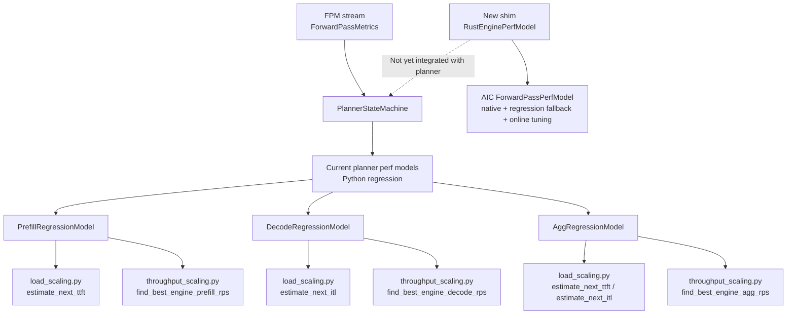
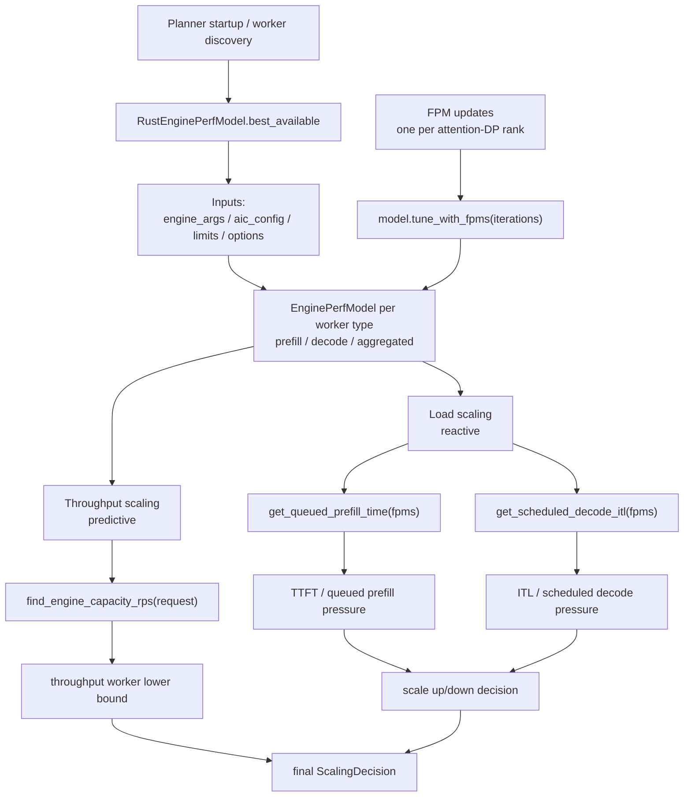
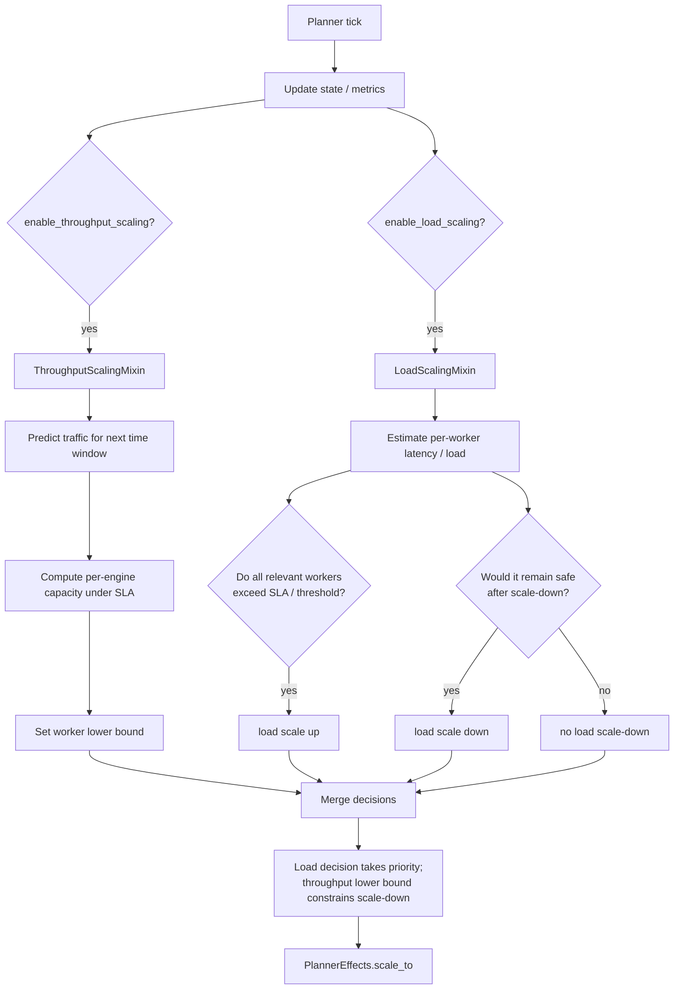
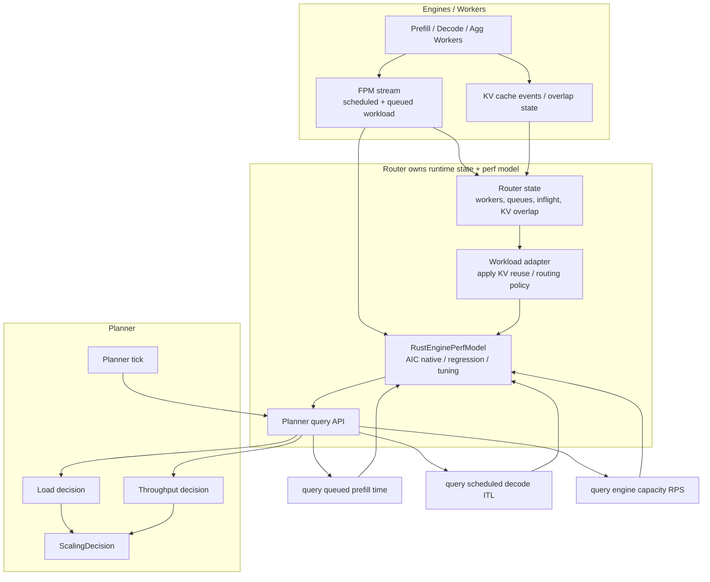
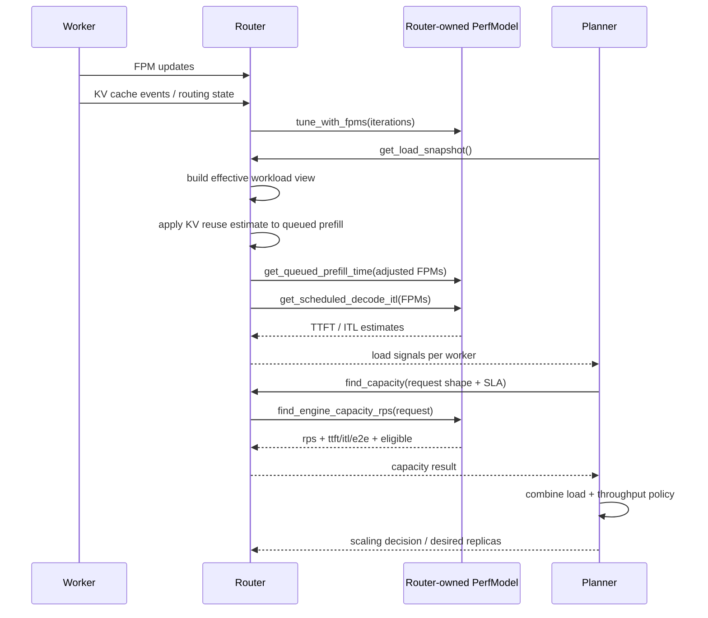
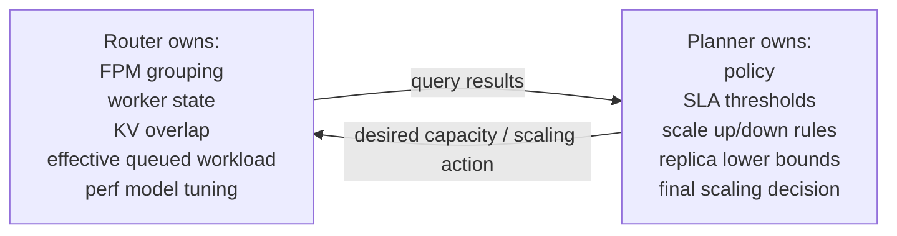
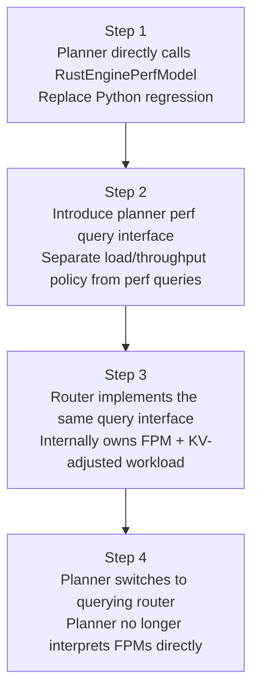

# Perf Model Ownership Design Discussion Draft

## Background

We currently have two possible integration approaches:

1. **Planner directly calls the mocker shim / AIC FPM perf model**
   - The planner consumes FPM state directly, or consumes aggregated FPM state.
   - The planner calls `RustEnginePerfModel` directly from load scaling and throughput scaling.

2. **Router owns the perf model, and planner queries router**
   - The router owns worker runtime state, FPMs, KV cache overlap / reuse views, and the perf model.
   - The planner does not interpret FPMs directly. Instead, it queries the router for semantic load and capacity results.

The two options are described together below to make ownership boundaries and migration paths easier to discuss.

---

## Option 1: Planner Directly Calls the Shim

### Current State

The current PR already exposes the Rust shim:

- Rust: `EnginePerfModel`
- Python: `RustEnginePerfModel`
- Backed by AIC `ForwardPassPerfModel`
- Supports:
  - `best_available(...)`
  - `estimate_forward_pass_time(...)`
  - `tune_with_fpms(...)`
  - `get_queued_prefill_time(...)`
  - `get_scheduled_decode_itl(...)`
  - `find_engine_capacity_rps(...)`

However, the planner is not yet wired to the shim. The current planner still uses Python regression models directly:

- `PrefillRegressionModel`
- `DecodeRegressionModel`
- `AggRegressionModel`

### Flow Diagram



### Target Integration



### Planner Internal Decision Layer



### Semantic Notes

With this option, the planner is responsible for preparing the shim inputs.

Key differences:

- The old planner `estimate_next_ttft()` treats `queued_prefill_tokens + avg_isl` as the work in front of the next request.
- The new shim `get_queued_prefill_time()` only estimates the queued prefill drain time provided by the caller. It does not automatically add a hypothetical next request.
- The old planner `estimate_next_itl()` adds learned average decode length / request count.
- The new shim `get_scheduled_decode_itl()` only estimates the scheduled decode workload provided by the caller.
- The current FPM queued-prefill fields contain raw prompt tokens only. They do not include KV reuse information.
- If the planner wants to account for prefix cache / KV reuse, it must adjust queued prefill tokens before calling the shim.

### Benefits

- Short implementation path. The planner can directly replace Python regression models.
- Planner load / throughput policy context stays local, making incremental migration easier.
- The shim API is already close to the three main query types the planner needs today.

### Risks

- The planner continues to own a significant amount of runtime workload interpretation logic.
- Details such as KV reuse, preempted decode, waiting KV transfer, and attention DP may leak into planner logic.
- The router is already closer to routing and cache state. Having the planner interpret these states may duplicate responsibility.

---

## Option 2: Router Owns Perf Model, Planner Queries Router

### Core Idea

The router owns the information closest to real-time scheduling:

- worker list and worker state
- in-flight / queued request views
- FPM stream
- KV cache events
- prefix overlap / cache reuse estimates
- routing-policy-related state

Therefore, the router can own the perf model and expose semantic queries to the planner. The planner does not interpret FPMs directly; it only owns scaling policy.

### High-Level Flow Diagram



### Sequence Diagram



### Ownership Boundary



### Possible Router API

```text
RouterPerfService
  # Router continuously consumes FPM / KV events internally,
  # updates state, and tunes the perf model.

  get_worker_load(worker_id)
    -> queued_prefill_time
    -> scheduled_decode_itl
    -> diagnostics

  find_engine_capacity(worker_type, request_shape, sla, optimization_target)
    -> rps
    -> ttft / itl / e2e
    -> eligible

  get_cluster_capacity(request_shape, sla)
    -> per-worker capacity
    -> aggregate capacity
    -> bottleneck worker type

  get_scaling_inputs()
    -> load signals
    -> throughput lower-bound inputs
    -> model diagnostics
```

### Benefits

- The router is better positioned to handle KV reuse because it already has routing and cache-overlap views.
- The planner does not need to understand FPM schema details. Differences between FPM v0/v1/v2 can remain in the router/perf layer.
- Runtime details such as attention DP, preempted decode, and waiting KV transfer can be normalized at the router layer.
- The planner stays a policy engine: it scales based on semantic load and capacity signals.

### Risks

- The router API must be designed carefully; otherwise, it may become a remote view of planner-internal state.
- The planner scaling tick becomes dependent on router query latency and consistency.
- The router becomes heavier because it owns perf model tuning and capacity queries.
- In multi-router / multi-replica deployments, the scope of perf model state must be defined clearly: per-router, locally aggregated, or globally aggregated.

---

## Comparison of the Two Options

| Dimension | Planner directly calls shim | Router owns perf model |
| --- | --- | --- |
| Short-term implementation cost | Low | Medium to high |
| FPM schema complexity | Handled by planner | Handled by router/perf layer |
| KV reuse | Planner adjusts inputs before calling shim | Router adjusts using cache/routing state |
| Attention DP / rank grouping | Planner must pass the correct FPM list | Router normalizes internally |
| Planner responsibility | Policy + workload interpretation | Policy only |
| Router responsibility | Routing/cache state | Routing/cache state + perf model |
| Distance from current code | Closest | Requires new query API |
| Long-term ownership boundary | Easier to blur | Cleaner |

---

## Discussion Questions

1. Should the planner consume FPMs directly, or should it only consume semantic load signals exposed by the router?
2. Where should KV reuse be applied?
   - Planner-side input adjustment
   - Router workload adapter
   - Future FPM schema extension
3. What should the state scope of a router-owned perf model be?
   - per worker
   - per router process
   - per deployment / global
4. When the planner queries the router, is snapshot consistency required?
   - Should all worker state within a single planner tick come from the same point in time?
   - Is an eventually consistent signal acceptable?
5. Should capacity queries return per-worker capacity from the router, or should the router return aggregate cluster capacity directly?
6. Do we need an intermediate state?
   - First, planner directly calls the shim.
   - Later, FPM grouping / KV adjustment moves down into the router.
   - Finally, planner switches to querying the router.

---

## Suggested Migration Path



In the short term, Option 1 can reduce integration risk by validating the shim and AIC native/fallback behavior. In the medium to long term, if the team agrees that the router is the right owner for runtime and cache state, Option 2 can become the target architecture.
