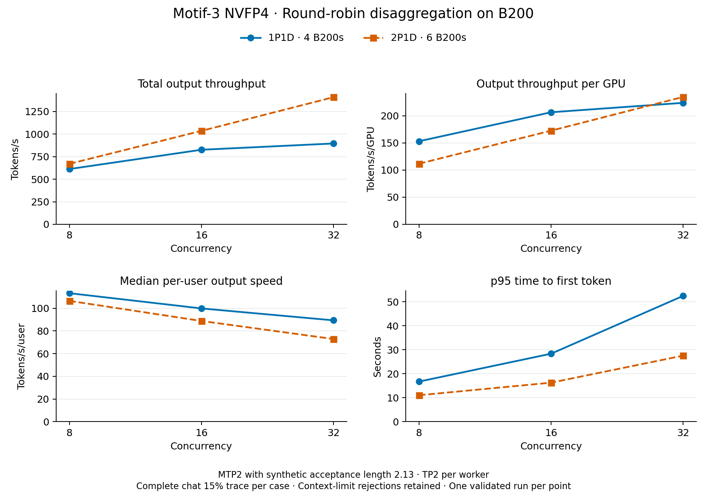

<!--
SPDX-FileCopyrightText: Copyright (c) 2025-2026 NVIDIA CORPORATION & AFFILIATES. All rights reserved.
SPDX-License-Identifier: Apache-2.0
-->

# Motif-3 B200 round-robin baseline comparison

All six cases passed the client and runtime audits.

Measurements use round-robin routing and MTP2 with synthetic acceptance length 2.13. They do not establish real speculative acceptance or output quality. Each worker uses TP2: 1P1D uses four B200s and 2P1D uses six.

The benchmark uses `nvcr.io/nvidia/ai-dynamo/vllm-runtime:1.5.0-motif-3-dev.1` at `sha256:76e2612108f820640ff1d5a00542b41c909a0e6a473ed02b700c817b34f65878` with the guarded Motif NIXL startup fix. The published recipe now uses a separate baked image with KV-aware routing and real MTP2 verification. Its functional smoke evidence is recorded separately; these measurements do not establish that recipe's throughput or a KV-routing speedup.

| Layout | Concurrency | GPUs | Output tok/s | Output tok/s/GPU | User tok/s mean | User tok/s median | TTFT mean (ms) | TTFT p50 (ms) | TTFT p95 (ms) | Cache read (%) | Success | Context rejects |
|---|---:|---:|---:|---:|---:|---:|---:|---:|---:|---:|---:|---:|
| 1p1d | 8 | 4 | 612.37 | 153.09 | 140.62 | 113.33 | 4245.72 | 2020.20 | 16691.92 | 8.73 | 1767 | 38 |
| 1p1d | 16 | 4 | 826.15 | 206.54 | 129.87 | 99.88 | 9381.05 | 7005.30 | 28318.30 | 8.73 | 1767 | 38 |
| 1p1d | 32 | 4 | 895.58 | 223.89 | 117.81 | 89.36 | 23958.84 | 21497.07 | 52446.97 | 8.73 | 1767 | 38 |
| 2p1d | 8 | 6 | 670.00 | 111.67 | 124.54 | 106.55 | 2526.09 | 757.82 | 11002.92 | 8.54 | 1767 | 38 |
| 2p1d | 16 | 6 | 1035.45 | 172.57 | 101.65 | 88.81 | 4092.70 | 1668.59 | 16240.29 | 8.48 | 1767 | 38 |
| 2p1d | 32 | 6 | 1408.83 | 234.81 | 83.09 | 72.87 | 8586.87 | 5897.96 | 27525.84 | 8.48 | 1767 | 38 |

At C32, 2P1D delivered 57.3% more total output tokens/s and 4.9% more output tokens/s/GPU. Its p50 TTFT was 5.90 s versus 21.50 s, while median per-user output rate was lower: 72.87 versus 89.36 tokens/s. At C8 and C16, 2P1D improved total throughput and TTFT but had lower throughput per GPU. These are observations from one validated run per point.

The complete 1,805-row chat 15% trace is replayed once per case, without further sampling or clipping. The pinned tokenizer identifies 38 requests beyond the 262,144-token context limit. Rejected rows are retained and verified against frontend errors. Throughput counts successful output tokens over the recorded benchmark duration; per-GPU throughput divides by every prefill and decode GPU. TTFT and per-user rates summarize successful requests. Very short outputs can inflate the arithmetic mean per-user rate, so the median is also shown. Cache read percentage uses the totals of successful server-reported cached prompt tokens and prompt tokens, checked against the per-request records.

Caches are reset before each independent case after separate warmup. Runtime audits verify worker continuity, configuration, GPU counts and successful NIXL transfers without transfer errors or expired leases. Preemptions are recorded in the CSV. Case timestamps and measured artifact hashes are in [provenance.json](provenance.json). Full audits and raw logs are retained locally.

After a shared-volume quota interrupted an incomplete 2P1D run, the three 2P1D cases were restarted with artifacts and the tokenizer-only client cache on pod-local storage. The shared model/trace volume was mounted read-only by the client. The trace, client dependency pins, tokenizer files, benchmark configurations, and serving settings were preserved. The interrupted run is excluded from this comparison.

A prior 1P1D C32 replay was repeated because rotated frontend logs prevented complete rejection-cause verification. That unverified attempt is excluded; the table contains one validated measurement per point.

1P1D C8 was recovered from attempt4 after AIPerf completed successfully and the wrapper failed to import its audit module. Its original failure snapshot provides the post-case runtime and frontend evidence; the missing FINISHED marker was not fabricated. Other cases come from completed attempt directories. These are separate measurements at different times, with the same image digest and serving parameters.

1P1D C8 hardware evidence consists of archived two-GPU worker specs and placement on inventoried B200 nodes. Its per-pod GPU UUID dumps were not captured. Resumed worker startup logs include direct nvidia-smi inventories.

The model is `Motif-Technologies/Motif-3-NVFP4` at revision `79f2fad1f8229f5db8a7ad08bbd24a20d6fb0bff`. Both worker roles use TP2, DP1, expert parallelism, BF16 activations, ModelOpt NVFP4 weights, FP8 KV cache, 128-token blocks, a 262,144-token context, 0.85 GPU memory utilization, prefix caching, the V2 model runner, and asynchronous scheduling. NIXL transfers KV data through UCX. The frontend uses the Motif chat, tool, and reasoning parsers.

The historical [round-robin serving manifests](https://github.com/ai-dynamo/dynamo/tree/9b61fbb13ce2087b5a96ac87ce3754bb29c85c18/recipes/motif-3/vllm/disagg-b200-chat) record the baseline command-line configuration and guarded runtime patch. The measured deployment selects `speculative-config-synthetic`, sets `PYTHONHASHSEED=0`, and adds site placement and CPU/memory reservations. The resumed launcher also logs the GPU inventory; its patch payloads are unchanged. Prefill workers share one eight-B200 host, and decode runs on a separate host. The runs use four or six GPUs across those two hosts.

AIPerf 0.13.0 streams chat requests with server-reported token counts, sequential trace replay, seed 42, temperature 0, and `ignore_eos=true`. The tokenizer client uses Transformers 5.19.0, Tokenizers 0.23.2, and huggingface-hub 1.33.0 with a tokenizer-only cache. A separate five-request warmup precedes measurement.

[Full numerical results](comparison.csv) · [Observed signed differences](deltas.csv) · [Vector plot](comparison.svg)

There is one validated run per point. The signed differences are 2P1D minus 1P1D at the same concurrency; relative differences divide by the 1P1D value. No repeat was added solely to construct confidence intervals. No empirical run-to-run noise floor or confidence interval was measured, and historical neighbour occupancy was not captured continuously. These observations do not support a claim of statistical separation, an adoption decision based on a small difference, or a full-node or fleet projection.

The CSV's NIXL counts describe recorded transfer operations across the worker ranks; they are not request counts. Request completion and context rejections are verified separately from the transfer metrics.
