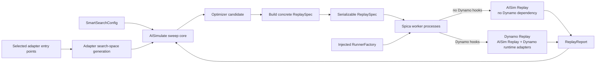

<!--
SPDX-FileCopyrightText: Copyright (c) 2026 NVIDIA CORPORATION & AFFILIATES. All rights reserved.
SPDX-License-Identifier: Apache-2.0
-->

# Spica / AISimulate Dynamo Decoupling Refactor Plan

## Summary

This refactor establishes `aisimulate` as a Dynamo-independent simulation and
sweep package while keeping it in the Dynamo repository for now.

- `aisimulate` retains simulation backend functionality, Spica core sweep logic,
  scoring, parallel execution, and public simulation protocols.
- `aisimulate` does not depend on or statically import `ai-dynamo`.
- Dynamo Planner and Router simulation behavior moves into adapters under their
  corresponding Dynamo components and is loaded only when selected.
- KVBM sweep support is removed without a compatibility layer; native G2 support
  is out of scope for this refactor.
- Spica owns process management, parallelism, candidate timeouts, and result
  collection. Actual replay execution is provided through an injected
  `RunnerFactory`.
- Replay is being decoupled in parallel: backend-only Spica calls standalone
  Dynamo-independent AISim Replay, while Spica with Dynamo adapters calls the
  Dynamo Replay composition built on top of the same AISim Replayer.
- The eventual physical move of the core/backend package to the AIConfigurator
  repository is out of scope, but the resulting package boundary must allow that
  move without further Dynamo-specific cleanup.



## Public Configuration

Core and adapter search spaces are explicitly separated:

```yaml
search_space:
  model_name: Qwen/Qwen3-32B
  hardware_sku: h200_sxm
  gpu_budget: 32
  backend: [vllm, sglang]
  deployment_mode: [agg, disagg]

adapters:
  dynamo.planner:
    search_space:
      scaling_policy: [disabled, throughput_180_5, load_180_5]
      fpm_sampling: [default, fine]
      load_sensitivity: [default, conservative]
      load_predictor_candidates: [constant_last, prophet_w20_raw]

  dynamo.router:
    search_space:
      mode: [round_robin, kv_router]
      overlap_score_credit: [0.0, 0.5, 1.0]
      prefill_load_scale: [0.0, 1.0, 4.0]
      temperature: [0.0, 0.2]
```

The adapter receives a search space, not a concrete Planner or Router
configuration. A concrete configuration is generated only when materializing an
optimizer candidate.

The new schema is intentionally breaking:

- Old flat Planner and Router fields are not converted automatically.
- Validation errors identify the replacement
  `adapters.<adapter-name>.search_space` path.
- Removed KVBM fields produce a specific error explaining that no native G2
  migration exists yet.

## Adapter ABI v1

The core defines a Dynamo-neutral adapter protocol:

```python
class SimulationAdapter(Protocol):
    name: str
    api_version: int

    def generate_search_space(
        self,
        search_spec: Mapping[str, JSONValue],
        context: SweepContext,
    ) -> AdapterSearchPlan:
        ...

    def materialize_replay(
        self,
        plan: AdapterSearchPlan,
        selection: Mapping[str, JSONValue],
        context: CandidateContext,
    ) -> AdapterReplaySpec:
        ...
```

The supporting contracts have the following responsibilities:

- `SweepContext` exposes immutable core context such as workload, optimization
  goal, SLA, and backend search context.
- `AdapterSearchPlan` contains a generic `SearchSpaceFragment`, adapter-owned
  prepared state, and optional preparation diagnostics.
- Core automatically namespaces every adapter parameter using the adapter name.
- `CandidateContext` contains the selected core/backend candidate and resolved
  values such as backend version, concurrency, and parallel configuration.
- `AdapterReplaySpec` contains the candidate-specific adapter configuration and
  serializable runtime-hook descriptors.
- Adapter code neither constructs a shell command nor runs replay.
- The initial resolver requires exact `api_version == 1`; incompatible adapters
  fail before the optimizer starts.

### Planner pre-sweep

The Planner adapter preserves the existing load-predictor pre-sweep:

1. Decode scaling policies and extract distinct throughput intervals.
2. For a trace workload, run the independent predictor grid search once per
   interval and record the winner and loss diagnostics.
3. Return the Planner parameters used by the main optimizer together with this
   prepared state.
4. During candidate materialization, select the predictor winner corresponding
   to that candidate's scaling interval.
5. Preserve the current constant-predictor fallback for non-trace or
   non-informative workloads.

Planner goal mapping, SLA compatibility filtering, and policy pruning are owned
by this adapter rather than the sweep core.

## Adapter Discovery

The `ai-dynamo` wheel registers the adapters through Python package metadata:

```toml
[project.entry-points."aisimulate.adapters"]
"dynamo.planner" = "dynamo.planner.simulation:create_adapter"
"dynamo.router" = "dynamo.router.simulation:create_adapter"
```

Resolution follows these rules:

1. Resolve only adapter names present in the input configuration.
2. A programmatically injected adapter with the same name takes precedence,
   enabling tests and embedded use without installed entry-point metadata.
3. Otherwise query the `aisimulate.adapters` entry-point group and call `.load()`
   only on the selected provider.
4. Reject missing adapters, duplicate registrations, invalid factories, and ABI
   mismatches with separate actionable errors.
5. Do not provide a hard-coded Dynamo import fallback.

Reading entry-point metadata does not import Dynamo. Dynamo is imported only
when a selected Dynamo provider is loaded.

## Replay and Runner ABI

Spica exposes an injected runner boundary:

```python
class RunnerFactory(Protocol):
    def capabilities(self) -> RunnerCapabilities:
        ...

    def create(self, worker_id: int) -> Runner:
        ...


class Runner(Protocol):
    def run(self, spec: ReplaySpec) -> ReplayReport:
        ...

    def close(self) -> None:
        ...
```

The public sweep entry point becomes:

```python
run_smart_search(
    config,
    *,
    runner_factory,
    adapters=None,
    sampler_factory=...,
    ...
)
```

Runner behavior is constrained as follows:

- `runner_factory` is a required keyword-only argument; core provides no Dynamo
  default Runner.
- The factory must be multiprocessing-serializable.
- Before starting the optimizer, Spica compares every requested runtime hook
  with `RunnerFactory.capabilities()` and fails early if the selected replay
  composition cannot execute it.
- Each worker creates and reuses one Runner, then closes it during worker
  shutdown.
- Spica retains ownership of worker processes, evaluation parallelism,
  per-candidate timeouts, worker crash handling, progress reporting, and result
  collection.
- Adapter preparation and candidate materialization run in the main process.
  Workers receive only a serializable `ReplaySpec`.
- The effective-candidate cache key is derived from the canonical `ReplaySpec`
  rather than the raw optimizer selection. This collapses choices ignored by an
  adapter, such as Router knobs under round-robin routing.

### ReplaySpec

`ReplaySpec` is a strict, serializable core model containing:

- backend deployment and engine specification;
- resolved backend version, parallel configuration, worker counts, and
  concurrency;
- workload and SLA measurement information;
- namespaced `AdapterReplaySpec` objects;
- runtime hooks represented as
  `RuntimeHookSpec(provider, kind, api_version, config)`.

Runtime hook descriptors contain data, not Python callback objects. The injected
Runner owns hook resolution and invocation.

`RunnerCapabilities` declares the supported `ReplaySpec` version and runtime
hook provider/kind/version tuples. A Dynamo-independent AISim Replay runner
supports the neutral spec and built-in policies only. A Dynamo Replay runner
adds support for the selected Dynamo Router and Planner hook contracts.

`ReplayReport` contains at least:

```python
class ReplayReport:
    metrics: dict[str, float]
    metadata: dict[str, JSONValue]
```

The core reads `metrics` for feasibility checks, scalar scoring, goodput
validation, and Pareto ranking. Runner- or adapter-specific diagnostics remain in
`metadata`.

## Parallel Replay Refactor

Spica and Replay are separate parallel workstreams joined by the AISim-owned
`ReplaySpec`, `ReplayReport`, runtime-hook, and runner contracts. Neither
workstream waits for the other's concrete implementation after these contracts
and their fixtures are frozen.

There is one Spica core and one AISim Replayer, with two compositions rather
than two forked implementations:

| Path | Spica composition | Replay composition |
| --- | --- | --- |
| Backend-only | AISimulate Spica without Dynamo adapters | AISim Replay with built-in neutral placement, initially round-robin |
| Dynamo features | The same Spica core with selected Dynamo search adapters | Dynamo Replay, which reuses AISim Replay and injects Dynamo Router and/or Planner runtime policies |

The dependency direction is:

```text
backend-only Spica -> AISim Replay -> Generalized Mocker Engine

Dynamo-enabled Spica -> Dynamo Replay -> AISim Replay -> Generalized Mocker Engine
                              |
                              +-> Dynamo Router and Planner runtime adapters
```

The Spica-side entry point and Replay-side runtime hook have different jobs:

- The Spica adapter validates an adapter-owned search space, performs optional
  preparation such as the Planner load-predictor pre-sweep, and materializes
  serializable policy configuration into `ReplaySpec`.
- AISim Replay owns the virtual clock, event loop, worker fleet, built-in neutral
  policies, and base report. It has no Dynamo dependency.
- Dynamo Replay resolves the runtime-hook descriptors, constructs the Dynamo
  `PlacementPolicy` and `ScalingPolicy` adapters, and injects them into the same
  AISim Replayer. It does not implement a second replay loop.

During parallel development, Spica is implemented and tested against a contract
`RunnerFactory`; Replay is implemented against versioned `ReplaySpec` fixtures.
No temporary import of the current `dynamo.replay` is added back to AISimulate.
If an integration bridge is temporarily required, it lives on the Dynamo Replay
side and implements the same runner contract.

## Code Separation

### AISimulate core

Retain and generalize:

- Vizier-backed sampling, branch enumeration, ask/tell orchestration, and
  parallel projection.
- Backend engine parameters, model/hardware resolution, and legal parallel
  configuration enumeration.
- Generic GPU KV-capacity estimation and `kv_load_ratio`; these are not KVBM
  features.
- Workload, optimization goals, SLA, scoring, Pareto ranking, and candidate
  models.
- Adapter discovery and ABI models.
- `ReplaySpec`, `ReplayReport`, `Runner`, and `RunnerFactory` protocols.
- Backend-only sample materialization.

Refactor or remove:

- Replace the mixed `DeploymentPlan` with a backend-only
  `BackendDeploymentSpec`.
- Remove `ReplayEvaluator` calls to `dynamo.replay`, `dynamo.mocker`, and
  `KvRouterConfig`.
- Remove Planner presets, predictor search, Planner goal mapping, policy
  filtering, and Planner config generation from core.
- Remove Router search fields, conditional pruning, and Router config generation
  from core.
- Replace `dynamo._internal.aic` exception imports with a local or
  AIConfigurator-owned exception.
- Remove the standalone sweep CLI execution path. `python -m
  aisimulate.spica` should emit a concise error directing callers to the Python
  API and required `RunnerFactory`.
- Remove the `ai-dynamo` dependency and move Planner-only predictor
  dependencies out of the `aisimulate` package.

### Dynamo Planner adapter

Place the Planner adapter under the Planner component. It owns:

- Planner search-space schema and preset decoding;
- scaling, FPM sampling, and load-sensitivity parameters;
- goal-to-Planner optimization-target mapping;
- SLA and scaling-policy compatibility checks;
- load-predictor trace aggregation and pre-sweep;
- candidate-specific Planner config generation;
- Planner runtime-hook descriptors and factories.

### Dynamo Router adapter

Place the Router adapter under the Router component. It owns:

- round-robin and KV-routing search dimensions;
- Router-specific conditional pruning and validation;
- candidate-specific Router config generation;
- Router runtime-hook descriptors and factories.

Planner-only optional dependencies move to a Dynamo simulation extra. The
dependency direction is:

```text
ai-dynamo[simulation] -> aisimulate
```

No dependency from `aisimulate` to `ai-dynamo` is permitted.

## KVBM Removal

Remove the following from schema, search-space generation, candidate
materialization, deployment/replay specifications, tests, examples, and
documentation:

- `num_g2_blocks`
- `kv_bytes_per_token`
- `bandwidth_g1_to_g2_gbps`
- `bandwidth_g2_to_g1_gbps`
- `offload_batch_size`
- `host_cache_hit_weight`
- `disk_cache_hit_weight`

Input containing any of these fields fails validation with a message stating
that KVBM support has been removed and that native G2 is not part of this
refactor.

GPU KV capacity, memory-utilization settings, and `kv_load_ratio` remain because
they model backend/GPU behavior independently of KVBM.

## Implementation Sequence

1. Freeze the shared contract first in the Dynamo Enhancement Proposal:
   Adapter ABI v1, ReplaySpec v1, RuntimeHookSpec, RunnerCapabilities,
   RunnerFactory, ReplayReport, and canonical serialized fixtures.
2. In the Spica workstream, add the core protocols, entry-point resolver,
   namespaced adapter configuration, and contract fake runner.
3. Refactor the Spica search loop to perform adapter preparation, merge search
   spaces, build a concrete ReplaySpec, validate runner capabilities, execute
   through Runner, and score ReplayReport.
4. In parallel, the Replay workstream extracts AISim Replay and the Generalized
   Mocker Engine without Dynamo dependencies, then implements the
   Dynamo-independent RunnerFactory.
5. On the Dynamo side, implement Dynamo Replay as a composition over AISim
   Replay, resolve the Router and Planner runtime hooks, and expose a
   Dynamo-capable RunnerFactory.
6. Move Planner and Router search behavior into their component adapters and
   register their Spica entry points.
7. Remove the mixed DeploymentPlan/ReplayEvaluator path, KVBM fields, legacy
   flat schema, direct Dynamo imports, and unused dependencies.
8. Run the shared contract suite followed by backend-only and Dynamo-enabled
   end-to-end integration, then update installation and sweep examples.

Each workstream remains buildable against the frozen contract and fake fixtures.
The real integration path is enabled only when Spica and the selected replay
composition advertise compatible contract versions; no unversioned intermediate
API is accepted.

## Test Plan

### Core isolation

- Install and import `aisimulate` in an environment without `ai-dynamo`.
- Run a backend-only sweep with a fake `RunnerFactory`.
- Assert that backend-only execution does not add `dynamo` modules to
  `sys.modules`.
- Add a source/import firewall preventing `aisimulate` from importing
  `dynamo.*`.
- Verify the `aisimulate` wheel dependency metadata does not contain
  `ai-dynamo`.

### Adapter discovery and ABI

- No adapter is loaded when `adapters` is empty.
- Only explicitly selected entry points are loaded.
- Cover missing adapter, duplicate entry point, invalid factory, provider import
  failure, and ABI mismatch.
- Verify programmatic injection overrides an installed provider of the same
  name.
- Verify the built `ai-dynamo` wheel advertises both adapter entry points.

### Planner adapter

- Validate Planner search-space inputs independently of core.
- Cover scaling-interval extraction and one predictor pre-sweep per distinct
  interval.
- Cover trace winners, short-trace fallback, non-trace fallback, and predictor
  diagnostics.
- Cover goal/SLA policy filtering, including e2e-only SLA behavior.
- Verify candidate selection produces the expected concrete Planner config and
  runtime-hook descriptors.

### Router adapter

- Validate round-robin and KV-routing spaces.
- Verify round-robin omits KV Router runtime hooks.
- Verify KV Router choices produce the expected concrete config and hooks.
- Verify inactive Router knobs do not create different effective ReplaySpecs.

### Runner and sweep orchestration

- Round-trip serialize every ReplaySpec model.
- Validate ReplaySpec and runtime-hook requirements against RunnerCapabilities
  before starting the optimizer.
- Create one Runner per worker and close it on normal and abnormal shutdown.
- Cover sequential and spawned parallel execution.
- Preserve candidate timeout, worker crash, runner exception, failed candidate,
  progress, result cache, and optimizer ask/tell behavior.
- Preserve scalar, goodput, and Pareto scoring from `ReplayReport.metrics`.
- Exercise Planner and Router adapters together and verify their parameters,
  configs, and hooks remain namespaced.

### Cross-workstream Replay contract

- Use the same canonical ReplaySpec fixtures in the Spica and Replay test suites.
- Run a backend-only Spica candidate through AISim Replay without installing or
  importing Dynamo.
- Run Planner- and Router-enabled candidates through Dynamo Replay and verify it
  reuses the AISim Replayer while constructing the requested runtime policies.
- Reject a Dynamo runtime hook when the caller injects the
  Dynamo-independent AISim Replay RunnerFactory.
- Verify the same base ReplayReport metrics and serialization version across
  AISim Replay and Dynamo Replay when no Dynamo runtime hook is selected.
- Add dependency firewalls proving AISim Replay and the Generalized Mocker
  Engine have no Dynamo workspace or Python dependencies.

### Breaking schema and KVBM

- Every old flat Planner/Router field emits a clear replacement path.
- Every removed KVBM field emits the dedicated removal error.
- Candidate output uses backend plus namespaced adapter configurations.
- Existing backend-only candidate and scoring fixtures remain equivalent.
- Planner/Router fixtures compare generated ReplaySpecs with the behavior of the
  current implementation, excluding KVBM.

## Acceptance Criteria

- `aisimulate` source and package metadata have no dependency on Dynamo.
- A backend-only sweep completes without Dynamo installed or imported.
- Selecting a Dynamo adapter imports only its registered provider.
- Planner and Router search spaces are supplied through their adapters, and
  concrete configs are produced only during candidate materialization.
- Planner load-predictor pre-sweep retains its existing interval-dependent
  behavior.
- Spica requires an injected `RunnerFactory` and continues to own evaluation
  process lifecycle and timeouts.
- Backend-only Spica invokes Dynamo-independent AISim Replay.
- Spica with Dynamo adapters invokes Dynamo Replay, which composes the same AISim
  Replayer with Dynamo runtime policies instead of forking the replay loop.
- A runner/spec capability mismatch fails before any candidate execution.
- KVBM fields and behavior are fully removed with explicit validation errors.
- The core/backend package can later move to the AIConfigurator repository
  without removing additional Dynamo-specific logic.

## Out of Scope

- Physically moving `aisimulate` to the AIConfigurator repository.
- Implementing native G2 support.
- Replay event-loop and Generalized Mocker Engine implementation details; those
  belong to the parallel Replay workstream, while their public contract and
  Spica integration are in scope here.
- Maintaining compatibility with the old flat Planner/Router/KVBM schema.
