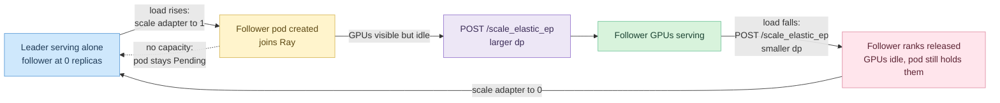
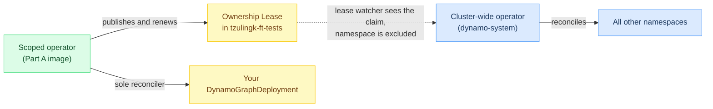

<!--
SPDX-FileCopyrightText: Copyright (c) 2026 NVIDIA CORPORATION & AFFILIATES. All rights reserved.
SPDX-License-Identifier: Apache-2.0
-->

# Runbook — building and testing the on-demand elastic EP follower

This runbook hands off work in progress on operator support for on-demand elastic expert-parallel
followers. The design lives in
[`docs/design-docs/operator-elastic-ep-follower.md`](../docs/design-docs/operator-elastic-ep-follower.md);
which holds the full reasoning and is worth reading first. This document covers only what has been
done, what remains, and how to finish it: build two ARM64 images from the branches below, deploy
them to a GB200 cluster, and confirm the two code changes behave as intended against a real vLLM
engine.

## Table of contents

- [What the feature does](#what-the-feature-does)
- [What has already been established](#what-has-already-been-established)
- [The two changes under test](#the-two-changes-under-test)
- [Branch state](#branch-state)
- [Environment and prerequisites](#environment-and-prerequisites)
- [Part A — build and push the images](#part-a--build-and-push-the-images)
- [Part B — install a scoped test operator](#part-b--install-a-scoped-test-operator)
- [Part C — run the test](#part-c--run-the-test)
- [Pass criteria](#pass-criteria)
- [Known blockers](#known-blockers)
- [Leftovers to clean up](#leftovers-to-clean-up)

## What the feature does

A leader pod serves the model alone. When load rises, a follower pod is created, joins the leader's
Ray cluster, and lends its GPUs to the expert-parallel group. When load falls the reverse happens
and the GPUs go back to the cluster. The point is that nothing is reserved while the follower is
absent, which rules out the warm-standby topology used by the existing bare vLLM test, where an
idle worker pod holds GPUs from the start.

Attaching is two ordered steps, and most of the difficulty lives in the gap between them.
Kubernetes first makes the follower pod exist and the pod joins Ray, which makes its GPUs *visible*
but still idle. Only a subsequent `scale_elastic_ep` call on the leader makes vLLM create ranks on
them. Detaching runs the same two steps in reverse: shrink the engine first, then remove the pod so
its GPUs are released.



## What has already been established

Two cluster experiments settled the shape of the design; neither needs repeating, but their
conclusions explain why the test below looks the way it does.

The first asked whether a Grove `PodClique` can rest at zero replicas. It cannot be declared that
way: Grove's validating webhook rejects `minAvailable: 0`, its defaulting webhook rewrites
`replicas: 0` to `1`, and the clique list is immutable after creation so a follower clique cannot
be added later. Scaling an existing clique to zero afterwards does work and is durable.

The second experiment was more decisive. Deploying the same leader-plus-parked-follower
DynamoGraphDeployment on both pathways showed that **on Grove a component at zero replicas leaves
the leader `SchedulingGated` and the whole deployment `pending`**; scaling the follower to one
released the leader immediately, proving the zero-replica member was the cause. This reproduces
[grove#676](https://github.com/ai-dynamo/grove/issues/676). On the non-Grove pathway the same spec
worked out of the box: the leader ran immediately, the follower Deployment sat at `0/0`, and a full
`0 → 1 → 0` cycle left the leader's pod untouched.

Consequently **v1 runs on the non-Grove pathway**, selected per deployment with the annotation
`nvidia.com/enable-grove: "false"`. Grove remains the eventual target, pending upstream support for
zero-replica gang members.

The scaling mechanism needs no new code. Setting `scalingAdapter: {}` on a component makes the
operator create a `DynamoGraphDeploymentScalingAdapter` carrying a real `/scale` subresource that
targets that one component, drivable with plain `kubectl scale`.

## The two changes under test

Everything above was verified with busybox stand-ins, so **neither code change has yet run against
a real vLLM engine**. That is the entire purpose of this runbook.

The operator change in `deploy/operator/internal/dynamo/backend_vllm.go` makes a *single-pod*
elastic EP component start a Ray head. Previously only a multi-node leader received the Ray launch
wiring, so a solo leader came up with no Ray cluster for followers to join later. A single-pod
component is expanded as `RoleMain`, never `RoleLeader`, so the leader arm now matches both roles.

The engine change in `components/src/dynamo/vllm/handlers.py` replaces a hardcoded
`new_data_parallel_size < 2` rejection with the constraint vLLM actually enforces, namely that
`tensor_parallel_size * data_parallel_size` must exceed one. The old floor made `dp=1` impossible
even when tensor parallelism alone already provides several expert-parallel ranks, which is exactly
the state a fully drained follower leaves behind.

## Branch state

Three branches, each independent and cut from `main` at `36e8f4a4c0`. They touch disjoint files, so
they can be built, reviewed, and merged separately. Rebasing onto current `main` is advisable, as
`main` has moved on since they were cut.

| Branch | Contents |
|---|---|
| `tzulingk/elastic-ep-p0-grove-spike` | Design document and the Phase 0 Grove spike manifest with its recorded results. Documentation only. |
| `tzulingk/elastic-ep-scale-floor` | The `handlers.py` scale-floor fix plus `components/src/dynamo/vllm/tests/test_vllm_elastic_ep_handlers.py`. |
| `tzulingk/elastic-ep-p2-ray-head` | The `backend_vllm.go` Ray-head change plus cases added to `backend_vllm_test.go`. |

Unit tests on both code branches pass locally. The Go tests were confirmed to fail without the
production change and pass with it.

## Environment and prerequisites

Testing has been done on the Teleport context
`nv-prd-dgxc.teleport.sh-dynamo-aws-dev-01`, namespace `tzulingk-ft-tests`. Despite the name, this
cluster's GPU nodes are GB200: **arm64, four GPUs each**, all sixteen sharing one NVLink clique, so
MNNVL is available between any pair. Grove `v0.1.0-alpha.11`, kai-scheduler, and the Dynamo operator
are all installed cluster-wide. The namespace already has a large RWX `shared-model-cache` PVC and
an `nvcr-imagepullsecret`.

All images must be **arm64**. An Apple Silicon machine builds them natively.

Before starting, confirm the Teleport session is live (`tsh status`), Docker is running, and the
namespace has an `hf-token-secret` — it did not exist at handoff time and gated models need it.
Follow the credential steps in the
[image push guide](https://gitlab.com/tzulingk/wideep-ft/-/blob/main/fault_tolerance_tests/image/pull_push_image.md);
in short, export `NGC_API_KEY`, then:

```bash
export NAMESPACE=tzulingk-ft-tests
echo $NGC_API_KEY | docker login nvcr.io --username '$oauthtoken' --password-stdin
kubectl create secret generic hf-token-secret --from-literal=HF_TOKEN=<your-hf-token> -n $NAMESPACE
```

## Part A — build and push the images

Two images are needed and they differ enormously in cost.

**The operator image** is a Go binary and builds in minutes. From `deploy/operator` on the
`tzulingk/elastic-ep-p2-ray-head` branch:

```bash
export REGISTRY=nvcr.io/nvidian/dynamo-dev
export TAG=elastic-ep-follower
make docker-build-operator REGISTRY=$REGISTRY/ TAG=$TAG
make docker-push-operator  REGISTRY=$REGISTRY/ TAG=$TAG
```

Check the resulting image is `linux/arm64` before pushing; the Makefile does not pass `--platform`,
so it inherits the host architecture, which is correct on Apple Silicon and wrong on an x86 builder.

**The worker image** is the awkward one. A full `make docker-build-vllm` compiles CUDA and vLLM for
arm64 and takes hours, so prefer deriving from an existing arm64 runtime and overlaying only the
changed Python. Pick a recent internal arm64 vLLM runtime — the newest publicly pullable one is
`nvcr.io/nvidia/ai-dynamo/vllm-runtime:1.3.0`, but an internal tag closer to `main` is strongly
preferred, because overlaying a `main`-era `handlers.py` onto an older package may not fit. Verify
the guard being replaced actually exists in the base image before trusting the result:

```bash
docker run --rm --entrypoint sh <base-image> -c \
  'grep -n "new_data_parallel_size" $(python3 -c "import dynamo.vllm.handlers as h; print(h.__file__)")' | head
```

Then build the overlay from the `tzulingk/elastic-ep-scale-floor` branch, at the repository root:

```dockerfile
# Dockerfile.elastic-ep-overlay
ARG BASE
FROM ${BASE}
COPY components/src/dynamo/vllm/handlers.py \
     /opt/dynamo/venv/lib/python3.12/site-packages/dynamo/vllm/handlers.py
```

The destination path must match what the `docker run` check above printed; it varies between image
builds. Then:

```bash
docker build --platform linux/arm64 --build-arg BASE=<base-image> \
  -t $REGISTRY/tzulingk-dynamo-vllm:$TAG -f Dockerfile.elastic-ep-overlay .
docker push $REGISTRY/tzulingk-dynamo-vllm:$TAG
```

If the overlay proves incompatible with the base, fall back to the full build rather than shipping a
half-patched image.

## Part B — install a scoped test operator

The change under test lives inside the operator binary. It is the operator that writes each
container's command line, so the only way to see `ray start --head` appear on a solo elastic-EP
leader is for the operator doing the writing to be running the Part A image.

That leaves two ways to get a patched operator in front of the DynamoGraphDeployment, and only one
is acceptable. Upgrading the cluster-wide operator in `dynamo-system` would put an unreviewed build
in front of every team on this cluster. Instead, install a **second** operator scoped to
`tzulingk-ft-tests`.

### Why a second operator does not fight the first one

The cluster-wide operator watches every namespace by default — confirmed on
`dynamo-aws-dev-01`, whose operator config sets no restricted namespace. Left alone, two operators
would both reconcile the same DGD and undo each other's work.

Dynamo has a built-in handoff for this. An operator installed in restricted mode writes an
*ownership Lease* into its namespace: a small object meaning "this namespace is mine, and the claim
expires at time T". The cluster-wide operator runs a lease watcher and skips any namespace holding a
valid claim ([`cmd/main.go:385-393`](../deploy/operator/cmd/main.go); the restricted side publishes
the claim at [`cmd/main.go:337-350`](../deploy/operator/cmd/main.go)).



This mechanism is live on the target cluster — the deployed v1.3.0 operator logs
`Namespace scope marker lease watcher started and cache synced` at startup. Confirm it yourself
before installing anything:

```bash
kubectl -n dynamo-system logs deploy/dynamo-platform-dynamo-operator-controller-manager \
  | grep -i 'lease watcher'
```

If that line is absent, stop: the handoff will not happen and the two operators really will fight.

> [!WARNING]
> Both the restricted mode and the lease mechanism are labelled development-and-testing-only, and
> the implementing package is marked deprecated. Fine for a scratch namespace; do not build on it.

### The three values that make the install safe

| Value | Set to | Why |
|---|---|---|
| `dynamo-operator.namespaceRestriction.enabled` | `true` | Scopes reconciliation to one namespace and publishes the ownership Lease. |
| `dynamo-operator.namespaceRestriction.targetNamespace` | `tzulingk-ft-tests` | The namespace being claimed. Defaults to the release namespace. |
| `dynamo-operator.upgradeCRD` | **`false`** | **The one that matters.** Defaults to `true`, which makes the install push CRDs from its own image over the cluster's shared ones. |

The third is the only genuine hazard in this procedure. CRDs are cluster-scoped and shared by
everyone, so a restricted install must reuse the ones the cluster-wide operator manages rather than
replace them ([`values.yaml:67-71`](../deploy/helm/charts/platform/values.yaml)).

Reusing them is safe here because the cluster's CRDs are already new enough: the
`DynamoGraphDeployment` schema on `dynamo-aws-dev-01` carries `scalingAdapter`, and the
`dynamographdeploymentscalingadapters.nvidia.com` CRD exists. Nothing Part C needs is missing.

Admission webhooks need no special handling. The chart registers namespace-scoped admission for a
restricted install rather than the global admission it registers for a cluster-wide one, so other
teams' DGDs are never routed through this operator
([`values.yaml:241`](../deploy/helm/charts/platform/values.yaml)).

### Install

```bash
helm upgrade --install dynamo-ep-test deploy/helm/charts/platform \
  --namespace tzulingk-ft-tests \
  --set dynamo-operator.namespaceRestriction.enabled=true \
  --set dynamo-operator.namespaceRestriction.targetNamespace=tzulingk-ft-tests \
  --set dynamo-operator.upgradeCRD=false \
  --set dynamo-operator.controllerManager.manager.image.repository=$REGISTRY/tzulingk-dynamo-operator \
  --set dynamo-operator.controllerManager.manager.image.tag=$TAG
```

The chart also bundles etcd and NATS. If the namespace already has them, add
`--set global.etcd.install=false --set global.nats.install=false` and point the operator at the
existing instances with `dynamo-operator.etcdAddr` / `dynamo-operator.natsAddr`, rather than
installing a second copy of each.

### Verify before creating any DynamoGraphDeployment

Check three things, in order, and stop at the first failure:

1. The scoped operator logs `Restricted namespace configured, launching in restricted mode` with
   `tzulingk-ft-tests`.
2. The ownership Lease exists: `kubectl -n tzulingk-ft-tests get lease`.
3. The cluster-wide operator is untouched — same pod age and same image as before you started, and
   its CRDs unchanged.

### If you would rather not install an operator at all

The operator change is a pure text transformation, and its correctness is already pinned by Go unit
tests. What genuinely needs GPUs is the engine behaviour: whether a lone vLLM leader with a Ray head
serves at all, and whether a pod joining later plus a `scale_elastic_ep` call works.

None of that needs the operator. Render the leader command from the patched Go code, put it in an
ordinary Deployment by hand, and run Part C's checks against that — no DGD, no operator, no shared
state touched. The cost is that nothing proves the operator emits that command in a live cluster,
which then rests on unit tests alone.

## Part C — run the test

Write a DynamoGraphDeployment modelled on
[`tests/fault_tolerance/deploy/templates/vllm/moe_elastic_ep_demo.yaml`](fault_tolerance/deploy/templates/vllm/moe_elastic_ep_demo.yaml),
which already carries the correct vLLM flags and environment for elastic EP, but reshaped as
follows. Annotate the deployment with `nvidia.com/enable-grove: "false"`. Give it a leader component
at one replica requesting four GPUs, and a follower component at `replicas: 0` with
`scalingAdapter: {}` and an identical pod template. Set tensor-parallel size to four so one pod
holds exactly one data-parallel rank, keep `--data-parallel-backend ray`, `--enable-elastic-ep`,
`--enable-eplb` and `VLLM_ALL2ALL_BACKEND=allgather_reducescatter`, and point `HF_HOME` at the
`shared-model-cache` PVC. Use the worker image from Part A for both components.

Work through the sequence in the diagram above, checking each stage before moving on.

Start by confirming the **solo leader really starts a Ray head** — this is the operator change.
Inspect the rendered leader container's command: it should begin with `ray start --head` followed by
a readiness poll and then the vLLM launch. Without the fix the Ray head is absent entirely, which is
the failure this change exists to prevent.

```bash
kubectl get deploy -n $NAMESPACE <dgd>-leader \
  -o jsonpath='{.spec.template.spec.containers[0].args}' | head -c 400
kubectl exec -n $NAMESPACE deploy/<dgd>-leader -- ray status
```

Next confirm the **parked follower costs nothing**: the follower Deployment reports `0/0`, no pod
exists, and the leader serves inference normally.

Then **attach the follower** with `kubectl scale dgdsa -n $NAMESPACE <dgd>-follower --replicas=1`.
A pod should appear and, after waiting for the leader's `/health`, join Ray — `ray status` on the
leader should now show two active nodes. Expect this to take a while on first start; the existing
scripts allow generous timeouts because Python bytecode compilation can delay `ray start`
substantially. Confirm here that the follower's GPUs are **visible but idle** in `nvidia-smi`, which
is the gap the reconciler will eventually close automatically.

Now **grow the engine** by posting to the leader's scale endpoint, exactly as
[`run_bare_multinode_elastic_ep_scale_test.sh`](fault_tolerance/deploy/templates/vllm/run_bare_multinode_elastic_ep_scale_test.sh)
does, noting that under Dynamo the path is prefixed rather than bare. The follower's GPUs should now
show memory in use, and inference should still succeed.

Finally **run the sequence in reverse**: shrink the data-parallel size, confirm the follower's ranks
are gone and inference still works from the leader alone, then scale the adapter back to zero and
confirm the pod is deleted and its GPUs return to the cluster. Because vLLM fills the leader first
and spills over in order, shrinking removes exactly the follower's ranks, so the pod is safe to
delete once the engine is back to leader-only width.

One extra check exercises the second code change. With tensor-parallel size four, request
`new_data_parallel_size: 1`. The old hardcoded floor rejected this outright; it should now be
accepted, because four expert-parallel ranks remain. Requesting a size below one should still be
rejected.

## Pass criteria

The changes are correct if the solo leader starts a Ray head and serves on its own, the follower
consumes nothing while parked, an attached follower joins Ray and its GPUs are put to work by a
subsequent scale call, the reverse sequence returns those GPUs to the cluster, and the leader pod is
never restarted at any point — check its UID before and after, not just that a pod is running.
`dp=1` at tensor-parallel size four must be accepted.

If the leader's pod restarts during any transition, or the deployment leaves a ready state, stop and
record it: that would contradict what the busybox experiments showed and would matter more than any
other result here.

## Known blockers

**Capacity is the immediate one.** At handoff, `dynamo-aws-dev-01` had four free GPUs fragmented
across three nodes with no node wholly free, and `dynamo-aws-dev-gb200` had none at all. The shape
above needs two whole nodes, one for the leader and one for the follower. Either wait for capacity,
find another GB200 cluster, or fall back to a reduced shape with tensor-parallel size one and fewer
GPUs per pod, which still exercises the mechanism but no longer matches the one-pod-per-node premise
and cannot exercise the `dp=1` case.

Two smaller ones are worth knowing. No verification has been done that a non-Grove pod can join a
ComputeDomain, so if MNNVL turns out to be needed across the leader and follower, that is untested
ground. And the internal registries could not be reached from the handoff machine, so Part A's push
step is unproven end to end.

## Leftovers to clean up

Several throwaway objects from the experiments are still running in `tzulingk-ft-tests` and should
be removed. They are all busybox and consume no GPUs, but they clutter the namespace and one of them
still holds a follower pod at one replica.

```bash
kubectl delete pcs ep0-spike-c ep0-addclq -n tzulingk-ft-tests
kubectl delete dgd ep-cmp-nogrove ep-cmp-grove -n tzulingk-ft-tests
```

Deleting the two DynamoGraphDeployments removes their scaling adapters and Deployments as well.

## 2026-08-10 run log and corrections

An execution attempt on `nv-prd-dgxc.teleport.sh-dynamo-aws-dev-01`, namespace `tzulingk-ft-tests`.
Several assumptions in the sections above no longer hold on this cluster; corrections are recorded
here so the next person does not rediscover them.

### Environment delta since handoff

- **Capacity is no longer a blocker.** At this run there were **six fully-free GB200 nodes**
  (`ip-100-64-{141-181,142-90,182-250,190-167,226-152,228-49}`), four GPUs each — ample for the two
  whole nodes this shape needs. The "Known blockers → capacity" note is stale.
- The RWX PVC is named **`shared-model-cache`** (not `model-cache` as the demo template hardcodes);
  point `claimName` and `HF_HOME` at it.
- `hf-token-secret` still did not exist; created it (a valid `HF_TOKEN`; DeepSeek-V2-Lite is public
  but `envFromSecret` requires the secret to exist).

### Part A corrections (images)

- **The base image the demo names does not exist.** `nvcr.io/nvidia/ai-dynamo/vllm-runtime:1.4.0`
  returns `no such manifest`. The newest *public* stable tag is **`1.3.1`**; `1.3.0` is what the
  runbook already names as the public fallback.
- **CRITICAL — the public runtime has no Ray.** `vllm-runtime:1.3.0` ships **vLLM 0.23.0 with `ray`
  not installed** (`pip show ray` → not found; no `/opt/dynamo/venv`; vLLM exposes no `elastic`
  symbols). Elastic EP is impossible on it: `ray start` → `ray: not found`, and a Ray-DP engine
  cannot launch. The runbook's "an internal tag closer to main is strongly preferred" must be
  upgraded to a **hard requirement**: use a runtime image that actually bundles Ray + elastic-EP
  vLLM — i.e. the internal `${IMAGE}` the team substitutes into `moe_elastic_ep_multinode.yaml`
  (a `dynamoci.azurecr.io/ai-dynamo/dynamo:<sha>-vllm-runtime`-style build), not a public `1.3.x`.
- **Overlay destination path.** In this image the package lives at
  `/usr/local/lib/python3.12/dist-packages/dynamo/vllm/handlers.py` (there is **no**
  `/opt/dynamo/venv`). Always re-derive it per image, as the runbook says.
- **Prefer a minimal in-place patch over a whole-file overlay.** The scale-floor `handlers.py`
  (main-era, guard at ~line 1423) and the 1.3.0 file (guard at line 1296) have diverged; overlaying
  the whole main-era file onto the older package risks incompatibility. Instead, extract the base
  image's own `handlers.py` and replace only the guard block. The new code's attribute path
  `self.engine_client.vllm_config.parallel_config.tensor_parallel_size` **is** present in 1.3.0, so
  the minimal patch is safe.
- **`REGISTRY` trailing slash.** `make docker-build-operator REGISTRY=$REGISTRY/` double-slashes,
  because the Makefile's `_prefix` already appends `/`. Pass `REGISTRY=nvcr.io/nvidian/dynamo-dev`
  with **no** trailing slash.
- **Operator build context.** The operator `Dockerfile` now COPYs from a `compliance` build context
  (licenses stage) in addition to `snapshot`; a bare `make docker-build-operator` may fail without
  `--build-context compliance=../../container/compliance`. (Not exercised this run — see Part B.)
- Push to `nvcr.io/nvidian/dynamo-dev` **works** and is fast (cross-repo blob-mounts the shared base
  layers). Part A's "push unproven" caveat is resolved.

### Part B correction (the second operator is safe here — with three settings)

The cluster-wide operator in `dynamo-system` runs in **cluster-wide mode** (its config sets no
restricted/excluded namespace) and already reconciles this namespace. That looks like it rules out a
second operator — but Dynamo has a **Lease-based namespace-scope marker**: an operator installed in
*restricted mode* writes a Lease claiming its namespace, and the cluster-wide operator skips any
namespace holding a valid claim (confirmed live in the cluster operator's startup logs:
`Setting up namespace scope marker lease watcher for cluster-wide mode`). So a scoped second operator
does **not** fight the cluster-wide one, **provided** you set all three:

1. **restricted mode on**, 2. **namespace = `tzulingk-ft-tests`**, 3. **CRD-upgrade OFF**.

The restricted install's webhook is auto-scoped to the namespace by the chart (no cluster-wide
webhook spillover). The real hazard is #3: the chart defaults to pushing the CRDs bundled in its own
image, which would overwrite the **shared** cluster CRDs — turn it off. Caveats: this mode is chart-
labelled "development and testing only" and the implementing code is marked deprecated.

### What was actually run this session

- Confirmed both code branches: `elastic-ep-scale-floor` (`c1f88d771a`, `handlers.py` floor fix) and
  `elastic-ep-p2-ray-head` (`79bc12ac3d`, `backend_vllm.go` Ray-head for single-pod `RoleMain`).
- **Operator change proven by unit tests** (worktree of `elastic-ep-p2-ray-head`):
  `go test ./internal/dynamo/ -run TestVLLMBackend_UpdateContainer` →
  `single_node_elastic_EP_gets_a_ray_head` **PASS**, plus the negative cases
  (`single_node_without_elastic_EP_keeps_its_plain_command`, `single_node_does_not_modify_args`).
- **Worker overlay built + pushed:** `nvcr.io/nvidian/dynamo-dev/tzulingk-dynamo-vllm:elastic-ep-follower`
  = `vllm-runtime:1.3.0` + the minimal scale-floor patch, arm64 verified, pushed OK.
- **Approach taken (Option 1 — no second operator this run):** deployed a non-Grove on-demand-follower
  DGD via the *existing* cluster operator, baking the exact Ray head/join commands the patched
  operator renders (`injectElasticEPRayLaunchFlags`), leader `RoleMain` + follower parked at
  `replicas: 0` with `scalingAdapter: {}`. New manifests:
  `tests/fault_tolerance/deploy/templates/vllm/moe_elastic_ep_follower_ondemand.yaml` and
  `…_ondemand_svc.yaml` (a headless Service the follower uses to reach the leader's Ray GCS on 6379
  and `/live` on 9090 — the operator's per-component `<dgd>-leader` Service is ClusterIP:9090 only and
  cannot carry Ray's multi-port pod-to-pod traffic).
  - The cluster operator **preserved the baked command verbatim** (verified the rendered leader
    Deployment args begin with `ray start --head --port=6379 …`), and scheduled the leader on a free
    GB200 node. The v1alpha1 services-map supports everything needed: `componentType`, `resources`,
    `envFromSecret`, `extraPodSpec.mainContainer.command/args`, `replicas: 0`, and `scalingAdapter`.
    Note: a non-semver image tag requires `runtimeVersionOverride` per service or the DGD is rejected.
- **Blocked here:** the leader CrashLoops on `ray: not found` — solely because the 1.3.0 base has no
  Ray (above). Everything up to the missing-Ray point is validated; the scale sequence
  (follower join → dp=2 → dp=1 → detach) and the engine `dp=1` acceptance check are still pending a
  Ray-capable image.

### Next step to finish

1. Obtain a Ray + elastic-EP-capable runtime image (the internal `${IMAGE}`), rebuild the overlay on
   it (re-derive the `handlers.py` path), and push.
2. Then either **(Option 1)** re-point `moe_elastic_ep_follower_ondemand.yaml` at that image and run
   the scale sequence, **or** **(Option 2, more faithful)** install a scoped operator from
   `elastic-ep-p2-ray-head` with the three safe settings above and deploy the demo-shaped DGD so the
   real operator emits the Ray head.

### Artifacts left behind by this run

- DGD `vllm-eep-follow` (+ its `-frontend`/`-leader`/`-follower` Deployments and scaling adapter) and
  headless Service `vllm-eep-follow-leader-ray` in `tzulingk-ft-tests`. The leader is CrashLooping and
  **holds 4 GPUs** — delete the DGD (and the headless Service) or re-point it once a Ray image exists.
- Worker image `…/tzulingk-dynamo-vllm:elastic-ep-follower` in the registry.
