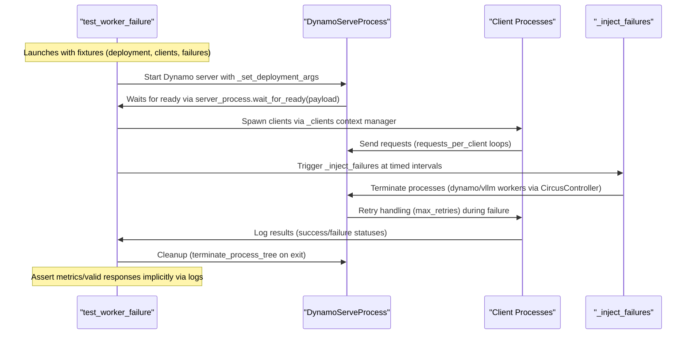
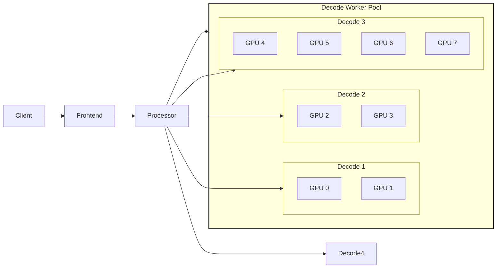

<!--
SPDX-FileCopyrightText: Copyright (c) 2024-2025 NVIDIA CORPORATION & AFFILIATES. All rights reserved.
SPDX-License-Identifier: Apache-2.0

Licensed under the Apache License, Version 2.0 (the "License");
you may not use this file except in compliance with the License.
You may obtain a copy of the License at

http://www.apache.org/licenses/LICENSE-2.0

Unless required by applicable law or agreed to in writing, software
distributed under the License is distributed on an "AS IS" BASIS,
WITHOUT WARRANTIES OR CONDITIONS OF ANY KIND, either express or implied.
See the License for the specific language governing permissions and
limitations under the License.
-->

# Fault Tolerance Test Suite

As a large scale distributed inference serving framework in addition
to providing high throughput and and low latency, Dynamo needs to
provide fault detection, resilency, and quick recovery in the face of
unforseen failures. In order to test Dynamo we are developing a test
suite to inject and measure the impact of different types of failure
conditions.

## Test Architecture

The fault tolerance test suite is designed as a set of pytest
configurations that launch typical dynamo serve graph deployments and
then inject failures by terminating processes in the graph. To test
the recovery time and impact of failures a set number of clients are
launched in parallel. Each client sends a set number of synchronous
requests. Log files are stored for each dynamo process as well as for
each client and inspected using a post processing script.

> [!NOTE]
> Test pass / failure is not an indication of SLA for recovery or resilience
> It only indicates is the test passed and data was collected

> [!NOTE] The test suite currently targets single node Dynamo Serve.
> Support for Dynamo Deploy is a work in progress.

###  Test Sequence Diagram



### Failure Scenarios

The test suite includes several predefined fault injection scenarios designed to validate system resilience under various failure conditions. These scenarios are configured in `scenarios.py` and can be selected via pytest parameters. Below is a description of the available scenarios:

| Scenario Name          | Description                                                                 | Affected Components                             | Timing Example     |
|------------------------|-----------------------------------------------------------------------------|-------------------------------------------------|-------------------|
| **decode_worker**      | Terminates decoder worker processes  | `dynamo_vllmworker`                             | 30 seconds         |
| **prefill_worker**     | Terminates prefill worker processes  | `dynamo_prefillworker`                          | 30 seconds         |
| **frontend**           | Terminates frontend processes handling client requests                       | `dynamo_frontend`                               | 30 seconds         |
| **processor**          | Terminates processor responsible for tokenization                 | `dynamo_processor`                              | 30 seconds         |
| **vllm_worker**        | Terminates low-level VLLM worker processes                                   | `vllm_worker` (external to Dynamo)             | 30 seconds         |
| **none**               | Baseline scenario with no failures                                          | N/A                                             | N/A               |

#### Key Characteristics:
1. **Timing**: Failures are injected at predefined intervals (e.g., 30 seconds after test start)
2. **Severity**: The number of terminated processes can be configured (default: 1)
3. **Scope**: Failures target specific components while leaving others operational
4. **Respawn Behavior**: Controlled via `--respawn` flag (enabled/disabled in test configuration)

#### Configuration:
- **Injection Timing**: Defined in `failure_scenarios` dictionary in `scenarios.py`
- **Process Count**: Adjustable via tuple values (e.g., `("dynamo_vllmworker", 1)` terminates 1 process)
- **Component Mapping**:
  - `dynamo_*`: Internal Dynamo services
  - `vllm_worker`: External VLLM model workers

#### Example Scenario Execution:

Run all graph configurations with injecting a decode_worker failure.

```bash
cd tests/fault_tolerance
pytest test_runner.py -k decode_worker --respawn --separate-process-logs
python3 parse_results.py
```

## Example Results

The following results were obtained running on a single node with 8
L40 GPUs.

### Aggregated




###

### Disaggregated
