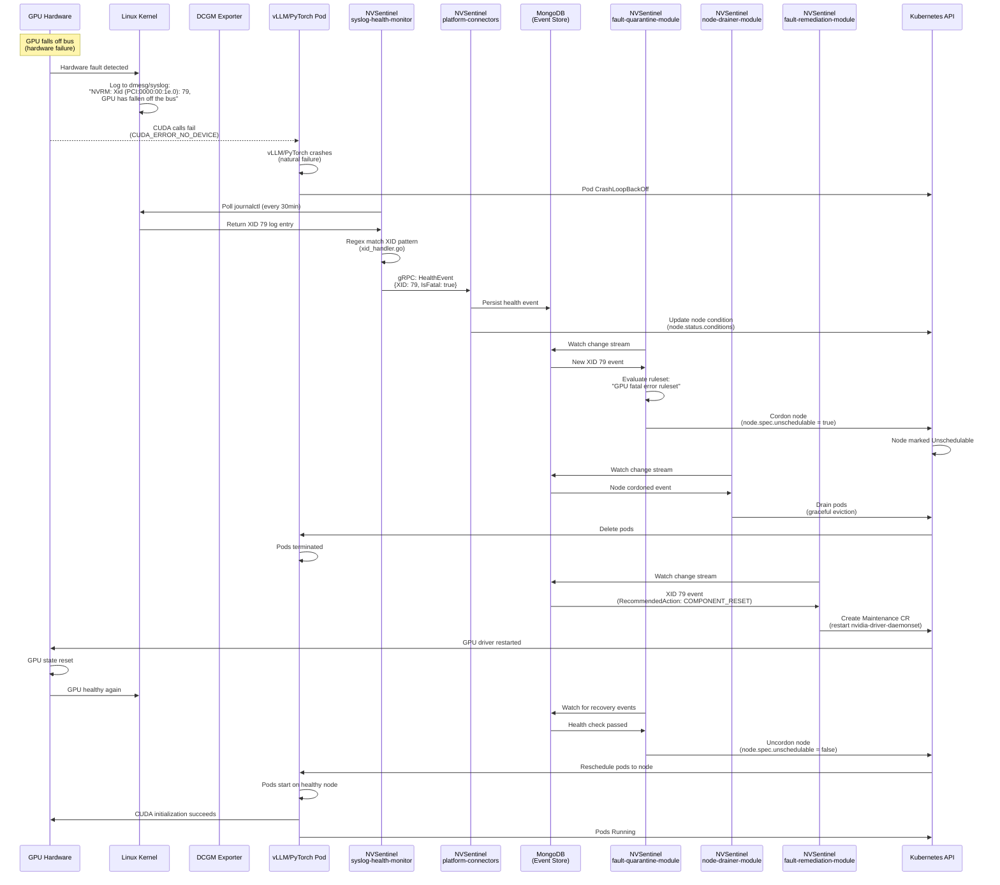
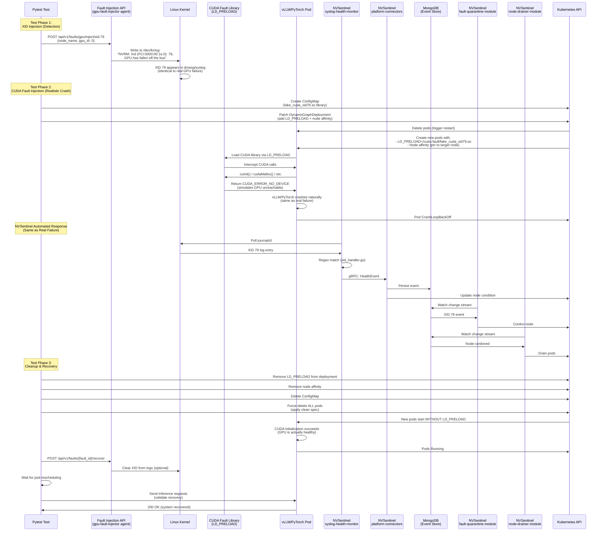

# GPU Fault Injection Testing Guide

Quick reference for writing GPU XID error fault tolerance tests.

## Available XID Errors

| XID | Function | What It Simulates | Severity | Recovery Time |
|-----|----------|-------------------|----------|---------------|
| **43** | `xid_43` | CUDA kernel assertion failure | Medium | Fast (~30s) |
| **48** | `xid_48` | Double-bit ECC error (uncorrectable memory) | High | Slow (~2min) |
| **74** | `xid_74` | NVLink communication failure | High | Medium (~1min) |
| **79** | `xid_79` | GPU fell off bus (complete failure) | **CRITICAL** | Very Slow (~5min)* |
| **94** | `xid_94` | Contained ECC error (correctable) | Low | Fast (~15s) |
| **95** | `xid_95` | Uncontained memory corruption | **CRITICAL** | Very Slow (~5min)* |
| **119** | `xid_119` | GPU firmware/GSP failure | Medium | Medium (~1min) |
| **120** | `xid_120` | GPU resource exhaustion | Medium | Medium (~1min) |

\* **Critical errors (79, 95)** typically trigger node cordoning and pod rescheduling

## Quick Start: Minimal Test

```python
import pytest
from gpu_fault_helpers import GPUFaultHelper
from test_helpers import get_config_from_env, send_completion_request

@pytest.mark.fault_tolerance
def test_xid_94_ecc_error():
    """Test XID 94: Contained ECC error (correctable)"""
    config = get_config_from_env()
    gpu_helper = GPUFaultHelper(api_url=config['api_url'])
    
    # Replace with actual GPU node name
    node_name = "aks-gpunp-12345678-vmss000001"
    
    # Context manager = auto-recovery
    with gpu_helper.xid_94(node_name=node_name, gpu_id=0):
        import time
        time.sleep(10)  # Let fault propagate
        
        # Test inference (should work - other GPUs handle it)
        try:
            send_completion_request("test", 10)
            print("[OK] System fault-tolerant")
        except Exception as e:
            print(f"[EXPECTED] Some impact: {e}")
    
    # Fault auto-recovered, test full recovery
    time.sleep(5)
    send_completion_request("recovery", 10)
    print("[PASS] Recovery confirmed")
```

## Getting Node Names

```python
from kubernetes import client, config

config.load_kube_config()
k8s = client.CoreV1Api()

# Get all GPU nodes
nodes = k8s.list_node(label_selector="accelerator=nvidia")
for node in nodes.items:
    print(f"GPU Node: {node.metadata.name}")

# Get node of a specific pod
pods = k8s.list_namespaced_pod(
    namespace="dynamo-oviya",
    label_selector="nvidia.com/dynamo-component-type=worker"
)
for pod in pods.items:
    if pod.status.phase == "Running":
        print(f"Pod: {pod.metadata.name} -> Node: {pod.spec.node_name}")
        break
```

## Three Testing Patterns

### Pattern 1: Context Manager (Recommended)

```python
with gpu_helper.xid_79(node_name="node-1", gpu_id=0):
    # Test during fault
    time.sleep(30)
# Auto-recovered
```

**Use when:** You want automatic cleanup

### Pattern 2: Manual Injection + Recovery

```python
fault = gpu_helper.inject_xid_48_dbe_ecc(node_name="node-1", gpu_id=0)
try:
    # Test during fault
    time.sleep(30)
finally:
    gpu_helper.recover_fault(fault['fault_id'])
```

**Use when:** You need fine control over timing

### Pattern 3: Duration-Based (Auto-Expire)

```python
fault = gpu_helper.inject_xid_94_contained_ecc(
    node_name="node-1",
    gpu_id=0,
    duration=60  # Auto-recover after 60s
)
time.sleep(70)  # Wait for auto-recovery
```

**Use when:** You want hands-off timeout recovery

## API Reference

### Context Managers (Recommended - Auto-Recovery)

All context managers automatically recover the fault when exiting the block.

```python
# Initialize helper
from gpu_fault_helpers import GPUFaultHelper
gpu_helper = GPUFaultHelper(api_url="http://localhost:8080")

# XID 43: Kernel Assert
with gpu_helper.xid_43(node_name="node-1", gpu_id=0, duration=None):
    # Test during fault

# XID 48: Double-Bit ECC Error
with gpu_helper.xid_48(node_name="node-1", gpu_id=0, duration=None):
    # Test during fault

# XID 74: NVLink Error
with gpu_helper.xid_74(node_name="node-1", gpu_id=0, duration=None):
    # Test during fault

# XID 79: GPU Fell Off Bus (CRITICAL)
with gpu_helper.xid_79(node_name="node-1", gpu_id=0, duration=None):
    # Test during fault

# XID 94: Contained ECC Error
with gpu_helper.xid_94(node_name="node-1", gpu_id=0, duration=None):
    # Test during fault

# XID 95: Uncontained Error (CRITICAL)
with gpu_helper.xid_95(node_name="node-1", gpu_id=0, duration=None):
    # Test during fault

# XID 119: GSP Error
with gpu_helper.xid_119(node_name="node-1", gpu_id=0, duration=None):
    # Test during fault

# XID 120: GSP Resource Manager Error
with gpu_helper.xid_120(node_name="node-1", gpu_id=0, duration=None):
    # Test during fault
```

### Manual Injection Functions

For fine-grained control over fault lifecycle:

```python
# XID 43: Kernel Assert
fault = gpu_helper.inject_xid_43_kernel_assert(
    node_name="node-1",
    gpu_id=0,
    duration=None  # Optional: auto-recover after N seconds
)

# XID 48: Double-Bit ECC Error
fault = gpu_helper.inject_xid_48_dbe_ecc(node_name, gpu_id, duration)

# XID 74: NVLink Error
fault = gpu_helper.inject_xid_74_nvlink_error(node_name, gpu_id, duration)

# XID 79: GPU Fell Off Bus
fault = gpu_helper.inject_xid_79_gpu_fell_off_bus(node_name, gpu_id, duration)

# XID 94: Contained ECC Error
fault = gpu_helper.inject_xid_94_contained_ecc(node_name, gpu_id, duration)

# XID 95: Uncontained Error
fault = gpu_helper.inject_xid_95_uncontained_error(node_name, gpu_id, duration)

# XID 119: GSP Error
fault = gpu_helper.inject_xid_119_gsp_error(node_name, gpu_id, duration)

# XID 120: GSP RM Error
fault = gpu_helper.inject_xid_120_gsp_rm_error(node_name, gpu_id, duration)

# All return: {'fault_id': '...', 'status': '...', ...}
```

### Utility Functions

```python
# Recover a specific fault
gpu_helper.recover_fault(fault_id="fault-123")

# List all available XID types
xid_types = gpu_helper.list_xid_types()

# Close HTTP client (cleanup)
gpu_helper.close()
```

### Function Parameters

All injection functions accept:

| Parameter | Type | Required | Description |
|-----------|------|----------|-------------|
| `node_name` | str | Yes | Kubernetes node name (e.g., "aks-gpunp-12345678-vmss000001") |
| `gpu_id` | int | No | GPU device ID on the node (0-7 typically). Default: 0 |
| `duration` | int | No | Auto-recovery timeout in seconds. None = manual recovery required |

**Returns:** Dictionary with `fault_id`, `status`, `fault_type`, `target`, `injected_at`

## CUDA Fault Library (Advanced - Realistic GPU Failures)

### What It Does

The CUDA fault injection library (`LD_PRELOAD` technique) intercepts CUDA API calls and returns error codes, simulating what happens when a GPU actually fails. This is **more realistic** than XID injection alone.

**XID Injection Only:**
- Logs XID error to kernel/syslog
- NVSentinel detects it
- But pods may keep running (GPU still works)

**XID + CUDA Fault Library:**
- Logs XID error to kernel/syslog ✓
- **CUDA calls return `CUDA_ERROR_NO_DEVICE`** ✓
- Pods crash naturally (just like real GPU failure) ✓
- Complete failure simulation

### When to Use

Use CUDA fault library when you need to test:
- **Realistic pod crashes** - vLLM/PyTorch naturally fails when CUDA breaks
- **Complete E2E workflow** - Detection → Pod crash → Rescheduling → Recovery
- **NVSentinel automation** - Validates full automated response pipeline

**Don't use if:**
- Testing only detection/alerting (XID injection alone is sufficient)
- Quick tests (CUDA faults require pod restarts, cleanup)
- You want pods to keep running (for testing degraded performance)

### Basic Usage

```python
from cuda_fault_injection import CUDAFaultInjector

cuda_injector = CUDAFaultInjector()

# 1. Build the fault library (one-time setup)
cuda_injector.build_library()

# 2. Create ConfigMap with library
cuda_injector.create_configmap_with_library(namespace="dynamo-oviya")

# 3. Patch deployment to use library
cuda_injector.patch_deployment_for_cuda_fault(
    deployment_name="vllm-v1-disagg-router",
    namespace="dynamo-oviya",
    target_node="aks-node-1",  # Pins pods to this node
    xid_type=79  # Which XID to simulate
)

# 4. Pods restart and will crash with CUDA errors
# ... wait for crash, test recovery ...

# 5. Cleanup (IMPORTANT!)
cuda_injector.cleanup_cuda_fault_injection(
    deployment_name="vllm-v1-disagg-router",
    namespace="dynamo-oviya",
    force_delete_pods=True  # Delete pods to apply clean spec
)
```

### Key Points

- **Requires compilation** - Library built with `make` (needs gcc)
- **Pod restart required** - Deployment patched, pods recreate with LD_PRELOAD
- **Node pinning** - Adds node affinity (simulates real XID where fault is node-specific)
- **Manual cleanup essential** - Must remove LD_PRELOAD and delete pods
- **Use for XID 79/95 primarily** - Critical errors that should cause crashes
- **Allows us to assess real-time inference request success rate**

### Complete Example

See `examples/test_xid79_nvsentinel_automated.py` for a full E2E test using:
1. XID 79 injection (logs to syslog)
2. CUDA fault library (causes real crashes)
3. NVSentinel automated response
4. Complete recovery validation

### Cleanup Checklist

After using CUDA fault library:
```python
# ✓ Remove LD_PRELOAD from deployment spec
# ✓ Remove node affinity (test artifact)
# ✓ Delete ConfigMap with library
# ✓ Force-delete ALL pods (including Pending ones)
# ✓ Wait for clean pods to start
```

The `cleanup_cuda_fault_injection()` function does all this automatically.

## Fault Injection Flow Diagrams

### Real-Life GPU Failure (Production)

What happens when a GPU actually fails in production:



**Key Points:**
- **Detection source**: Kernel logs (`dmesg`/`journalctl`) 
- **Crash mechanism**: Natural CUDA failure when GPU is unreachable
- **NVSentinel triggers**: XID 79 in syslog
- **Automation**: All steps automated (cordon → drain → remediate → uncordon)
- **Total time**: 5-15 minutes depending on configuration

---

### Simulated Fault Injection (Testing)

What our test framework does to simulate the same failure:



**Key Points:**
- **Phase 1 (XID)**: Injects kernel log entry → Triggers NVSentinel detection
- **Phase 2 (CUDA)**: LD_PRELOAD intercepts CUDA → Pods crash naturally
- **Phase 3 (Cleanup)**: Remove test artifacts → Pods restart clean
- **Automation**: NVSentinel steps are identical to real failure
- **Test validates**: Detection → Crash → Cordon → Drain → Recovery

---

### Component Comparison

| Component | Real Failure | Simulated Test | Detection Identical? |
|-----------|-------------|----------------|---------------------|
| **GPU Hardware** | Actually fails | Healthy (no damage) | N/A |
| **Kernel Logs** | XID 79 logged by driver | XID 79 injected to `/dev/kmsg` | ✅ **YES** |
| **CUDA Behavior** | GPU unreachable → errors | LD_PRELOAD returns errors | ✅ **YES** |
| **Pod Crashes** | Natural crash | Natural crash (via LD_PRELOAD) | ✅ **YES** |
| **syslog-health-monitor** | Detects XID from syslog | Detects XID from syslog | ✅ **YES** |
| **fault-quarantine-module** | Cordons node | Cordons node | ✅ **YES** |
| **node-drainer-module** | Drains pods | Drains pods | ✅ **YES** |
| **Pod Rescheduling** | To healthy nodes | To healthy nodes | ✅ **YES** |
| **Recovery** | After GPU driver restart | After cleanup (GPU was healthy) | ⚠️ Different |

---

## Testing Critical Errors (XID 79, 95)

Critical errors trigger NVSentinel workflow:
1. XID logged to syslog
2. NVSentinel detects health event
3. Node cordoned (prevents new pods)
4. Pods drained/rescheduled
5. GPU driver restart
6. Node uncordoned

**Test expectations:**
- Pods on faulty node will crash/reschedule
- Other nodes continue serving requests
- Recovery takes 3-5 minutes (pod rescheduling + model loading)

```python
@pytest.mark.fault_tolerance
@pytest.mark.slow  # Mark as slow test
def test_xid_79_critical_failure():
    """Test XID 79 with pod rescheduling"""
    config = get_config_from_env()
    gpu_helper = GPUFaultHelper(api_url=config['api_url'])
    
    # Get worker pod and its node
    from kubernetes import client, config as k8s_config
    k8s_config.load_kube_config()
    k8s = client.CoreV1Api()
    
    pods = k8s.list_namespaced_pod(
        namespace=config['app_namespace'],
        label_selector="nvidia.com/dynamo-component-type=worker"
    )
    target_pod = pods.items[0]
    target_node = target_pod.spec.node_name
    
    print(f"Injecting XID 79 on node: {target_node}")
    
    with gpu_helper.xid_79(node_name=target_node):
        print("[INJECTED] XID 79 active")
        
        # Wait for NVSentinel detection
        import time
        time.sleep(30)
        
        # System should still respond (other nodes)
        for i in range(5):
            try:
                send_completion_request(f"test-{i}", 10)
                print(f"[OK] Request {i+1}/5 succeeded (other nodes handling)")
            except Exception as e:
                print(f"[WARN] Request {i+1}/5 failed: {e}")
            time.sleep(2)
    
    # Wait for recovery (pod rescheduling takes time)
    print("[RECOVERY] Waiting for pod rescheduling (up to 5 min)...")
    time.sleep(180)  # 3 minutes for rescheduling + model load
    
    # Validate recovery
    send_completion_request("final", 10)
    print("[PASS] System recovered")
```

## Wait Times by Severity

| Severity | Wait After Injection | Wait After Recovery |
|----------|---------------------|---------------------|
| Low (94) | 5-10s | 5-10s |
| Medium (43, 119, 120) | 10-15s | 15-30s |
| High (48, 74) | 15-30s | 30-60s |
| Critical (79, 95) | 30-60s | 180-300s (pod rescheduling) |

## Assertion Patterns

```python
# Pattern 1: Fault tolerance (system stays up)
success_count = 0
for i in range(10):
    try:
        send_completion_request(f"test-{i}", 10)
        success_count += 1
    except:
        pass

assert success_count >= 7, f"Only {success_count}/10 succeeded - fault tolerance inadequate"

# Pattern 2: Recovery validation
recovered = False
for attempt in range(5):
    try:
        send_completion_request("recovery", 10)
        recovered = True
        break
    except:
        time.sleep(10)

assert recovered, "System did not recover after 50s"

# Pattern 3: Latency degradation
import time
baseline = time.time()
send_completion_request("baseline", 10)
baseline_latency = time.time() - baseline

# Inject fault
with gpu_helper.xid_48(...):
    fault_start = time.time()
    send_completion_request("degraded", 10)
    fault_latency = time.time() - fault_start

# Should be slower but still work
assert fault_latency > baseline_latency * 1.2, "No observable impact"
assert fault_latency < baseline_latency * 5, "Too much degradation"
```

## Cleanup Best Practices

```python
@pytest.fixture
def gpu_fault_cleanup():
    """Fixture ensuring cleanup on test failure"""
    cleanup_state = {'fault_id': None}
    yield cleanup_state
    
    # Always runs (even on Ctrl+C)
    if cleanup_state['fault_id']:
        gpu_helper = GPUFaultHelper(api_url=config['api_url'])
        gpu_helper.recover_fault(cleanup_state['fault_id'])

def test_with_cleanup(gpu_fault_cleanup):
    fault = gpu_helper.inject_xid_79(...)
    gpu_fault_cleanup['fault_id'] = fault['fault_id']
    # Test code...
```

## Multi-GPU Testing

```python
# Test all GPUs on a node
node_name = "gpu-node-1"
num_gpus = 8

for gpu_id in range(num_gpus):
    print(f"Testing GPU {gpu_id}...")
    with gpu_helper.xid_94(node_name=node_name, gpu_id=gpu_id):
        time.sleep(5)
    time.sleep(2)  # Brief pause between GPUs
```

## Debugging Failed Tests

```bash
# Check if fault was injected
kubectl logs -n fault-injection-system -l app=fault-injection-api --tail=50

# Check syslog for XID errors
kubectl exec -n gpu-operator nvidia-driver-daemonset-xxxxx -- dmesg | grep "Xid"

# Check NVSentinel detection
kubectl logs -n nvsentinel -l app=syslog-health-monitor --tail=50

# Check pod status after fault
kubectl get pods -n dynamo-oviya -l nvidia.com/dynamo-component-type=worker

# Check node cordoning
kubectl get nodes -L test.fault-injection/cordoned
```

## Common Issues

**Issue: "No GPU node found"**
- Ensure you have GPU nodes: `kubectl get nodes -l accelerator=nvidia`
- Check node labels

**Issue: "Fault injection timeout"**
- Verify fault-injection-api is running
- Check API logs for errors
- Ensure node name is correct

**Issue: "Recovery takes too long"**
- Critical errors (XID 79, 95) require pod rescheduling (3-5 min)
- Check if node was cordoned: `kubectl get node <name> -o jsonpath='{.spec.unschedulable}'`
- Check pod events: `kubectl describe pod <name>`

**Issue: "Test flaky - sometimes passes, sometimes fails"**
- Add longer wait times after fault injection
- Add retry logic for recovery validation
- Use pytest marks: `@pytest.mark.flaky(reruns=3)`

## Example: Complete Test Template

See `examples/test_gpu_fault_tolerance_example.py` for a complete, production-ready test.

