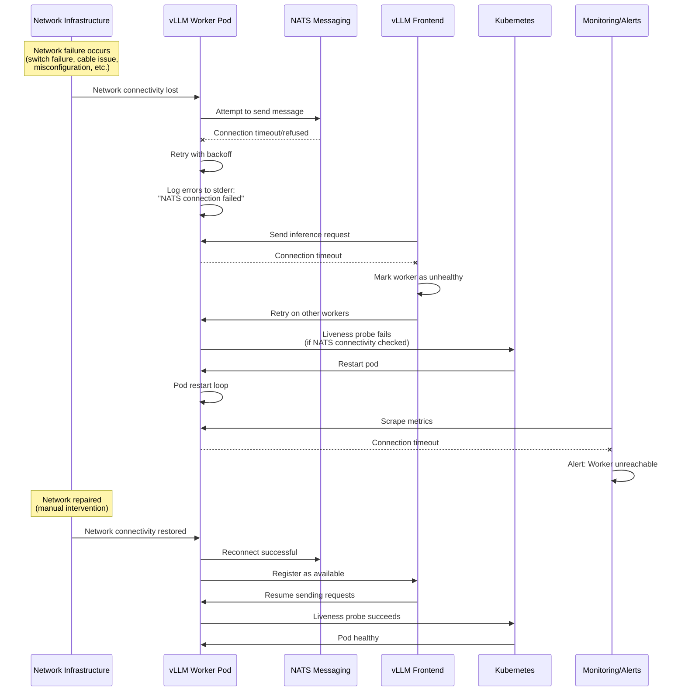
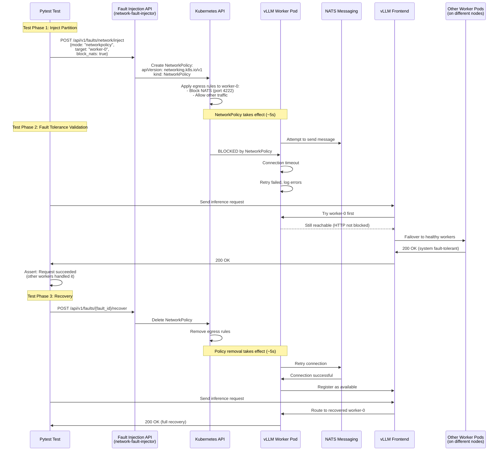
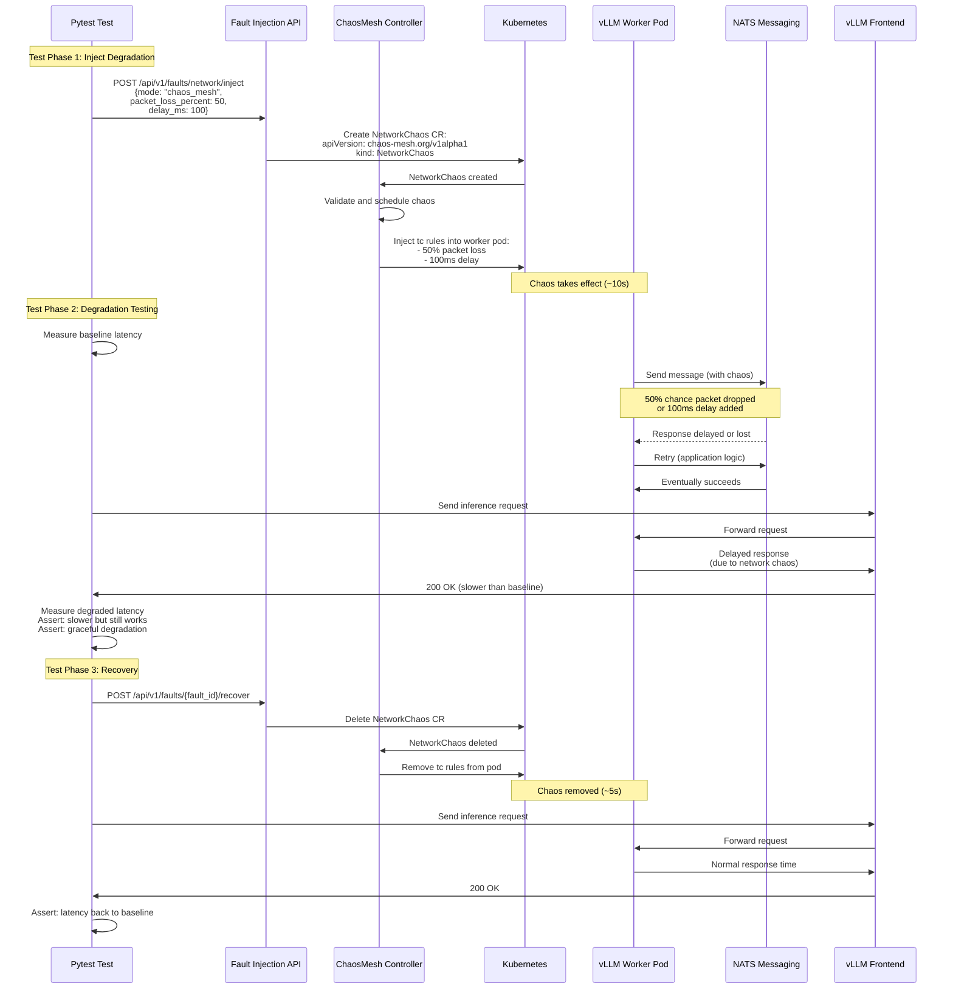

# Network Fault Injection Testing Guide

Quick reference for writing network partition and degradation fault tolerance tests.

## Two Modes

| Mode | Use Case | Requirements | Capabilities |
|------|----------|--------------|--------------|
| **NetworkPolicy** | Complete blocking | Built-in (Kubernetes) | All-or-nothing isolation |
| **ChaosMesh** | Partial degradation | ChaosMesh installed | Packet loss, delay, bandwidth limits |

## NetworkPolicy Mode (Simple Blocking)

### Pattern 1: Block NATS Access

```python
import pytest
from fault_injection_client import FaultInjectionClient, NetworkMode, NetworkPartition
from test_helpers import get_config_from_env, send_completion_request
import time

@pytest.mark.fault_tolerance
def test_worker_nats_partition():
    """Test worker isolated from NATS"""
    config = get_config_from_env()
    client = FaultInjectionClient(api_url=config['api_url'])
    
    # Block one worker's access to NATS
    with client.network_partition(
        partition_type=NetworkPartition.CUSTOM,
        mode=NetworkMode.NETWORKPOLICY,
        namespace=config['app_namespace'],
        target_pod_prefix="vllm-agg-0-vllmdecodeworker",
        block_nats=True,
        duration=60  # Auto-recover after 60s
    ) as fault:
        print(f"Partition active: {fault.fault_id}")
        time.sleep(5)  # Let policy take effect
        
        # Other workers should handle requests
        send_completion_request("test", 10)
        print("[OK] System fault-tolerant")
    
    # Auto-recovered, validate full recovery
    time.sleep(5)
    send_completion_request("recovery", 10)
    print("[PASS] Full recovery")
```

### Pattern 2: Block Specific Pods (Pod-to-Pod)

```python
# Block worker from reaching frontend
with client.network_partition(
    partition_type=NetworkPartition.CUSTOM,
    mode=NetworkMode.NETWORKPOLICY,
    namespace=config['app_namespace'],
    target_pod_prefix="vllm-agg-0-vllmdecodeworker",
    block_specific_pods=[
        {"app.kubernetes.io/name": "vllm-agg-0-frontend"}
    ],
    block_nats=False,  # Keep NATS working
    duration=60
):
    # Test during partition
    time.sleep(5)
```

**Finding pod labels:**
```bash
kubectl get pod <pod-name> -n <namespace> --show-labels
# Or more readable:
kubectl get pod <pod-name> -n <namespace> -o jsonpath='{.metadata.labels}'
```

### Pattern 3: Block Multiple Targets

```python
# Block both NATS and specific pods
with client.network_partition(
    partition_type=NetworkPartition.CUSTOM,
    mode=NetworkMode.NETWORKPOLICY,
    namespace=config['app_namespace'],
    target_pod_prefix="vllm-agg-0-vllmdecodeworker",
    block_nats=True,
    block_specific_pods=[
        {"app.kubernetes.io/name": "vllm-agg-0-frontend"}
    ],
    duration=60
):
    # Worker completely isolated
    time.sleep(5)
```

## ChaosMesh Mode (Advanced Degradation)

**Requires:** ChaosMesh installed in cluster
```bash
kubectl get pods -n chaos-mesh  # Should show chaos-controller-manager, chaos-daemon
```

### Pattern 1: Packet Loss

```python
@pytest.mark.fault_tolerance
@pytest.mark.requires_chaosmesh
def test_50_percent_packet_loss():
    """Test 50% packet loss to NATS"""
    config = get_config_from_env()
    client = FaultInjectionClient(api_url=config['api_url'])
    
    with client.network_partition(
        partition_type=NetworkPartition.CUSTOM,
        mode=NetworkMode.CHAOS_MESH,
        namespace=config['app_namespace'],
        target_pod_prefix="vllm-agg-0-vllmdecodeworker",
        packet_loss_percent=50,  # Drop 50% of packets
        target_nats=True,
        duration=60
    ):
        import time
        time.sleep(5)
        
        # Requests should succeed but may be slower
        for i in range(5):
            try:
                send_completion_request(f"test-{i}", 10, timeout=45)
                print(f"[OK] Request {i+1}/5 succeeded (degraded)")
            except Exception as e:
                print(f"[EXPECTED] Request {i+1}/5 failed: {e}")
            time.sleep(2)
```

### Pattern 2: Network Delay

```python
# Add 100ms delay + 50ms jitter
with client.network_partition(
    partition_type=NetworkPartition.CUSTOM,
    mode=NetworkMode.CHAOS_MESH,
    namespace=config['app_namespace'],
    target_pod_prefix="vllm-agg-0-vllmdecodeworker",
    delay_ms=100,           # Base delay
    delay_jitter_ms=50,     # Jitter (50-150ms total)
    target_nats=True,
    duration=60
):
    # Measure latency increase
    import time
    start = time.time()
    send_completion_request("delayed", 10)
    latency = time.time() - start
    print(f"Latency with delay: {latency:.2f}s")
```

### Pattern 3: Bandwidth Limiting

```python
# Limit to 1 Mbps
with client.network_partition(
    partition_type=NetworkPartition.CUSTOM,
    mode=NetworkMode.CHAOS_MESH,
    namespace=config['app_namespace'],
    target_pod_prefix="vllm-agg-0-vllmdecodeworker",
    bandwidth_limit="1mbps",
    target_nats=True,
    duration=60
):
    # Test with limited bandwidth
    time.sleep(5)
```

### Pattern 4: Combined Chaos

```python
# Packet loss + delay + bandwidth limit
with client.network_partition(
    partition_type=NetworkPartition.CUSTOM,
    mode=NetworkMode.CHAOS_MESH,
    namespace=config['app_namespace'],
    target_pod_prefix="vllm-agg-0-vllmdecodeworker",
    packet_loss_percent=20,
    delay_ms=50,
    delay_jitter_ms=25,
    bandwidth_limit="10mbps",
    target_nats=True,
    duration=60
):
    # Simulate very degraded network
    time.sleep(5)
```

## Common Pod Prefixes

| Deployment Type | Worker Pod Prefix | Frontend Pod Prefix |
|----------------|-------------------|---------------------|
| Aggregated | `vllm-agg-0-vllmdecodeworker` | `vllm-agg-0-frontend` |
| Disaggregated (decode) | `vllm-disagg-0-vllmdecodeworker` | `vllm-disagg-0-frontend` |
| Disaggregated (prefill) | `vllm-disagg-0-vllmprefillworker` | Same |

**Find your pod prefix:**
```bash
kubectl get pods -n dynamo-oviya -l nvidia.com/dynamo-component-type=worker
# Look at pod names, use everything before the last hyphen + numbers
# Example: vllm-agg-0-vllmdecodeworker-5c7b8-abcde
# Prefix: vllm-agg-0-vllmdecodeworker
```

## Testing Strategies

### Strategy 1: Fault Tolerance (System Stays Up)

```python
def test_one_worker_isolated_others_handle():
    """Isolate one worker, verify others handle requests"""
    with client.network_partition(
        mode=NetworkMode.NETWORKPOLICY,
        namespace=config['app_namespace'],
        target_pod_prefix="vllm-agg-0-vllmdecodeworker",
        block_nats=True,
        duration=60
    ):
        time.sleep(5)
        
        # All requests should succeed (other workers handle)
        success_count = 0
        for i in range(10):
            try:
                send_completion_request(f"test-{i}", 10)
                success_count += 1
            except:
                pass
        
        # Assert high success rate (≥80%)
        assert success_count >= 8, f"Only {success_count}/10 succeeded"
        print(f"[PASS] {success_count}/10 requests succeeded during partition")
```

### Strategy 2: Graceful Degradation

```python
def test_degraded_performance_acceptable():
    """Verify performance degrades gracefully, doesn't fail completely"""
    import time
    
    # Baseline latency
    start = time.time()
    send_completion_request("baseline", 10)
    baseline_latency = time.time() - start
    
    # Inject 50% packet loss
    with client.network_partition(
        mode=NetworkMode.CHAOS_MESH,
        namespace=config['app_namespace'],
        target_pod_prefix="vllm-agg-0-vllmdecodeworker",
        packet_loss_percent=50,
        target_nats=True,
        duration=60
    ):
        time.sleep(5)
        
        # Degraded latency
        start = time.time()
        send_completion_request("degraded", 10, timeout=60)
        degraded_latency = time.time() - start
        
        # Assert: slower but not catastrophically slow
        assert degraded_latency > baseline_latency, "No observable impact"
        assert degraded_latency < baseline_latency * 3, "Too much degradation"
        print(f"[OK] Baseline: {baseline_latency:.2f}s, Degraded: {degraded_latency:.2f}s")
```

### Strategy 3: Recovery Speed

```python
def test_recovery_time_acceptable():
    """Measure how quickly system recovers after partition ends"""
    import time
    
    # Inject partition
    fault = client.inject_network_partition(
        mode=NetworkMode.NETWORKPOLICY,
        namespace=config['app_namespace'],
        target_pod_prefix="vllm-agg-0-vllmdecodeworker",
        block_nats=True
    )
    time.sleep(10)
    
    # Remove partition
    client.recover_fault(fault.fault_id)
    recovery_start = time.time()
    
    # Wait for first successful request
    recovered = False
    for attempt in range(30):  # 30s max
        try:
            send_completion_request("recovery", 10, timeout=10)
            recovered = True
            recovery_time = time.time() - recovery_start
            break
        except:
            time.sleep(1)
    
    assert recovered, "System did not recover within 30s"
    assert recovery_time < 15, f"Recovery took {recovery_time:.1f}s (>15s)"
    print(f"[PASS] Recovered in {recovery_time:.1f}s")
```

## Wait Times

| Operation | Recommended Wait |
|-----------|-----------------|
| After injecting NetworkPolicy | 5s |
| After injecting ChaosMesh | 10s |
| After recovering fault | 5-10s |
| Between test retries | 5s |

## Debugging

```bash
# Check if NetworkPolicy was created
kubectl get networkpolicy -n dynamo-oviya

# Check NetworkPolicy details
kubectl describe networkpolicy <name> -n dynamo-oviya

# Check ChaosMesh resource
kubectl get networkchaos -n dynamo-oviya

# Check ChaosMesh details
kubectl describe networkchaos <name> -n dynamo-oviya

# Check API logs
kubectl logs -n fault-injection-system -l app=fault-injection-api --tail=50

# Test pod connectivity manually
kubectl exec -n dynamo-oviya <pod-name> -- curl http://nats:4222
```

## Cleanup

### Automatic Cleanup

```python
# Context manager (recommended)
with client.network_partition(...):
    test_code()
# Auto-cleaned up

# Duration-based
client.inject_network_partition(..., duration=60)
# Auto-expires after 60s
```

### Manual Cleanup

```python
fault_id = None
try:
    fault = client.inject_network_partition(...)
    fault_id = fault.fault_id
    test_code()
finally:
    if fault_id:
        client.recover_fault(fault_id)
```

### Cleanup Orphaned Policies

```python
# If tests crash, NetworkPolicies may remain
client.cleanup_network_policies(namespace=config['app_namespace'])

# Or from command line:
# kubectl delete networkpolicy -n dynamo-oviya -l created-by=fault-injection-api
```

## Common Issues

**Issue: "ChaosMesh not working"**
```bash
# Verify ChaosMesh installed
kubectl get pods -n chaos-mesh
# Should show: chaos-controller-manager, chaos-daemon

# Check permissions
kubectl get clusterrole fault-injection-api -o yaml | grep chaos-mesh
```

**Issue: "NetworkPolicy not blocking traffic"**
- Wait 5-10s after injection (policy takes time to apply)
- Check if policy was created: `kubectl get networkpolicy -n <namespace>`
- Verify pod prefix matches actual pod names
- Check policy syntax: `kubectl describe networkpolicy <name>`

**Issue: "Requests still succeeding during partition"**
- This is expected! Fault tolerance means other workers handle requests
- Verify you're targeting the right pods
- Check if multiple worker replicas exist (they should)

**Issue: "Test timeout"**
- Increase timeout for inference requests during faults
- ChaosMesh faults may cause retries (set timeout=60 instead of 30)
- Use `@pytest.mark.timeout(300)` for long-running tests

## Network Fault Injection Flow Diagrams

### Real-Life Network Partition (Production)

What happens when network failures occur in production:



**Characteristics:**
- **Cause**: Infrastructure failure (physical/config)
- **Detection**: Timeout errors, failed health checks, monitoring alerts
- **Impact**: Unpredictable, may affect multiple pods
- **Recovery**: Manual network repair required
- **Observability**: Application logs, pod events, metrics gaps

---

### Simulated Network Partition (NetworkPolicy Mode)

Using NetworkPolicy for complete traffic blocking:



**Key Points:**
- **Injection**: Kubernetes NetworkPolicy (native K8s resource)
- **Scope**: Precise pod-level isolation
- **Effect**: Complete blocking (all-or-nothing)
- **Recovery**: Immediate when policy deleted
- **Cleanup**: Automatic via API

---

### Simulated Network Degradation (ChaosMesh Mode)

Using ChaosMesh for partial packet loss and delay:



**Key Points:**
- **Injection**: ChaosMesh NetworkChaos custom resource
- **Scope**: Pod-level with target selectors
- **Effect**: Partial degradation (packet loss, delay, bandwidth)
- **Realism**: Simulates real-world network issues
- **Requirements**: ChaosMesh must be installed

---

### Component Comparison

| Component | Real Partition | NetworkPolicy Simulation | ChaosMesh Simulation |
|-----------|---------------|-------------------------|---------------------|
| **Root Cause** | Infrastructure failure | Kubernetes NetworkPolicy | ChaosMesh tc rules |
| **Traffic Impact** | Unpredictable | Complete blocking | Partial degradation |
| **Affected Pods** | Variable (topology-dependent) | Precisely targeted | Precisely targeted |
| **Effect Duration** | Until manual fix | Until policy deleted | Until CR deleted |
| **Application Behavior** | Timeout/retry | Timeout/retry | Slower/retry |
| **Fault Tolerance Test** | ❌ Risky to test | ✅ Safe and repeatable | ✅ Safe and repeatable |
| **Cleanup** | Manual network repair | Automatic (delete policy) | Automatic (delete CR) |
| **Realism** | 100% real | High (actual TCP blocking) | Very high (kernel-level delays) |
| **Use Case** | Production incidents | Binary failure testing | Degraded network testing |

---

## Example: Complete Test Template

See `examples/test_network_fault_tolerance_example.py` for a complete, production-ready test.

## Integration with CI/CD

```python
# Mark tests by requirements
@pytest.mark.fault_tolerance
@pytest.mark.requires_chaosmesh
@pytest.mark.slow
def test_complex_network_fault():
    ...

# Run only NetworkPolicy tests (fast)
# pytest -m "fault_tolerance and not requires_chaosmesh"

# Run all fault tolerance tests (including ChaosMesh)
# pytest -m fault_tolerance
```

