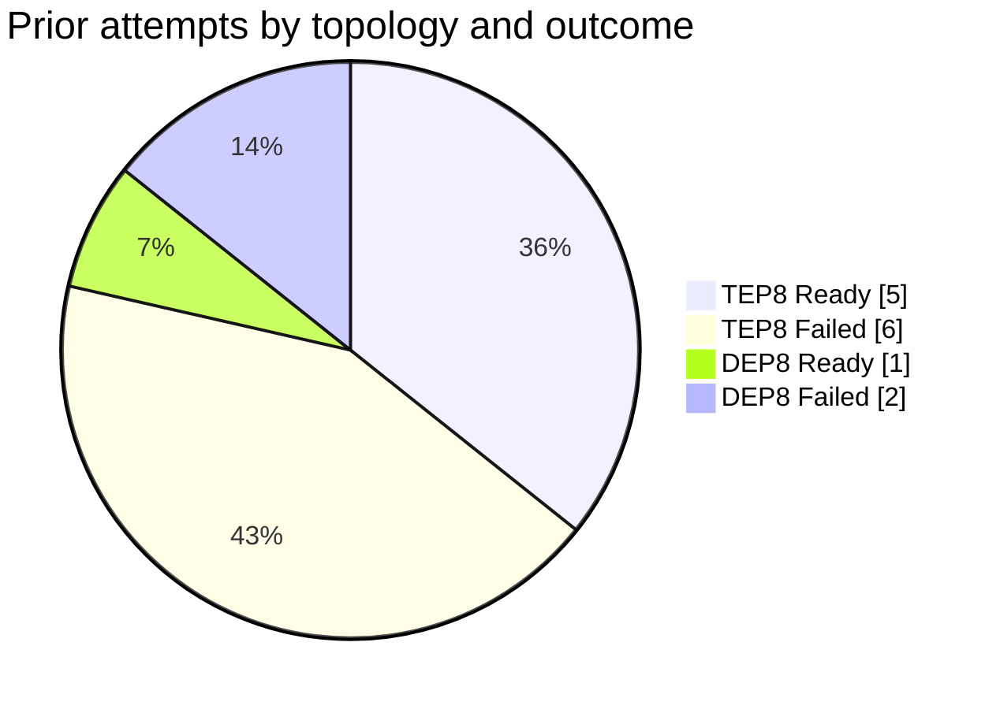

<!--
SPDX-FileCopyrightText: Copyright (c) 2026 NVIDIA CORPORATION & AFFILIATES. All rights reserved.
SPDX-License-Identifier: Apache-2.0
-->

# 05 — Prior attempts already in `schwinns`

These are the best available evidence for what works and what does not. All are
GLM-5.2 on vLLM, 8 GPUs, GMS intraPod, on node s2877.

## Naming decode

| Token | Meaning |
|---|---|
| `t8` | **TEP8** — `--tensor-parallel-size 8 --enable-expert-parallel` |
| `d8` | **DEP8** — `--tensor-parallel-size 1 --data-parallel-size 8 --enable-expert-parallel` |
| `gms` / `ssd` | GMS backend: default vs sharded-SSD saver |
| `ccoff` | cuda-checkpoint-related toggle off |
| `alias`, `sq`, `kg8a`, `fi3950`, `tar`, `narrow`, `min` | one-off probe variants |

## Outcomes

### Reached `Ready`

| Checkpoint | Topology | Probing |
|---|---|---|
| `glm52-tep8-gms-ssd-top-29213270567-source-v2` | TEP8 | **The saved reference.** GMS + sharded-SSD saver, hand-authored after an auto-Job race (label `schwinns.ai-dynamo.io/recovery: explicit-source-after-auto-job-race`) |
| `g52-t8-ccoff-tar-r10` | TEP8 | cuda-checkpoint off + tar rootfs path |
| `g52-t8-alias-a372-032700` | TEP8 | tensor-aliasing variant |
| `g52-t8-kg8a-r298032b` | TEP8 | KV-group variant |
| `g52-t8-sq-f9-212946` | TEP8 | squashed/quantised variant |
| `g52-d8-ccoff-tar-r7` | **DEP8** | cuda-checkpoint off + tar — **the only DEP8 success** |

### Failed

| Checkpoint | Topology | Probing |
|---|---|---|
| `glm52-tep8-gms-ssd-top-29213270567` | TEP8 | the auto-created Job that lost the race to `-source-v2` |
| `glm52-narrow-snap-gms-1ee559` | TEP8 | narrowed snapshot scope, GMS backend |
| `glm52-narrow-snap-ssd-1ee559` | TEP8 | narrowed snapshot scope, SSD backend |
| `g52-t8-gms-prof-r29604929787` | TEP8 | profiling-enabled build |
| `glm52-min-tep8-fi3950-*` | TEP8 | minimal config, FlashInfer 3950 |
| `glm52-alias-tep8-*` | TEP8 | aliasing variant |
| `g52-d8-alias-a372-032701` | **DEP8** | aliasing variant |
| `g52-d8-sq-f9-224459` | **DEP8** | squashed/quantised variant |

## The headline risk for Run A

| Topology | Ready | Failed | Success rate |
|---|---|---|---|
| TEP8 | 5 | 6 | ~45 % |
| **DEP8** | **1** | **2** | **~33 %** |

> [!WARNING]
> **DEP8 has the worse track record, and Run A asks for DEP8.**
> The single DEP8 success (`g52-d8-ccoff-tar-r7`) also carried the `ccoff`
> (cuda-checkpoint-off) and `tar` modifiers — i.e. it may not have exercised the
> CUDA restore path this probe is designed to test.
>
> This matters because the whole point of Run A is to distinguish a **(D) driver**
> failure from a **(P) plumbing** failure. If DEP8 fails for its own unrelated
> reasons — vLLM DP coordinator, `--data-parallel-rpc-port` sockets, all2all
> backend under DP — the run yields a (P) result and tells us nothing about
> `cuMem` POSIX FD support under `cuCheckpoint`.

### Recommendation

Run **TEP8 as the control** if DEP8 fails at all:

1. `20-dynamocheckpoint.yaml` is DEP8 (as requested), driven by a single
   `TOPOLOGY` comment block.
2. If it fails, flip that block to TEP8 (the exact reference args) and re-run
   **before** concluding anything about the driver.
   - TEP8 fails too → the failure is likely (D) or (E), shared across topologies
     → this is the signal, proceed to Run B.
   - TEP8 passes, DEP8 fails → the failure is DEP-specific (P) → fix DEP8 or
     accept TEP8 for the driver probe.

Both variants are pre-written in `20-dynamocheckpoint.yaml`; only one block is
active at a time.

## What the reference proves is *already solved*

Do not re-litigate these; they are baked into `20-dynamocheckpoint.yaml`:

| Concern | Resolution in the reference |
|---|---|
| DRA claim shape | pod-level `resourceClaims[0] = {name: intrapod-shared-gpu, resourceClaimTemplateName: ...}` + per-container `resources.claims` |
| GMS socket sharing | `gms-intrapod-control` emptyDir at `/gms-intrapod-control`, `GMS_SOCKET_DIR` on all three containers |
| CRIU workspace | `criu-work` emptyDir at `/var/criu-work` |
| `/dev/shm` | 64 Gi `medium: Memory` emptyDir + `spec.job.sharedMemory.size: 64Gi` |
| NCCL under CRIU | `NCCL_CUMEM_ENABLE=0`, `NCCL_IB_DISABLE=1`, `NCCL_NVLS_ENABLE=0`, `NCCL_RAS_ENABLE=0`, `NCCL_P2P_DISABLE=1`, `VLLM_USE_NCCL_SYMM_MEM=0`, `VLLM_ALLREDUCE_USE_SYMM_MEM=0` — note `configure_snapshot_capture_env()` (`components/src/dynamo/common/snapshot/lifecycle.py:107-153`) sets most of these anyway |
| Offline model load | `HF_HUB_OFFLINE=1`, `TRANSFORMERS_OFFLINE=1`, `hf-cache` ← PVC `shared-model-cache` |
| CRIU ptrace | `securityContext.capabilities.add: [SYS_PTRACE]`, `runAsUser: 0` on `main` |
| Long model load | `startupProbe.failureThreshold: 720` @ 10 s = 2 h; `activeDeadlineSeconds: 7200` |

## NVMe paths: host vs container (the reference is correct — keep both)

The two path styles in the reference are **not** a stale/current pair. They are
the two halves of a normal volume mapping, and both are correct:

| Layer | Path | Where it lives |
|---|---|---|
| `volumes[].hostPath.path` | `/mnt/dynamo-gms-nvme{N}` | on node s2877 |
| `gms-saver` `volumeMounts[].mountPath` | `/mnt/gms-ssd/nvme{N}` | inside the container |
| `--sharded-ssd-roots` | `/mnt/gms-ssd/nvme{N}/<run-leaf>` | **container** paths — the saver is the process reading them |

`--sharded-ssd-roots` must use **container** paths because
`cli/snapshot/saver.py` resolves them with `os.path.abspath` inside its own
mount namespace (`snapshot/backends/sharded_ssd.py:30-46`).

`20-dynamocheckpoint.yaml` keeps this mapping **verbatim** from the reference and
changes only the per-run leaf subdirectory.

Roots: **7 total — 2, 4, 5, 6, 7, 8, 9. There is no `nvme3`.** A `hostPath` with
`type: Directory` pointing at a missing path fails the pod at kubelet admission
with `FailedMount`.

## Known trap: `extraClientContainers` is pruned by the live CRD

In the reference, `spec.gpuMemoryService.extraClientContainers: ["gms-saver"]`
appears in `metadata.annotations["kubectl.kubernetes.io/last-applied-configuration"]`
but **not** in the live `spec` — the installed CRD schema dropped it. The repo's
1.4.0 CRD does define it (`config/crd/bases/nvidia.com_dynamocheckpoints.yaml:90`).

Since the reference still reached `Ready` with `gms-saver` working, the saver
evidently functioned on the hand-written wiring alone. `20-dynamocheckpoint.yaml`
therefore sets the field **and** hand-writes the full client contract on
`gms-saver`, so it is correct whether or not the field survives.
