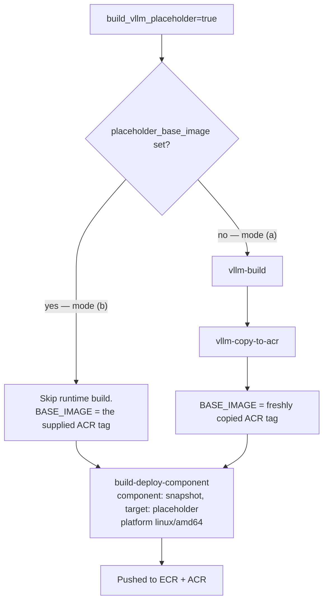

<!--
SPDX-FileCopyrightText: Copyright (c) 2026 NVIDIA CORPORATION & AFFILIATES. All rights reserved.
SPDX-License-Identifier: Apache-2.0
-->

# 06 — Placeholder image: BLOCKER for Run A

> [!CAUTION]
> **The image must contain BOTH PR #12011 and PR #12392.**
> #12011 ships GMS V1 but **no V1 saver**. Its saver speaks the V0 protocol
> (`gpu_memory_service.common.protocol.messages.HandshakeResponse`) while a
> `--use-v1` server speaks `gpu_memory_service.core.protocol.HandshakeResponse`.
> The last live run died in `gms-saver` with exactly that mismatch:
>
> ```
> msgspec.ValidationError: Object missing required field `success`
> ConnectionError: GMS handshake failed: Object missing required field `success`
> ```
>
> #12392 ("feat(gms): add v1 weight snapshot hydration") adds
> `lib/gpu_memory_service/v1/saver.py` and `v1/loader.py` and is cherry-picked
> onto this branch. Confirm before building:
>
> ```bash
> git log --oneline -1   # feat(gms): add v1 weight snapshot hydration
> ```

> [!NOTE]
> **What the composition deliberately EXCLUDES.**
> - **PR #12226** — no `checkpoint_prepare` / `checkpoint_restore`. Those are
>   upstream vLLM `Worker`/`AsyncLLM` methods present only on the nightly base;
>   including them would change what Run A is probing.
> - The vLLM base stays pinned at **v0.26.0**
>   (`container/context.yaml:64`, `vllm/vllm-openai:v0.26.0-ubuntu2404`).
>   This is above the v0.25.0 that introduced the pluggable sleep-mode backend
>   GMS V1 depends on, so V1 is viable here.

> [!CAUTION]
> **The image built for this experiment is `-vllm-runtime`. It will not work.**
> The checkpoint Job needs a **`-vllm-placeholder`** image. Fix this before
> applying `20-dynamocheckpoint.yaml`.
>
> Built (unusable as-is):
> `dynamoci.azurecr.io/ai-dynamo/dynamo:1.4.0-ci-05dac0c7da0372312819e256e1b0cd4a07a61eab-vllm-runtime`
>
> The saved reference used a placeholder image, which is why it worked:
> `…:8a8035b9…-vllm-placeholder-run-29213270567-1@sha256:c3e66f09…`

> [!IMPORTANT]
> **All images are built via the `build-on-demand` GitHub Action.** Local
> `docker build` / `docker pull` / `make docker-build-placeholder` are not used
> in this project. This document covers only the CI path.

## 1. What `-vllm-placeholder` adds over `-vllm-runtime`

The placeholder is a **strict superset** of the runtime image — `FROM ${BASE_IMAGE}`
where `BASE_IMAGE` *is* the runtime image (`deploy/snapshot/Dockerfile:371-373`;
stage comment at `:364-370`: "superset of the runtime image: same default
execution contract").

| Added | Dockerfile:line | Path in image |
|---|---|---|
| CRIU runtime libs (`libbsd0`, `libcap2`, `libnet1`, `libnl-*`, `libprotobuf-c1`, `libgnutls30t64`, `libnftables1`, `iproute2`, `iptables`, `procps`, `uuid-runtime`, `tar`) | `384-399` | system |
| **CRIU** + CUDA plugin + `snapshot_inet_remap.so` | `402-404` | `/usr/local/...` |
| **`cuda-checkpoint`** | `407` | `/usr/local/sbin/cuda-checkpoint` |
| **`cuda-checkpoint-helper`** | `409` | `/usr/local/bin/cuda-checkpoint-helper` |
| **`nsrestore`** | `413-414` | `/usr/local/bin/nsrestore` |
| `/checkpoints`, `/var/run/criu`, `/var/criu-work` | `417` | dirs |
| `ORIGINAL_BASE_IMAGE` env | `375` | metadata |

## 2. Why the checkpoint **source** Job genuinely needs it

### 2a. `cuda-checkpoint --launch-job` runs INSIDE the container (decisive)

For multi-GPU checkpoints the operator **rewrites the target container's entrypoint**:

```go
// deploy/operator/internal/controller/checkpoint_job.go:167
wrapLaunchJob := gpuCount > 1
```
```go
// deploy/snapshot/protocol/checkpoint.go:155-160
return []string{"cuda-checkpoint"}, wrappedArgs   // "--launch-job" + original cmd
```

Our pod requests **8 GPUs** via the DRA claim; `checkpoint_job.go:99-166` counts
them from the `ResourceClaimTemplate`, so `gpuCount == 8 > 1` and wrapping is ON.
On a runtime image the container dies immediately with:

```
exec: "cuda-checkpoint": executable file not found in $PATH
```

There is **no opt-out** — `WrapLaunchJob` is derived from the GPU count.

### 2b. `nsrestore` runs inside the container's namespaces (restore half)

The agent `nsenter`s and executes the binary **from the container's own filesystem**:

```go
// deploy/snapshot/internal/executor/restore.go:206-210
args := []string{"-t", strconv.Itoa(snap.PlaceholderPID), "-m","-u","-i","-n","-p",
                 "--", req.NSRestorePath, "--checkpoint-path", checkpointPath}
cmd := exec.CommandContext(ctx, "nsenter", args...)
```

`NSRestorePath` defaults to `/usr/local/bin/nsrestore`
(`deploy/helm/charts/snapshot/values.yaml:176`) — placeholder-only.

### What the runtime image already provides (not the problem)

- `DYN_SNAPSHOT_RESTORE_STANDBY` handling is pure Python
  (`components/src/dynamo/vllm/__main__.py:10-14` →
  `common/snapshot/restore_context.py:236-244`).
- Sentinel lifecycle is pure Python (`common/snapshot/lifecycle.py`).
- `cuda-checkpoint-helper` lock/checkpoint/restore/unlock run **on the host**
  (`deploy/snapshot/internal/cuda/shim.go:17,40-60` — plain `exec`, no `nsenter`).

So the gap is exactly **`cuda-checkpoint` (source) and `nsrestore` (restore)**.

## 3. The gap in `build-on-demand`, and the fix

`build-on-demand.yml` could build vllm/sglang/trtllm **runtime** and **operator**
images only — no placeholder target. Placeholders were built solely by
`pr.yaml`'s `snapshot-placeholder-vllm` job (`:987-1017`), which needs a PR and
a maintainer's `/ok to test`.

**This branch adds a `build_vllm_placeholder` input to
`.github/workflows/build-on-demand.yml`**, mirroring `pr.yaml`'s
`vllm-build → vllm-copy-to-acr → snapshot-placeholder-vllm` chain, with two modes:



**Mode (b) is what you need now** — the runtime image already exists.

## 4. The command to run

```bash
gh workflow run build-on-demand.yml \
  --repo ai-dynamo/dynamo \
  --ref rebase-test \
  -f build_vllm_placeholder=true \
  -f placeholder_base_image=dynamoci.azurecr.io/ai-dynamo/dynamo:1.4.0-ci-05dac0c7da0372312819e256e1b0cd4a07a61eab-vllm-runtime
```

> [!NOTE]
> `--ref` must be a branch **pushed to `ai-dynamo/dynamo`**, because
> `workflow_dispatch` runs the workflow definition from that ref — and the
> `build_vllm_placeholder` input only exists on a branch carrying this change.
> Push `rebase-test` (or whatever you name it) first.

Watch it:

```bash
gh run list --repo ai-dynamo/dynamo --workflow build-on-demand.yml --limit 5
gh run watch  --repo ai-dynamo/dynamo <run-id>
gh run view   --repo ai-dynamo/dynamo <run-id> --log-failed
```

The job's step summary prints every pushed URI.

### Expected output tags

With `github.sha = <SHA>` and the base tag's version prefix `1.4.0`:

| Registry | Tag |
|---|---|
| ECR (primary, from `image_tag`) | `<SHA>-vllm-placeholder` |
| **ACR (use this one)** | `dynamoci.azurecr.io/ai-dynamo/dynamo:1.4.0-ci-<SHA>-vllm-placeholder` |
| ACR (sha) | `dynamoci.azurecr.io/ai-dynamo/dynamo:<SHA>-vllm-placeholder` |
| ACR (branch) | `dynamoci.azurecr.io/ai-dynamo/dynamo:<sanitized-branch>-vllm-placeholder` |

The `<version>-ci-<sha>` shape matches `shared-copy.yml:90`
(`IMAGE_TAG="${DYNAMO_VERSION}-ci-${SOURCE_TAG}"`).

> [!WARNING]
> `<SHA>` is the SHA of the **branch head you dispatch**, not necessarily
> `05dac0c7…`. Read the actual tags from the run's step summary rather than
> assuming. If you dispatch a branch whose head *is* `05dac0c7…`, you get
> `1.4.0-ci-05dac0c7da0372312819e256e1b0cd4a07a61eab-vllm-placeholder`, which is
> exactly what the manifests currently reference.

### Verify it landed in ACR

```bash
az acr login --name dynamoci

az acr repository show-tags \
  --name dynamoci --repository ai-dynamo/dynamo \
  --orderby time_desc --top 40 -o tsv | grep placeholder

# Confirm the specific tag and inspect provenance:
az acr repository show \
  --name dynamoci \
  --image ai-dynamo/dynamo:1.4.0-ci-<SHA>-vllm-placeholder

az acr manifest show-metadata \
  --registry dynamoci \
  --name ai-dynamo/dynamo:1.4.0-ci-<SHA>-vllm-placeholder \
  --query '{tags:tags, arch:architecture, os:operatingSystem, created:createdTime}'
```

Expect `architecture: amd64` — the placeholder stage hard-errors on any other
arch (`Dockerfile:379-381`), so the job pins `linux/amd64`.

Then run every check in [`verify-image.md`](verify-image.md), especially check 1
(`cuda-checkpoint`, `cuda-checkpoint-helper`, `nsrestore`, `criu` present).

## 5. Risk: the `compliance` build-context 403

The operator build in run **30892573555** failed pulling
`docker.io/library/compliance:latest` through the ECR dockerhub proxy (403).

**The placeholder build does not hit this**, for two independent reasons:

1. `build-deploy-component` only adds `--build-context compliance=…` when
   `run_compliance == 'true'` (`action.yml:218-220`). For
   `component: snapshot` that is true **only** when the effective target is
   `agent` (`action.yml:137-139`). We pass `target: placeholder`, so compliance
   is skipped — deliberately, since the placeholder carries no `/legal`
   (`action.yml:121-126`).
2. The `placeholder` stage in `deploy/snapshot/Dockerfile:371-417` contains no
   `COPY --from=compliance` at all (only `--from=criu-builder`,
   `--from=cuda-helper-builder`, `--from=builder`).

The root cause of the operator failure is different: `build-on-demand.yml`'s
`operator` job runs a **raw `docker buildx build`** (`:175-179`) rather than
going through `build-deploy-component`, and `deploy/operator/Dockerfile:128,187`
does `COPY --from=compliance . /opt/compliance` unconditionally — with no
`--build-context compliance=…` supplied, BuildKit resolves the bare name
`compliance` as a Docker Hub image and 403s via the proxy.

<!-- UNVERIFIED: the 403 root-cause above is inferred from reading the operator
     job and Dockerfile, not from the failed run's logs. It does not affect the
     placeholder path either way. Fixing the operator job is out of scope here. -->

If a future change makes the placeholder run compliance, it would need
`--build-context compliance=../../container/compliance`, which
`build-deploy-component` already supplies on that path.

## 6. After the build — update the manifests

`20-dynamocheckpoint.yaml` and `30-dgd-restore.yaml` each carry a single
`&image` YAML anchor, currently holding a **stale placeholder tag that predates
#12392**:

```
dynamoci.azurecr.io/ai-dynamo/dynamo:1.4.0-ci-584202bf08bc11a71484cfaac28ba99683db881f-vllm-placeholder
```

A build is running from branch head as **build-on-demand run 30897584753**.
Read its ACR tag from the run's step summary and put it in both anchors:

```bash
gh run view --repo ai-dynamo/dynamo 30897584753
grep -n 'TODO: set to the tag from build-on-demand run 30897584753' \
  20-dynamocheckpoint.yaml 30-dgd-restore.yaml
```

The anchor covers every container in each file — `gms-server`, `main`,
`gms-saver` in the checkpoint; the frontend, `gms-server`, `gms-loader` and
`main` in the restore. Change the one anchored value per file.

> [!WARNING]
> If you apply the manifests with the stale tag, `gms-saver` will reproduce the
> `Object missing required field 'success'` failure, because that image has no
> V1 saver.

## 7. Alternative: full CI on the PR (slower, less certain)

A maintainer comments `/ok to test <short-sha>` on PR #12011; copy-pr-bot creates
`pull-request/12011` and `pr.yaml` runs. But `snapshot-placeholder-vllm` only
fires when `changed-files` reports `snapshot == 'true' || snapshot_vllm == 'true'`
(`pr.yaml:991-993`) — **PR #12011 touches `lib/gpu_memory_service/**`, not
`deploy/snapshot/**`, so the job may be skipped entirely.**

<!-- UNVERIFIED: the path globs behind the `snapshot` / `snapshot_vllm`
     changed-files outputs were not traced. -->

Prefer the `build-on-demand` dispatch in §4.
