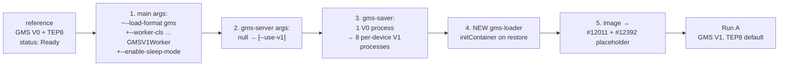
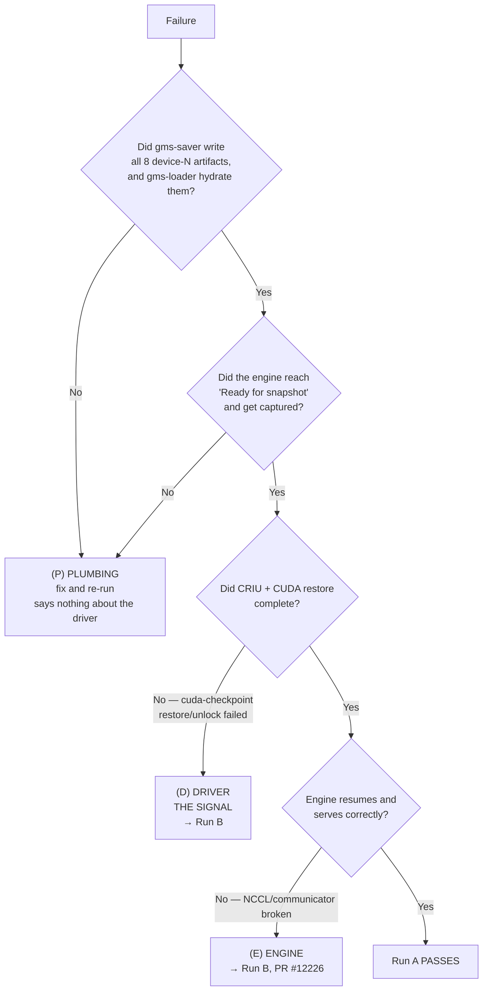

<!--
SPDX-FileCopyrightText: Copyright (c) 2026 NVIDIA CORPORATION & AFFILIATES. All rights reserved.
SPDX-License-Identifier: Apache-2.0
-->

# Run A — GMS V1 + Dynamo Snapshot, GLM-5.2 on vLLM

**This is a CUDA driver capability probe, not a feature test.** It answers one
question: does the driver handle `cuMem` allocations exported via
`CU_MEM_HANDLE_TYPE_POSIX_FILE_DESCRIPTOR` across `cuCheckpoint`?

- **Run A passes** → the driver handles it natively; no interposer needed.
- **Run A fails in the CUDA restore path** → driver gap confirmed → proceed to Run B
  (PRs #12226 + #12485).
- **Run A fails in setup/plumbing** → says nothing about the driver; fix and re-run.

Distinguishing those last two is the entire analytical job. See [Triage](#triage).

Run A must be executed for **both** topologies. **TEP8 is the default**; DEP8 is
the alternate. See [Topology](#topology).

## What the last run proved

The last live run got **far**, and everything it proved is now banked:

| Stage | Result |
|---|---|
| Namespace-scoped operator, both feature gates, cluster-wide webhook patch | works |
| DRA `ResourceClaimTemplate`, 8 GPUs shared across containers | works |
| Hand-authored `gms-server` sidecar with `args: ["--use-v1"]` surviving admission | works |
| 8 GMS **V1** servers started, one per device | works |
| GLM-5.2-NVFP4 loaded offline from `shared-model-cache` | works |
| **GMS weights committed on all 8 devices (~55.2 GiB each)** | works |
| `gms-saver` | **FAILED** |

```
msgspec.ValidationError: Object missing required field `success`
ConnectionError: GMS handshake failed: Object missing required field `success`
```

**Root cause — pure (P) plumbing, not a driver result.** PR #12011 ships no V1
saver. Its saver speaks the V0 wire protocol
(`common/protocol/messages.HandshakeResponse`) at a `--use-v1` server speaking
`core/protocol.HandshakeResponse`. **Fixed by cherry-picking PR #12392**
("feat(gms): add v1 weight snapshot hydration"), which adds
`v1/saver.py` + `v1/loader.py`.

Topology observation from that run: **TEP8 got further than DEP8.** TEP8 reached
the committed-weights stage above; DEP8 failed earlier, in vLLM DP engine-core
init (`RuntimeError: Engine core initialization failed`). Hence TEP8 is now the
default.

## The new saver/loader contract

PR #12392's V1 CLIs are **per-device** and share almost nothing with the V0
flags this experiment used to pass.

| | V0 (what the manifests used to do) | V1 (now) |
|---|---|---|
| Processes | 1, iterates all devices internally | **8, one per device** |
| Accepted flags | `--checkpoint-dir --max-workers --save-lock-timeout-ms --shard-size-bytes --sharded-ssd-roots --device-type` | saver: `--checkpoint-dir --device --shard-size-bytes`<br>loader: `--checkpoint-dir --device --max-workers` |
| Striping | `--sharded-ssd-roots` fans one device across all roots | **gone** — one `--checkpoint-dir` per device, each on a different root |
| Output | backend-defined | `<checkpoint-dir>/device-<N>/{manifest.json,shards/}` |
| Loader lifetime | blocks forever (regular sidecar) | **exits** after hydration (initContainer) |

Both parsers are `allow_abbrev=False`, so any leftover V0 flag is a hard
argparse error. Verified at `v1/saver.py:22-35`, `v1/loader.py:22-38`,
`cli/snapshot/saver.py:123-129`, `cli/snapshot/loader.py:161-167`.

### Device → NVMe root mapping

Striping now comes from *where each device writes*. There are **7 roots**
(no `nvme3`) and **8 devices**, so one root is doubled up.

| Device | Container mount | Host path | Free | Note |
|---|---|---|---|---|
| 0 | `/mnt/gms-ssd/nvme2` | `/mnt/dynamo-gms-nvme2` | 197.7 G | tightest root — **never doubled** |
| 1 | `/mnt/gms-ssd/nvme4` | `/mnt/dynamo-gms-nvme4` | 1.7 T | |
| 2 | `/mnt/gms-ssd/nvme5` | `/mnt/dynamo-gms-nvme5` | 2.3–2.4 T | |
| 3 | `/mnt/gms-ssd/nvme6` | `/mnt/dynamo-gms-nvme6` | 2.3–2.4 T | |
| 4 | `/mnt/gms-ssd/nvme7` | `/mnt/dynamo-gms-nvme7` | 2.3–2.4 T | |
| 5 | `/mnt/gms-ssd/nvme8` | `/mnt/dynamo-gms-nvme8` | 2.3–2.4 T | |
| 6 | `/mnt/gms-ssd/nvme9` | `/mnt/dynamo-gms-nvme9` | 2.3–2.4 T | |
| 7 | `/mnt/gms-ssd/nvme4` | `/mnt/dynamo-gms-nvme4` | 1.7 T | **doubled up** — roomiest after nvme5-9 |

Each device writes ~**55.2 GiB**, so `nvme4` takes ~110 GiB (~6% of its free
space). Keeping the bytes here rather than on the PVC is deliberate.

The mapping is encoded as a `ROOTS=(…)` bash array in **both**
`gms-saver` (`20-dynamocheckpoint.yaml`) and `gms-loader`
(`30-dgd-restore.yaml`). **They must stay identical** — the loader reads exactly
what the saver wrote.

## Topology

Both files carry a marked `TOPOLOGY BLOCK` with TEP8 active and DEP8 commented
out immediately below it. To flip to DEP8:

```bash
sed -i 's/tep8/dep8/g; s/TEP8/DEP8/g' 20-dynamocheckpoint.yaml 30-dgd-restore.yaml
# then, by hand:
#  - 20-dynamocheckpoint.yaml: spec.identity.tensorParallelSize 8 -> 1
#  - BOTH files: in the TOPOLOGY BLOCK, comment the TEP8 args, uncomment DEP8
grep -n 'TOPOLOGY:' 20-dynamocheckpoint.yaml 30-dgd-restore.yaml   # audit
```

| Variant | `main` args |
|---|---|
| **TEP8** (default) | `--tensor-parallel-size 8 --enable-expert-parallel` |
| DEP8 (alternate) | `--tensor-parallel-size 1 --data-parallel-size 8 --enable-expert-parallel` |

Every field that must move together is tagged `# TOPOLOGY:`: object names,
`spec.identity` (`model`, `tensorParallelSize`, `extraParameters.topology`),
the annotations, `resourceClaimTemplateName`, `checkpointRef`, the
`DYN_NAMESPACE`/`DYN_PARENT_DGD_K8S_NAME` env vars, and the `LEAF` NVMe
directory in `gms-saver`/`gms-loader`.

Because `tensorParallelSize` and `extraParameters` feed `ComputeIdentityHash`
(`checkpoint/hash.go:87-102`), the two topologies get distinct artifact
directories and never collide.

## Files

| File | Purpose |
|---|---|
| [`06-placeholder-image.md`](06-placeholder-image.md) | **START HERE.** Why the built image is wrong and how to fix it |
| [`00-namespace-scoped-operator.md`](00-namespace-scoped-operator.md) | Namespace-scoped operator with both gates ON + cluster-wide webhook patch |
| [`05-prior-attempts.md`](05-prior-attempts.md) | What has already been tried in `schwinns` and what it predicts |
| [`07-disk-cleanup.md`](07-disk-cleanup.md) | NVMe headroom on s2877 (optional — the run fits today) |
| [`verify-image.md`](verify-image.md) | Pre-flight checks on the image |
| [`20-dynamocheckpoint.yaml`](20-dynamocheckpoint.yaml) | The checkpoint (capture half) |
| [`30-dgd-restore.yaml`](30-dgd-restore.yaml) | The DGD (restore half) — **where the driver question is answered** |
| `reference/prior-working-gms-ssd-checkpoint.json` | The proven-Ready V0/TEP8 object everything is adapted from |

There is **no** model-cache manifest: GLM-5.2-NVFP4 is already on the
`shared-model-cache` PVC (50 Ti RWX) and the manifests run fully offline
(`HF_HUB_OFFLINE=1`).

## What changed from the reference

Everything not listed is verbatim from the reference (all NCCL/VLLM env vars,
probes, `securityContext`, volumes, tolerations).



| # | Change | Verified at |
|---|---|---|
| 1 | Drop `--load-format gms` (selects **V0**), add `--worker-cls …GMSV1Worker` + `--enable-sleep-mode` | `components/src/dynamo/vllm/main.py:547-548`; `v1/integrations/vllm/worker.py:6-9,23-25`; `v1/README.md:197-202` |
| 2 | `gms-server` gets `args: ["--use-v1"]` | `cli/server.py:64-68`; `cli/runner.py:90-94`; `v1/cli.py:19` |
| 3 | `gms-saver` → 8 per-device V1 processes, one NVMe root each | `cli/snapshot/saver.py:123-129`; `v1/saver.py:22-35` |
| 4 | New `gms-loader` **initContainer** on the restore half | `v1/loader.py:22-38`; `v1/README.md:90-104,145-158` |
| 5 | Placeholder image carrying #12011 **+ #12392** on every container | [`06-placeholder-image.md`](06-placeholder-image.md) |

The composition deliberately **excludes PR #12226** (no `checkpoint_prepare` /
`checkpoint_restore`) and stays on **vLLM v0.26.0**.

### Why `gms-loader` is an initContainer

On restore the rank-local `gms-server` is a **fresh process holding no
allocations**. The restored worker does not reload the model — it re-imports its
committed weight allocations under the same allocation IDs from a server a
loader has already populated and committed
(`v1/README.md:27-30, 90-104, 145-158`). Three independent reasons force
`initContainer` over a regular container:

1. **The V1 loader exits** after hydration (`v1/loader.py:32-38`). DGD worker
   pods are Deployment-backed (`restartPolicy: Always`), so kubelet would
   restart a regular container that exits 0. On restart it connects RW to an
   already-committed server, which **clears the old epoch**
   (`core/server/sessions.py:12-14, 100-116`) and destroys the hydrated weights
   under the running worker. The V0 loader blocks forever
   (`cli/snapshot/loader.py:215-216`) precisely so it *can* be a regular
   sidecar; its docstring says exactly that (`cli/snapshot/loader.py:6-9`). V1
   inverts that choice, so V1 inverts the container kind.
2. **Deterministic ordering, not lock-mediated.** A regular container would race
   the worker's `connect RO, remap_all_vas`. RO is only grantable once the
   server is committed (`sessions.py:133-139`) and that acquire is **untimed**
   (`rpc.py:49` → `sessions.py:51-57`, `timeout=None`) — so the worker would
   silently hang inside its CUDA wake path. That hang is precisely the symptom
   that would be misread as a **(D) driver** failure.
3. **Unbounded time.** The restore-complete startup probe budget (1800 s at 1 s
   cadence, `protocol/restore.go:39,127-156`) only starts once `main` starts,
   i.e. after hydration.

`gms-server` is a *native* sidecar (init + `restartPolicy: Always`), so kubelet
starts it and proceeds immediately to `gms-loader`
(`gms/gms.go:36-41`); `gms-loader` is a plain initContainer and therefore runs
to completion before `main`.

`gms-loader` is **not** listed in `extraClientContainers`: every path consuming
that list scans `podSpec.Containers` only and silently ignores absent names
(`dynamo/graph.go:1615-1627`; `checkpoint/podspec.go:344-355`;
`v1beta1/common.go:217-226`), so an initContainer can never match. Its GMS
client contract (DRA claim + `gms-intrapod-control` mount + `GMS_SOCKET_DIR`,
per `checkpoint/gms_pod_validation.go:75-85`) is hand-written instead.

## Runbook

### 0. Build the placeholder image — **BLOCKER**

The image must carry **#12011 + #12392**. A build from branch head is running as
**build-on-demand run 30897584753**; read its ACR tag from the step summary and
put it in the `&image` anchor of both manifests (search for
`TODO: set to the tag from build-on-demand run 30897584753`).

To dispatch a fresh one:

```bash
gh workflow run build-on-demand.yml \
  --repo ai-dynamo/dynamo \
  --ref rebase-test \
  -f build_vllm_placeholder=true \
  -f placeholder_base_image=dynamoci.azurecr.io/ai-dynamo/dynamo:1.4.0-ci-05dac0c7da0372312819e256e1b0cd4a07a61eab-vllm-runtime
```

> [!WARNING]
> `placeholder_base_image` must be a runtime image built from a commit that
> **includes #12392**. Reusing the old `05dac0c7…` runtime image layers CRIU
> onto a tree with no V1 saver and reproduces the original failure.

Full detail, expected tags and ACR verification: [`06-placeholder-image.md`](06-placeholder-image.md).

### 1. Verify the image

Run every check in [`verify-image.md`](verify-image.md). Do not skip checks 1 and 2.
Additionally confirm the V1 saver/loader are present and per-device:

```bash
python3 -m gpu_memory_service.cli.snapshot.saver  --use-v1 --help
python3 -m gpu_memory_service.cli.snapshot.loader --use-v1 --help
# Each must list ONLY --checkpoint-dir/--device/(--shard-size-bytes|--max-workers).
# If either shows --sharded-ssd-roots, the image predates #12392.
```

### 2. Operator + webhooks

Follow [`00-namespace-scoped-operator.md`](00-namespace-scoped-operator.md):
clean up the failed `dynamo-platform-gmscr` release → patch the cluster-wide
webhooks to exclude `schwinns` (start the repatch loop; Flux reverts every 2 m) →
install the namespace-scoped operator → verify the existing snapshot-agent →
run the gate smoke test.

The smoke test must fail with
`...must contain the GMS shared volume "gms-intrapod-control"` — that means both
gates are ON and our operator is admitting.

### 3. (Optional) disk headroom

[`07-disk-cleanup.md`](07-disk-cleanup.md). Each device now needs ~55.2 GiB on
**one** root rather than ~53 GB spread over all seven; `nvme2` (197.7 G free)
still fits its single device comfortably, so **the run fits without cleanup**.

### 4. Capture half

```bash
CTX=nv-prd-dgxc.teleport.sh-dynamo-nscale-dev-cluster
NS=schwinns
CKPT=gmsv1-glm52-tep8      # gmsv1-glm52-dep8 for the DEP8 variant

kubectl --context "$CTX" -n "$NS" apply -f 20-dynamocheckpoint.yaml

# Watch the CR.
kubectl --context "$CTX" -n "$NS" get dynamocheckpoint "$CKPT" -w
# Phases: Pending -> Creating -> Ready | Failed  (dynamocheckpoint_types.go:29-37)

# Watch the Job pod.
kubectl --context "$CTX" -n "$NS" get pods -l nvidia.com/snapshot-owner="$CKPT" -w
POD=$(kubectl --context "$CTX" -n "$NS" get pod \
      -l nvidia.com/snapshot-owner="$CKPT" -o name | head -1)

# THE THREE LOG STREAMS THAT MATTER
kubectl --context "$CTX" -n "$NS" logs -f "$POD" -c gms-server   # GMS V1 sidecar
kubectl --context "$CTX" -n "$NS" logs -f "$POD" -c main         # vLLM engine
kubectl --context "$CTX" -n "$NS" logs -f "$POD" -c gms-saver    # 8 shard writers

# The agent drives CRIU/cuda-checkpoint from the host:
kubectl --context "$CTX" -n "$NS" logs -f \
  -l app.kubernetes.io/component=snapshot-agent
```

#### What success looks like

| Stage | Evidence |
|---|---|
| V1 sidecar up | `gms-server`: `Started GMS V1 device=N pid=…` ×8 (`cli/server.py:89-94`) |
| Entrypoint wrapped | `main` cmdline starts `cuda-checkpoint --launch-job` (`protocol/checkpoint.go:155-160`) |
| V1 worker selected | `main`: GMS V1 backend init; **no** `GMSWorker` (V0) mention |
| Weights committed | `main`: `GMS weights committed device=N parameter_span_bytes=… ` (`v1/integrations/vllm/backend.py:96-113`) ← *the last run reached here* |
| Engine asleep + ready | `main`: `Pausing model` → `Ready for snapshot. Polling for sentinel in /snapshot-control` (`common/snapshot/lifecycle.py:52-63`) |
| Pod Ready | readiness probe `cat /snapshot-control/ready-for-snapshot` passes (`protocol/checkpoint.go:76-83`) |
| Shards written | `gms-saver`: `gms-saver: device=N checkpoint-dir=…` ×8, then `GMS V1 saver total device=N …` ×8 (`v1/snapshot.py:167-175`), then `gms-saver: all devices finished rc=0` |
| CRIU capture | agent logs dump progress; `main` logs `Snapshot completion sentinel detected` (`lifecycle.py:79`) |
| Done | `status.phase: Ready` |

```bash
# Per-device artifacts on disk (host paths). Expect 8 device-N dirs, each with
# manifest.json + shards/, and nvme4 holding TWO of them (devices 1 and 7).
kubectl --context "$CTX" -n "$NS" exec nvme-janitor -- \
  sh -c 'du -sh /mnt/dynamo-gms-nvme*/schwinns/gmsv1-glm52-tep8/device-* 2>/dev/null'
```

### 5. Restore half — the actual experiment

```bash
kubectl --context "$CTX" -n "$NS" apply -f 30-dgd-restore.yaml
kubectl --context "$CTX" -n "$NS" get dgd "${CKPT}-restore" -w

RPOD=$(kubectl --context "$CTX" -n "$NS" get pod \
       -l nvidia.com/dynamo-component=VllmDecodeWorker -o name | head -1)
```

**Check these first — they invalidate the run if wrong:**

```bash
kubectl --context "$CTX" -n "$NS" get "$RPOD" \
  -o jsonpath='{.spec.initContainers[?(@.name=="gms-server")].args}{"\n"}'
# MUST print ["--use-v1"].

kubectl --context "$CTX" -n "$NS" get "$RPOD" \
  -o jsonpath='{range .spec.initContainers[*]}{.name}{"\n"}{end}'
# MUST list gms-server AND gms-loader, in that order.
```

The restore webhook re-injects a GMS sidecar with **no args** (V0) via
`gms.Container()` (`gms/gms.go:49,122-136`). Our same-named sidecar wins by
`EnsureServerSidecar`'s early return (`gms/gms.go:51-55`). If the args are empty
you are running a V0 server against V1 clients and any failure is **(P)**.

```bash
# Weight hydration must complete before `main` starts:
kubectl --context "$CTX" -n "$NS" logs "$RPOD" -c gms-loader
# expect: GMS V1 loader total device=N ... x8, then
#         gms-loader: all devices finished rc=0

# Restore is shaped correctly:
kubectl --context "$CTX" -n "$NS" get "$RPOD" -o jsonpath='{.metadata.labels}' | tr ',' '\n' | grep snapshot
# expect nvidia.com/snapshot-is-restore-target=true + nvidia.com/snapshot-checkpoint-id=<id>

# THE CUDA RESTORE ITSELF — agent side, on the host:
kubectl --context "$CTX" -n "$NS" logs -f \
  -l app.kubernetes.io/component=snapshot-agent | tee restore-agent.log

kubectl --context "$CTX" -n "$NS" logs -f "$RPOD" -c main
kubectl --context "$CTX" -n "$NS" logs -f "$RPOD" -c gms-server
```

#### What success looks like

| Stage | Evidence |
|---|---|
| Weights hydrated | `gms-loader`: `GMS V1 loader commit/publish device=N …` ×8 then `complete; exiting` (`v1/snapshot.py:267-278`, `v1/loader.py:38`) |
| Standby | `main`: process is `sleep infinity` (`restore_context.py:236-244`) |
| nsrestore starts | agent: `Executing nsenter + nsrestore` (`executor/restore.go:224`) |
| CRIU restore OK | agent: nsrestore returns a valid restored PID (`restore.go:238-241`) |
| **CUDA restore OK** | agent: `cuda-checkpoint-helper` `restore` then `unlock` succeed (`cuda/shim.go:32-37,53-60`) ← **THE SIGNAL** |
| GMS wake | `main`: KV reallocated + remapped at saved VAs, weights re-imported RO (`v1/README.md:145-158`) |
| Engine resumes | `main`: `Restore sentinel detected` → `Resuming model after restore` (`lifecycle.py:69-73`) |
| Pod Ready | restore-complete startup probe passes (`protocol/restore.go:136-146`) |

```bash
# Smoke test the restored engine:
kubectl --context "$CTX" -n "$NS" port-forward "svc/${CKPT}-restore-frontend" 8000:8000 &
curl -s localhost:8000/v1/models | jq
curl -s localhost:8000/v1/chat/completions -H 'Content-Type: application/json' -d '{
  "model": "nvidia/GLM-5.2-NVFP4",
  "messages": [{"role":"user","content":"Say hi in five words."}],
  "max_tokens": 32}' | jq -r '.choices[0].message.content'
```

Coherent output = **Run A passes**. The driver handles `cuMem` POSIX FDs across
`cuCheckpoint`. No interposer needed.

## Triage

Classify every failure into exactly one class. Only **(D)** and **(E)** justify Run B.



> [!IMPORTANT]
> Anything in the saver/loader path is **(P)**, by construction — it is
> file I/O and a UDS protocol, not CUDA restore. The last run's failure was
> exactly there.

### (P) Plumbing — fix and re-run

| Symptom | Cause | Fix |
|---|---|---|
| `msgspec.ValidationError: Object missing required field 'success'` in `gms-saver` | image has #12011 but **not** #12392 → V0 saver against a V1 server | rebuild with #12392; [`06-placeholder-image.md`](06-placeholder-image.md) |
| `unrecognized arguments: --sharded-ssd-roots` (or `--max-workers`) in `gms-saver` | a V0 flag survived into the V1 per-device command | the V1 saver takes only `--checkpoint-dir/--device/--shard-size-bytes` (`v1/saver.py:22-28`) |
| `gms-loader` missing from the restore pod | the initContainer was dropped or renamed | it is hand-authored; `extraClientContainers` cannot add it |
| `gms-loader: MISSING …/device-N/manifest.json` | the `ROOTS`/`LEAF` mapping differs between saver and loader, or the capture half never finished | make the two `ROOTS=(…)`/`LEAF=` lines identical |
| Restored worker hangs with no CUDA error | weights server never committed → the worker's RO acquire blocks forever (`sessions.py:51-57`, `timeout=None`) | check `gms-loader` exited 0 |
| `exec: "cuda-checkpoint": not found` | runtime image, not placeholder | [`06-placeholder-image.md`](06-placeholder-image.md) |
| `spec: Forbidden: checkpoint functionality is disabled` | cluster-wide webhook admitted it | re-patch webhooks; check the Lease (§1 of `00-`) |
| `spec.gpuMemoryService: Forbidden: GMS + Snapshot is temporarily disabled` | `gmsSnapshot` gate off on our operator | re-check `featureGates.gmsSnapshot` |
| `must contain the GMS shared volume / resource claim / GMS_SOCKET_DIR` | pod contract broken | compare against `gms_pod_validation.go:45-85` |
| `GPU Memory Service allocator extension is not built` | `_allocator_ext` is `None` | `verify-image.md` check 2 |
| `GMS V1 requires vLLM sleep mode` | `--enable-sleep-mode` missing | `worker.py:23-25` |
| gms-server logs show no `V1` | `--use-v1` missing/pruned | check `initContainers[gms-server].args` |
| `FailedMount` on a hostPath | referenced `nvme3` (does not exist) | 7 roots only: 2,4,5,6,7,8,9 |
| Pod Pending, no GPUs | DRA claim/template missing or count 0 | check `ResourceClaimTemplate` and `DeviceClass gpu.nvidia.com` |
| `No space left on device` in gms-saver | a root filled up | [`07-disk-cleanup.md`](07-disk-cleanup.md); check nvme4, which now carries two devices |
| Model won't load / offline error | model not on `shared-model-cache` | `verify-image.md` check 6 |
| DP coordinator / rpc-port / all2all errors, `Engine core initialization failed` | DEP8-specific topology issue | expected — DEP8 failed exactly here last run; TEP8 is the default |

> [!NOTE]
> **Run both topologies; TEP8 is the default.** In the last live run TEP8 loaded
> the model and committed GMS weights on all 8 devices, while DEP8 failed
> earlier in vLLM DP engine-core init (`RuntimeError: Engine core
> initialization failed`). Prior runs agree: TEP8 5 Ready / 6, DEP8 1 Ready / 2
> ([`05-prior-attempts.md`](05-prior-attempts.md)).
>
> Flipping is one marked block per file plus the `sed` in [Topology](#topology).
>
> - Both topologies fail the same way → shared failure, likely (D)/(E) → signal holds.
> - TEP8 passes, DEP8 fails → DEP-specific **(P)** → not a driver result.

### (D) Driver / CUDA restore — **THE SIGNAL** → Run B

Engine slept and was captured, but restore fails. Look for:

- `cuda-checkpoint-helper … failed for pid N` with action `restore` or `unlock`
  (`cuda/shim.go:74-83`)
- CRIU restore succeeds but the CUDA phase does not
- VMM remap at a saved VA fails, or imported POSIX FD handles are invalid
  post-restore (`common/vmm/cuda_utils.py:97-141`)
- GMS `remap_all_vas` / `reallocate_all_handles` errors on wake

```bash
grep -iE 'cuda-checkpoint|restore|unlock|cuMem|VMM|POSIX' restore-agent.log | tail -80
```

**Capture and keep** `restore-agent.log`, the `main` and `gms-server` logs, and
`nvidia-smi` on the node. This is the deliverable for the CUDA driver team.

### (E) Engine / communicator → Run B (PR #12226)

Restore succeeds but NCCL/communicator state is broken (hangs on the first
collective, NCCL aborts, mismatched comm IDs). This is exactly what
`checkpoint_prepare`/`checkpoint_restore` in #12226 addresses.

## Cleanup

```bash
kubectl --context "$CTX" -n "$NS" delete -f 30-dgd-restore.yaml
kubectl --context "$CTX" -n "$NS" delete -f 20-dynamocheckpoint.yaml
# GMS artifacts are NOT auto-deleted (deletion-policy Retain) and now live
# per-device under each NVMe root:
kubectl --context "$CTX" -n "$NS" exec nvme-janitor -- \
  sh -c 'rm -rf /mnt/dynamo-gms-nvme*/schwinns/gmsv1-glm52-tep8'
```

Then stop the webhook repatch loop and uninstall the namespace-scoped operator
(teardown section of [`00-namespace-scoped-operator.md`](00-namespace-scoped-operator.md)).
