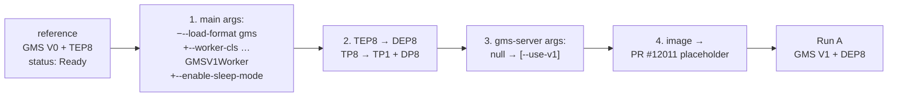
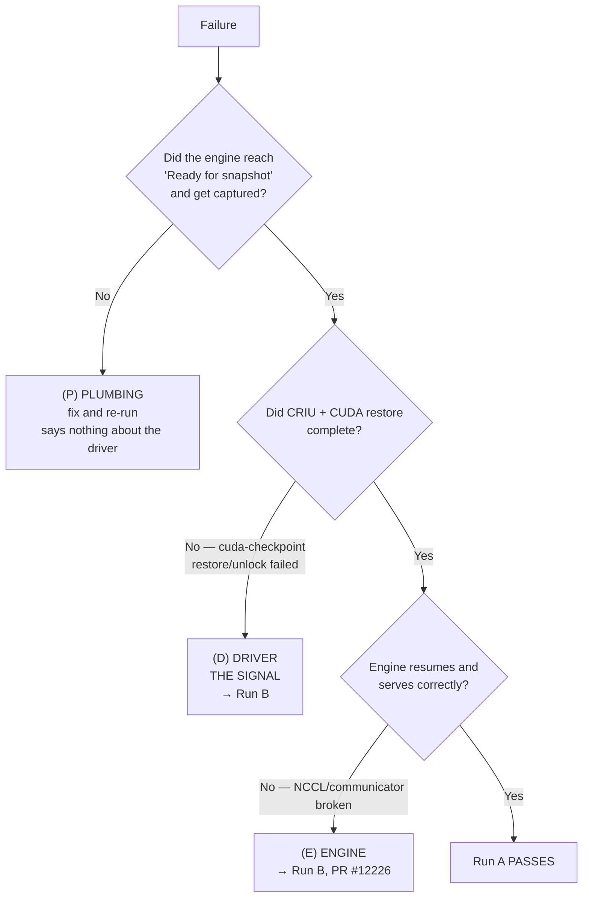

<!--
SPDX-FileCopyrightText: Copyright (c) 2026 NVIDIA CORPORATION & AFFILIATES. All rights reserved.
SPDX-License-Identifier: Apache-2.0
-->

# Run A — GMS V1 + Dynamo Snapshot, GLM-5.2 DEP8 on vLLM

**This is a CUDA driver capability probe, not a feature test.** It answers one
question: does the driver handle `cuMem` allocations exported via
`CU_MEM_HANDLE_TYPE_POSIX_FILE_DESCRIPTOR` across `cuCheckpoint`?

- **Run A passes** → the driver handles it natively; no interposer needed.
- **Run A fails in the CUDA restore path** → driver gap confirmed → proceed to Run B
  (PRs #12226 + #12485).
- **Run A fails in setup/plumbing** → says nothing about the driver; fix and re-run.

Distinguishing those last two is the entire analytical job. See [Triage](#triage).

> [!CAUTION]
> **BLOCKER — read [`06-placeholder-image.md`](06-placeholder-image.md) first.**
> The image built for this experiment is `-vllm-runtime`. The checkpoint Job
> needs `-vllm-placeholder`. With 8 GPUs the operator rewrites the entrypoint to
> `cuda-checkpoint --launch-job`, a binary that exists only in the placeholder
> image, so a runtime image fails instantly. That doc has the exact one-command fix.

## Files

| File | Purpose |
|---|---|
| [`06-placeholder-image.md`](06-placeholder-image.md) | **START HERE.** Why the built image is wrong and how to fix it |
| [`00-namespace-scoped-operator.md`](00-namespace-scoped-operator.md) | Namespace-scoped operator with both gates ON + cluster-wide webhook patch |
| [`05-prior-attempts.md`](05-prior-attempts.md) | What has already been tried in `schwinns` and what it predicts |
| [`07-disk-cleanup.md`](07-disk-cleanup.md) | NVMe headroom on s2877 (optional — the run fits today) |
| [`verify-image.md`](verify-image.md) | Pre-flight checks on the image |
| [`20-dynamocheckpoint.yaml`](20-dynamocheckpoint.yaml) | The checkpoint (capture half) |
| [`30-dgd-restore.yaml`](30-dgd-restore.yaml) | The DGD (restore half) — **where the driver question is answered** |
| `reference/prior-working-gms-ssd-checkpoint.json` | The proven-Ready V0/TEP8 object everything is adapted from |

There is **no** model-cache manifest: GLM-5.2-NVFP4 is already on the
`shared-model-cache` PVC (50 Ti RWX) and the manifests run fully offline
(`HF_HUB_OFFLINE=1`).

## What changed from the reference

Four deliberate changes; everything else is verbatim (all NCCL/VLLM env vars,
probes, `securityContext`, volumes, tolerations).



| # | Change | Verified at |
|---|---|---|
| 1 | Drop `--load-format gms` (selects **V0**), add `--worker-cls …GMSV1Worker` + `--enable-sleep-mode` | `components/src/dynamo/vllm/main.py:547-548`; `v1/integrations/vllm/worker.py:6-9,23-25`; `v1/README.md` |
| 2 | TEP8 → DEP8 (`TP=1`, `DP=8`, expert-parallel) | `profiler/utils/config_modifiers/vllm.py:417-451` |
| 3 | `gms-server` gets `args: ["--use-v1"]` | `cli/server.py:64-68`; `cli/runner.py:90-94`; `v1/cli.py:19` |
| 4 | Placeholder image on all three containers | `06-placeholder-image.md` |

## Runbook

### 0. Build the placeholder image — **BLOCKER**

All images are built via the **`build-on-demand` GitHub Action** — no local
docker. Push this branch to `ai-dynamo/dynamo` first (the
`build_vllm_placeholder` input only exists on a branch carrying the workflow
change), then:

```bash
gh workflow run build-on-demand.yml \
  --repo ai-dynamo/dynamo \
  --ref rebase-test \
  -f build_vllm_placeholder=true \
  -f placeholder_base_image=dynamoci.azurecr.io/ai-dynamo/dynamo:1.4.0-ci-05dac0c7da0372312819e256e1b0cd4a07a61eab-vllm-runtime
```

This reuses the already-built runtime image as `BASE_IMAGE` and only layers CRIU
/ `cuda-checkpoint` / `nsrestore` on top. Read the resulting ACR tag from the run's
step summary and put it in the `&image` anchor of both manifests.
Full detail, expected tags and ACR verification: [`06-placeholder-image.md`](06-placeholder-image.md).

### 1. Verify the image

Run every check in [`verify-image.md`](verify-image.md). Do not skip checks 1 and 2.

### 2. Operator + webhooks

Follow [`00-namespace-scoped-operator.md`](00-namespace-scoped-operator.md):
clean up the failed `dynamo-platform-gmscr` release → patch the cluster-wide
webhooks to exclude `schwinns` (start the repatch loop; Flux reverts every 2 m) →
install the namespace-scoped operator → verify the existing snapshot-agent →
run the gate smoke test.

The smoke test must fail with
`...must contain the GMS shared volume "gms-intrapod-control"` — that means both
gates are ON and our operator is admitting.

### 3. (Optional) disk headroom

[`07-disk-cleanup.md`](07-disk-cleanup.md). Needed ~53 GB/root; `nvme2` has
~212 GB free, so **the run fits without cleanup**. Do step 2 there (delete
`gms-storage`, 2.3 TB) if you want comfortable headroom for repeat runs.

### 4. Capture half

```bash
CTX=nv-prd-dgxc.teleport.sh-dynamo-nscale-dev-cluster
NS=schwinns

kubectl --context "$CTX" -n "$NS" apply -f 20-dynamocheckpoint.yaml

# Watch the CR.
kubectl --context "$CTX" -n "$NS" get dynamocheckpoint gmsv1-glm52-dep8 -w
# Phases: Pending -> Creating -> Ready | Failed  (dynamocheckpoint_types.go:29-37)

# Watch the Job pod.
kubectl --context "$CTX" -n "$NS" get pods -l nvidia.com/snapshot-owner=gmsv1-glm52-dep8 -w
POD=$(kubectl --context "$CTX" -n "$NS" get pod \
      -l nvidia.com/snapshot-owner=gmsv1-glm52-dep8 -o name | head -1)

# THE THREE LOG STREAMS THAT MATTER
kubectl --context "$CTX" -n "$NS" logs -f "$POD" -c gms-server   # GMS V1 sidecar
kubectl --context "$CTX" -n "$NS" logs -f "$POD" -c main         # vLLM engine
kubectl --context "$CTX" -n "$NS" logs -f "$POD" -c gms-saver    # shard writer

# The agent drives CRIU/cuda-checkpoint from the host:
kubectl --context "$CTX" -n "$NS" logs -f \
  -l app.kubernetes.io/component=snapshot-agent
```

#### What success looks like

| Stage | Evidence |
|---|---|
| V1 sidecar up | `gms-server`: `Started GMS V1 device=N pid=…` ×8 (`cli/server.py:89-94`) |
| Entrypoint wrapped | `main` cmdline starts `cuda-checkpoint --launch-job` (`protocol/checkpoint.go:155-160`) |
| V1 worker selected | `main`: GMS V1 backend init; **no** `GMSWorker` (V0) mention |
| Weights committed | `main`: `GMS weights committed device=N parameter_span_bytes=… ` (`v1/integrations/vllm/backend.py:96-113`) |
| Engine asleep + ready | `main`: `Pausing model` → `Ready for snapshot. Polling for sentinel in /snapshot-control` (`common/snapshot/lifecycle.py:52-63`) |
| Pod Ready | readiness probe `cat /snapshot-control/ready-for-snapshot` passes (`protocol/checkpoint.go:76-83`) |
| Shards written | `gms-saver`: `GMS checkpoint saved: device=N elapsed=…` ×8 then `All 8 devices saved` (`cli/snapshot/saver.py:72,162-163`) |
| CRIU capture | agent logs dump progress; `main` logs `Snapshot completion sentinel detected` (`lifecycle.py:79`) |
| Done | `status.phase: Ready` |

```bash
# Shards on disk (host paths):
kubectl --context "$CTX" -n "$NS" exec nvme-janitor -- \
  sh -c 'du -sh /mnt/nvme*/schwinns/gmsv1-glm52-dep8/* 2>/dev/null'
```

### 5. Restore half — the actual experiment

```bash
kubectl --context "$CTX" -n "$NS" apply -f 30-dgd-restore.yaml
kubectl --context "$CTX" -n "$NS" get dgd gmsv1-glm52-dep8-restore -w

RPOD=$(kubectl --context "$CTX" -n "$NS" get pod \
       -l nvidia.com/dynamo-component=VllmDecodeWorker -o name | head -1)
```

**Check this first — it invalidates the run if wrong:**

```bash
kubectl --context "$CTX" -n "$NS" get "$RPOD" \
  -o jsonpath='{.spec.initContainers[?(@.name=="gms-server")].args}{"\n"}'
# MUST print ["--use-v1"].
```

The restore webhook re-injects a GMS sidecar with **no args** (V0) via
`gms.Container()` (`gms/gms.go:49,122-136`). Our same-named sidecar wins by
`EnsureServerSidecar`'s early return (`gms/gms.go:51-55`). If the args are empty
you are running a V0 server against V1 clients and any failure is **(P)**.

```bash
# Restore is shaped correctly:
kubectl --context "$CTX" -n "$NS" get "$RPOD" -o jsonpath='{.metadata.labels}' | tr ',' '\n' | grep snapshot
# expect nvidia.com/snapshot-is-restore-target=true + nvidia.com/snapshot-checkpoint-id=<id>

# THE CUDA RESTORE ITSELF — agent side, on the host:
kubectl --context "$CTX" -n "$NS" logs -f \
  -l app.kubernetes.io/component=snapshot-agent | tee restore-agent.log

kubectl --context "$CTX" -n "$NS" logs -f "$RPOD" -c main
kubectl --context "$CTX" -n "$NS" logs -f "$RPOD" -c gms-server
```

#### What success looks like

| Stage | Evidence |
|---|---|
| Standby | `main`: process is `sleep infinity` (`restore_context.py:236-244`) |
| nsrestore starts | agent: `Executing nsenter + nsrestore` (`executor/restore.go:224`) |
| CRIU restore OK | agent: nsrestore returns a valid restored PID (`restore.go:238-241`) |
| **CUDA restore OK** | agent: `cuda-checkpoint-helper` `restore` then `unlock` succeed (`cuda/shim.go:32-37,53-60`) ← **THE SIGNAL** |
| GMS wake | `main`: KV reallocated + remapped at saved VAs, weights re-imported RO (`v1/README.md` "Sleep and wake") |
| Engine resumes | `main`: `Restore sentinel detected` → `Resuming model after restore` (`lifecycle.py:69-73`) |
| Pod Ready | restore-complete startup probe passes (`protocol/restore.go:136-146`) |

```bash
# Smoke test the restored engine:
kubectl --context "$CTX" -n "$NS" port-forward svc/gmsv1-glm52-dep8-restore-frontend 8000:8000 &
curl -s localhost:8000/v1/models | jq
curl -s localhost:8000/v1/chat/completions -H 'Content-Type: application/json' -d '{
  "model": "nvidia/GLM-5.2-NVFP4",
  "messages": [{"role":"user","content":"Say hi in five words."}],
  "max_tokens": 32}' | jq -r '.choices[0].message.content'
```

Coherent output = **Run A passes**. The driver handles `cuMem` POSIX FDs across
`cuCheckpoint`. No interposer needed.

## Triage

Classify every failure into exactly one class. Only **(D)** and **(E)** justify Run B.



### (P) Plumbing — fix and re-run

| Symptom | Cause | Fix |
|---|---|---|
| `exec: "cuda-checkpoint": not found` | runtime image, not placeholder | [`06-placeholder-image.md`](06-placeholder-image.md) |
| `spec: Forbidden: checkpoint functionality is disabled` | cluster-wide webhook admitted it | re-patch webhooks; check the Lease (§1 of `00-`) |
| `spec.gpuMemoryService: Forbidden: GMS + Snapshot is temporarily disabled` | `gmsSnapshot` gate off on our operator | re-check `featureGates.gmsSnapshot` |
| `must contain the GMS shared volume / resource claim / GMS_SOCKET_DIR` | pod contract broken | compare against `gms_pod_validation.go:45-85` |
| `GPU Memory Service allocator extension is not built` | `_allocator_ext` is `None` | `verify-image.md` check 2 |
| `GMS V1 requires vLLM sleep mode` | `--enable-sleep-mode` missing | `worker.py:23-25` |
| gms-server logs show no `V1` | `--use-v1` missing/pruned | check `initContainers[gms-server].args` |
| `FailedMount` on a hostPath | referenced `nvme3` (does not exist) | 7 roots only: 2,4,5,6,7,8,9 |
| Pod Pending, no GPUs | DRA claim/template missing or count 0 | check `ResourceClaimTemplate` and `DeviceClass gpu.nvidia.com` |
| `No space left on device` in gms-saver | nvme2 full | [`07-disk-cleanup.md`](07-disk-cleanup.md) |
| Model won't load / offline error | model not on `shared-model-cache` | `verify-image.md` check 6 |
| **DEP8-specific**: DP coordinator / rpc-port / all2all errors | DEP8 topology issue | **switch to the TEP8 control** — see below |

> [!WARNING]
> **DEP8 is the riskier topology.** Prior runs: TEP8 5 Ready / 6 Failed; DEP8
> **1 Ready / 2 Failed**, and that one success also carried `ccoff`+`tar`
> modifiers ([`05-prior-attempts.md`](05-prior-attempts.md)).
>
> **If DEP8 fails anywhere before the CUDA restore, run TEP8 as a control before
> concluding anything.** Both files have a clearly marked TOPOLOGY block:
> comment out the DEP8 lines, uncomment the TEP8 lines (which are the reference's
> exact args), in **both** `20-dynamocheckpoint.yaml` and `30-dgd-restore.yaml`.
>
> - TEP8 also fails → shared failure, likely (D)/(E) → the signal holds.
> - TEP8 passes, DEP8 fails → DEP-specific **(P)** → not a driver result.

### (D) Driver / CUDA restore — **THE SIGNAL** → Run B

Engine slept and was captured, but restore fails. Look for:

- `cuda-checkpoint-helper … failed for pid N` with action `restore` or `unlock`
  (`cuda/shim.go:74-83`)
- CRIU restore succeeds but the CUDA phase does not
- VMM remap at a saved VA fails, or imported POSIX FD handles are invalid
  post-restore (`common/vmm/cuda_utils.py:97-141`)
- GMS `remap_all_vas` / `reallocate_all_handles` errors on wake

```bash
grep -iE 'cuda-checkpoint|restore|unlock|cuMem|VMM|POSIX' restore-agent.log | tail -80
```

**Capture and keep** `restore-agent.log`, the `main` and `gms-server` logs, and
`nvidia-smi` on the node. This is the deliverable for the CUDA driver team.

### (E) Engine / communicator → Run B (PR #12226)

Restore succeeds but NCCL/communicator state is broken (hangs on the first
collective, NCCL aborts, mismatched comm IDs). This is exactly what
`checkpoint_prepare`/`checkpoint_restore` in #12226 addresses.

## Cleanup

```bash
kubectl --context "$CTX" -n "$NS" delete -f 30-dgd-restore.yaml
kubectl --context "$CTX" -n "$NS" delete -f 20-dynamocheckpoint.yaml
# Shards are NOT auto-deleted (deletion-policy Retain):
kubectl --context "$CTX" -n "$NS" exec nvme-janitor -- \
  sh -c 'rm -rf /mnt/nvme*/schwinns/gmsv1-glm52-dep8'
```

Then stop the webhook repatch loop and uninstall the namespace-scoped operator
(teardown section of [`00-namespace-scoped-operator.md`](00-namespace-scoped-operator.md)).
