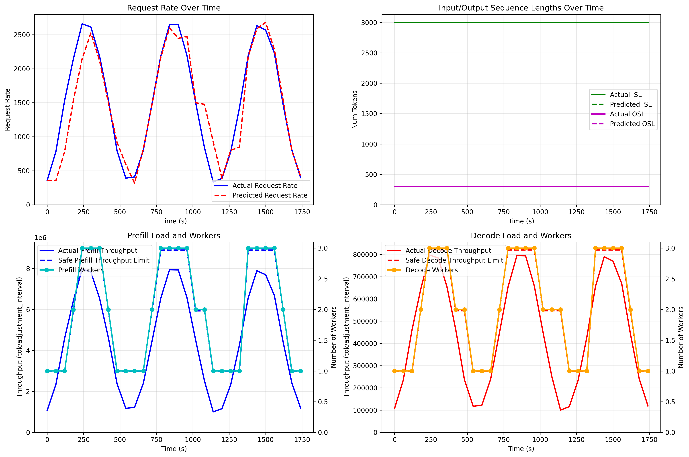
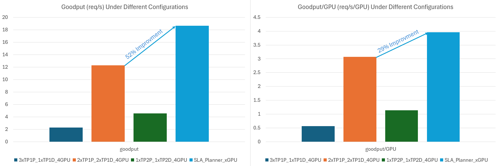

<!--
SPDX-FileCopyrightText: Copyright (c) 2025 NVIDIA CORPORATION & AFFILIATES.
All rights reserved.
SPDX-License-Identifier: Apache-2.0
-->

# SLA Planner Load Test

This directory contains comprehensive testing tools for validating the SLA planner's scaling behavior.
The SLA planner monitors metrics every 60 seconds (default adjustment interval) and scales
prefill/decode workers based on TTFT, ITL, and request patterns.

To setup the environment, simply use the released docker images for any backends, or build your own docker image following the READMEs in `./components/backends/<vllm/sglang/trtllm>/README.md`, or follow the `Developing Locally` section in [README.md](../../README.md) to setup the environment locally. If using the local environment, make sure to install dependencies by running `uv pip install -r container/deps/requirements.txt`

## Pre-Requisite: Pre-Deployment Profiling Data

You have two options to obtain the pre-deployment profiling data:

### Option A: Use Test Configuration (Quickstart)

Use the pre-configured test deployment with sample profiling data, we provide the results and the deployment configuration for the following models x hardware configurations:
- `nvidia/Llama-3.1-8B-Instruct-FP8` on H200 with max context length 16384, TP1 Prefill, and TP1 Decode. At ISL/OSL 3000/150, it achieves 40k tokens/s/gpu prefill with 80ms TTFT and 10k tokens/s/gpu decode with 10ms ITL. See `profiling_results/H200_TP1P_TP1D/`.

### Option B: Use Your Own Profiling Results

1. Run pre-deployment profiling for your specific setup. See the [pre-deployment profiling documentation](../../docs/benchmarks/pre_deployment_profiling.md) for detailed instructions.

## Interpolator Testing

SLA planner uses two interpolators to estimate the performance of prefill and decode. You can test the interpolators with the following command:

```bash
python components/planner/src/dynamo/planner/utils/perf_interpolation.py \
  --profile_results_dir <path_to_profile_results> \
  --isl <ISL> \
  --osl <OSL> \
  --ttft <TTFT(s)> \
  --itl <ITL(s)>
```

The script will perform the interpolation based on ISL, OSL, and TTFT and ITL SLAs and advise the load that can saturate the engine.

For example, to test the interpolator for `nvidia/Llama-3.1-8B-Instruct-FP8` on H200,

```bash
python components/planner/src/dynamo/planner/utils/perf_interpolation.py \
  --profile_results_dir tests/planner/profiling_results/H200_TP1P_TP1D/ \
  --isl 3000 \
  --osl 300 \
  --ttft 0.2 \
  --itl 0.01

# output:
ISL=3000, OSL=300
TTFT=0.1s, ITL=0.01s
Using profile results from tests/planner/profiling_results/H200_TP1P_TP1D/

Interpolating prefill performance ...
        Estimated TTFT=0.060s <= target TTFT=0.200s. Requests can queue 0.140s maximally while meeting TTFT SLA.
        Estimated throughput: 49481.09 tokens/s/gpu. Request rate at 16.49 requests/s will saturate one GPU.

Interpolating decode performance ...
        Average context length: isl + osl/2 = 3150.
        Estimated ITL=0.0097s <= target ITL=0.0100s at 16.16% active kv usage.
        Estimated throughput: 4555.68 token/s/gpu. Request rate at 15.19 requests/s will saturate one GPU.
```

## Generating Load Dataset

We provide a tool to generate load dataset with varying request rate. More details can be found in [sin_load_generator](../../benchmarks/sin_load_generator/README.md).

From previous interpolator testing, ISL 3000 and OSL 300 can handle ~15 request/s/gpu for both prefill and decode.
To test planner's performance for different request rates, we can generate a load dataset with request rate varying between 12 to 36 request/s.
For TP1 H200 engine, planner should scale between 1P1D and 3P3D.

```bash
python benchmarks/sin_load_generator/sin_synth.py \
  --time-duration 1800 \
  --request-rate-min 5 \
  --request-rate-max 45 \
  --request-rate-period 600 \
  --isl1 3000 \
  --osl1 300 \
  --isl2 3000 \
  --osl2 300 \
  --output-file rr-5-45_i3000o300.jsonl
```

The dataset starts at 5 requests/s, increases to 45 requests/s at t=300s, decreases back to 5 requests/s at t=600s, and repeats.
The total duration is 30 minutes or 1800 seconds.

## Planner Dry Run

Before testing SLA planner on real deployments, we provide a dry run feature to test the autoscaling behavior on a given dataset. Specifically, in dry run mode,
- The load predictor will be tested. However, the load metrics will be different from the real deployment because the actual OSL is only known after the requests are processed.
- There will be no SLA predictions. Instead, sla planner will show the safe throughput limit that will ensure the requests can be processed within the SLA.
- The correction factor will be disabled because there is no SLA metrics as reference.

To dry run SLA planner,

```bash
python components/planner/test/planner_sla_dryrun.py \
    --<SLA planner arguments> \
    --dry-run \
    --start-num-p <num_prefill_workers_to_start_with> \
    --start-num-d <num_decode_workers_to_start_with> \
    --output-plot <path_to_output_plot>
```

For example, to dry run SLA planner for the previous FP8 8B on H200 using the generated `rr-5-45_i3000o300.jsonl` dataset,

```bash
python components/planner/test/planner_sla_dryrun.py \
    --ttft 0.2 \
    --itl 0.01 \
    --adjustment-interval 60 \
    --profile-results-dir tests/planner/profiling_results/H200_TP1P_TP1D/ \
    --dataset rr-5-45_i3000o300.jsonl \
    --start-num-p 1 \
    --start-num-d 1 \
    --output-plot dryrun_plot.png
```

Below is the dryrun result:



The first plot shows the actual request rate and the predicted request rate (in the unit of requests/adjustment_interval).

The second plot shows the actual ISL/OSL and the predicted ISL/OSL. The first two plots are useful when tuning the performance of the load predictor.

The third plot shows the actual prefill throughput, number of prefill workers that planner scales, and the safe throughput limit with the number of prefill workers. If the actual throughput is below the safe throughput limit, the deployment has the capacity to adhere the TTFT SLA. Note that in the real deployment, due to other factors such as queueing, load balancing, KV cache transfer latency, and ISL variance, it is not guaranteed that the actual deployment can adhere the TTFT SLA.

The fourth plot, similar to the third plot, shows the actual decode throughput, number of decode workers that planner scales, and the safe throughput limit with the number of decode workers. If the actual throughput is below the safe throughput limit, the deployment has the capacity to adhere the ITL SLA. Note that in the real deployment, due to other factors such as load balancing and OSL variance, it is not guaranteed that the actual deployment can adhere the ITL SLA.

## Scaling Tests

This directory contains comprehensive tests for validating the SLA planner's scaling behavior. The tests validate both the replica calculation logic and end-to-end scaling behavior. The scaling test uses a graduated load approach rather than dataset files, as it proved more reliable for metric generation and scaling triggers.

### Test Types

1. **Unit Tests** (`test_replica_calculation.py`) - Test the mathematical formulas for calculating prefill and decode replicas in isolation
2. **End-to-End Tests** (`scaling/run_scaling_test.sh`) - Test complete workflow including Kubernetes deployment, load generation, and pod scaling validation
3. **End-to-End Perf Tests** (see instructions below) - Compare performance (goodput and goodput/GPU) on deployments with and without sla planner

### Quick Start for Unit Tests and End-to-End Tests

#### Run Unit Tests Only
Test the replica calculation logic without requiring Kubernetes:

```bash
# Set PYTHONPATH to include planner components
PYTHONPATH=components/src python -m pytest tests/planner/test_replica_calculation.py -v

# Or from the tests/planner directory:
cd tests/planner
PYTHONPATH=../../components/src python -m pytest test_replica_calculation.py -v
```

**Note**: The unit tests automatically mock external dependencies (prometheus_client, runtime modules) to ensure they can run in isolation without requiring the full Dynamo environment.

#### Run Full End-to-End Test
Test complete scaling behavior including Kubernetes deployment and load generation:

```bash
./scaling/run_scaling_test.sh
```

With custom namespace:
```bash
./scaling/run_scaling_test.sh --namespace <namespace>
```

To save results to `tests/planner/e2e_scaling_results` instead of `/tmp`:
```bash
./scaling/run_scaling_test.sh --save-results
```

**E2E Test Deployment Management:**
- If no deployment exists: creates, tests, and cleans up deployment
- If deployment exists: uses existing deployment and preserves it
- Perfect for development workflows where you want to keep deployments running between tests

**Test Scenario**

The main test scenario validates prefill scaling for H200 with 1P1D → 2P1D configuration:

- **Phase 1**: 8 req/s for 90s (baseline - maintains 1P1D)
- **Phase 2**: 18 req/s for 120s (scaling trigger - scales to 2P1D)
- **ISL/OSL**: 4000/150 tokens (optimized for prefill bottleneck)
- **Transition delay**: 30s between phases
- **Total test duration**: ~7 minutes + scaling observation
- **Smart cleanup**: Only removes deployment if test created it (preserves existing deployments)

### Instructions for End-to-End Perf Tests

In this test, we compare performance (goodput and goodput/GPU) on deployments on the following four deployments using the aforementioned 8b FP8 model on H200 and the dataset used in dryrun:
- Config 1 with inefficient P/D ratio: 3xTP1P_1xTP1D_4GPU
 `./perf_test_configs/disagg_8b_3p1d.yaml`
- Config 2 with best static deployment: 2xTP1P_2xTP1D_4GPU
 `./perf_test_configs/disagg_8b_2p2d.yaml`
- Config 3 with inefficient parallelization mapping: 1xTP2P_1xTP2D_4GPU
 `./perf_test_configs/disagg_8b_tp2.yaml`
- Config 4 with sla planner: `./perf_test_configs/disagg_8b_planner.yaml`

To run the test on each configuration, first deploy the corresponding DynamoGraphDeployment by

```bash
kubectl apply -f ./perf_test_configs/<config_file_name> -n <namespace>
```

When running deployment with sla-planner, to reduce the image pulling time, deploy a `DaemonSet` to cache the image in advance:

```bash
kubectl apply -f ./perf_test_configs/image_cache_daemonset.yaml -n <namespace>
```

Then, port-forward or shell into the frontend pod and run AIPerf to get the goodput:

```bash
aiperf profile \
  --model nvidia/Llama-3.1-8B-Instruct-FP8 \
  --tokenizer nvidia/Llama-3.1-8B-Instruct-FP8 \
  --endpoint-type chat \
  --url localhost:8000 \ # or the port-forwarded port
  --streaming \
  --input-file payload:/workspace/rr-5-45_i3000o300.jsonl \ # path to the generated load dataset \
  --fixed-schedule True \
  --goodput time_to_first_token:200 inter_token_latency:10 \
  -v
```

> [!NOTE]
> Sometimes, when sla planner scales down the number of workers, a few requests will error out and cause AIPerf to stuck. We are aware of this issue and are working on fixing it.

#### E2E Perf Test Results



The table below shows the performance improvement of SLA planner across different deployment configurations:

| Baseline | Goodput Improvement | Goodput/GPU Improvement |
|---------------|-----------------|-------------------------|
| Inefficient P/D ratio | 725% | 600% |
| Inefficient parallelization mapping | 311% | 249% |
| Best static deployment | 52% | 29% |`

